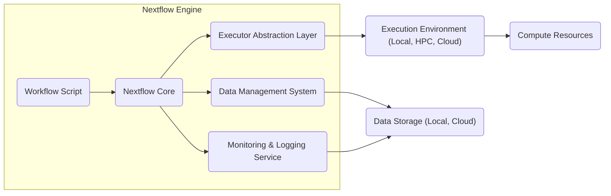
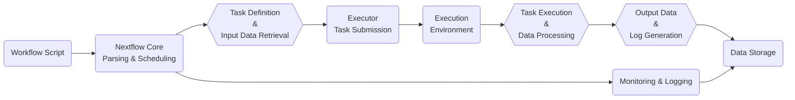

# Project Design Document: Nextflow Workflow Engine

**Version:** 1.1
**Date:** October 26, 2023
**Author:** AI Software Architect

## 1. Introduction

This document provides a comprehensive architectural overview of the Nextflow workflow engine, an open-source platform designed for building and executing data-driven computational pipelines. This detailed design serves as the foundation for subsequent threat modeling activities, offering a clear understanding of the system's components, interactions, and data flows. The information is derived from publicly available resources, primarily the Nextflow GitHub repository: [https://github.com/nextflow-io/nextflow](https://github.com/nextflow-io/nextflow).

## 2. Goals and Objectives

The primary objectives of Nextflow are:

- **Simplify Pipeline Development:**  To make the creation of complex computational pipelines easier and more intuitive.
- **Ensure Reproducibility:** To provide a consistent and repeatable environment for executing scientific workflows.
- **Leverage Existing Tools:** To seamlessly integrate with existing scripting languages (Bash, Python, R) for task definitions.
- **Enable Scalability and Portability:** To allow workflows to run efficiently across diverse execution environments (local, HPC clusters, cloud).
- **Provide Robustness:** To offer reliable error handling and fault tolerance for long-running and complex pipelines.

This document aims to provide the necessary architectural details for effectively identifying and analyzing potential security threats within the Nextflow ecosystem.

## 3. Scope

This design document focuses on the core architectural elements and data flow within the Nextflow engine, specifically for the purpose of threat modeling. It encompasses:

- The primary components of the Nextflow system and their functionalities.
- The interactions and communication pathways between these components during workflow execution.
- The various execution environments supported by Nextflow and their integration.
- The mechanisms Nextflow employs for managing and transferring data.
- Key security considerations and potential vulnerabilities inherent in the architecture.

This document does not delve into:

- The intricacies of the Nextflow Domain Specific Language (DSL) syntax in detail.
- Exhaustive specifications of individual executors or cloud service integrations.
- Performance evaluation or optimization techniques for Nextflow workflows.
- Low-level code implementation details of the Nextflow engine.

## 4. High-Level Architecture

Nextflow functions as an orchestration engine that interprets a user-defined workflow script and manages the execution of individual tasks across different computational resources. The core components work together to control the entire workflow lifecycle.

**Component Descriptions:**

- **Workflow Script:** The user-authored script, written in the Nextflow DSL, defining the pipeline's logic, processes, data flow, and dependencies. This is the primary input to the Nextflow engine.
- **Nextflow Core:** The central control unit of the engine. It parses the workflow script, constructs the execution graph, schedules tasks, manages state, and handles errors.
- **Executor Abstraction Layer:** This layer provides an abstraction over the underlying execution environments. It allows Nextflow to interact with diverse platforms without requiring significant modifications to the core engine.
- **Data Management System:** Responsible for managing the flow of data between tasks. This includes staging input data, transferring output data, and tracking data provenance.
- **Monitoring & Logging Service:** Provides real-time insights into the workflow's progress, captures logs from executed tasks, and reports on errors and resource utilization.
- **Execution Environment:** The specific platform where the computational tasks are executed. This can range from a local machine to large-scale HPC clusters or cloud computing platforms.
- **Compute Resources:** The actual processing units (CPU cores, memory) utilized to execute the individual tasks of the workflow within the execution environment.
- **Data Storage:** The location where input data resides and where output data is written. This can be local file systems, network file systems, or cloud storage services.

## 5. Key Components and Interactions

This section provides a more detailed explanation of the core components and their interactions during a typical Nextflow workflow execution.

### 5.1. Nextflow Core

- **Workflow Parsing and Validation:** The core engine begins by parsing the Nextflow script, verifying its syntax and semantics, and constructing an internal representation of the workflow's directed acyclic graph (DAG).
- **Task Scheduling and Orchestration:** Based on the workflow graph, available resources, and defined dependencies, the core schedules individual tasks for execution on the designated executor. It orchestrates the order and timing of task execution.
- **State Management and Persistence:** The core maintains the state of each task (e.g., pending, running, completed, failed) and the overall workflow execution. This state can be persisted to allow for resuming interrupted workflows.
- **Error Detection and Handling:** The core monitors task executions for errors and implements defined error handling strategies, including retries or workflow termination.
- **Dependency Resolution and Data Flow Management:** The core ensures that tasks are executed in the correct order by tracking data dependencies defined through Nextflow channels. It ensures that input data is available before a task starts.

### 5.2. Executor Abstraction Layer

- **Unified Interface:** This layer presents a consistent interface to the Nextflow core, hiding the complexities of interacting with different execution environments.
- **Executor Implementations:** Specific implementations (executors) exist for various platforms:
    - **`local` Executor:** Executes tasks directly on the machine running the Nextflow engine. Primarily used for development and testing.
    - **HPC Executors (`slurm`, `pbs`, `lsf`):** Integrate with High-Performance Computing (HPC) resource managers to submit and manage jobs on cluster nodes.
    - **Cloud Executors (`aws batch`, `google lifesciences`, `azure batch`):** Leverage cloud-based batch processing services for scalable execution in the cloud.
    - **`kubernetes` Executor:** Executes tasks as containers within a Kubernetes cluster, enabling containerized workflows.
- **Task Translation and Submission:** The executor layer translates Nextflow task definitions into the specific commands or API calls required by the target execution environment. It then submits these tasks for execution.
- **Task Monitoring and Status Updates:** Executors monitor the status of submitted tasks within the execution environment and report back to the Nextflow core on their progress and completion.
- **Resource Request Handling:** While the underlying execution environment manages resource allocation, Nextflow can provide hints or constraints regarding resource requirements through executor configurations.

### 5.3. Data Management System

- **Channels as Data Streams:** Nextflow uses channels as asynchronous, first-in, first-out (FIFO) queues to manage the flow of data between processing steps (processes).
    - **Value Channels:** Carry single values or simple data structures.
    - **File Channels:** Represent pointers to files or directories, enabling efficient handling of large datasets.
- **Data Staging and Transfer:** The data management system handles the staging of input data required by a task to the execution environment where the task will run. This may involve copying files or creating symbolic links. Output data generated by a task is transferred back to a designated location, often within the Nextflow working directory or a user-specified output directory.
- **Data Provenance Tracking:** Nextflow tracks the origin and processing history of data elements as they move through the workflow, contributing to reproducibility.
- **Caching and Reuse of Results:** Nextflow can cache the results of completed tasks based on input parameters and code. This allows for skipping redundant computations in subsequent workflow runs, improving efficiency.

### 5.4. Monitoring & Logging Service

- **Real-time Workflow Progress Visualization:** Provides users with up-to-date information on the status of the overall workflow and individual tasks.
- **Task Log Capture and Aggregation:** Captures standard output and standard error streams generated by executed tasks, providing valuable debugging information.
- **Performance Metrics Collection:** Can gather performance metrics related to task execution time, resource utilization, and other relevant parameters.
- **Reporting and Summarization:** Generates reports summarizing the workflow execution, including success/failure rates, resource consumption, and execution timelines.
- **Integration with External Monitoring Tools:** Nextflow can be configured to integrate with external monitoring and logging systems for centralized monitoring and analysis.

## 6. Data Flow

The following diagram illustrates the typical flow of data through a Nextflow workflow. Understanding this flow is crucial for identifying potential data security vulnerabilities.

**Detailed Data Flow Steps:**

1. **Workflow Script:** The user provides the Nextflow script defining the pipeline logic and data flow.
2. **Nextflow Core (Parsing & Scheduling):** The core parses the script, builds the execution plan, and determines the order of task execution.
3. **Task Definition & Input Data Retrieval:** For each scheduled task, the core identifies the required input data based on channel definitions. This might involve retrieving data from local storage, network locations, or cloud storage.
4. **Executor Task Submission:** The core instructs the appropriate executor to submit the task to the designated execution environment. This includes transferring necessary input data to the execution environment.
5. **Execution Environment:** The executor interacts with the underlying infrastructure to allocate resources and initiate the task execution.
6. **Task Execution & Data Processing:** The task executes within the allocated resources, processing the input data according to the defined commands or scripts.
7. **Output Data & Log Generation:** The task generates output data and execution logs.
8. **Data Storage:** The generated output data and logs are transferred back from the execution environment and stored in the designated storage location.
9. **Monitoring & Logging:** Throughout the process, the Nextflow core and executor continuously monitor the execution, capturing logs and metrics related to data transfer and processing.

## 7. Execution Environments

Nextflow's ability to run on diverse execution environments provides flexibility but also introduces varying security considerations.

- **Local Execution:** Tasks are executed directly on the user's machine. Security relies on the user's system security.
    - **Security Implications:**  Limited isolation between tasks. Potential for resource contention and security breaches on the local system.
- **HPC Clusters (Slurm, PBS, LSF):** Leverages cluster resource managers for job submission and management. Security relies on the cluster's security infrastructure.
    - **Security Implications:** Relies on the security policies and configurations of the HPC cluster. Access control and data security are managed by the cluster environment.
- **Cloud Platforms (AWS, Google Cloud, Azure):** Utilizes cloud-based batch processing services. Security is a shared responsibility between the user and the cloud provider.
    - **Security Implications:**  Requires careful configuration of cloud security settings, including access control, network policies, and data encryption. Credentials management for cloud access is critical.
- **Kubernetes:** Executes tasks as containers within a Kubernetes cluster. Security depends on the Kubernetes cluster's security configuration and container security practices.
    - **Security Implications:**  Container image security, network segmentation within the cluster, and access control to Kubernetes resources are important considerations.

## 8. Security Considerations (For Threat Modeling)

This section highlights potential security concerns that will be crucial for the subsequent threat modeling process.

- **Workflow Script Security:**
    - **Malicious Code Injection:** User-provided scripts could contain malicious commands or code that could compromise the execution environment or data.
    - **Insecure Secrets Management:** Storing sensitive information (API keys, passwords, credentials) directly within workflow scripts is a significant risk.
- **Executor Security:**
    - **Insufficient Access Control:** Overly permissive permissions granted to the Nextflow process or executor could allow unauthorized access to resources in the execution environment.
    - **Lack of Task Isolation:** Inadequate isolation between concurrently running tasks could allow malicious tasks to interfere with or compromise other tasks.
    - **Compromised Executor Credentials:** If the credentials used by the executor to access the execution environment are compromised, attackers could gain unauthorized access.
- **Data Security:**
    - **Data in Transit Vulnerabilities:** Data transferred between storage, the Nextflow engine, and the execution environment might not be adequately encrypted, making it vulnerable to interception.
    - **Data at Rest Vulnerabilities:** Input and output data stored in various locations might not be properly encrypted or protected by access controls, leading to unauthorized access or data breaches.
    - **Insufficient Access Control to Data:** Inadequate controls over who can access the data managed by Nextflow could lead to unauthorized data access or modification.
- **Dependency Management Security:**
    - **Supply Chain Attacks:** Using compromised or vulnerable software dependencies (e.g., container images, libraries) within workflow tasks can introduce security risks.
- **Monitoring and Logging Security:**
    - **Exposure of Sensitive Information in Logs:** Logs might inadvertently contain sensitive information, making them a target for attackers if not properly secured.
    - **Unauthorized Access to Logs:** If access to monitoring and logging information is not restricted, attackers could gain insights into system operations or potentially tamper with logs.
- **Nextflow Engine Security:**
    - **Vulnerabilities in the Nextflow Core:** Security flaws in the Nextflow engine itself could be exploited by attackers.
    - **Lack of Authentication and Authorization:** In shared environments, the absence of proper authentication and authorization mechanisms could allow unauthorized users to interact with the Nextflow engine.
- **Communication Security:**
    - **Insecure Communication Channels:** Communication channels between Nextflow components (e.g., between the core and executors) might not be encrypted, potentially exposing sensitive information.

## 9. Assumptions and Constraints

- It is assumed that users have the necessary permissions and credentials to access the specified execution environments and data storage locations.
- The security of the underlying execution environment infrastructure is partially outside the direct control of the Nextflow engine.
- This document reflects the current understanding of Nextflow's architecture as of the document creation date and may require updates as the software evolves.

## 10. Future Considerations

- Implementing built-in secrets management capabilities within Nextflow to avoid storing sensitive information in workflow scripts.
- Enhancing integration with security scanning tools for automatically analyzing workflow scripts and container images for vulnerabilities.
- Conducting formal security audits of the Nextflow codebase to identify and address potential security flaws.
- Developing more robust mechanisms for ensuring data integrity and provenance throughout the workflow execution lifecycle.
- Implementing more granular access control mechanisms within the Nextflow engine itself, particularly in shared deployment scenarios.
