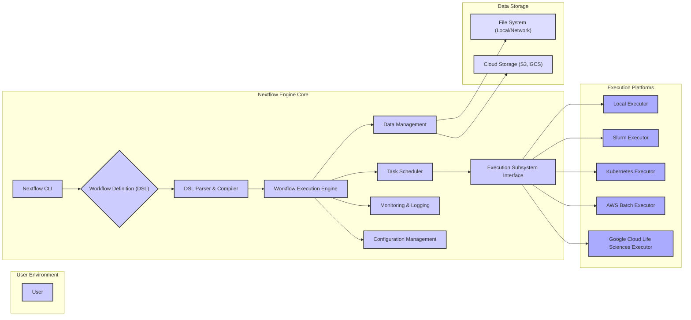

# Project Design Document: Nextflow Workflow Engine - Improved

**Version:** 1.1
**Date:** October 26, 2023
**Author:** Gemini (AI Language Model)

## 1. Introduction

This document provides an enhanced and more detailed design overview of the Nextflow workflow engine. Building upon the previous version, it further elaborates on the key architectural components, data flows, and interactions within the system. This refined document will serve as a stronger foundation for subsequent threat modeling activities, offering a deeper understanding of the system's intricacies.

Nextflow is a powerful domain-specific language (DSL) and execution engine designed for constructing data-driven computational pipelines. It empowers scientists and developers to orchestrate intricate workflows seamlessly across diverse execution platforms, ranging from personal computers to high-performance computing clusters and cloud environments. Its reactive programming model and support for various execution environments make it a versatile tool for complex data analysis.

## 2. Goals and Objectives

*   Provide a comprehensive and more granular description of the Nextflow architecture, including internal interactions.
*   Identify key components and their specific responsibilities, highlighting interdependencies.
*   Illustrate the flow of data and control within Nextflow workflows with greater clarity and detail.
*   Pinpoint potential areas of interest for security analysis and threat modeling with more specific examples.
*   Serve as a robust and detailed reference point for understanding the system's internal workings and potential vulnerabilities.

## 3. System Architecture

Nextflow's architecture is structured in a layered manner, facilitating modularity and extensibility. The core layers are:

*   **User Interface (CLI):** The primary interface for user interaction, handling commands and displaying output.
*   **Workflow Definition (DSL):** The Groovy-based language used to define the structure and logic of computational pipelines.
*   **Core Engine:** The central processing unit responsible for parsing, compiling, managing, and executing workflows.
*   **Execution Subsystems:** Pluggable modules that interface with various execution platforms, abstracting platform-specific details.
*   **Data Management:**  The system responsible for handling data input, output, and intermediate results, including staging and transfer.
*   **Monitoring and Logging:**  Features for tracking workflow execution, providing insights into performance and facilitating debugging.
*   **Configuration Management:**  Handles the loading and management of configuration settings for Nextflow and workflows.

## 4. Key Components

*   **Nextflow CLI:**
    *   Serves as the primary command-line interface for user interaction.
    *   Handles commands for workflow submission (`nextflow run`), monitoring (`nextflow log`, `nextflow report`), and management (`nextflow info`, `nextflow drop`).
    *   Parses command-line arguments and options, translating them into actions within the Nextflow engine.
    *   Manages global and project-specific configuration settings, often stored in `nextflow.config` files.

*   **Workflow Definition (DSL):**
    *   A Groovy-based domain-specific language specifically designed for defining data-driven workflows.
    *   Allows users to define `process` blocks (representing individual computational steps), `channel` constructs (for data flow), and `workflow` blocks (for orchestrating processes).
    *   Supports features like parameterization, conditional execution, and error handling within the workflow definition.

*   **DSL Parser & Compiler:**
    *   Responsible for parsing the Nextflow DSL code, verifying its syntax and structure.
    *   Performs semantic analysis to ensure the workflow definition is logically sound and adheres to Nextflow's rules.
    *   Compiles the workflow definition into an internal representation, often a directed acyclic graph (DAG), that the execution engine can understand and execute.

*   **Workflow Execution Engine:**
    *   The central orchestrator of workflow execution, managing the state of the workflow and its constituent processes.
    *   Interprets the compiled workflow representation and determines the order of task execution based on data dependencies and resource availability.
    *   Implements Nextflow's reactive programming model, where processes are triggered automatically when their input data becomes available.
    *   Manages the lifecycle of processes, including submission, monitoring, and error handling.

*   **Task Scheduler:**
    *   Responsible for scheduling individual task executions (instances of `process` blocks) onto the target execution platform.
    *   Manages task queuing and resource allocation, taking into account factors like CPU, memory, and other resource requirements.
    *   Interacts with the appropriate execution subsystem to submit and monitor tasks on the chosen platform.

*   **Execution Subsystem Interface:**
    *   Provides an abstraction layer that isolates the core Nextflow engine from the specifics of different execution platforms.
    *   Translates Nextflow's generic task execution requests into platform-specific commands and API calls (e.g., submitting jobs to Slurm, creating Kubernetes pods, launching AWS Batch jobs).
    *   Handles platform-specific details like authentication, authorization, and resource management.

*   **Data Management:**
    *   Handles the management of input, output, and intermediate data generated during workflow execution.
    *   Supports various data storage locations, including local file systems, network file systems (NFS), and cloud storage services (Amazon S3, Google Cloud Storage).
    *   Provides mechanisms for data staging (moving data to the execution environment before a task starts) and transfer (moving output data after a task completes).
    *   Implements data caching and sharing strategies to optimize performance and avoid redundant data transfers.

*   **Monitoring & Logging:**
    *   Provides features for monitoring the progress and status of workflow execution in real-time.
    *   Generates detailed logs that capture events, errors, and performance metrics for debugging and auditing purposes.
    *   May integrate with external monitoring tools and dashboards for visualization and alerting.

*   **Configuration Management:**
    *   Responsible for loading and managing configuration settings that control Nextflow's behavior and workflow execution.
    *   Supports various configuration sources, including command-line arguments, environment variables, and configuration files (`nextflow.config`).
    *   Allows users to customize settings related to execution platforms, data management, and other aspects of workflow execution.

## 5. Data Flow

The typical data flow within a Nextflow workflow proceeds through these stages:

1. **Workflow Definition:** The user creates a workflow definition using the Nextflow DSL, specifying processes and data channels.
2. **Submission & Configuration:** The user submits the workflow definition to the Nextflow CLI, potentially providing configuration parameters.
3. **Parsing and Compilation:** The DSL parser and compiler analyze the workflow definition, generating an internal representation (e.g., a DAG).
4. **Task Scheduling & Data Staging:** The workflow execution engine and task scheduler determine the next tasks to execute. Input data required for these tasks is staged from the configured data storage location to the execution environment.
5. **Task Execution:** The task scheduler interacts with the appropriate execution subsystem to launch the task on the designated execution platform. The task executes, processing the staged input data.
6. **Data Transfer & Output:** Upon completion, the task's output data is transferred from the execution environment back to the designated output location managed by the data management component.
7. **Monitoring & Logging:** Throughout the execution process, the monitoring and logging components track progress, record events, and capture performance data.
8. **Workflow Completion:** The workflow continues executing tasks until all processes are completed, and the final output data is available.

```mermaid
graph LR
    A["Workflow Definition (DSL)"] --> B["Nextflow CLI"]
    B --> C["Configuration Management"]
    B --> D["DSL Parser & Compiler"]
    C --> D
    D --> E["Workflow Execution Engine"]
    E --> F["Task Scheduler"]
    F --> G["Execution Subsystem"]
    G --> H{"Execution Platform"}
    I["Input Data Source"] --> J["Data Management"]
    J --> H
    H --> K["Task Execution"]
    K --> L["Output Data Storage"]
    L --> J
    E --> M["Monitoring & Logging"]

    style A fill:#ccf,stroke:#333,stroke-width:2px
    style B fill:#ccf,stroke:#333,stroke-width:2px
    style C fill:#ccf,stroke:#333,stroke-width:2px
    style D fill:#ccf,stroke:#333,stroke-width:2px
    style E fill:#ccf,stroke:#333,stroke-width:2px
    style F fill:#ccf,stroke:#333,stroke-width:2px
    style G fill:#ccf,stroke:#333,stroke-width:2px
    style H fill:#aaf,stroke:#333,stroke-width:2px
    style I fill:#ddf,stroke:#333,stroke-width:2px
    style J fill:#ccf,stroke:#333,stroke-width:2px
    style K fill:#aaf,stroke:#333,stroke-width:2px
    style L fill:#ddf,stroke:#333,stroke-width:2px
    style M fill:#ccf,stroke:#333,stroke-width:2px
```

## 6. Security Considerations

This section provides a more detailed breakdown of potential security concerns:

*   **Workflow Definition Security (Confidentiality, Integrity):**
    *   **Risk:** Malicious code injection within process definitions, potentially leading to arbitrary command execution on the execution platform.
    *   **Risk:** Exposure of sensitive credentials or API keys embedded directly within the workflow definition.
    *   **Risk:** Lack of proper input validation within process scripts, making them vulnerable to command injection attacks.

*   **Execution Environment Security (Integrity, Availability):**
    *   **Risk:** Vulnerabilities in the underlying container runtime (e.g., Docker, Kubernetes) allowing for container escapes and privilege escalation.
    *   **Risk:** Insecurely configured execution environments lacking proper resource isolation or network segmentation.
    *   **Risk:**  Denial-of-service attacks targeting the execution platform, impacting workflow availability.

*   **Data Security (Confidentiality, Integrity, Availability):**
    *   **Risk:** Unauthorized access to input, output, or intermediate data stored in file systems or cloud storage.
    *   **Risk:** Data breaches during transfer between storage locations and execution environments, especially if encryption is not enforced.
    *   **Risk:** Lack of encryption at rest for sensitive data stored within the workflow's working directory or output locations.

*   **Authentication and Authorization (Confidentiality, Integrity):**
    *   **Risk:** Weak or default credentials used for accessing Nextflow features or interacting with execution platforms.
    *   **Risk:** Insufficient authorization controls, allowing users to access or modify workflows and data beyond their intended permissions.
    *   **Risk:** Potential for impersonation or privilege abuse if authentication mechanisms are compromised.

*   **Dependency Management (Integrity, Availability):**
    *   **Risk:** Inclusion of vulnerable third-party libraries or dependencies within process environments, introducing security flaws.
    *   **Risk:** Risk of supply chain attacks if dependencies are sourced from untrusted repositories.

*   **Communication Security (Confidentiality, Integrity):**
    *   **Risk:** Insecure communication channels between Nextflow components, potentially exposing sensitive information during internal communication.
    *   **Risk:** Lack of encryption for network traffic between Nextflow and execution platforms or data storage services.

*   **Logging and Auditing (Confidentiality, Integrity, Availability):**
    *   **Risk:** Insufficient logging of security-relevant events, making it difficult to detect and respond to security incidents.
    *   **Risk:** Lack of secure storage and access controls for audit logs, potentially allowing for tampering or deletion.

*   **Configuration Security (Confidentiality, Integrity):**
    *   **Risk:** Insecure default configurations that expose unnecessary services or functionalities.
    *   **Risk:** Exposure of sensitive configuration parameters (e.g., API keys, passwords) in configuration files or environment variables.

## 7. Deployment

Nextflow offers flexible deployment options, each with its own security implications:

*   **Local Installation:** Running Nextflow directly on a user's machine. Security relies on the user's system security.
*   **Containerized Deployment (Docker, Singularity):** Encapsulating Nextflow and its dependencies within containers provides a degree of isolation but requires careful container image management and security scanning.
*   **Cloud-Based Deployment (AWS, Google Cloud):** Deploying Nextflow on cloud infrastructure offers scalability and managed services but introduces dependencies on the cloud provider's security model, requiring proper IAM configuration, network security groups, and encryption settings.
*   **HPC Cluster Deployment (Slurm, PBS):** Integrating Nextflow with HPC schedulers leverages existing cluster security mechanisms but requires careful configuration of user permissions and resource access.

## 8. Future Considerations

*   **Enhanced Security Features:**
    *   Implementing workflow signing and verification to ensure the integrity and authenticity of workflow definitions.
    *   Integrating secure secrets management solutions (e.g., HashiCorp Vault) for handling sensitive credentials.
    *   Implementing role-based access control (RBAC) for managing access to Nextflow features and resources.
*   **Improved Input Validation:**
    *   Strengthening input validation mechanisms within process definitions to prevent command injection vulnerabilities.
    *   Providing built-in functions or libraries for sanitizing user-provided input.
*   **Secure Dependency Management:**
    *   Integrating tools for scanning workflow dependencies for known vulnerabilities.
    *   Providing mechanisms for specifying trusted dependency sources.
*   **Encryption Enhancements:**
    *   Enforcing encryption at rest and in transit for sensitive data throughout the workflow execution lifecycle.
    *   Supporting integration with key management services for secure key storage and rotation.
*   **Integration with Security Information and Event Management (SIEM) systems:**
    *   Enhancing logging capabilities to provide richer security-related events for analysis by SIEM systems.
    *   Developing integrations with popular SIEM platforms for real-time threat detection and response.

This improved document provides a more in-depth understanding of the Nextflow architecture, highlighting key components, data flows, and a more detailed analysis of security considerations. This enhanced level of detail will be invaluable for conducting thorough threat modeling and implementing appropriate security measures.