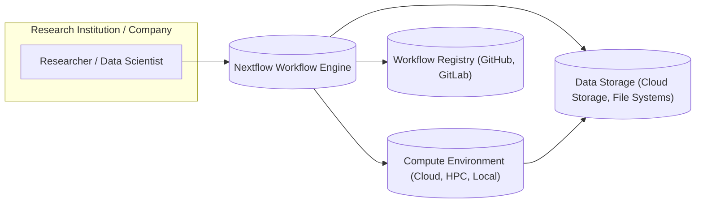
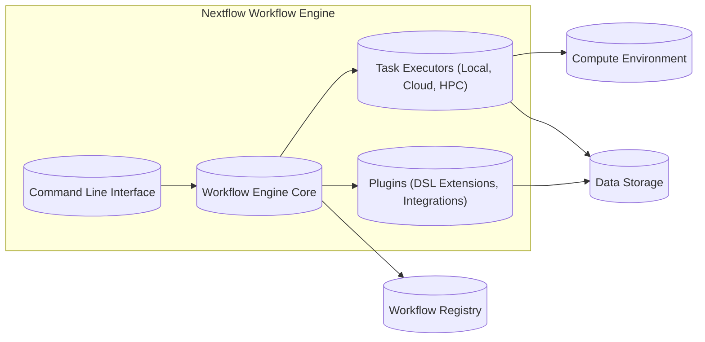
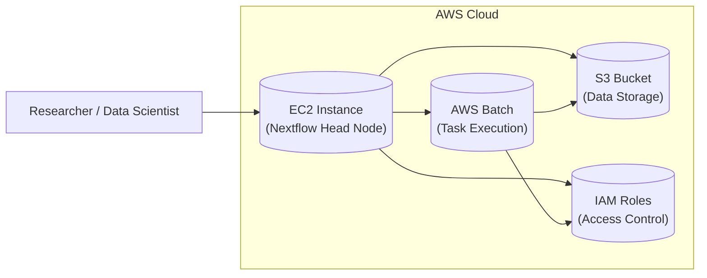
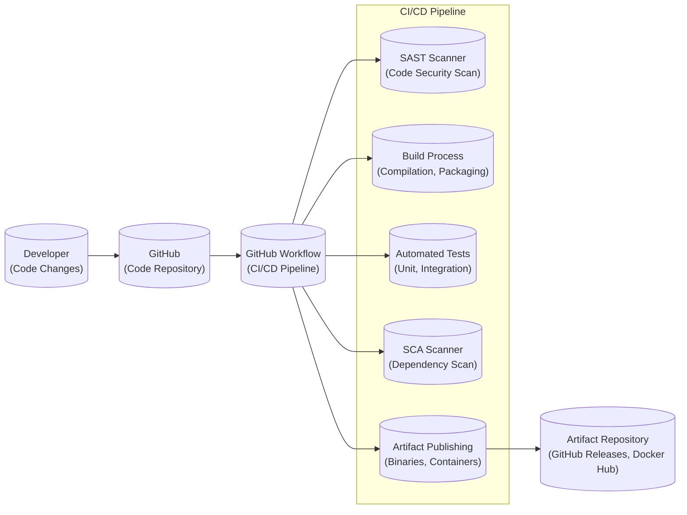

# BUSINESS POSTURE

- Business Priorities and Goals:
  - Enable researchers and data scientists to build and execute complex computational pipelines in a portable and reproducible manner.
  - Simplify the orchestration of data-intensive workflows across diverse computing environments, from local workstations to cloud platforms and high-performance computing clusters.
  - Improve the efficiency and scalability of scientific data analysis by leveraging parallel processing and distributed computing.
  - Foster collaboration and knowledge sharing within the scientific community by providing a standardized workflow language and execution environment.
  - Reduce the time and effort required to develop, deploy, and maintain complex bioinformatics and data science pipelines.

- Business Risks:
  - Risk of data breaches or unauthorized access to sensitive research data processed by Nextflow workflows.
  - Risk of workflow execution failures due to misconfigurations, software vulnerabilities, or infrastructure issues, leading to delays in research and potential data loss.
  - Risk of supply chain attacks targeting Nextflow dependencies or build process, potentially compromising the integrity of executed workflows.
  - Risk of intellectual property theft or unauthorized modification of workflows if access controls and security measures are not properly implemented.
  - Risk of reputational damage if Nextflow is associated with security incidents or data breaches, impacting user trust and adoption.

# SECURITY POSTURE

- Existing Security Controls:
  - security control: HTTPS for website and documentation access (inferred).
  - security control: GitHub repository with access control (inferred).
  - security control: Software Composition Analysis (SCA) as part of development process (inferred, best practice for dependency management).
  - security control: Code review process for contributions (inferred, standard practice for open-source projects).
  - security control: Containerization of Nextflow runtime (Docker, Conda) for environment isolation (described in documentation).
  - security control: Support for secure credential management within workflows (e.g., secrets management in cloud environments) (described in documentation).

- Accepted Risks:
  - accepted risk: Reliance on underlying infrastructure security provided by cloud providers or HPC environments.
  - accepted risk: Security of user-provided workflow scripts and configurations.
  - accepted risk: Security of third-party software and libraries used within workflows.
  - accepted risk: Potential vulnerabilities in Nextflow core engine and plugins.

- Recommended Security Controls:
  - security control: Implement static application security testing (SAST) in the CI/CD pipeline to identify potential code vulnerabilities.
  - security control: Implement dynamic application security testing (DAST) to assess the security of running Nextflow workflows.
  - security control: Regularly perform penetration testing to identify and address security weaknesses in Nextflow and its deployment environments.
  - security control: Implement security awareness training for Nextflow developers and users to promote secure coding practices and responsible workflow design.
  - security control: Establish a vulnerability disclosure program to encourage responsible reporting of security issues.

- Security Requirements:
  - Authentication:
    - requirement: Nextflow itself does not require user authentication for core engine functionality.
    - requirement: Authentication is relevant in the context of accessing Nextflow workflows and results stored in external systems (e.g., cloud storage, workflow registries).
    - requirement: Integrate with existing authentication mechanisms of target execution environments (e.g., cloud provider IAM, HPC cluster authentication).
  - Authorization:
    - requirement: Implement fine-grained authorization controls for accessing and managing Nextflow workflows, data, and execution environments.
    - requirement: Support role-based access control (RBAC) to manage permissions for different user groups (e.g., workflow developers, operators, administrators).
    - requirement: Enforce least privilege principle for workflow execution, limiting access to only necessary resources and data.
  - Input Validation:
    - requirement: Implement robust input validation for workflow parameters, configuration files, and user-provided scripts to prevent injection attacks and other input-related vulnerabilities.
    - requirement: Sanitize and validate data inputs to workflow processes to mitigate risks of data corruption or unexpected behavior.
    - requirement: Use secure coding practices to avoid common input validation vulnerabilities such as command injection, SQL injection, and cross-site scripting (if applicable).
  - Cryptography:
    - requirement: Utilize cryptography to protect sensitive data at rest and in transit within Nextflow workflows.
    - requirement: Support encryption of workflow inputs, outputs, and intermediate data stored in persistent storage.
    - requirement: Use HTTPS for all communication channels involving sensitive data or control plane operations.
    - requirement: Provide mechanisms for secure key management and rotation for encryption keys used within Nextflow.

# DESIGN

## C4 CONTEXT

- Context Diagram Elements:
  - - Name: Researcher / Data Scientist
    - Type: Person
    - Description: Users who design, develop, and execute Nextflow workflows for data analysis and computational tasks.
    - Responsibilities: Create and manage Nextflow workflows, submit workflows for execution, analyze results.
    - Security controls: User authentication and authorization to access workflow registry and compute environments. Secure coding practices for workflow development.
  - - Name: Nextflow Workflow Engine
    - Type: Software System
    - Description: The core Nextflow application responsible for parsing workflow definitions, orchestrating tasks, managing dependencies, and executing workflows on various compute environments.
    - Responsibilities: Workflow parsing and execution, task scheduling, resource management, monitoring and logging, integration with compute environments and data storage.
    - Security controls: Input validation, secure configuration management, logging and auditing, vulnerability management, secure communication with compute environments and data storage.
  - - Name: Compute Environment (Cloud, HPC, Local)
    - Type: External System
    - Description: The infrastructure where Nextflow workflows are executed, including cloud platforms (AWS, GCP, Azure), high-performance computing clusters, and local workstations.
    - Responsibilities: Providing compute resources, executing workflow tasks, managing resource allocation, providing access to data storage.
    - Security controls: Infrastructure security controls provided by the environment (e.g., IAM, network security, physical security), access control to compute resources, secure configuration of compute instances.
  - - Name: Data Storage (Cloud Storage, File Systems)
    - Type: External System
    - Description: Systems used to store input data, intermediate data, and output results of Nextflow workflows, including cloud storage services (S3, GCS, Azure Blob Storage) and file systems (NFS, Lustre).
    - Responsibilities: Storing and retrieving data, providing data access to compute environments, ensuring data durability and availability.
    - Security controls: Data encryption at rest and in transit, access control to data storage, data backup and recovery, data integrity checks.
  - - Name: Workflow Registry (GitHub, GitLab)
    - Type: External System
    - Description: Version control systems used to store and manage Nextflow workflow definitions, scripts, and configurations.
    - Responsibilities: Version control for workflows, collaboration and sharing of workflows, access control to workflow repositories.
    - Security controls: Access control to workflow repositories, secure code storage, audit logging of changes, vulnerability scanning of workflow code (if applicable).

## C4 CONTAINER

- Container Diagram Elements:
  - - Name: Command Line Interface (CLI)
    - Type: Container
    - Description: The command-line interface used by researchers to interact with Nextflow, including commands for workflow execution, monitoring, and management.
    - Responsibilities: Parsing user commands, submitting workflows to the engine, displaying workflow status and logs, managing configurations.
    - Security controls: Input validation of CLI commands and parameters, secure handling of user credentials (if applicable), logging of CLI activity.
  - - Name: Workflow Engine Core
    - Type: Container
    - Description: The central component of Nextflow responsible for workflow parsing, task orchestration, dependency resolution, and state management.
    - Responsibilities: Workflow definition parsing, task scheduling and execution, dependency management, workflow state tracking, error handling, logging and monitoring.
    - Security controls: Secure workflow parsing and interpretation, input validation of workflow definitions, secure state management, logging and auditing of engine activities, vulnerability management.
  - - Name: Task Executors (Local, Cloud, HPC)
    - Type: Container
    - Description: Modules responsible for executing individual workflow tasks on different compute environments, including local execution, cloud-based execution (AWS Batch, Google Cloud Life Sciences), and HPC cluster execution (Slurm, PBS).
    - Responsibilities: Task execution on target environments, resource provisioning and management, data staging, task monitoring and logging, communication with compute environment APIs.
    - Security controls: Secure communication with compute environment APIs, secure task execution environment, input validation for task commands and parameters, secure handling of credentials for compute environments, logging of task execution.
  - - Name: Plugins (DSL Extensions, Integrations)
    - Type: Container
    - Description: Extensible modules that provide additional functionality to Nextflow, such as domain-specific language extensions, integrations with external tools and services, and custom task executors.
    - Responsibilities: Extending Nextflow functionality, providing integrations with external systems, implementing custom task execution logic.
    - Security controls: Secure plugin loading and execution, input validation for plugin configurations and inputs, secure communication with external systems, plugin isolation and sandboxing (if applicable), vulnerability management for plugins.

## DEPLOYMENT

- Deployment Options:
  - Local Workstation: Nextflow and workflows are executed directly on the user's local machine. Suitable for development and testing, but limited scalability and reproducibility.
  - Cloud Environment: Nextflow is deployed and workflows are executed on cloud platforms like AWS, GCP, or Azure, leveraging cloud compute and storage services. Offers scalability, elasticity, and managed infrastructure.
  - High-Performance Computing (HPC) Cluster: Nextflow is deployed on HPC clusters, utilizing cluster resource managers (Slurm, PBS) for large-scale, high-performance workflow execution. Ideal for computationally intensive workflows.

- Detailed Deployment (Cloud Environment - AWS):

- Deployment Diagram Elements (AWS Cloud):
  - - Name: EC2 Instance (Nextflow Head Node)
    - Type: Compute Instance
    - Description: An Amazon EC2 instance running the Nextflow engine core and CLI. Acts as the control plane for workflow execution, managing workflow state and submitting tasks to AWS Batch.
    - Responsibilities: Running Nextflow engine, managing workflow execution, communicating with AWS Batch and S3, providing user interface (via SSH or web interface if configured).
    - Security controls: Security groups to control network access, IAM roles for access to AWS services, OS-level security hardening, regular patching, access logging and monitoring.
  - - Name: AWS Batch (Task Execution)
    - Type: Compute Service
    - Description: AWS Batch service used to execute individual workflow tasks in a scalable and managed manner. Tasks are submitted by the Nextflow head node and executed on compute resources managed by AWS Batch.
    - Responsibilities: Task execution, resource provisioning and management, task scheduling, logging and monitoring of task execution.
    - Security controls: IAM roles for task execution permissions, security policies enforced by AWS Batch, isolation of task execution environments, logging and monitoring of task execution.
  - - Name: S3 Bucket (Data Storage)
    - Type: Data Storage Service
    - Description: Amazon S3 bucket used for storing workflow input data, intermediate data, and output results. Provides scalable and durable object storage.
    - Responsibilities: Data storage and retrieval, data access for Nextflow head node and AWS Batch tasks, data durability and availability.
    - Security controls: S3 bucket policies for access control, data encryption at rest and in transit (SSE-S3, SSE-KMS, HTTPS), versioning and backup, access logging and monitoring.
  - - Name: IAM Roles (Access Control)
    - Type: Identity and Access Management Service
    - Description: AWS IAM roles used to grant permissions to EC2 instance and AWS Batch tasks to access other AWS services, such as S3 and Batch itself, following the principle of least privilege.
    - Responsibilities: Managing access control to AWS resources, enforcing least privilege, providing secure authentication and authorization for AWS services.
    - Security controls: IAM policies defining permissions, role-based access control, regular review of IAM roles and policies.

## BUILD

- Build Process Description:
  - Developers commit code changes to the GitHub repository.
  - GitHub Actions workflow (CI/CD pipeline) is triggered on code changes (e.g., push, pull request).
  - CI/CD pipeline performs the following steps:
    - Static Application Security Testing (SAST): Scans the codebase for potential security vulnerabilities using SAST tools.
    - Build Process: Compiles the Nextflow source code, packages it into distributable artifacts (e.g., binaries, JAR files, Docker images).
    - Automated Tests: Executes unit tests and integration tests to ensure code quality and functionality.
    - Software Composition Analysis (SCA): Scans project dependencies for known vulnerabilities using SCA tools.
    - Artifact Publishing: Publishes build artifacts to artifact repositories like GitHub Releases and Docker Hub.
- Build Diagram Elements:
  - - Name: Developer (Code Changes)
    - Type: Person
    - Description: Software developers who contribute code changes to the Nextflow project.
    - Responsibilities: Writing code, fixing bugs, implementing new features, submitting code changes via pull requests.
    - Security controls: Secure coding practices, code review process, developer workstations security.
  - - Name: GitHub (Code Repository)
    - Type: Service
    - Description: GitHub repository hosting the Nextflow source code, issue tracking, and collaboration features.
    - Responsibilities: Version control, code storage, collaboration platform, pull request management, issue tracking.
    - Security controls: Access control to repository, branch protection, audit logging, vulnerability scanning of repository infrastructure.
  - - Name: GitHub Workflow (CI/CD Pipeline)
    - Type: Automation
    - Description: GitHub Actions workflow automating the build, test, and release process of Nextflow.
    - Responsibilities: Automating build process, running security scans, executing tests, publishing artifacts, orchestrating CI/CD pipeline stages.
    - Security controls: Secure workflow definition, access control to workflow secrets and variables, audit logging of workflow execution, secure execution environment for workflow actions.
  - - Name: SAST Scanner (Code Security Scan)
    - Type: Tool
    - Description: Static Application Security Testing tool integrated into the CI/CD pipeline to automatically scan the codebase for security vulnerabilities.
    - Responsibilities: Static code analysis, vulnerability detection, reporting of security findings.
    - Security controls: Secure configuration of SAST tool, vulnerability database updates, integration with CI/CD pipeline security reporting.
  - - Name: Build Process (Compilation, Packaging)
    - Type: Process
    - Description: Steps involved in compiling the Nextflow source code and packaging it into distributable artifacts.
    - Responsibilities: Code compilation, dependency management, artifact packaging (JAR, Docker image), build artifact signing (if applicable).
    - Security controls: Secure build environment, dependency management controls, artifact integrity checks, secure signing of artifacts.
  - - Name: Automated Tests (Unit, Integration)
    - Type: Process
    - Description: Automated unit and integration tests executed as part of the CI/CD pipeline to ensure code quality and functionality.
    - Responsibilities: Code testing, bug detection, ensuring code quality, providing feedback on code changes.
    - Security controls: Secure test environment, test data management, test result reporting.
  - - Name: SCA Scanner (Dependency Scan)
    - Type: Tool
    - Description: Software Composition Analysis tool integrated into the CI/CD pipeline to scan project dependencies for known vulnerabilities.
    - Responsibilities: Dependency scanning, vulnerability detection in dependencies, reporting of dependency vulnerabilities.
    - Security controls: Secure configuration of SCA tool, vulnerability database updates, integration with CI/CD pipeline security reporting.
  - - Name: Artifact Publishing (Binaries, Containers)
    - Type: Process
    - Description: Steps involved in publishing build artifacts (binaries, Docker images) to artifact repositories.
    - Responsibilities: Artifact uploading to repositories, release management, versioning of artifacts, artifact signing (if applicable).
    - Security controls: Secure artifact repository access, secure artifact upload process, artifact integrity checks, access control to artifact repositories.
  - - Name: Artifact Repository (GitHub Releases, Docker Hub)
    - Type: Service
    - Description: Repositories used to store and distribute Nextflow build artifacts, such as GitHub Releases for binaries and Docker Hub for container images.
    - Responsibilities: Artifact storage, artifact distribution, version management, access control to artifacts.
    - Security controls: Access control to artifact repositories, secure artifact storage, audit logging of artifact access, vulnerability scanning of repository infrastructure.

# RISK ASSESSMENT

- Critical Business Processes:
  - Scientific Research and Data Analysis: Nextflow is used to automate and accelerate scientific research by enabling efficient and reproducible data analysis workflows. Protecting the integrity and availability of these workflows is critical for research progress.
  - Data Processing Pipelines: Nextflow orchestrates complex data processing pipelines, often involving large and sensitive datasets. Ensuring the secure and reliable execution of these pipelines is crucial for data-driven decision-making and research outcomes.
  - Workflow Development and Sharing: Nextflow facilitates collaboration and knowledge sharing through workflow development and exchange. Protecting the intellectual property and integrity of workflows is important for maintaining trust and fostering innovation within the community.

- Data Sensitivity:
  - Research Data: Nextflow workflows often process sensitive research data, including genomic data, patient data, and other confidential information. The sensitivity level depends on the specific research domain and data being processed, but can be high, requiring strong data protection measures.
  - Workflow Definitions: Workflow definitions themselves can contain sensitive information, such as API keys, database credentials, or proprietary algorithms. Protecting workflow definitions from unauthorized access and modification is important for security and intellectual property protection.
  - Execution Logs and Metadata: Workflow execution logs and metadata may contain information about data processed, workflow configurations, and execution environments. While less sensitive than raw data, these logs can still reveal valuable information and should be protected from unauthorized access.

# QUESTIONS & ASSUMPTIONS

- Questions:
  - What are the specific compliance requirements for Nextflow users (e.g., HIPAA, GDPR, PCI DSS)?
  - What are the typical deployment environments for Nextflow in user organizations (e.g., cloud providers, on-premises data centers, hybrid environments)?
  - What are the common data sources and data sinks used in Nextflow workflows?
  - Are there any specific security certifications or attestations required for Nextflow?
  - What is the process for handling security vulnerabilities reported in Nextflow?

- Assumptions:
  - BUSINESS POSTURE: The primary business goal is to enable and accelerate scientific research and data analysis. Security is a critical enabler for achieving this goal, ensuring data integrity, confidentiality, and availability.
  - SECURITY POSTURE: Nextflow project follows secure software development lifecycle best practices, including code review, testing, and vulnerability management. Security controls are primarily focused on protecting data processed by workflows and ensuring the integrity of workflow execution.
  - DESIGN: Nextflow is designed to be flexible and deployable in various environments, from local workstations to cloud platforms and HPC clusters. The architecture is modular and extensible, allowing for integration with different compute and storage systems. Security is considered at different layers of the architecture, from the core engine to task executors and plugins.