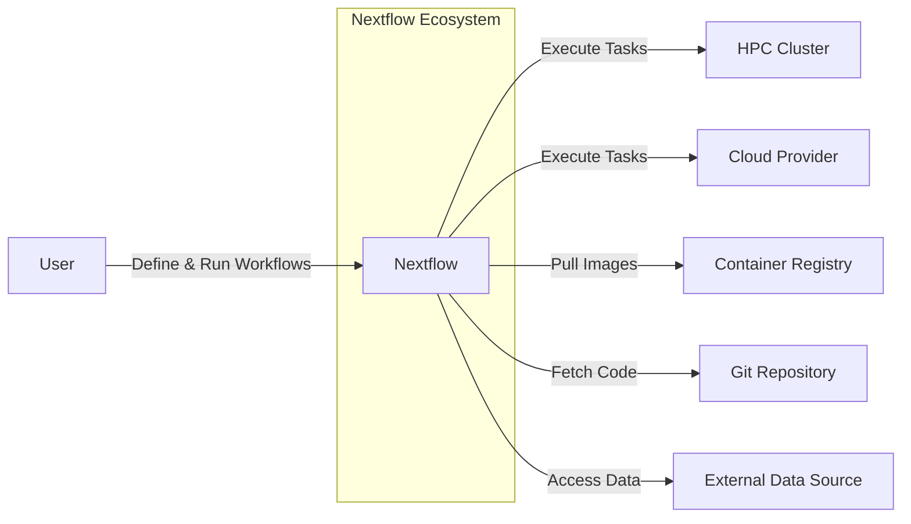
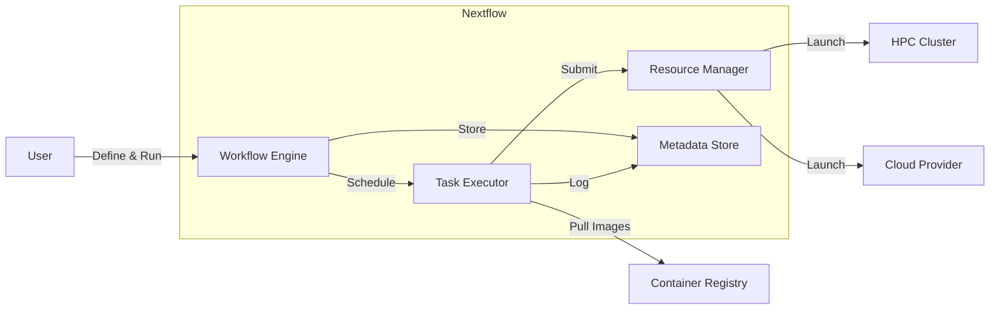
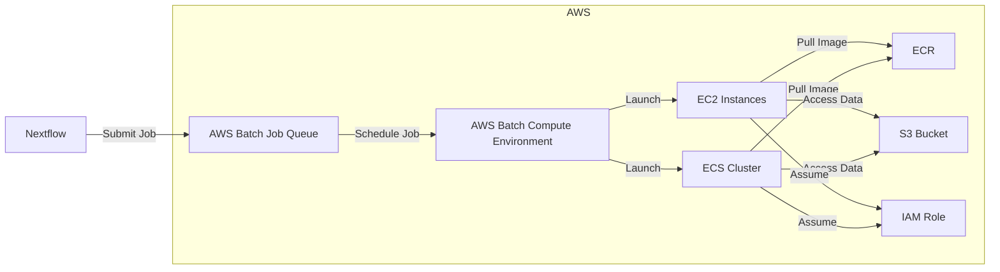

Okay, let's create a design document for Nextflow, based on the provided GitHub repository.

# BUSINESS POSTURE

Nextflow is a workflow management system designed to simplify the development and deployment of complex computational pipelines, particularly in the fields of bioinformatics, genomics, and other data-intensive scientific research.  It's an open-source project with a growing community and commercial support through Seqera Labs.

Business Priorities:

*   Enable reproducible and scalable scientific workflows.
*   Facilitate collaboration among researchers.
*   Reduce the complexity of managing computational infrastructure.
*   Support a wide range of execution environments (local, HPC clusters, cloud).
*   Maintain a vibrant open-source community.
*   Provide a path to commercial support and enterprise features.

Business Goals:

*   Become the leading workflow management system for data-intensive science.
*   Grow the user and contributor base.
*   Establish a sustainable business model around commercial offerings.

Most Important Business Risks:

*   Loss of community trust due to security vulnerabilities or poor software quality.
*   Inability to keep pace with evolving cloud and HPC technologies.
*   Competition from other workflow management systems.
*   Failure to attract and retain key contributors.
*   Inability to monetize the project effectively.
*   Data breaches or unauthorized access to sensitive research data processed by Nextflow.
*   Non-compliance with relevant data privacy regulations (e.g., GDPR, HIPAA) if used in regulated environments.

# SECURITY POSTURE

Existing Security Controls:

*   security control: Code reviews: Pull requests are used for code changes, implying a code review process (though the rigor isn't explicitly defined in the repository's top-level documentation). Implemented in GitHub pull request process.
*   security control: Static analysis: Some static analysis is likely used, given the use of Groovy and Java, but details are not prominent in the repository root. Implemented in build process.
*   security control: Containerization: Nextflow heavily relies on containerization (Docker, Singularity) for reproducibility and dependency management. This inherently provides some isolation and reduces the attack surface. Implemented in Nextflow runtime.
*   security control: Open-source model: The open-source nature of the project allows for community scrutiny and contributions to security. Implemented by design.
*   security control: Support for various execution platforms: Nextflow supports execution on various platforms, including cloud providers (AWS, Google Cloud, Azure) and HPC clusters, each with its own security controls. Implemented in Nextflow runtime and configuration.

Accepted Risks:

*   accepted risk: Reliance on third-party dependencies: Like any complex software, Nextflow depends on numerous third-party libraries, introducing the risk of vulnerabilities in those dependencies.
*   accepted risk: User-provided scripts and workflows: Nextflow executes user-provided scripts and workflows, which could contain malicious code if not properly vetted.
*   accepted risk: Configuration complexity: The flexibility of Nextflow's configuration can lead to misconfigurations that create security vulnerabilities.
*   accepted risk: Limited built-in security features: Nextflow itself doesn't provide extensive built-in security features like fine-grained access control or data encryption at rest (relying on the underlying execution environment).

Recommended Security Controls:

*   Implement a formal Software Bill of Materials (SBOM) generation process to track all dependencies and their versions.
*   Integrate Software Composition Analysis (SCA) tools into the CI/CD pipeline to automatically scan for known vulnerabilities in dependencies.
*   Develop and publish a security policy that clearly outlines vulnerability reporting procedures and response timelines.
*   Perform regular security audits and penetration testing, especially for new features and major releases.
*   Provide security hardening guides and best practices for users deploying Nextflow in sensitive environments.
*   Consider adding support for signed workflows and containers to ensure integrity.

Security Requirements:

*   Authentication:
    *   Nextflow itself does not handle user authentication directly. It relies on the authentication mechanisms of the underlying execution environment (e.g., SSH keys for HPC clusters, cloud provider IAM roles for cloud execution).
    *   Requirement: Clearly document how to securely configure authentication for each supported execution environment.
*   Authorization:
    *   Nextflow has limited built-in authorization mechanisms. Access control is primarily managed by the underlying execution environment.
    *   Requirement: Provide guidance on how to leverage the authorization capabilities of the execution environment to restrict access to resources and data.
*   Input Validation:
    *   Nextflow performs some basic input validation, but user-provided scripts and workflows are responsible for validating their own inputs.
    *   Requirement: Encourage the use of robust input validation techniques in user-provided scripts and workflows. Provide examples and libraries to facilitate this.
    *   Requirement: Sanitize inputs used to construct command lines to prevent command injection vulnerabilities.
*   Cryptography:
    *   Nextflow does not directly handle encryption of data at rest or in transit. It relies on the underlying execution environment and user-provided scripts for this.
    *   Requirement: Document how to use encryption capabilities of the execution environment (e.g., encrypted file systems, TLS for communication).
    *   Requirement: If handling sensitive data, provide guidance on using cryptographic libraries within workflows.

# DESIGN

## C4 CONTEXT



Context Diagram Element List:

*   Element:
    *   Name: User
    *   Type: Person
    *   Description: A scientist, bioinformatician, or developer who defines and runs Nextflow workflows.
    *   Responsibilities: Defines workflows, provides input data, monitors execution, and analyzes results.
    *   Security controls: Uses strong passwords and multi-factor authentication where applicable. Follows security best practices for handling sensitive data.

*   Element:
    *   Name: Nextflow
    *   Type: Software System
    *   Description: The workflow management system that orchestrates the execution of computational pipelines.
    *   Responsibilities: Parses workflow definitions, manages dependencies, schedules tasks, monitors execution, and handles errors.
    *   Security controls: Relies on containerization for isolation, uses code reviews and static analysis (to some extent), and leverages the security features of the underlying execution environment.

*   Element:
    *   Name: HPC Cluster
    *   Type: System
    *   Description: A high-performance computing cluster used to execute computationally intensive tasks.
    *   Responsibilities: Provides compute resources, manages job scheduling, and provides access to shared storage.
    *   Security controls: Typically uses SSH for secure access, implements access control lists, and may have firewalls and intrusion detection systems.

*   Element:
    *   Name: Cloud Provider
    *   Type: System
    *   Description: A cloud computing provider (e.g., AWS, Google Cloud, Azure) used to execute tasks and store data.
    *   Responsibilities: Provides virtual machines, storage services, and other cloud resources.
    *   Security controls: Offers a wide range of security services, including IAM, VPCs, encryption, and security auditing.

*   Element:
    *   Name: Container Registry
    *   Type: System
    *   Description: A repository for storing and retrieving container images (e.g., Docker Hub, Quay.io).
    *   Responsibilities: Stores container images, manages access control, and provides an API for pulling images.
    *   Security controls: Uses authentication and authorization to control access, may offer image scanning for vulnerabilities.

*   Element:
    *   Name: Git Repository
    *   Type: System
    *   Description: A repository for storing workflow definitions, scripts, and other code (e.g., GitHub, GitLab).
    *   Responsibilities: Stores code, manages version control, and facilitates collaboration.
    *   Security controls: Uses authentication and authorization to control access, provides audit logs, and may offer features like branch protection.

*   Element:
    *   Name: External Data Source
    *   Type: System
    *   Description: A source of data used by the workflow (e.g., public databases, private data repositories).
    *   Responsibilities: Provides data to the workflow.
    *   Security controls: Varies depending on the data source. May use authentication, authorization, and encryption.

## C4 CONTAINER



Container Diagram Element List:

*   Element:
    *   Name: Workflow Engine
    *   Type: Container
    *   Description: The core component of Nextflow that parses workflow definitions, manages dependencies, and orchestrates task execution.
    *   Responsibilities: Interprets the Nextflow DSL, creates a directed acyclic graph (DAG) of tasks, manages data dependencies, and monitors task execution.
    *   Security controls: Input sanitization (to a limited extent), reliance on container isolation.

*   Element:
    *   Name: Task Executor
    *   Type: Container
    *   Description: Responsible for executing individual tasks within the workflow.
    *   Responsibilities: Receives task definitions from the Workflow Engine, pulls container images, executes commands within containers, and reports results.
    *   Security controls: Container isolation, limited privileges within the container.

*   Element:
    *   Name: Resource Manager
    *   Type: Container
    *   Description: Interfaces with the underlying execution environment (HPC cluster or cloud provider) to allocate resources and launch tasks.
    *   Responsibilities: Requests resources from the execution environment, launches tasks using the appropriate executor (e.g., `executor = 'awsbatch'`), monitors resource utilization.
    *   Security controls: Uses the authentication and authorization mechanisms of the execution environment.

*   Element:
    *   Name: Metadata Store
    *   Type: Container
    *   Description: Stores metadata about the workflow execution, including task status, logs, and resource usage.
    *   Responsibilities: Stores and retrieves workflow metadata.
    *   Security controls: Access control (typically managed by the execution environment).

*   Element:
    *   Name: User
    *   Type: Person
    *   Description: A scientist, bioinformatician, or developer who defines and runs Nextflow workflows.
    *   Responsibilities: Defines workflows, provides input data, monitors execution, and analyzes results.
    *   Security controls: Uses strong passwords and multi-factor authentication where applicable. Follows security best practices for handling sensitive data.

*   Element:
    *   Name: HPC Cluster
    *   Type: System
    *   Description: A high-performance computing cluster used to execute computationally intensive tasks.
    *   Responsibilities: Provides compute resources, manages job scheduling, and provides access to shared storage.
    *   Security controls: Typically uses SSH for secure access, implements access control lists, and may have firewalls and intrusion detection systems.

*   Element:
    *   Name: Cloud Provider
    *   Type: System
    *   Description: A cloud computing provider (e.g., AWS, Google Cloud, Azure) used to execute tasks and store data.
    *   Responsibilities: Provides virtual machines, storage services, and other cloud resources.
    *   Security controls: Offers a wide range of security services, including IAM, VPCs, encryption, and security auditing.

*   Element:
    *   Name: Container Registry
    *   Type: System
    *   Description: A repository for storing and retrieving container images (e.g., Docker Hub, Quay.io).
    *   Responsibilities: Stores container images, manages access control, and provides an API for pulling images.
    *   Security controls: Uses authentication and authorization to control access, may offer image scanning for vulnerabilities.

## DEPLOYMENT

Nextflow can be deployed in several ways:

1.  Local Machine: Direct installation on a user's workstation.
2.  HPC Cluster: Installation on a shared HPC cluster, often managed by system administrators.
3.  Cloud Environment: Deployment on a cloud provider (AWS, Google Cloud, Azure) using virtual machines or managed services.
4.  Hybrid: A combination of the above, where some tasks run locally or on an HPC cluster, and others run in the cloud.

Chosen Deployment (Cloud - AWS Batch):



Deployment Diagram Element List:

*   Element:
    *   Name: AWS Batch Compute Environment
    *   Type: Infrastructure Node
    *   Description: Defines the resources available for running jobs (e.g., instance types, number of vCPUs).
    *   Responsibilities: Manages the allocation of resources for AWS Batch jobs.
    *   Security controls: Uses IAM roles to control access to resources, can be configured with security groups and VPCs.

*   Element:
    *   Name: AWS Batch Job Queue
    *   Type: Infrastructure Node
    *   Description: A queue that holds jobs waiting to be executed.
    *   Responsibilities: Receives job submissions and schedules them for execution on the Compute Environment.
    *   Security controls: Uses IAM roles to control access to the queue.

*   Element:
    *   Name: EC2 Instances
    *   Type: Infrastructure Node
    *   Description: Virtual machines that run the containerized tasks.
    *   Responsibilities: Executes containerized tasks.
    *   Security controls: Uses security groups, VPCs, and IAM roles to control access and network traffic.

*   Element:
    *   Name: ECS Cluster
    *   Type: Infrastructure Node
    *   Description: Amazon Elastic Container Service cluster that manages containers.
    *   Responsibilities: Orchestrates the execution of containers on EC2 instances.
    *   Security controls: Uses IAM roles, security groups, and VPCs.

*   Element:
    *   Name: ECR
    *   Type: Infrastructure Node
    *   Description: Amazon Elastic Container Registry, a private container registry.
    *   Responsibilities: Stores container images.
    *   Security controls: Uses IAM roles to control access, supports image scanning.

*   Element:
    *   Name: S3 Bucket
    *   Type: Infrastructure Node
    *   Description: Amazon S3 storage for input data, output data, and workflow scripts.
    *   Responsibilities: Stores data.
    *   Security controls: Uses IAM roles and bucket policies to control access, supports encryption at rest and in transit.

*   Element:
    *   Name: IAM Role
    *   Type: Infrastructure Node
    *   Description: An IAM role that grants permissions to AWS resources.
    *   Responsibilities: Provides credentials for accessing AWS services.
    *   Security controls: Uses IAM policies to define permissions.

*   Element:
    *   Name: Nextflow
    *   Type: Software System
    *   Description: The workflow management system.
    *   Responsibilities: Submits jobs to AWS Batch, monitors execution, and retrieves results.
    *   Security controls: Uses AWS SDK and credentials to interact with AWS services.

## BUILD

Nextflow's build process is managed primarily through Gradle, as indicated by the `build.gradle` file in the repository. The process likely involves compiling the Groovy and Java code, running tests, and packaging the application.

```mermaid
graph LR
    A[Developer]
    B[Git Repository]
    C[CI Server (GitHub Actions)]
    D[Gradle]
    E[Tests]
    F[Code Analysis]
    G[Artifact (nextflow)]
    H[Release (GitHub Releases)]

    A -- Commit & Push --> B
    B -- Trigger --> C
    C -- Checkout --> B
    C -- Build --> D
    D -- Run --> E
    D -- Run --> F
    D -- Package --> G
    C -- Publish --> H
```

Build Process Description:

1.  Developers commit and push code changes to the Git repository (GitHub).
2.  This triggers a build on the CI server (likely GitHub Actions, given the presence of `.github/workflows`).
3.  The CI server checks out the code from the repository.
4.  Gradle is used to build the project. This involves:
    *   Compiling the Groovy and Java code.
    *   Running unit and integration tests.
    *   Potentially running static analysis tools (though this isn't explicitly defined in the visible files).
    *   Packaging the application into an executable JAR file (`nextflow`).
5.  The build artifacts (the `nextflow` executable) are created.
6.  The CI server may publish the artifacts to a release on GitHub (GitHub Releases).

Security Controls in Build Process:

*   security control: CI/CD: The use of a CI/CD system (GitHub Actions) automates the build process and ensures consistency.
*   security control: Testing: The build process includes running tests, which helps to identify bugs and vulnerabilities early.
*   security control: (Potential) Static Analysis: While not explicitly shown, it's likely that some form of static analysis is used, given the use of Groovy and Java.
*   security control: Dependency Management: Gradle manages dependencies, but it's crucial to use SCA tools to scan for vulnerabilities in those dependencies.

# RISK ASSESSMENT

Critical Business Processes:

*   Reproducible scientific workflow execution: The core value proposition of Nextflow is enabling reproducible research. Any compromise to this would severely damage its reputation and utility.
*   Data integrity and confidentiality: Many Nextflow users work with sensitive data (e.g., genomic data). Ensuring the integrity and confidentiality of this data is paramount.
*   Scalability and performance: Nextflow needs to be able to handle large datasets and complex workflows efficiently. Performance bottlenecks or scalability issues could limit its adoption.

Data Sensitivity:

*   Input Data: Can range from publicly available data to highly sensitive personal data (e.g., patient genomes). Sensitivity varies greatly depending on the specific use case.
*   Intermediate Data: Temporary files and data generated during workflow execution. Sensitivity depends on the input data and the nature of the computations.
*   Output Data: The results of the workflow. Sensitivity depends on the input data and the analysis performed.
*   Workflow Definitions and Scripts: May contain proprietary algorithms or sensitive information about data sources.
*   Metadata: Information about workflow execution, including task logs and resource usage. Could potentially reveal sensitive information about the data or computations.

# QUESTIONS & ASSUMPTIONS

Questions:

*   What is the specific threat model used by the Nextflow development team (if any)?
*   What are the details of the static analysis tools and processes used in the build pipeline?
*   Are there any security audits or penetration tests performed on Nextflow? If so, what are the results and remediation plans?
*   What is the process for handling security vulnerabilities reported by the community?
*   Are there any plans to add more built-in security features to Nextflow, such as fine-grained access control or data encryption?
*   What level of support is provided for compliance with data privacy regulations (e.g., GDPR, HIPAA)?
*   How are secrets (e.g., API keys, passwords) managed when using Nextflow with cloud providers or other external services?
*   What is the process for ensuring the integrity of container images used in Nextflow workflows?

Assumptions:

*   BUSINESS POSTURE: The primary users of Nextflow are researchers and scientists who prioritize reproducibility and scalability.
*   BUSINESS POSTURE: The Nextflow development team is committed to maintaining a secure and reliable product.
*   SECURITY POSTURE: Users are responsible for securing their own execution environments (HPC clusters, cloud accounts).
*   SECURITY POSTURE: Users are responsible for validating the security of any third-party tools or scripts they use within their Nextflow workflows.
*   DESIGN: Nextflow relies heavily on containerization for security isolation.
*   DESIGN: The build process is automated and includes testing.
*   DESIGN: The deployment model can vary significantly depending on the user's needs and infrastructure.
*   DESIGN: Nextflow project is using GitHub Actions for CI/CD.