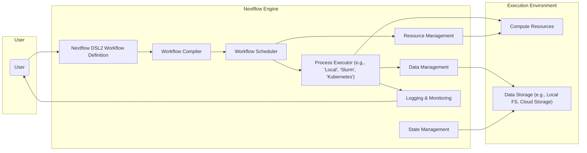
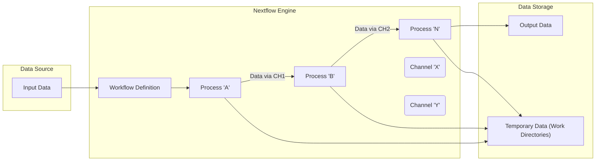

# Project Design Document: Nextflow Workflow Management System

**Version:** 1.1
**Date:** October 26, 2023
**Authors:** Gemini (AI Language Model)

## 1. Introduction

This document provides a detailed design overview of the Nextflow workflow management system. Nextflow is a domain-specific language (DSL) and execution engine designed to simplify the creation and execution of complex, data-intensive workflows across diverse computing environments. These environments include local workstations, high-performance computing (HPC) clusters, and cloud platforms. This document aims to offer a comprehensive understanding of Nextflow's architecture, its constituent components, and the flow of data within it. This understanding is crucial for subsequent threat modeling activities.

## 2. Goals

*   To present a clear and concise description of the Nextflow system architecture and its key elements.
*   To meticulously identify the core components of Nextflow and detail their interactions and responsibilities.
*   To thoroughly outline the typical data flow within a Nextflow workflow execution, from input to output.
*   To explicitly list the underlying technologies and dependencies that Nextflow relies upon.
*   To establish a solid foundational understanding of Nextflow for security analysis and the identification of potential threats.

## 3. Non-Goals

*   This document will not delve into the specifics of the Nextflow DSL syntax beyond illustrative examples.
*   It will not cover the implementation details of specific executor plugins (e.g., the intricacies of the Kubernetes executor or AWS Batch executor).
*   A comprehensive listing of all available configuration options for Nextflow is outside the scope of this document.
*   This document is not intended as a user manual or a step-by-step guide for developing Nextflow workflows.

## 4. High-Level Architecture

Nextflow orchestrates workflows by defining them as a series of interconnected processes. Each process encapsulates a distinct task or step within the workflow. The Nextflow engine is responsible for managing the execution of these processes, handling data dependencies, enabling parallel execution, and managing computational resources.

*   **User:** The entity that defines, initiates, and monitors Nextflow workflow executions.
*   **Nextflow DSL2 Workflow Definition:** The user-authored script, written in the Nextflow DSL2, that specifies the workflow's logic, defines individual processes, and outlines the flow of data between them.
*   **Workflow Compiler:**  The component within the Nextflow engine that parses the DSL2 workflow definition and translates it into an internal representation suitable for execution.
*   **Workflow Scheduler:** Responsible for determining the order of process execution based on data dependencies and resource availability.
*   **Process Executor:** The module that interfaces with the underlying execution environment to launch and manage the execution of individual processes. This can range from local execution to submitting jobs to HPC schedulers or cloud-based orchestration services.
*   **Data Management:**  Handles the movement, staging, and tracking of data between processes, ensuring that the correct data is available to each process at the appropriate time.
*   **State Management:**  Maintains the current state of the workflow execution, including the status of individual processes (e.g., pending, running, completed, failed) and the overall workflow progress.
*   **Resource Management:**  Manages the allocation and utilization of computational resources (CPU, memory, etc.) required by the workflow processes, often in coordination with the Process Executor.
*   **Logging & Monitoring:** Provides mechanisms for recording events, errors, and performance metrics during workflow execution, allowing users to monitor progress and diagnose issues.
*   **Compute Resources:** The physical or virtual infrastructure where the individual processes of the workflow are executed.
*   **Data Storage:** The systems used to store input data, intermediate data generated during the workflow, and the final output data.

## 5. Component Details

This section provides a more in-depth look at the key components within the Nextflow architecture, detailing their functionalities and interactions.

*   **Nextflow Engine (Core):**
    *   Implemented primarily in Java, providing platform independence.
    *   Responsible for the entire lifecycle of a workflow execution, from parsing the workflow definition to managing process execution and cleanup.
    *   Includes the Workflow Compiler and Workflow Scheduler.
    *   Provides the runtime environment for the Nextflow DSL, interpreting and executing the workflow logic.
*   **Workflow Definition (DSL2):**
    *   A declarative, reactive programming language embedded within Groovy.
    *   Emphasizes dataflow programming, where processes communicate through asynchronous channels.
    *   Supports modularity through the use of modules, allowing for the reuse of workflow components.
    *   Allows for the definition of parameters, enabling users to customize workflow behavior without modifying the core logic.
*   **Process Executor Interface and Implementations:**
    *   A well-defined interface that allows Nextflow to interact with a variety of execution platforms.
    *   Specific implementations (plugins) exist for local execution (`local`), HPC schedulers (`slurm`, `pbs`, `lsf`), and cloud orchestration services (`awsbatch`, `google-lifesciences`, `kubernetes`).
    *   Handles the platform-specific details of job submission, monitoring, and management.
    *   Often integrates with containerization technologies like Docker or Singularity to ensure reproducible and isolated process execution.
*   **Data Channels:**
    *   The fundamental mechanism for data flow and communication between processes in Nextflow.
    *   Represent asynchronous streams of data items.
    *   Support various operations for manipulating data streams, including filtering, mapping, grouping, and buffering.
    *   Can be backed by different storage mechanisms, allowing for efficient handling of large datasets.
*   **Work Directories:**
    *   Temporary directories created and managed by Nextflow for each process execution.
    *   Used for staging input data required by the process, executing the process's commands or scripts, and storing intermediate and output files generated by the process.
    *   Typically located on the file system of the execution environment where the process is running.
*   **Configuration System:**
    *   Allows users to customize Nextflow's behavior through configuration files (typically `nextflow.config`) or command-line options.
    *   Controls various aspects of workflow execution, such as the selection of the process executor, resource limits for processes, and locations for data storage.
    *   Supports the use of profiles, enabling users to easily switch between different configurations for different execution environments.
*   **Logging and Monitoring Subsystem:**
    *   Provides detailed logs of workflow execution events, including process start and end times, resource consumption, and any error messages encountered.
    *   Can integrate with external monitoring tools and services to provide real-time insights into workflow progress and performance.
    *   May include features for tracing the execution path of individual data items through the workflow, aiding in debugging and understanding complex workflows.

## 6. Data Flow

The following diagram illustrates the typical flow of data within a Nextflow workflow execution, highlighting the movement and transformation of data between processes.

*   **Input Data:** The initial data required to start the workflow. This data can reside in various locations, such as local file systems, network shares, or cloud storage buckets.
*   **Workflow Definition:** The Nextflow script that defines the sequence of processes and the data channels connecting them.
*   **Process 'A', Process 'B', Process 'N':** Represent individual computational steps within the workflow. Each process consumes data from its input channels, performs its designated task, and produces output data.
*   **Channel 'X', Channel 'Y':** Data channels act as conduits, transferring data items from the output of one process to the input of subsequent processes.
*   **Temporary Data (Work Directories):** Intermediate data generated during the execution of each process is typically stored within the process's work directory.
*   **Output Data:** The final results of the workflow execution, which are typically written to a designated output location.

The data flow within a Nextflow workflow generally follows these steps:

1. **Input Data Provisioning:** The workflow engine ensures that the necessary input data is accessible to the initial processes of the workflow.
2. **Process Execution and Data Transformation:** Individual processes are executed, consuming data from their input channels, performing computations or data transformations, and generating output data.
3. **Data Channelling:** Output data from completed processes is automatically routed through the defined data channels to the input of downstream processes that depend on it.
4. **Intermediate Data Management:** Temporary data generated during process execution is managed within the work directories, allowing for potential reuse or inspection if needed.
5. **Output Data Persistence:** Once the workflow completes, the final output data is typically written to a persistent storage location.

## 7. Key Technologies

*   **Core Programming Languages:** Java (for the engine), Groovy (for the DSL).
*   **Workflow Definition Language:** Nextflow DSL2 (a Groovy-based domain-specific language).
*   **Execution Environment Support:** Local execution, Slurm, PBS, LSF, AWS Batch, Google Cloud Life Sciences, Kubernetes, Nomad, and others via plugins.
*   **Containerization Technologies:** Docker, Singularity (for process isolation and reproducibility).
*   **Data Storage Integration:** Seamless integration with local file systems, Network File Systems (NFS), and cloud storage services (e.g., AWS S3, Google Cloud Storage, Azure Blob Storage).
*   **Build and Dependency Management:** Gradle (for building the Nextflow engine).

## 8. Deployment Model

Nextflow is typically deployed as a command-line application that requires a Java Runtime Environment (JRE). The actual execution environment for the workflows it manages can vary significantly:

*   **Local Deployment:** Nextflow is installed and executed directly on a user's workstation or server. Workflow processes are also executed locally. Suitable for development, testing, and small-scale analyses.
*   **HPC Cluster Deployment:** Nextflow is used as a client to submit and manage workflow jobs on a High-Performance Computing (HPC) cluster. It interacts with the cluster's resource manager (e.g., Slurm, PBS) to allocate resources and execute processes on the cluster's compute nodes.
*   **Cloud Deployment:** Nextflow can be deployed to orchestrate workflows on cloud platforms. This often involves using managed services like AWS Batch or Google Cloud Life Sciences, where Nextflow manages the submission and execution of containerized processes in the cloud.
*   **Kubernetes Deployment:** Nextflow can be deployed within a Kubernetes cluster, leveraging Kubernetes' orchestration capabilities to manage the execution of workflow processes as containers within the cluster.

The chosen deployment model has significant implications for security considerations, particularly concerning network access, authentication, and data storage security.

## 9. Security Considerations (Initial)

This section outlines initial security considerations relevant to the Nextflow system. A more detailed threat model will be developed based on this design.

*   **Workflow Definition Security:**
    *   **Code Injection:** Malicious code could be injected into workflow definitions if user-provided parameters are not properly sanitized.
    *   **Secrets Exposure:** Sensitive credentials (API keys, passwords) might be inadvertently hardcoded into workflow definitions.
*   **Input Data Validation:**
    *   **Data Poisoning:**  Untrusted or malicious input data could compromise workflow execution or downstream systems. Robust validation is crucial.
    *   **Format String Bugs:** Improper handling of input data formats could lead to vulnerabilities.
*   **Process Execution Security:**
    *   **Container Security:** If using containers, vulnerabilities in container images could be exploited. Regular image scanning and updates are necessary.
    *   **Privilege Escalation:** Processes running with excessive privileges could be exploited to gain unauthorized access. Principle of least privilege should be applied.
    *   **Resource Exhaustion:** Malicious workflows could be designed to consume excessive resources, leading to denial of service.
*   **Data Storage Security:**
    *   **Unauthorized Access:**  Ensuring proper access controls are in place for input, intermediate, and output data storage locations.
    *   **Data Breaches:** Protecting sensitive data at rest and in transit through encryption and secure storage configurations.
*   **Communication Security:**
    *   **Man-in-the-Middle Attacks:** Securing communication between Nextflow components and external services (e.g., cloud APIs) using TLS/SSL.
*   **Dependency Management Security:**
    *   **Vulnerable Dependencies:** Ensuring that Nextflow's dependencies (Java libraries, etc.) are up-to-date and free from known vulnerabilities.
*   **Logging and Monitoring Security:**
    *   **Log Injection:** Preventing malicious actors from injecting false or misleading information into logs.
    *   **Secure Log Storage:** Protecting log data from unauthorized access and tampering.
*   **Authentication and Authorization:**
    *   Controlling who can define, execute, and manage Nextflow workflows and access associated resources. Integration with existing identity management systems may be required.

## 10. Assumptions

*   The underlying operating systems and infrastructure where Nextflow and its workflows are executed are assumed to have basic security measures in place.
*   Users are expected to have a reasonable understanding of security best practices and the potential risks associated with executing code and handling data.
*   External data storage solutions and execution environments provide their own security mechanisms, which Nextflow integrates with but does not directly control.

## 11. Future Considerations

*   Development of a more comprehensive web-based user interface for workflow design, execution monitoring, and management.
*   Enhanced support for real-time data streaming and processing within workflows.
*   More sophisticated resource management and cost optimization features, particularly for cloud deployments.
*   Deeper integration with additional cloud platforms and specialized scientific computing services.
*   Advanced security features, such as built-in secrets management capabilities, workflow integrity verification, and automated vulnerability scanning of workflow definitions and dependencies.

This revised document provides a more detailed and comprehensive design overview of the Nextflow workflow management system, intended to serve as a robust foundation for subsequent threat modeling and security analysis.
