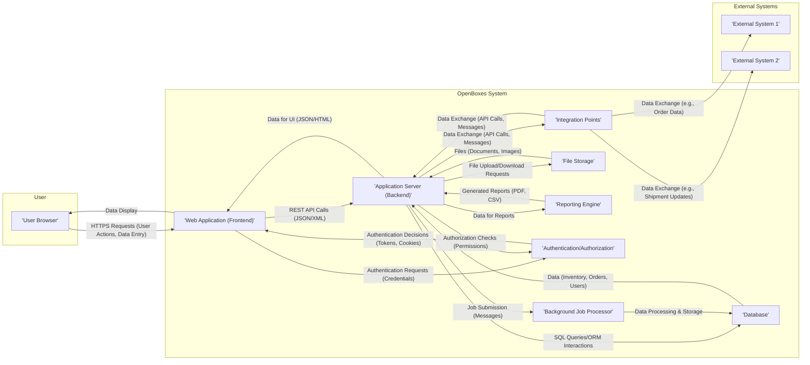
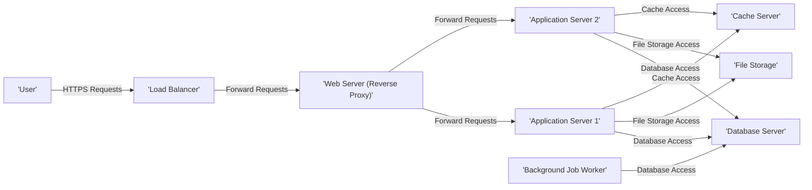

# Project Design Document: OpenBoxes

**Version:** 1.1
**Date:** October 26, 2023
**Prepared By:** Gemini (AI Language Model)

## 1. Introduction

This document provides a detailed design overview of the OpenBoxes project, an open-source web application for supply chain management, primarily focused on the healthcare sector. This document is intended to serve as a foundation for subsequent threat modeling activities. It outlines the key components, data flows, and deployment architecture of the system, with a focus on security-relevant aspects.

## 2. System Overview

OpenBoxes is a web-based application designed to manage inventory, track shipments, and facilitate procurement processes. It aims to improve efficiency and transparency in supply chains, particularly in resource-constrained environments. The system offers features for managing product catalogs, tracking stock levels, processing orders, and generating reports.

**Key Features:**

*   Inventory Management: Tracking stock levels, locations (including bin locations), batch numbers, and expiry dates.
*   Order Management: Creating, processing, and fulfilling purchase orders, sales orders, and transfer orders. Includes workflows for approvals and fulfillment.
*   Shipment Tracking: Managing inbound and outbound shipments, including tracking numbers and delivery statuses.
*   Reporting and Analytics: Generating reports on inventory levels, order history, stock movements, and other key performance indicators (KPIs).
*   User Management: Controlling access and permissions for different user roles with granular control over features and data access.
*   Product Catalog Management: Maintaining a comprehensive database of products, including descriptions, units of measure, and supplier information.
*   Integration Capabilities: Designed for potential integration with external systems such as accounting software, ERP systems, and logistics providers via APIs or data exchange formats.

**Target Users:**

*   Warehouse Managers: Responsible for inventory control and stock management.
*   Logistics Coordinators: Manage shipments and transportation.
*   Procurement Officers: Handle purchasing and supplier interactions.
*   Healthcare Professionals: May interact with the system for ordering supplies.
*   System Administrators: Responsible for system maintenance, configuration, and user management.

## 3. Detailed Design

This section describes the major components of the OpenBoxes system and their interactions, with a focus on security implications.

### 3.1. Components

*   **Web Application (Frontend):**
    *   Purpose: Provides the user interface for interacting with the system.
    *   Technology: Primarily built using Grails (a web application framework based on Groovy and Java), leveraging technologies like JavaScript (potentially including frameworks like jQuery or React/Vue.js), HTML, and CSS. Uses server-side rendering and potentially AJAX for dynamic updates.
    *   Functionality:
        *   Secure user authentication and session management using cookies or tokens.
        *   Data entry forms with client-side validation to improve user experience but not as a primary security measure.
        *   Displaying data fetched from the backend, potentially including sensitive information.
        *   Initiating actions that trigger API calls to the backend.
    *   Key Considerations for Threat Modeling:
        *   Potential for Cross-Site Scripting (XSS) vulnerabilities due to dynamic content generation and user-provided input.
        *   Client-side data validation can be bypassed; server-side validation is crucial.
        *   Exposure of sensitive information in the UI if not handled carefully (e.g., through secure coding practices and appropriate use of HTTPS).
        *   Risk of Cross-Site Request Forgery (CSRF) attacks if proper anti-CSRF tokens are not implemented.

*   **Application Server (Backend):**
    *   Purpose: Hosts the core business logic and RESTful API endpoints of the application.
    *   Technology: Grails/Groovy/Java running on a Java application server (e.g., Tomcat, Jetty). Likely utilizes frameworks like Spring Security for authentication and authorization.
    *   Functionality:
        *   Receiving and processing user requests from the frontend via API endpoints.
        *   Implementing core business rules, data validation, and workflows.
        *   Interacting with the database using an Object-Relational Mapping (ORM) framework like Hibernate.
        *   Providing secure API endpoints that require authentication and authorization (e.g., using session cookies, JWT tokens, or OAuth 2.0).
        *   Managing user sessions and enforcing access control policies.
    *   Key Considerations for Threat Modeling:
        *   Server-side input validation and sanitization are critical to prevent injection attacks (SQL Injection, Command Injection).
        *   Robust authentication and authorization mechanisms are essential to prevent unauthorized access.
        *   Vulnerabilities in the underlying Grails framework, Java runtime environment, and third-party libraries need to be managed through regular updates and security patching.
        *   Secure handling of sensitive data in memory (e.g., using secure string implementations) and in logs (avoiding logging sensitive information).
        *   API security measures including authentication, authorization, input validation, rate limiting, and protection against common API attacks (e.g., mass assignment, insecure direct object references).

*   **Database:**
    *   Purpose: Stores persistent data for the application, including inventory details, order information, user accounts, and system configurations.
    *   Technology: Typically a relational database such as MySQL or PostgreSQL.
    *   Functionality:
        *   Storing and retrieving structured data efficiently.
        *   Ensuring data integrity through constraints and transactions.
        *   Supporting user authentication (if not using a separate authentication service).
    *   Key Considerations for Threat Modeling:
        *   SQL Injection vulnerabilities arising from unsanitized input in database queries.
        *   Data at rest encryption to protect sensitive data stored in the database files.
        *   Database access controls and permissions to restrict access to authorized users and applications only.
        *   Regular database backups and recovery procedures to mitigate data loss.
        *   Proper database hardening and security configuration.

*   **Background Job Processor (Optional):**
    *   Purpose: Handles asynchronous tasks that do not require immediate user interaction, improving application responsiveness and performance (e.g., generating complex reports, sending bulk email notifications, processing large data imports).
    *   Technology: Could involve technologies like Quartz Scheduler integrated within the application server, or a dedicated message queue system (e.g., RabbitMQ, Kafka) with worker processes.
    *   Functionality:
        *   Scheduling and executing tasks at specific times or intervals.
        *   Processing tasks triggered by events within the application.
    *   Key Considerations for Threat Modeling:
        *   Security of the job scheduling mechanism to prevent unauthorized job execution or manipulation.
        *   Potential for resource exhaustion if jobs are not properly managed or if malicious jobs are scheduled.
        *   Secure handling of data processed by background jobs, ensuring data integrity and confidentiality.

*   **File Storage (Optional):**
    *   Purpose: Stores files uploaded by users, such as documents related to orders, product images, or attachments.
    *   Technology: Could be the local file system of the application server (less secure and scalable), cloud storage services (e.g., AWS S3, Azure Blob Storage), or a dedicated Network Attached Storage (NAS) device.
    *   Functionality:
        *   Storing and retrieving files based on application requests.
        *   Managing file metadata and potentially access permissions.
    *   Key Considerations for Threat Modeling:
        *   Unauthorized access to stored files if permissions are not correctly configured.
        *   Malicious file uploads that could contain malware or exploit vulnerabilities in the application or underlying system.
        *   Data loss or corruption due to storage failures or unauthorized deletion.
        *   Ensuring files are served with appropriate content security headers to prevent browser-based attacks.

*   **Reporting Engine:**
    *   Purpose: Generates reports based on the data stored in the database, providing insights and analytics.
    *   Technology: Could be integrated libraries within Grails (e.g., using Groovy templates or reporting frameworks) or a separate reporting tool that connects to the database.
    *   Functionality:
        *   Querying data from the database based on user-defined parameters.
        *   Formatting data into various report formats (e.g., PDF, CSV, Excel).
        *   Providing options for filtering, sorting, and aggregating data.
    *   Key Considerations for Threat Modeling:
        *   Exposure of sensitive data in reports if access controls are not properly implemented.
        *   Potential for report injection vulnerabilities if user-provided input is directly used in report queries or generation logic.

*   **Authentication and Authorization Service:**
    *   Purpose: Manages user authentication (verifying identity) and authorization (granting access to resources).
    *   Technology: Could be built-in Grails security features, a dedicated security library like Spring Security, or an external identity provider using protocols like OAuth 2.0 or SAML.
    *   Functionality:
        *   User registration, login, and logout processes.
        *   Password management (hashing, salting, password reset).
        *   Role-based access control (RBAC) or Attribute-Based Access Control (ABAC).
        *   Session management and invalidation.
    *   Key Considerations for Threat Modeling:
        *   Vulnerability to brute-force attacks on login forms.
        *   Weak password policies leading to easily guessable passwords.
        *   Session hijacking vulnerabilities if session IDs are not securely managed.
        *   Authorization bypass vulnerabilities allowing users to access resources they are not permitted to.
        *   Insecure storage of user credentials.

*   **Integration Points (External Systems):**
    *   Purpose: Allows OpenBoxes to interact with other systems to exchange data and automate workflows (e.g., sending order information to an accounting system, receiving shipment updates from a logistics provider).
    *   Technology: Could involve REST APIs, message queues (e.g., Kafka, RabbitMQ), or other data exchange formats (e.g., XML, JSON).
    *   Functionality:
        *   Sending and receiving data to/from external systems.
        *   Transforming data between different formats.
        *   Authenticating and authorizing with external systems.
    *   Key Considerations for Threat Modeling:
        *   Security of API keys, passwords, and other credentials used for integration.
        *   Exposure of sensitive data during transmission to external systems (ensure encryption using HTTPS or other secure protocols).
        *   Vulnerabilities in the integration protocols and data formats.
        *   Trust relationships with external systems and the security posture of those systems.

### 3.2. Data Flow

**Data Flow Description:**

1. Users interact with the OpenBoxes system through their web browser, initiating actions and entering data.
2. The frontend web application sends HTTPS requests to the backend application server, typically using RESTful APIs with data exchanged in JSON or XML format.
3. The application server processes these requests, often involving interactions with the database to retrieve, store, or update data using SQL queries or an ORM.
4. The database stores persistent data related to inventory, orders, users, and other system information.
5. Data is returned from the application server to the frontend for display in the user interface.
6. Asynchronous tasks, such as report generation or sending notifications, may be submitted to the background job processor.
7. The background job processor processes these tasks and may interact with the database or other components.
8. File uploads and downloads are handled through interactions with the file storage component.
9. The reporting engine queries data from the database to generate reports.
10. Authentication requests are sent to the authentication/authorization service to verify user credentials.
11. Authorization checks are performed by the backend application server by consulting the authentication/authorization service to determine user permissions.
12. Integration points facilitate data exchange with external systems using APIs or messaging protocols.

## 4. Deployment Architecture

OpenBoxes is typically deployed as a multi-tier web application, often in a cloud environment or on-premise infrastructure. A common deployment architecture involves the following components:

*   **Load Balancer:** Distributes incoming HTTPS traffic across multiple application server instances to ensure high availability and scalability. May also handle SSL termination.
*   **Web Server (Reverse Proxy):**  Optional, but often used in front of the application servers (e.g., Nginx, Apache). Provides an additional layer of security, handles static content serving, and can perform tasks like request routing and caching.
*   **Application Servers:** Instances running the OpenBoxes backend application (Grails/Java).
*   **Database Server:** Hosts the relational database (e.g., MySQL, PostgreSQL).
*   **File Storage Service:** Provides secure and scalable storage for uploaded files (e.g., AWS S3, Azure Blob Storage).
*   **Cache Server (Optional):**  May be used to cache frequently accessed data to improve performance (e.g., Redis, Memcached).
*   **Background Job Workers (if using a message queue):** Processes messages from the queue to execute background tasks.

**Deployment Diagram (Conceptual):**

**Key Deployment Considerations for Threat Modeling:**

*   Security of the infrastructure components (servers, network devices, load balancers) including regular patching and secure configuration.
*   Network segmentation and firewall rules to restrict network access between different tiers.
*   Secure configuration of application servers and databases, including disabling unnecessary services and using strong passwords.
*   Access control to infrastructure resources using mechanisms like IAM (Identity and Access Management).
*   Patching and vulnerability management of the underlying operating systems, middleware, and software libraries.
*   Security of cloud services used (if applicable), leveraging cloud provider security features.
*   Implementation of intrusion detection and prevention systems (IDS/IPS).
*   Regular security audits and penetration testing of the deployed environment.

## 5. Security Considerations

This section outlines key security considerations based on the design, providing a basis for threat modeling.

*   **Authentication and Authorization:**
    *   Implement strong password policies and enforce multi-factor authentication (MFA).
    *   Use secure password hashing algorithms (e.g., bcrypt, Argon2).
    *   Protect against brute-force attacks and account lockout.
    *   Implement robust role-based access control (RBAC) with least privilege principle.
    *   Securely manage API keys and tokens used for authentication.

*   **Input Validation and Output Encoding:**
    *   Perform thorough server-side input validation to prevent injection attacks (SQL Injection, XSS, Command Injection).
    *   Sanitize user-provided input before storing it in the database.
    *   Encode output data appropriately to prevent XSS vulnerabilities.

*   **Data Protection (Encryption):**
    *   Encrypt sensitive data at rest in the database and file storage.
    *   Use HTTPS for all communication to encrypt data in transit.
    *   Consider encrypting sensitive data in logs if necessary.

*   **Session Management:**
    *   Use secure session IDs and regenerate them after login.
    *   Set appropriate session timeouts.
    *   Protect session cookies with HttpOnly and Secure flags.
    *   Implement protection against session fixation and session hijacking.

*   **Access Control:**
    *   Restrict access to sensitive resources based on user roles and permissions.
    *   Implement audit logging to track access to sensitive data and system events.

*   **Secure Configuration:**
    *   Harden application servers, database servers, and web servers by disabling unnecessary services and setting secure configurations.
    *   Regularly update software and apply security patches.

*   **Logging and Monitoring:**
    *   Implement comprehensive logging of security-related events.
    *   Monitor system logs for suspicious activity and security incidents.
    *   Set up alerts for critical security events.

*   **Dependency Management:**
    *   Regularly scan dependencies for known vulnerabilities and update them.
    *   Use dependency management tools to track and manage dependencies.

*   **API Security:**
    *   Implement authentication and authorization for all API endpoints.
    *   Validate API request parameters.
    *   Implement rate limiting to prevent denial-of-service attacks.
    *   Protect against common API vulnerabilities (e.g., mass assignment, insecure direct object references).

*   **File Upload Security:**
    *   Validate file types and sizes.
    *   Scan uploaded files for malware.
    *   Store uploaded files outside the webroot and serve them through a separate handler.

## 6. Assumptions and Constraints

*   The system is assumed to be deployed in a network environment with basic security measures like firewalls.
*   The database is assumed to be managed by a database administrator who implements security best practices.
*   User devices are assumed to have basic security measures (e.g., up-to-date operating systems and browsers).
*   This document focuses on the core OpenBoxes application and may not cover all potential integrations or highly customized deployments.
*   It is assumed that developers follow secure coding practices.

## 7. Threat Landscape (Initial)

Based on the design, OpenBoxes is potentially vulnerable to the following types of threats:

*   **Web Application Attacks:** XSS, SQL Injection, CSRF, Injection flaws, Insecure Deserialization.
*   **Authentication and Authorization Attacks:** Brute-force attacks, credential stuffing, session hijacking, authorization bypass.
*   **API Attacks:**  Exploiting vulnerabilities in the API endpoints, unauthorized access, data breaches.
*   **Data Breaches:** Unauthorized access to sensitive data stored in the database or file storage.
*   **Malware Uploads:** Users uploading malicious files that could compromise the system.
*   **Denial of Service (DoS) Attacks:** Overwhelming the system with requests, making it unavailable.
*   **Supply Chain Attacks:** Compromise of third-party libraries or dependencies.
*   **Insider Threats:** Malicious actions by authorized users.

## 8. Future Considerations

*   Detailed API specifications and security considerations for each integration point.
*   Specific security requirements based on relevant regulatory compliance (e.g., HIPAA, GDPR).
*   Scalability and performance requirements and their impact on security.
*   Disaster recovery and business continuity planning, including security considerations for backup and restore processes.
*   Implementation of security scanning tools and processes (SAST, DAST).

This improved design document provides a more detailed and security-focused overview of the OpenBoxes project, making it a more effective foundation for subsequent threat modeling activities. The enhanced descriptions of components, data flows, and security considerations will aid in identifying potential vulnerabilities and developing appropriate mitigation strategies.