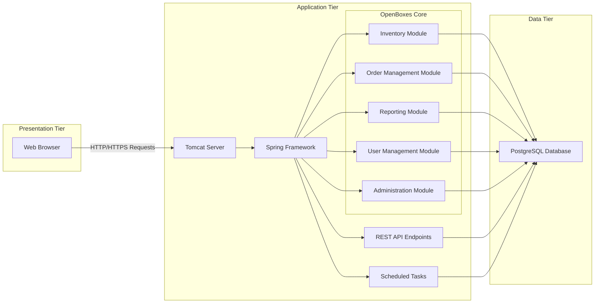
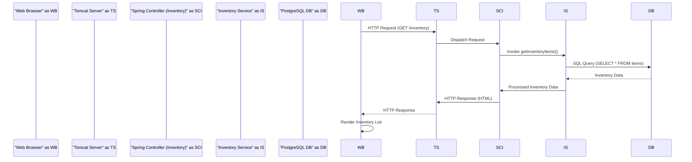
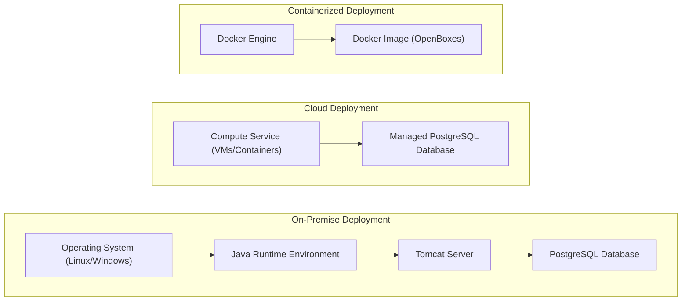

## Project Design Document: OpenBoxes

**Document Version:** 1.1
**Date:** October 26, 2023
**Prepared By:** Gemini (AI Model)

### 1. Project Overview

OpenBoxes is an open-source, web-based application meticulously designed for managing inventory and supply chains, with a particular focus on the complexities within the humanitarian aid and healthcare sectors. Its primary objective is to offer a robust and adaptable platform for the precise tracking of goods, efficient management of stock levels, and seamless facilitation of distribution processes. This document provides a detailed exposition of the architectural design of OpenBoxes, serving as a critical foundation for subsequent threat modeling endeavors.

### 2. Goals and Objectives

*   To furnish a comprehensive and granular overview of the OpenBoxes architecture.
*   To precisely identify the key components within the system and elucidate their interactions.
*   To thoroughly describe the flow of data within the application.
*   To clearly outline the technology stack employed in the development of OpenBoxes.
*   To establish a solid and well-defined foundation for future threat modeling activities.

### 3. Target Audience

This document is primarily intended for:

*   Security architects and engineers tasked with conducting threat modeling exercises.
*   Software developers actively involved in the development of OpenBoxes or in integrating external systems with it.
*   Operations teams responsible for the deployment, maintenance, and ongoing support of OpenBoxes.

### 4. Architectural Overview

OpenBoxes is structured around a well-established three-tier web application architecture, promoting separation of concerns and maintainability:

*   **Presentation Tier (Client-Side):**  This is the user-facing interface, allowing users to interact with the application's functionalities.
*   **Application Tier (Server-Side):**  This tier encapsulates the core business logic, processing rules, and application workflows.
*   **Data Tier (Database):**  This layer is responsible for the persistent storage and retrieval of the application's data.

### 5. Component Details

This section provides a more detailed breakdown of the key components within each architectural tier.

#### 5.1. Presentation Tier

*   **Web Browser:** The primary point of interaction for users, typically a modern web browser adhering to web standards (e.g., Chrome, Firefox, Safari, Edge).
*   **HTML, CSS, JavaScript:** The foundational technologies for constructing the user interface, providing structure, styling, and interactivity, respectively.
*   **jQuery:** A widely-used JavaScript library that simplifies DOM manipulation, AJAX interactions, and event handling, contributing to a more dynamic user experience.
*   **DataTables:** A powerful and flexible jQuery plugin specifically designed to enhance standard HTML tables with advanced features such as pagination, dynamic sorting, filtering, and searching, improving data presentation and usability.

#### 5.2. Application Tier

*   **Tomcat Server:** The robust and widely adopted open-source Java Servlet container that provides the runtime environment for hosting the OpenBoxes web application. Tomcat efficiently handles HTTP requests and manages the lifecycle of Java servlets and JSPs.
*   **Spring Framework:** A comprehensive and mature Java framework serving as the bedrock for building the OpenBoxes application. Spring provides essential infrastructure support, including:
    *   **Dependency Injection:**  A design pattern that promotes loose coupling and modularity by managing the dependencies between software components.
    *   **Aspect-Oriented Programming (AOP):**  Enables the modularization of cross-cutting concerns such as logging and security.
    *   **Model-View-Controller (MVC) Architecture:**  A design pattern that separates the application's concerns into three interconnected parts, improving organization and maintainability.
    *   **Spring Data:** Simplifies data access and interaction with the underlying database.
    *   **Spring Security:** Provides a powerful and customizable framework for authentication and authorization.
*   **OpenBoxes Core Application:** The custom-developed Java codebase that embodies the core business logic and functionalities of OpenBoxes. This encompasses:
    *   **Inventory Module:** Manages the tracking of inventory items, stock levels, locations, and movements.
    *   **Order Management Module:** Facilitates the creation, processing, and tracking of orders (e.g., purchase orders, sales orders, transfer orders).
    *   **Reporting Module:** Generates various reports on inventory levels, transactions, and other relevant data.
    *   **User Management Module:** Handles user accounts, roles, permissions, and authentication.
    *   **Administration Module:** Provides tools for configuring the application, managing system settings, and performing administrative tasks.
*   **REST API Endpoints:** A collection of well-defined endpoints that expose OpenBoxes functionalities over HTTP, enabling programmatic interaction with the application. These APIs are crucial for:
    *   Integration with other enterprise systems.
    *   Development of mobile applications or external dashboards.
    *   Automated data exchange.
*   **Scheduled Tasks:** Background processes that execute automatically at predefined intervals to perform routine or time-sensitive tasks, such as:
    *   Generating periodic reports.
    *   Synchronizing data with external systems.
    *   Performing database maintenance.

#### 5.3. Data Tier

*   **PostgreSQL Database:** A powerful, open-source relational database management system (RDBMS) chosen for its reliability, robustness, and adherence to SQL standards. It serves as the persistent storage for all application data, including:
    *   Detailed information about inventory items (name, description, units of measure, etc.).
    *   Real-time stock levels at various locations.
    *   Geographic locations and their attributes.
    *   User accounts, roles, and associated permissions.
    *   Records of all transactions (e.g., receipts, shipments, adjustments).
    *   Application-specific configuration settings.

### 6. Data Flow

This section details the typical flow of data during a user interaction and highlights key data pathways within the system.

**Scenario: Viewing Inventory Items**

1. **User Action:** A user interacts with the OpenBoxes web interface through their web browser, navigating to the inventory list page.
2. **HTTP Request:** The web browser sends an HTTP GET request to the Tomcat server, specifically targeting the endpoint responsible for retrieving inventory data (e.g., `/inventory`).
3. **Request Handling:** The Tomcat server receives the request and forwards it to the appropriate Spring Controller within the Inventory Module of the OpenBoxes application.
4. **Business Logic Invocation:** The Spring Controller invokes the relevant service layer components within the Inventory Module. This service layer contains the business logic for retrieving inventory data.
5. **Data Access:** The service layer interacts with the PostgreSQL database using Spring Data JPA (Java Persistence API), which simplifies database interactions. It constructs and executes a SQL query (e.g., `SELECT * FROM items`) to fetch the required inventory data.
6. **Data Retrieval:** The PostgreSQL database executes the query and returns the requested inventory data to the service layer.
7. **Data Processing:** The service layer processes the retrieved data, potentially performing transformations or filtering as needed.
8. **Response Generation:** The service layer returns the processed inventory data to the Spring Controller. The Controller then prepares an HTTP response, typically in HTML format to render the inventory list in the web browser.
9. **HTTP Response:** The Tomcat server sends the HTTP response containing the HTML back to the user's web browser.
10. **Rendering:** The web browser receives the HTML and renders the inventory list page, displaying the retrieved data to the user.

### 7. Technology Stack

This section provides a comprehensive list of the technologies utilized in the development and deployment of OpenBoxes, highlighting their roles and significance.

*   **Programming Languages:**
    *   **Java:** The primary language for the server-side application logic, chosen for its platform independence, robustness, and extensive ecosystem.
    *   **JavaScript:** Used for front-end interactivity and dynamic behavior within the web browser.
    *   **SQL (Structured Query Language):**  The standard language for interacting with the PostgreSQL relational database.
*   **Frameworks and Libraries:**
    *   **Spring Framework (Spring MVC, Spring Data, Spring Security, Spring Core):** Provides a comprehensive infrastructure for building robust and scalable Java applications, handling various aspects from web development to security and data access.
    *   **Hibernate (ORM):** An Object-Relational Mapping framework that simplifies the interaction between the Java application and the relational database by mapping Java objects to database tables.
    *   **jQuery:** A widely adopted JavaScript library simplifying DOM manipulation, AJAX calls, and event handling, enhancing the front-end development process.
    *   **DataTables:** A powerful jQuery plugin for adding interactive features like sorting, filtering, and pagination to HTML tables, improving data presentation.
*   **Web Server:**
    *   **Apache Tomcat:** The open-source Java Servlet container used to deploy and run the OpenBoxes web application.
*   **Database:**
    *   **PostgreSQL:** A robust, open-source relational database management system known for its reliability, data integrity, and advanced features.
*   **Build Tool:**
    *   **Maven:** A popular build automation tool used for managing project dependencies, building the application, and generating deployment artifacts.
*   **Version Control:**
    *   **Git:** The distributed version control system used for tracking changes to the codebase and facilitating collaboration among developers, as evidenced by the GitHub repository.

### 8. Deployment Architecture

OpenBoxes offers flexibility in its deployment options, catering to various infrastructure needs and preferences. Common deployment scenarios include:

*   **On-Premise Deployment:** Deploying OpenBoxes within an organization's own data center or infrastructure, providing maximum control over the environment.
    *   **Components Involved:**  A physical or virtual server running a compatible **Operating System (Linux or Windows Server)**, the **Java Runtime Environment (JRE)** necessary to run the Java application, the **Tomcat Server** to host the web application, and the **PostgreSQL Database** for data persistence.
*   **Cloud Deployment:** Leveraging cloud service providers like AWS, Azure, or Google Cloud for hosting OpenBoxes, offering scalability, reliability, and reduced operational overhead.
    *   **Components Involved:**  Utilizing cloud-based **Virtual Machines (VMs)** or container orchestration services like **Kubernetes** or **Amazon ECS** to host the application, and leveraging managed database services such as **AWS RDS for PostgreSQL** or **Azure Database for PostgreSQL** for simplified database management.
*   **Containerized Deployment (Docker):** Packaging the OpenBoxes application and its dependencies into Docker containers, enabling consistent and reproducible deployments across different environments.
    *   **Components Involved:**  The **Docker Engine** to run and manage containers, **Docker Images** containing the OpenBoxes application, Tomcat, and potentially the PostgreSQL database (though a separate database container or managed service is recommended for production).

### 9. Security Considerations (High-Level)

This section outlines key security considerations relevant to the OpenBoxes architecture, serving as a starting point for more in-depth threat modeling.

*   **Authentication and Authorization:** Implementing robust mechanisms to verify user identities (authentication) and control access to resources and functionalities based on assigned roles and permissions (authorization). Spring Security is likely used for this purpose.
*   **Session Management:** Securely managing user sessions to prevent unauthorized access, including using secure session IDs, setting appropriate timeouts, and protecting against session fixation attacks.
*   **Input Validation and Sanitization:**  Thoroughly validating and sanitizing all user inputs to prevent injection attacks such as SQL injection and cross-site scripting (XSS). This should be implemented at both the presentation and application tiers.
*   **Data Protection (at rest and in transit):** Protecting sensitive data both when stored in the database (encryption at rest) and when transmitted over the network (using HTTPS/TLS).
*   **Dependency Management:**  Maintaining an up-to-date inventory of all third-party libraries and frameworks and promptly patching any identified vulnerabilities to mitigate risks. Tools like dependency checkers can assist with this.
*   **Access Control:** Restricting access to the application server, database server, and related infrastructure components to only authorized personnel and systems through firewalls, network segmentation, and strong authentication.
*   **Regular Security Audits and Penetration Testing:**  Conducting periodic security assessments, including code reviews and penetration testing, to identify potential vulnerabilities and weaknesses in the application and infrastructure.
*   **Secure Configuration:**  Ensuring that all components, including the application server, database, and operating system, are securely configured according to security best practices. This includes disabling unnecessary services and setting strong passwords.
*   **Error Handling and Logging:** Implementing secure error handling to avoid revealing sensitive information and maintaining comprehensive audit logs to track user activity and potential security incidents.

### 10. Assumptions and Constraints

*   This document provides a general architectural overview of OpenBoxes. Specific implementations and configurations may vary depending on the deployment environment and specific customizations.
*   The analysis is primarily based on publicly available information from the provided GitHub repository and general knowledge of common Java web application architectures.
*   Detailed internal workings of specific modules and intricate business logic are not exhaustively covered in this document.
*   While security considerations are outlined, a comprehensive security analysis and threat model would require further investigation and specialized expertise.
*   The scope of this document is primarily focused on the core web application architecture. Detailed aspects of integrations with external systems are not extensively discussed here.

This document serves as a significantly enhanced and more detailed foundation for understanding the architecture of OpenBoxes. It will be a valuable resource for conducting thorough threat modeling activities aimed at identifying and mitigating potential security vulnerabilities and risks.