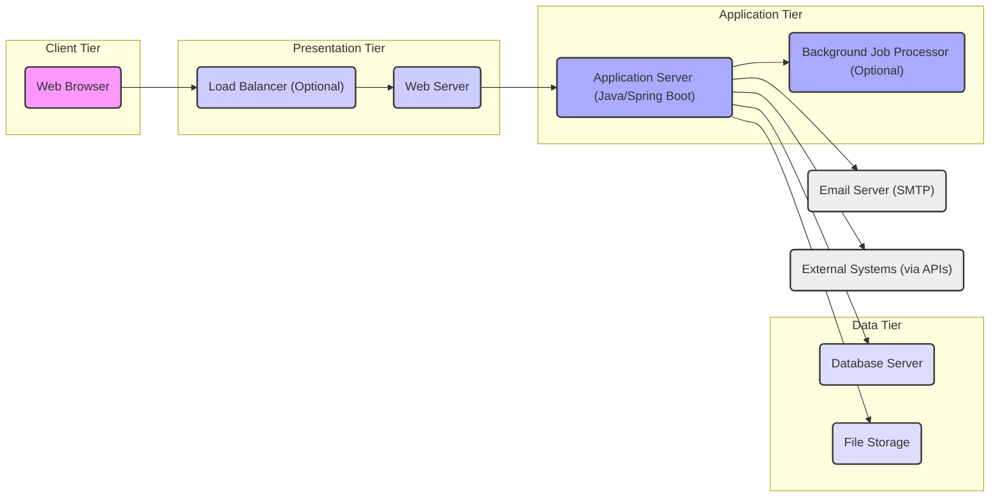

## Project Design Document: OpenBoxes (Improved)

**1. Introduction**

This document provides an enhanced design overview of the OpenBoxes project, an open-source, web-based inventory management system specifically designed for optimizing healthcare supply chains and humanitarian aid logistics. This document is intended to serve as a comprehensive resource for subsequent threat modeling activities. It details the system's architecture, key components, data flows, underlying technologies, and deployment considerations. The information presented is derived from the publicly accessible codebase and documentation of the OpenBoxes project available at [https://github.com/openboxes/openboxes](https://github.com/openboxes/openboxes). This document aims to provide sufficient detail for security professionals to identify potential vulnerabilities and attack vectors.

**2. Project Overview**

OpenBoxes addresses the critical need for efficient and transparent inventory management, particularly in resource-constrained environments. Its primary users include healthcare providers, non-governmental organizations (NGOs), and logistics personnel involved in managing medical supplies, pharmaceuticals, and other essential goods. The system aims to:

*   Streamline inventory tracking across multiple locations (warehouses, clinics, distribution centers).
*   Improve supply chain visibility and reduce stockouts or overstocking.
*   Facilitate accurate reporting and analysis of inventory data.
*   Support efficient order management, fulfillment, and shipment tracking.
*   Provide robust user and role-based access control to protect sensitive information.
*   Enable integration with other relevant systems, such as electronic health records (EHRs) or logistics platforms.

**3. System Architecture**

OpenBoxes employs a layered, service-oriented architecture, typical of modern web applications. The core components and their interactions are described below:

*   **Web Browser (Client):** The primary interface for users to interact with OpenBoxes. This includes functionalities for data entry, viewing reports, managing inventory, and configuring the system. It relies on standard web technologies (HTML, CSS, JavaScript).
*   **Load Balancer (Optional):**  Distributes incoming user requests across multiple instances of the Web Server and Application Server. This enhances scalability, fault tolerance, and availability, especially under high user load. Examples include Nginx or HAProxy.
*   **Web Server (e.g., Apache Tomcat or Jetty):**  Receives HTTP(S) requests from clients. It serves static content (images, CSS, JavaScript files) and forwards dynamic requests to the Application Server. It also handles SSL/TLS termination for secure communication.
*   **Application Server (Java/Spring Boot):** The central component responsible for the application's business logic, data processing, and orchestration. It handles:
    *   User authentication and authorization (using Spring Security).
    *   Processing user requests and interacting with the Database Server.
    *   Implementing core inventory management functionalities.
    *   Managing background tasks through a job scheduler.
    *   Exposing APIs for integration with external systems (likely RESTful).
*   **Database Server (e.g., PostgreSQL):**  Persistently stores all application data, including:
    *   Product catalogs and item details.
    *   Inventory levels and stock movements.
    *   User accounts, roles, and permissions.
    *   Transaction history and audit logs.
    *   Configuration settings.
*   **Background Job Processor (Optional - e.g., Quartz or Spring Batch):** Executes asynchronous tasks that do not require immediate user interaction. Examples include generating scheduled reports, sending email notifications, and performing data cleanup.
*   **File Storage (Local File System or Cloud Storage - e.g., AWS S3):** Stores uploaded files, such as product images, documents, or import/export files. The storage mechanism can be configured based on deployment needs.
*   **Email Server (SMTP):** Used for sending transactional emails, notifications, and alerts to users. The application needs SMTP server credentials for this functionality.
*   **Integration Interfaces (APIs - RESTful):** Provides well-defined endpoints for external systems to interact with OpenBoxes programmatically. This allows for data exchange and integration with other applications.

**4. Data Flow**

The following describes key data flows within the OpenBoxes system, highlighting potential security considerations:

*   **User Login and Session Management:**
    *   User enters credentials on the "Web Browser".
    *   Credentials are transmitted over HTTPS to the "Web Server".
    *   The "Web Server" forwards the request to the "Application Server".
    *   The "Application Server" authenticates the user against credentials stored in the "Database Server".
    *   Upon successful authentication, the "Application Server" creates a session and sends a session identifier (e.g., a cookie) back to the "Web Browser". Subsequent requests include this identifier for authorization.
*   **Adding a New Product:**
    *   User inputs product details via the "Web Browser".
    *   Data is sent to the "Web Server".
    *   The "Web Server" forwards the request to the "Application Server".
    *   The "Application Server" validates the input data and stores the new product information in the "Database Server". If an image is uploaded, it's stored in "File Storage".
*   **Processing an Inventory Receipt:**
    *   User records an inventory receipt via the "Web Browser".
    *   Transaction details are sent to the "Web Server".
    *   The "Web Server" forwards the request to the "Application Server".
    *   The "Application Server" updates inventory levels in the "Database Server". This might trigger a background job to update reports or send notifications.
*   **Generating an Inventory Report:**
    *   User requests a report through the "Web Browser".
    *   The request is sent to the "Web Server".
    *   The "Web Server" forwards the request to the "Application Server".
    *   The "Application Server" queries the "Database Server" for the necessary data.
    *   The "Application Server" formats the data into the report and sends it back to the "Web Browser" for display or download.
*   **External System Integration via API:**
    *   An "External System" sends an API request to the "Web Server".
    *   The "Web Server" forwards the request to the "Application Server".
    *   The "Application Server" authenticates and authorizes the request (depending on the API endpoint).
    *   The "Application Server" processes the request, potentially interacting with the "Database Server".
    *   The "Application Server" sends a response back to the "External System".
*   **Sending a Low Stock Notification:**
    *   A background job running on the "Background Job Processor" periodically checks inventory levels in the "Database Server".
    *   If a low stock condition is detected, the "Application Server" retrieves the relevant user's email address from the "Database Server".
    *   The "Application Server" connects to the "Email Server (SMTP)" and sends a notification email.

**5. Key Technologies**

OpenBoxes leverages a well-established set of technologies:

*   **Programming Language:** Java (primarily for backend logic)
*   **Framework:** Spring Boot (for rapid application development, dependency injection, and more)
*   **Web Server:**  Likely Apache Tomcat or Jetty (for serving the application)
*   **Database:** PostgreSQL (a robust and feature-rich open-source relational database) - Security considerations include proper access controls and encryption at rest.
*   **Frontend Technologies:**  A combination of:
    *   HTML, CSS, and JavaScript (for the user interface structure, styling, and interactivity).
    *   Likely a server-side templating engine like Thymeleaf (integrated with Spring MVC).
    *   Potentially JavaScript libraries or frameworks for enhanced UI components.
*   **Build Tool:** Maven or Gradle (for managing dependencies and building the application). Security considerations involve ensuring the integrity of the build process and dependencies.
*   **Background Job Scheduling:**  Potentially Quartz or Spring Batch (for managing asynchronous tasks). Security considerations include ensuring jobs are executed securely and do not introduce vulnerabilities.
*   **API Standards:** REST (likely using JSON for data exchange) - Security considerations include proper authentication and authorization for API endpoints.
*   **Authentication and Authorization:** Spring Security (a powerful and customizable framework for securing Spring-based applications). Key for controlling access to resources and functionalities.
*   **Data Serialization:**  Likely Jackson (for converting Java objects to JSON and vice versa). Security considerations involve handling potentially malicious input during deserialization.

**6. Deployment Considerations**

The security posture of OpenBoxes is significantly influenced by its deployment environment. Common deployment scenarios include:

*   **On-Premise Deployment:**  The application is hosted on the organization's own infrastructure (servers, network). Security is the responsibility of the deploying organization, including server hardening, network security, and physical security.
*   **Cloud-Based Deployment (IaaS, PaaS):**  Leveraging cloud providers like AWS, Azure, or GCP. Security is a shared responsibility. The cloud provider manages the underlying infrastructure security, while the deploying organization is responsible for securing the application, data, and configurations. Cloud-specific security services (e.g., AWS WAF, Azure Firewall) can be utilized.
*   **Containerized Deployment (Docker, Kubernetes):**  Packaging the application and its dependencies into containers for portability and scalability. Security considerations include container image security, orchestration platform security, and network policies.

**7. Security Considerations (Initial Overview)**

Based on the architecture and technologies, key security considerations for OpenBoxes include:

*   **Authentication and Authorization Vulnerabilities:** Weak password policies, insecure storage of credentials, flaws in role-based access control, and vulnerabilities in session management.
*   **Injection Attacks:**  Susceptibility to SQL injection, cross-site scripting (XSS), and other injection attacks due to improper input validation and output encoding.
*   **Cross-Site Request Forgery (CSRF):**  The risk of malicious websites or emails tricking authenticated users into performing unintended actions.
*   **Insecure Direct Object References (IDOR):**  Exposure of internal object IDs that could allow unauthorized access to resources.
*   **Security Misconfiguration:**  Incorrectly configured web servers, application servers, databases, or cloud services, leading to vulnerabilities.
*   **Exposure of Sensitive Data:**  Lack of encryption for data at rest and in transit, potentially exposing sensitive inventory data, user information, or financial details.
*   **Insufficient Logging and Monitoring:**  Limited visibility into system activity, making it difficult to detect and respond to security incidents.
*   **Vulnerable Dependencies:**  Use of outdated or vulnerable third-party libraries and frameworks.
*   **API Security Flaws:**  Lack of proper authentication, authorization, and rate limiting for API endpoints, potentially leading to unauthorized access or denial-of-service.
*   **Insecure File Uploads:**  Allowing the upload of malicious files that could compromise the server or other users.

**8. Threat Modeling Focus Areas**

The following areas should be prioritized during the threat modeling process, focusing on potential attack vectors and vulnerabilities:

*   **User Authentication and Session Management Flows:** Analyze the login process, session creation, session invalidation, and password reset mechanisms for weaknesses.
*   **API Endpoints and Data Validation:**  Examine all API endpoints for authentication requirements, input validation logic, and potential for data breaches or manipulation.
*   **Database Interactions and Data Access Layer:**  Assess the security of database queries, stored procedures, and data access controls to prevent SQL injection and unauthorized data access.
*   **File Upload and Storage Mechanisms:**  Evaluate the validation of uploaded files, storage location security, and access controls to prevent malicious uploads and unauthorized access.
*   **Background Job Execution and Security Context:**  Analyze the security implications of background jobs, including their access to resources and potential for privilege escalation.
*   **Third-Party Library Dependencies:**  Identify and assess the vulnerabilities of all third-party libraries used by the application.
*   **Communication Channels and Encryption:**  Verify the use of HTTPS for all sensitive communication and the proper configuration of TLS/SSL.
*   **Error Handling and Information Disclosure:**  Analyze error messages and logging practices to prevent the disclosure of sensitive information.
*   **Deployment Environment Security Controls:**  Assess the security measures in place within the chosen deployment environment (on-premise or cloud).

**9. Conclusion**

This improved design document provides a more detailed and nuanced understanding of the OpenBoxes project, enhancing its value for threat modeling activities. By focusing on the identified components, data flows, technologies, and potential security considerations, security professionals can conduct a more thorough and effective threat analysis, ultimately contributing to a more secure and resilient system. This document serves as a crucial input for identifying potential vulnerabilities and developing appropriate mitigation strategies.