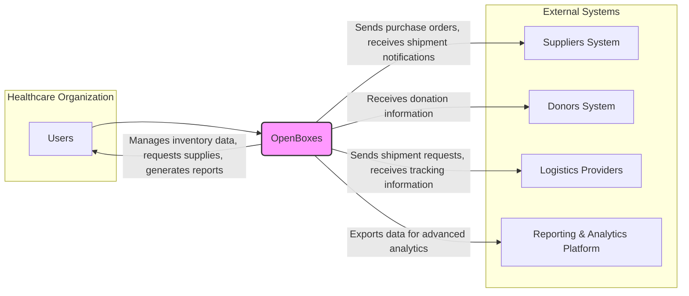
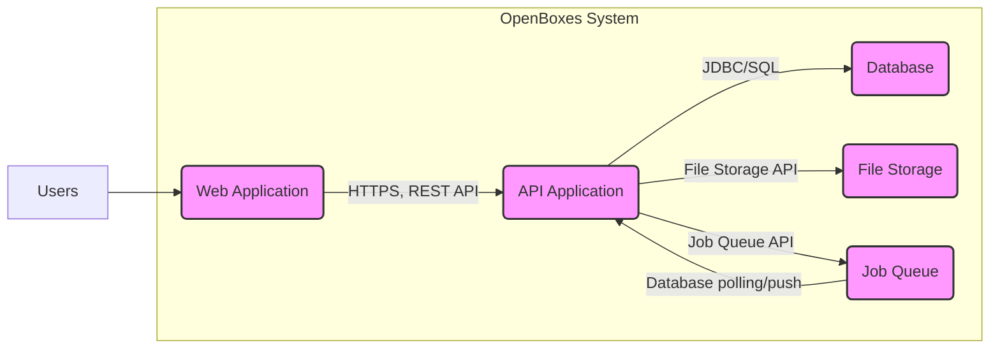
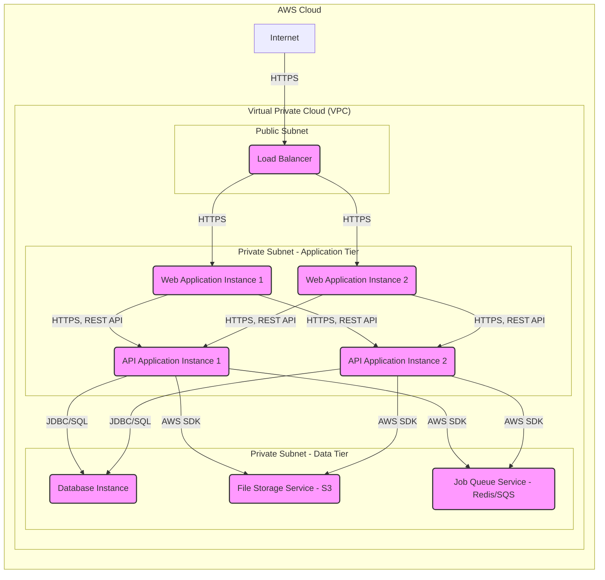

# BUSINESS POSTURE

OpenBoxes is an open-source inventory management system specifically designed for healthcare supply chains, with a focus on resource-constrained environments. The primary business goal is to improve the efficiency, transparency, and accountability of medical supply distribution, ultimately leading to better healthcare outcomes.

Business priorities include:
- Ensuring accurate and timely tracking of medical supplies.
- Optimizing inventory levels to prevent stockouts and overstocking.
- Facilitating efficient distribution of supplies to healthcare facilities.
- Providing reporting and analytics for supply chain visibility and decision-making.
- Supporting regulatory compliance and auditability in medical supply management.
- Scalability to accommodate growing needs and diverse environments.
- Usability for users with varying levels of technical expertise.
- Cost-effectiveness, leveraging open-source nature to reduce licensing costs.

Key business risks to address:
- Data integrity and accuracy: Inaccurate inventory data can lead to stockouts or incorrect supply distribution, directly impacting patient care.
- System availability and reliability: Downtime can disrupt supply chain operations and hinder access to essential medical supplies.
- Security and confidentiality of sensitive data: Patient data, supply chain information, and financial details must be protected from unauthorized access and breaches.
- Regulatory compliance: Failure to comply with healthcare regulations can result in legal penalties and reputational damage.
- User adoption and training: Lack of user acceptance or inadequate training can hinder effective system utilization.
- Integration with existing systems: Difficulty integrating with existing healthcare information systems can create data silos and inefficiencies.
- Long-term sustainability and maintenance: Ensuring ongoing support, updates, and maintenance of the open-source system is crucial for long-term viability.

# SECURITY POSTURE

Existing security controls:
- security control: HTTPS for web traffic encryption. Implemented at the web server and application level.
- security control: Role-Based Access Control (RBAC) for authorization. Implemented within the application code.
- security control: Password-based authentication. Implemented within the application code.
- security control: Database encryption at rest (potentially depending on deployment environment). Implemented at the database server level.
- security control: Regular security updates for underlying operating system and software libraries (responsibility of the deployment environment maintainer). Implemented at the infrastructure level.

Accepted risks:
- accepted risk: Reliance on community for security vulnerability identification and patching.
- accepted risk: Potential for vulnerabilities in third-party dependencies.
- accepted risk: Security configuration and maintenance heavily dependent on the deployment environment and administrator.
- accepted risk: Limited formal security testing and code reviews documented in the public repository.

Recommended security controls:
- security control: Implement multi-factor authentication (MFA) to enhance user authentication security.
- security control: Integrate with a centralized logging and monitoring system for security event detection and incident response.
- security control: Implement input validation and output encoding throughout the application to prevent common web vulnerabilities like Cross-Site Scripting (XSS) and SQL Injection.
- security control: Conduct regular static and dynamic application security testing (SAST/DAST) to identify and remediate vulnerabilities.
- security control: Implement a vulnerability management program to track and address identified vulnerabilities in a timely manner.
- security control: Establish a secure software development lifecycle (SSDLC) incorporating security considerations at each stage of development.
- security control: Implement security awareness training for users to mitigate social engineering and phishing risks.
- security control: Regularly review and update security configurations and policies.

Security requirements:
- Authentication:
    - requirement: Secure user authentication mechanism to verify user identity.
    - requirement: Support for strong passwords and password complexity policies.
    - requirement: Consider integration with existing identity providers (e.g., LDAP, SAML, OAuth 2.0) for centralized authentication.
    - requirement: Implement session management to control user session duration and prevent session hijacking.
    - requirement: Implement account lockout policies to prevent brute-force attacks.
    - requirement: Audit logging of authentication events (successes and failures).
- Authorization:
    - requirement: Role-Based Access Control (RBAC) to manage user permissions and access to different functionalities and data.
    - requirement: Principle of least privilege should be enforced, granting users only the necessary permissions to perform their tasks.
    - requirement: Granular access control to different modules, features, and data within the system.
    - requirement: Audit logging of authorization events (access attempts and decisions).
- Input Validation:
    - requirement: Validate all user inputs to prevent injection attacks (e.g., SQL Injection, Cross-Site Scripting).
    - requirement: Input validation should be performed on both client-side and server-side.
    - requirement: Use parameterized queries or prepared statements to prevent SQL Injection.
    - requirement: Encode outputs to prevent Cross-Site Scripting (XSS) vulnerabilities.
    - requirement: Implement input sanitization to remove or neutralize potentially harmful characters or code.
- Cryptography:
    - requirement: Use HTTPS to encrypt all communication between clients and the server.
    - requirement: Protect sensitive data at rest using encryption (e.g., database encryption, file system encryption).
    - requirement: Securely store and manage cryptographic keys.
    - requirement: Use strong and up-to-date cryptographic algorithms and libraries.
    - requirement: Protect sensitive data in transit within the system (e.g., between containers).

# DESIGN

## C4 CONTEXT



Context Diagram Elements:

- Element:
    - Name: Users
    - Type: Person
    - Description: Healthcare professionals, inventory managers, administrators, and other staff within a healthcare organization who use OpenBoxes to manage medical supplies.
    - Responsibilities:
        - Manage inventory levels.
        - Request and receive medical supplies.
        - Generate reports on inventory and supply chain activities.
        - Configure and administer the OpenBoxes system.
    - Security controls:
        - security control: User authentication (username/password, potentially MFA).
        - security control: Role-Based Access Control (RBAC) to limit access based on user roles.
        - security control: Audit logging of user actions.

- Element:
    - Name: OpenBoxes
    - Type: Software System
    - Description: Open-source inventory management system for healthcare supply chains, providing functionalities for inventory tracking, stock management, procurement, and reporting.
    - Responsibilities:
        - Centralized inventory management.
        - Stock level monitoring and alerts.
        - Procurement and purchase order management.
        - Supply distribution and tracking.
        - Reporting and analytics on supply chain data.
        - User management and access control.
    - Security controls:
        - security control: HTTPS encryption for web traffic.
        - security control: Role-Based Access Control (RBAC).
        - security control: Input validation and output encoding.
        - security control: Password policies and session management.
        - security control: Database encryption at rest.
        - security control: Audit logging of security-relevant events.

- Element:
    - Name: Suppliers System
    - Type: External System
    - Description: Systems used by medical supply suppliers to manage orders, shipments, and product information.
    - Responsibilities:
        - Receiving purchase orders from OpenBoxes.
        - Processing orders and managing shipments.
        - Providing product catalogs and pricing information.
        - Sending shipment notifications and tracking details.
    - Security controls:
        - security control: Secure communication channels (e.g., VPN, API keys).
        - security control: Authentication and authorization for API access.
        - security control: Data validation on received data.

- Element:
    - Name: Donors System
    - Type: External System
    - Description: Systems used by organizations or individuals donating medical supplies to track donations and manage donor information.
    - Responsibilities:
        - Providing information about donated supplies.
        - Managing donor details and donation records.
        - Receiving acknowledgements or reports from OpenBoxes.
    - Security controls:
        - security control: Secure communication channels.
        - security control: Data validation on received data.

- Element:
    - Name: Logistics Providers
    - Type: External System
    - Description: Systems used by logistics companies to manage transportation and delivery of medical supplies.
    - Responsibilities:
        - Receiving shipment requests from OpenBoxes.
        - Managing transportation and delivery of supplies.
        - Providing shipment tracking information.
        - Confirming delivery of supplies.
    - Security controls:
        - security control: Secure communication channels.
        - security control: Authentication and authorization for API access.
        - security control: Data validation on received data.

- Element:
    - Name: Reporting & Analytics Platform
    - Type: External System
    - Description: External platform used for advanced data analysis and reporting on supply chain data exported from OpenBoxes.
    - Responsibilities:
        - Receiving data exports from OpenBoxes.
        - Providing advanced analytics and reporting capabilities.
        - Data visualization and dashboarding.
    - Security controls:
        - security control: Secure data transfer mechanisms.
        - security control: Access control to the analytics platform.
        - security control: Data encryption at rest and in transit within the platform.

## C4 CONTAINER



Container Diagram Elements:

- Element:
    - Name: Web Application
    - Type: Container - Web Application
    - Description: Provides the user interface for OpenBoxes, allowing users to interact with the system through web browsers. Built using technologies like Ruby on Rails, HTML, CSS, and JavaScript.
    - Responsibilities:
        - Presenting user interface to users.
        - Handling user authentication and authorization.
        - Processing user requests and displaying data.
        - Communicating with the API Application to access backend services and data.
    - Security controls:
        - security control: HTTPS for secure communication with users.
        - security control: Session management and cookie security.
        - security control: Client-side input validation.
        - security control: Output encoding to prevent XSS.
        - security control: Protection against CSRF attacks.

- Element:
    - Name: API Application
    - Type: Container - API Application
    - Description: Provides backend services and APIs for the Web Application and potentially other systems to interact with OpenBoxes data and functionalities. Likely built using Ruby on Rails or similar framework.
    - Responsibilities:
        - Implementing business logic and data processing.
        - Providing RESTful APIs for the Web Application and other clients.
        - Interacting with the Database and File Storage containers.
        - Managing background jobs through the Job Queue.
        - Enforcing authorization and access control for API requests.
    - Security controls:
        - security control: API authentication and authorization (e.g., API keys, OAuth 2.0).
        - security control: Server-side input validation.
        - security control: Secure API design and implementation (OWASP API Security Top 10).
        - security control: Rate limiting and throttling to prevent abuse.
        - security control: Logging and monitoring of API requests and errors.

- Element:
    - Name: Database
    - Type: Container - Database
    - Description: Persistent storage for OpenBoxes data, including inventory information, user details, transactions, and configurations. Likely a relational database like PostgreSQL or MySQL.
    - Responsibilities:
        - Storing and retrieving application data.
        - Ensuring data integrity and consistency.
        - Providing data persistence and backup.
        - Handling database transactions and concurrency.
    - Security controls:
        - security control: Database authentication and authorization.
        - security control: Database encryption at rest.
        - security control: Regular database backups and recovery procedures.
        - security control: Database access control lists and network segmentation.
        - security control: Monitoring database activity and security logs.

- Element:
    - Name: File Storage
    - Type: Container - File Storage
    - Description: Stores files uploaded by users or generated by the system, such as documents, reports, and images. Could be local file system storage or cloud-based object storage (e.g., AWS S3).
    - Responsibilities:
        - Storing and retrieving files.
        - Managing file access permissions.
        - Ensuring file storage availability and durability.
    - Security controls:
        - security control: Access control to file storage.
        - security control: Encryption of stored files at rest.
        - security control: Secure file upload and download mechanisms.
        - security control: Virus scanning for uploaded files (optional).

- Element:
    - Name: Job Queue
    - Type: Container - Job Queue
    - Description: Manages asynchronous background tasks, such as sending emails, generating reports, and processing large data imports. Likely using a message queue system like Redis or RabbitMQ.
    - Responsibilities:
        - Queuing and scheduling background jobs.
        - Ensuring reliable job execution and retries.
        - Monitoring job status and performance.
    - Security controls:
        - security control: Secure communication within the job queue infrastructure.
        - security control: Authorization for job creation and execution.
        - security control: Input validation for job parameters.
        - security control: Monitoring job queue activity and errors.

## DEPLOYMENT

Deployment Architecture Option: Cloud-based Deployment (AWS)



Deployment Diagram Elements (AWS Cloud Deployment):

- Element:
    - Name: Internet
    - Type: Infrastructure - Internet
    - Description: Public internet network allowing users to access the OpenBoxes Web Application.
    - Responsibilities:
        - Providing network connectivity to users.
    - Security controls:
        - security control: Standard internet security protocols and infrastructure.

- Element:
    - Name: Load Balancer
    - Type: Infrastructure - AWS Elastic Load Balancer (ELB/ALB)
    - Description: Distributes incoming HTTPS traffic across multiple Web Application Instances for high availability and scalability.
    - Responsibilities:
        - Load balancing web traffic.
        - SSL termination.
        - Health checks for Web Application Instances.
    - Security controls:
        - security control: HTTPS termination and encryption.
        - security control: Web Application Firewall (WAF) integration (optional).
        - security control: Security groups to control inbound and outbound traffic.

- Element:
    - Name: Web Application Instance 1 & 2
    - Type: Infrastructure - AWS EC2 Instances
    - Description: Virtual machines running the Web Application container. Deployed in an Auto Scaling Group for scalability and resilience.
    - Responsibilities:
        - Hosting and running the Web Application container.
        - Processing user requests.
    - Security controls:
        - security control: Security groups to restrict inbound and outbound traffic.
        - security control: Hardened operating system images.
        - security control: Regular security patching and updates.
        - security control: Instance-level monitoring and logging.

- Element:
    - Name: API Application Instance 1 & 2
    - Type: Infrastructure - AWS EC2 Instances
    - Description: Virtual machines running the API Application container. Deployed in an Auto Scaling Group for scalability and resilience.
    - Responsibilities:
        - Hosting and running the API Application container.
        - Processing API requests.
    - Security controls:
        - security control: Security groups to restrict inbound and outbound traffic.
        - security control: Hardened operating system images.
        - security control: Regular security patching and updates.
        - security control: Instance-level monitoring and logging.

- Element:
    - Name: Database Instance
    - Type: Infrastructure - AWS RDS Instance (PostgreSQL/MySQL)
    - Description: Managed database service providing a scalable and reliable database for OpenBoxes.
    - Responsibilities:
        - Hosting and managing the OpenBoxes database.
        - Ensuring database availability, performance, and security.
        - Automated backups and disaster recovery.
    - Security controls:
        - security control: Database encryption at rest and in transit.
        - security control: Database access control lists and security groups.
        - security control: Regular database patching and updates.
        - security control: Database monitoring and audit logging.

- Element:
    - Name: File Storage Service - S3
    - Type: Infrastructure - AWS S3
    - Description: Scalable and durable object storage service for storing files.
    - Responsibilities:
        - Storing and managing files uploaded to OpenBoxes.
        - Providing file access and retrieval.
    - Security controls:
        - security control: Access control policies (IAM policies, bucket policies).
        - security control: Encryption of data at rest (S3 server-side encryption).
        - security control: Encryption of data in transit (HTTPS).
        - security control: Versioning and data lifecycle management.

- Element:
    - Name: Job Queue Service - Redis/SQS
    - Type: Infrastructure - AWS ElastiCache (Redis) or SQS
    - Description: Managed message queue service for handling asynchronous background jobs.
    - Responsibilities:
        - Providing a reliable message queue for background job processing.
        - Ensuring job delivery and execution.
    - Security controls:
        - security control: Access control policies.
        - security control: Encryption in transit (if applicable).
        - security control: Monitoring and logging.

## BUILD

```mermaid
graph LR
    Developer[Developer] --> VCS[Version Control System (GitHub)]
    VCS --> CI[CI/CD Pipeline (GitHub Actions/Jenkins)]
    CI --> BuildArtifacts[Build Artifacts (Docker Images, Packages)]
    CI --> ContainerRegistry[Container Registry (Docker Hub/ECR)]
    ContainerRegistry --> DeploymentEnv[Deployment Environment (AWS, On-Premise)]

    style Developer fill:#f9f,stroke:#333,stroke-width:2px
    style VCS fill:#f9f,stroke:#333,stroke-width:2px
    style CI fill:#f9f,stroke:#333,stroke-width:2px
    style BuildArtifacts fill:#f9f,stroke:#333,stroke-width:2px
    style ContainerRegistry fill:#f9f,stroke:#333,stroke-width:2px
    style DeploymentEnv fill:#f9f,stroke:#333,stroke-width:2px
```

Build Process Description:

1. Developer: Developers write code, commit changes, and push them to the Version Control System.
    - security control: Developer workstations should be secured and follow secure coding practices.
    - security control: Code reviews should be implemented to identify potential security vulnerabilities.
2. Version Control System (VCS - GitHub): GitHub hosts the source code repository for OpenBoxes.
    - security control: Access control to the repository to restrict unauthorized code changes.
    - security control: Branch protection rules to enforce code review and prevent direct commits to main branches.
    - security control: Audit logging of repository activities.
3. CI/CD Pipeline (GitHub Actions/Jenkins): An automated CI/CD pipeline is triggered on code changes in the VCS. This pipeline builds, tests, and packages the application.
    - security control: Secure CI/CD pipeline configuration and access control.
    - security control: Automated security scans (SAST, linters) integrated into the pipeline.
    - security control: Dependency scanning to identify vulnerable dependencies.
    - security control: Build process should be reproducible and auditable.
    - security control: Secrets management for storing and accessing credentials securely within the pipeline.
4. Build Artifacts (Docker Images, Packages): The CI/CD pipeline produces build artifacts, such as Docker images for containerized deployment or installable packages.
    - security control: Artifact signing to ensure integrity and authenticity.
    - security control: Vulnerability scanning of Docker images and packages.
5. Container Registry (Docker Hub/ECR): Build artifacts are stored in a container registry or package repository.
    - security control: Access control to the container registry to prevent unauthorized access and modifications.
    - security control: Vulnerability scanning of images in the registry.
    - security control: Image signing and verification.
6. Deployment Environment (AWS, On-Premise): The deployment process retrieves build artifacts from the container registry and deploys them to the target environment.
    - security control: Secure deployment process and infrastructure.
    - security control: Infrastructure as Code (IaC) to manage infrastructure securely and consistently.

# RISK ASSESSMENT

Critical business processes to protect:
- Inventory Management: Accurate tracking of medical supplies is crucial for preventing stockouts and ensuring timely availability for patient care.
- Supply Chain Operations: Efficient procurement, distribution, and logistics processes are essential for maintaining a functional healthcare supply chain.
- Reporting and Analytics: Reliable reporting and analytics are needed for informed decision-making and supply chain optimization.

Data to protect and sensitivity:
- Inventory Data: Quantity, location, expiration dates, and other details of medical supplies. Sensitivity: Moderate to High (impacts operational efficiency and patient care if compromised or inaccurate).
- Transaction Data: Purchase orders, shipment records, donation records, and other transactional information. Sensitivity: Moderate (impacts operational efficiency and financial accountability).
- User Data: User accounts, roles, permissions, and contact information. Sensitivity: Moderate (impacts access control and system security if compromised).
- Audit Logs: Records of system events, user actions, and security-related activities. Sensitivity: Moderate to High (essential for security monitoring, incident response, and compliance).
- Potentially Sensitive Medical Supply Information: Depending on the context, information about specific types of medical supplies could be considered sensitive (e.g., controlled substances, specialized equipment). Sensitivity: Moderate to High (depending on the specific data).

# QUESTIONS & ASSUMPTIONS

Questions:
- What are the specific regulatory compliance requirements for OpenBoxes deployments (e.g., HIPAA, GDPR, local regulations)?
- What are the organization's specific data sensitivity classifications and data handling policies?
- Are there existing security policies and procedures within the organization that OpenBoxes needs to align with?
- What are the integration requirements with other healthcare information systems (e.g., EMR, HIS)?
- What is the expected user base and user roles for OpenBoxes?
- What is the budget and timeline for implementing security controls and recommendations?
- What is the preferred deployment environment (cloud, on-premise, hybrid)?
- Are there any specific threat actors or attack vectors of particular concern?

Assumptions:
- BUSINESS POSTURE:
    - OpenBoxes is intended to improve healthcare supply chain efficiency and transparency.
    - Data accuracy and system availability are critical business priorities.
    - Security and compliance are important considerations, especially given the healthcare context.
- SECURITY POSTURE:
    - Basic security controls like HTTPS and RBAC are currently in place.
    - Security is a shared responsibility between the OpenBoxes project and the deployment organization.
    - There is a need to enhance security controls to address identified risks and meet security requirements.
- DESIGN:
    - OpenBoxes follows a typical web application architecture with web frontend, API backend, database, and file storage.
    - Deployment can be flexible, including cloud-based and on-premise options.
    - A CI/CD pipeline is assumed for build and deployment automation, although details may vary.