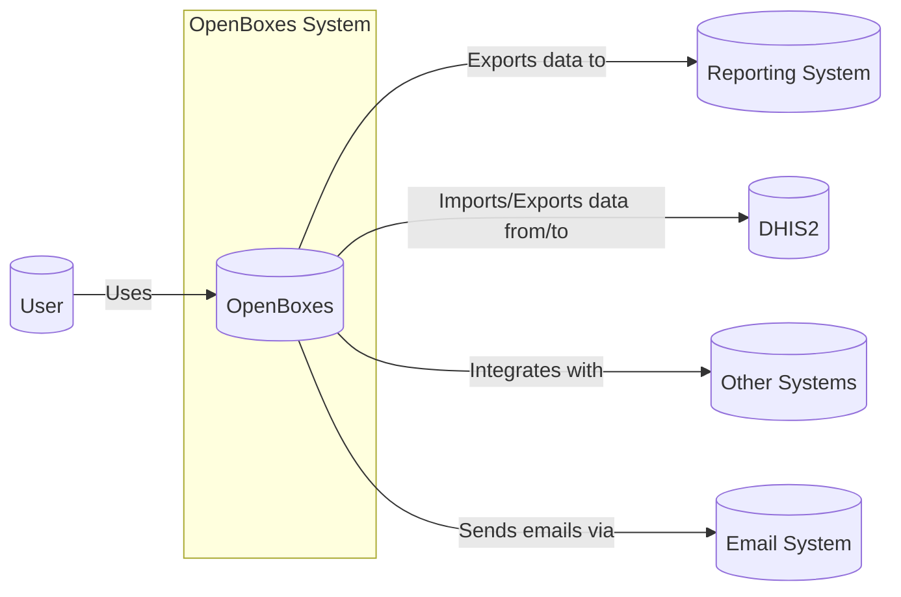
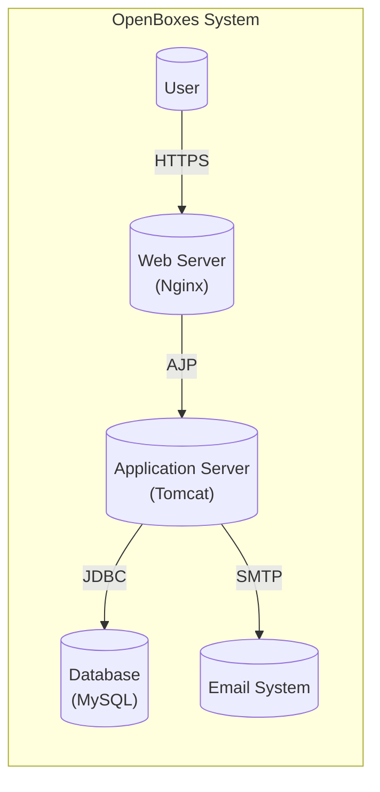
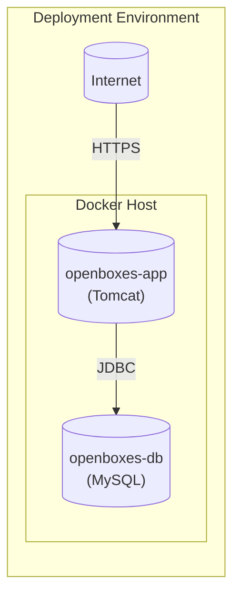
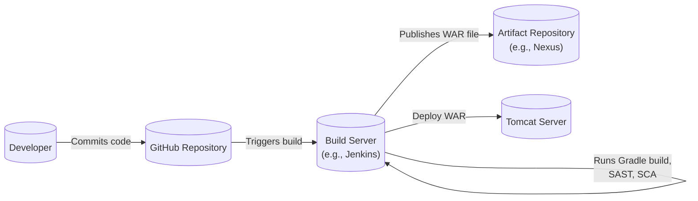

Okay, let's create a design document for the OpenBoxes project.

# BUSINESS POSTURE

OpenBoxes is an open-source supply chain management system designed primarily for public health facilities in resource-constrained settings. The primary business goals are:

*   Provide a reliable and accurate system for tracking inventory and managing supply chains.
*   Improve the efficiency of healthcare delivery by ensuring the availability of essential medicines and supplies.
*   Reduce waste and loss due to stockouts, expiries, and poor inventory management.
*   Empower healthcare workers with the tools they need to manage their supplies effectively.
*   Be adaptable and configurable to a wide range of contexts and workflows.
*   Foster a community of users and developers to ensure the long-term sustainability of the project.

Key business risks that need to be addressed:

*   Data loss or corruption, leading to inaccurate inventory records and potential disruption of healthcare services.
*   Unauthorized access to the system, potentially exposing sensitive data or allowing malicious manipulation of inventory.
*   System failure or downtime, preventing healthcare workers from accessing critical information and managing supplies.
  *   Inability to scale to meet the needs of larger facilities or expanding programs.
*   Lack of user adoption due to complexity or poor usability.
*   Vulnerabilities in third-party dependencies, potentially exposing the system to exploits.
*   Insufficient audit trails, making it difficult to track changes and identify the source of errors or discrepancies.

# SECURITY POSTURE

Existing security controls (based on the GitHub repository and common practices):

*   security control: Authentication: User accounts and login functionality are implemented (implied by the presence of user roles and login pages).
*   security control: Authorization: Role-based access control (RBAC) is mentioned, restricting access to certain features based on user roles (e.g., Admin, Stock Manager). Described in documentation and implemented in code.
*   security control: Input validation: Some level of input validation is likely present to prevent common web vulnerabilities (e.g., SQL injection, cross-site scripting), although the specifics need to be verified in the codebase.
*   security control: Session management: Sessions are used to maintain user state after login.
*   security control: HTTPS: The application is likely intended to be deployed behind a reverse proxy (e.g., Nginx) that handles HTTPS encryption.
*   security control: Database security: Database credentials are (hopefully) stored securely and not hardcoded in the application.
*   security control: Regular backups: It's implied that users should perform regular backups of the database.
*   security control: Dependency management: Dependencies are managed using a package manager (e.g., Gradle), allowing for updates and vulnerability patching.

Accepted risks:

*   accepted risk: The project relies heavily on community contributions, which may introduce varying levels of code quality and security awareness.
*   accepted risk: The application is designed to be deployed in resource-constrained settings, which may limit the feasibility of implementing some advanced security measures.
*   accepted risk: The documentation may not be fully comprehensive, and some security-relevant configurations may require manual setup.

Recommended security controls (high priority):

*   Implement comprehensive input validation and sanitization for all user inputs, including those from file uploads.
*   Enforce strong password policies and consider implementing multi-factor authentication (MFA).
*   Implement detailed audit logging to track all user actions and system events.
*   Regularly perform security audits and penetration testing.
*   Establish a clear process for reporting and addressing security vulnerabilities.
*   Implement Content Security Policy (CSP) to mitigate cross-site scripting (XSS) attacks.
*   Implement robust error handling to prevent information leakage.
*   Use a secure coding standard and perform static code analysis (SAST) during development.
*   Implement dynamic application security testing (DAST) during testing.
*   Implement software composition analysis (SCA) to identify and manage vulnerabilities in third-party dependencies.

Security Requirements:

*   Authentication:
    *   The system MUST require users to authenticate with a unique username and strong password.
    *   The system SHOULD support multi-factor authentication (MFA).
    *   The system MUST securely store passwords using a strong, one-way hashing algorithm (e.g., bcrypt).
    *   The system MUST implement account lockout policies to prevent brute-force attacks.

*   Authorization:
    *   The system MUST implement role-based access control (RBAC) to restrict access to sensitive data and functionality.
    *   The system MUST ensure that users can only access data and perform actions that are authorized for their assigned roles.
    *   The system MUST provide a mechanism for administrators to manage user roles and permissions.

*   Input Validation:
    *   The system MUST validate all user inputs against a strict whitelist of allowed characters and formats.
    *   The system MUST sanitize all user inputs to prevent cross-site scripting (XSS) and SQL injection attacks.
    *   The system MUST validate file uploads to ensure they are of the expected type and size.

*   Cryptography:
    *   The system MUST use HTTPS for all communication between the client and the server.
    *   The system MUST use strong, industry-standard encryption algorithms for storing sensitive data (e.g., AES-256).
    *   The system MUST securely manage cryptographic keys.
    *   The system SHOULD use a secure random number generator for all cryptographic operations.

# DESIGN

## C4 CONTEXT

Element Descriptions:

*   Element:
    *   Name: User
    *   Type: Person
    *   Description: A healthcare worker, administrator, or other user who interacts with the OpenBoxes system.
    *   Responsibilities: Managing inventory, placing orders, receiving shipments, generating reports, administering the system.
    *   Security controls: Authentication, Authorization, Session Management.

*   Element:
    *   Name: OpenBoxes
    *   Type: Software System
    *   Description: The OpenBoxes supply chain management system.
    *   Responsibilities: Tracking inventory, managing orders and shipments, generating reports, managing users and locations.
    *   Security controls: Input Validation, Output Encoding, Audit Logging, Error Handling.

*   Element:
    *   Name: Reporting System
    *   Type: Software System
    *   Description: An external system used for generating advanced reports and dashboards.
    *   Responsibilities: Receiving data from OpenBoxes, generating reports, providing data visualization.
    *   Security controls: Authentication, Authorization (if applicable).

*   Element:
    *   Name: DHIS2
    *   Type: Software System
    *   Description: District Health Information Software 2, a health management information system.
    *   Responsibilities: Collecting and managing health data, potentially integrating with OpenBoxes for inventory data.
    *   Security controls: Authentication, Authorization (if applicable).

*   Element:
    *   Name: Other Systems
    *   Type: Software System
    *   Description: Other external systems that OpenBoxes may integrate with (e.g., accounting systems, ERP systems).
    *   Responsibilities: Varies depending on the specific system.
    *   Security controls: Authentication, Authorization (if applicable).

*   Element:
    *   Name: Email System
    *   Type: Software System
    *   Description: External system used for sending email notifications.
    *   Responsibilities: Sending emails.
    *   Security controls: Authentication, Encryption.

## C4 CONTAINER

Element Descriptions:

*   Element:
    *   Name: User
    *   Type: Person
    *   Description: A healthcare worker, administrator, or other user who interacts with the OpenBoxes system.
    *   Responsibilities: Managing inventory, placing orders, receiving shipments, generating reports, administering the system.
    *   Security controls: Authentication, Authorization, Session Management.

*   Element:
    *   Name: Web Server (Nginx)
    *   Type: Web Server
    *   Description: Handles incoming HTTP requests and acts as a reverse proxy.
    *   Responsibilities: Serving static content, forwarding requests to the application server, handling SSL/TLS encryption.
    *   Security controls: HTTPS, TLS Configuration, Rate Limiting.

*   Element:
    *   Name: Application Server (Tomcat)
    *   Type: Application Server
    *   Description: Runs the OpenBoxes application code.
    *   Responsibilities: Handling business logic, processing requests, interacting with the database.
    *   Security controls: Input Validation, Output Encoding, Authentication, Authorization, Session Management, Error Handling.

*   Element:
    *   Name: Database (MySQL)
    *   Type: Database
    *   Description: Stores the OpenBoxes data.
    *   Responsibilities: Storing and retrieving data, enforcing data integrity.
    *   Security controls: Database User Authentication, Access Control, Encryption (if configured), Audit Logging (if configured).

*   Element:
    *   Name: Email System
    *   Type: Software System
    *   Description: External system used for sending email notifications.
    *   Responsibilities: Sending emails.
    *   Security controls: Authentication, Encryption.

## DEPLOYMENT

Possible deployment solutions:

1.  Manual installation on a Linux server (e.g., Ubuntu, CentOS).
2.  Using Docker and Docker Compose.
3.  Deployment on a cloud platform (e.g., AWS, Azure, GCP) using virtual machines or container services.

Chosen solution (for detailed description): Docker and Docker Compose. This is a popular and convenient option for deploying OpenBoxes.

Element Descriptions:

*   Element:
    *   Name: Docker Host
    *   Type: Server
    *   Description: The physical or virtual machine that runs the Docker Engine.
    *   Responsibilities: Hosting the Docker containers.
    *   Security controls: Operating System Security, Firewall, SSH Access Control.

*   Element:
    *   Name: openboxes-app (Tomcat)
    *   Type: Docker Container
    *   Description: The container running the OpenBoxes application server (Tomcat).
    *   Responsibilities: Running the OpenBoxes application code.
    *   Security controls: Container Isolation, Resource Limits.

*   Element:
    *   Name: openboxes-db (MySQL)
    *   Type: Docker Container
    *   Description: The container running the MySQL database.
    *   Responsibilities: Storing the OpenBoxes data.
    *   Security controls: Container Isolation, Database User Authentication, Access Control.

*   Element:
    *   Name: Internet
    *   Type: Network
    *   Description: The external network.
    *   Responsibilities: Providing access to the OpenBoxes application.
    *   Security controls: Firewall.

## BUILD

OpenBoxes uses Gradle as its build tool. The build process typically involves the following steps:

1.  Developer commits code changes to the GitHub repository.
2.  A build server (or a developer's local machine) checks out the code.
3.  Gradle is used to compile the code, run tests, and create a WAR (Web Application Archive) file.
4.  The WAR file is then deployed to the application server (Tomcat).

Security controls in the build process:

*   security control: Version control (Git): All code changes are tracked in a Git repository, providing an audit trail and allowing for rollbacks.
*   security control: Dependency management (Gradle): Gradle manages project dependencies, allowing for updates and vulnerability patching.
*   security control: Automated build: The build process is automated using Gradle, reducing the risk of manual errors.
*   security control: Testing: The build process includes running unit tests and integration tests, which can help identify security vulnerabilities.

Recommended additions:

*   Integrate SAST (Static Application Security Testing) tools into the Gradle build process to automatically scan the code for vulnerabilities.
*   Integrate SCA (Software Composition Analysis) tools to identify and manage vulnerabilities in third-party dependencies.
*   Use a dedicated build server (e.g., Jenkins, GitLab CI) to ensure a consistent and secure build environment.
*   Digitally sign the WAR file to ensure its integrity.

# RISK ASSESSMENT

Critical business processes to protect:

*   Inventory management: Ensuring accurate tracking of stock levels, locations, and movements.
*   Order management: Managing the procurement of new supplies.
*   Shipment management: Tracking incoming and outgoing shipments.
*   Reporting: Generating accurate and timely reports on inventory and supply chain performance.
*   User management: Controlling access to the system and ensuring data integrity.

Data to protect and their sensitivity:

*   Inventory data (stock levels, locations, expiry dates): Sensitive, as it directly impacts healthcare delivery.
*   Product information (names, descriptions, classifications): Moderately sensitive, as it could be used for competitive advantage or to identify supply chain vulnerabilities.
*   Supplier information: Moderately sensitive, as it could be used for competitive advantage.
*   User account information (usernames, roles, permissions): Highly sensitive, as it controls access to the system.
*   Transaction logs: Sensitive, as they provide an audit trail of all system activity.
*   Patient data: If integrated with other systems that handle patient data, this would be highly sensitive and subject to strict regulations (e.g., HIPAA). OpenBoxes itself does *not* directly manage patient data.

# QUESTIONS & ASSUMPTIONS

Questions:

*   What specific reporting systems are intended to be integrated with OpenBoxes?
*   What other systems (besides DHIS2) are planned for integration?
*   What are the specific security requirements of the target deployment environments (e.g., government regulations, organizational policies)?
*   What is the expected scale of deployments (number of users, locations, items)?
*   What level of support and maintenance is provided for OpenBoxes?
*   Are there any existing security assessments or penetration testing reports for OpenBoxes?
*   What is the process for handling security vulnerabilities reported by the community?
*   Is there a dedicated security team or individual responsible for OpenBoxes security?
*   What is the frequency of security updates and patches?

Assumptions:

*   BUSINESS POSTURE: The primary users are healthcare workers in resource-constrained settings. The organization has a moderate risk tolerance, but prioritizes data integrity and availability.
*   SECURITY POSTURE: The existing security controls are basic but functional. There is room for significant improvement in security practices. The development team is receptive to security recommendations.
*   DESIGN: The deployment will use Docker and Docker Compose. The system will be accessed over HTTPS. The database will be properly secured with strong passwords and access controls. Regular backups will be performed.