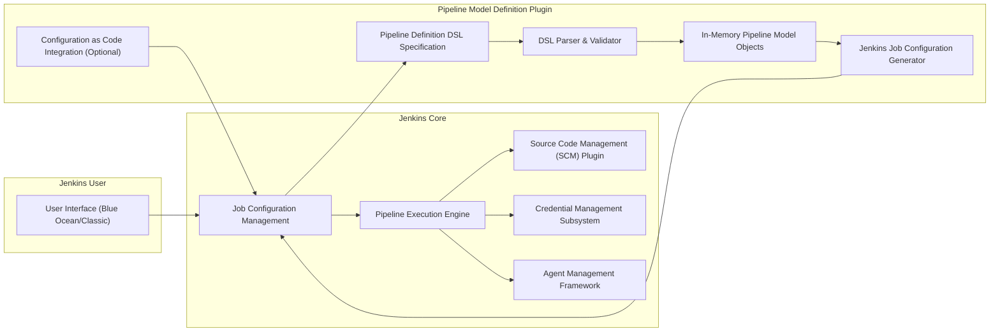
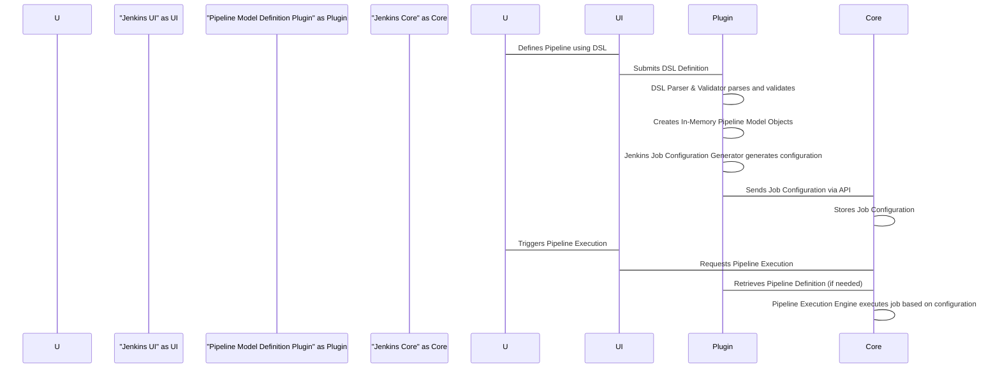

# Project Design Document: Jenkins Pipeline Model Definition Plugin

**Version:** 1.1
**Date:** October 26, 2023
**Author:** AI Software Architect

## 1. Introduction

This document provides an enhanced design overview of the Jenkins Pipeline Model Definition Plugin. This plugin empowers users to define Jenkins pipelines using a declarative syntax, offering a more intuitive and less error-prone approach to pipeline creation and management compared to traditional scripted pipelines. This document details the plugin's architecture, core components, data flow, and interactions with the Jenkins core, serving as a robust foundation for subsequent threat modeling exercises.

## 2. Goals

* Deliver a clear and comprehensive description of the plugin's architecture and functionality.
* Precisely identify key components and their interactions within the system.
* Detail the data flow within the plugin and its communication pathways with the Jenkins core.
* Serve as a well-defined basis for identifying potential security vulnerabilities during the threat modeling process.

## 3. Non-Goals

* This document intentionally avoids delving into the specific implementation details of individual classes or methods within the plugin.
* A detailed examination of the plugin's user interface design is outside the scope of this document, which primarily focuses on the backend architecture.
* A comprehensive listing of all available configuration options for the plugin is not included here.

## 4. Architectural Overview

The Jenkins Pipeline Model Definition Plugin extends the core Jenkins functionality by introducing a domain-specific language (DSL) for defining pipelines. This DSL is parsed and interpreted by the plugin to create and execute Jenkins pipeline jobs. The plugin operates in close collaboration with the Jenkins core, utilizing its APIs for job creation, execution orchestration, and overall management.

**Key Interactions Explained:**

* **User Interaction:** Users define pipeline blueprints using the declarative DSL, typically through the Jenkins user interface (Blue Ocean or the classic UI) or via the Configuration as Code mechanism.
* **Parsing and Modeling:** The plugin's DSL Parser component takes the textual DSL definition as input, validates its syntax and semantics, and transforms it into an internal, structured representation using Pipeline Model Objects.
* **Job Generation:** The Pipeline Model Objects serve as the blueprint for the Jenkins Job Generator, which translates this abstract representation into a concrete Jenkins job configuration that the Jenkins core can understand and execute.
* **Execution Orchestration:** The Jenkins core's Pipeline Execution Engine takes over the execution of the generated job, orchestrating the defined stages and steps.
* **Integration with Core Services:** The plugin seamlessly integrates with essential Jenkins core services such as SCM for retrieving source code, Credential Management for securely accessing secrets, and Agent Management for allocating execution environments.

## 5. Component Design

This section provides a more detailed breakdown of the key components within the Pipeline Model Definition Plugin.

### 5.1. Pipeline Definition DSL Specification

* **Description:** This defines the grammar and vocabulary of the declarative language used to describe Jenkins pipelines. It dictates the keywords, syntax, and allowed structures for pipeline definitions.
* **Functionality:**
    * Establishes the rules for writing valid pipeline definitions.
    * Provides a human-readable and structured way to express complex workflows.
    * Includes directives and options for customizing various aspects of pipeline behavior, such as agent selection, environment variables, and post-build actions.
* **Potential Security Concerns:**
    * Design flaws or ambiguities in the DSL specification could be exploited to create pipelines that bypass intended security controls or introduce vulnerabilities.
    * Overly permissive or complex DSL features might inadvertently allow users to perform actions with unintended consequences.

### 5.2. DSL Parser & Validator

* **Description:** This component is responsible for taking the textual pipeline definition written in the DSL as input and verifying its correctness against the DSL specification.
* **Functionality:**
    * Reads the raw DSL definition.
    * Performs lexical analysis and syntax checking to ensure the definition conforms to the defined grammar.
    * Validates the semantic correctness of the definition, ensuring that the specified elements and their relationships are valid according to the DSL rules.
    * Transforms the validated DSL definition into an in-memory representation (Pipeline Model Objects).
* **Potential Security Concerns:**
    * Vulnerabilities in the parsing logic could allow attackers to inject malicious code that gets executed during the parsing process.
    * Insufficient input validation could lead to denial-of-service attacks by providing malformed or excessively large pipeline definitions.
    * Errors in semantic validation could result in the creation of pipelines with unexpected or insecure behavior.

### 5.3. In-Memory Pipeline Model Objects

* **Description:** These are Java objects that represent the parsed and validated pipeline definition in a structured, programmatic format. They serve as an intermediate representation between the textual DSL and the Jenkins job configuration.
* **Functionality:**
    * Stores the hierarchical structure of the pipeline, including stages, steps, agents, and other attributes.
    * Provides an abstraction layer, decoupling the DSL syntax from the underlying Jenkins job configuration details.
    * Facilitates programmatic manipulation and analysis of the pipeline definition.
* **Potential Security Concerns:**
    * If these model objects are not properly secured in memory, they could potentially be accessed or tampered with by other parts of the Jenkins system or malicious plugins.
    * Serialization or deserialization vulnerabilities in these objects could be exploited to execute arbitrary code.

### 5.4. Jenkins Job Configuration Generator

* **Description:** This component takes the validated Pipeline Model Objects as input and translates them into the specific configuration format required by Jenkins to create and execute a pipeline job.
* **Functionality:**
    * Maps the abstract concepts defined in the Pipeline Model Objects to concrete Jenkins job settings, such as build steps, triggers, and post-build actions.
    * Generates the underlying Jenkins job configuration, typically in XML format.
    * Interacts with the Jenkins core API to create new jobs or update existing ones based on the generated configuration.
* **Potential Security Concerns:**
    * Flaws in the job generation logic could lead to the creation of Jenkins jobs with unintended security vulnerabilities, such as overly permissive permissions or insecure build steps.
    * Improper handling of data from the Pipeline Model Objects during job generation could introduce injection vulnerabilities or expose sensitive information.

### 5.5. Configuration as Code Integration (Optional)

* **Description:** This feature allows pipeline definitions, written in the DSL, to be stored and managed as code, typically within version control systems. This enables infrastructure-as-code practices for pipeline management.
* **Functionality:**
    * Enables the programmatic and version-controlled management of pipeline configurations.
    * Facilitates automation of pipeline setup and promotes consistency across environments.
    * Often integrates with the Jenkins Configuration as Code plugin to apply these configurations to the Jenkins instance.
* **Potential Security Concerns:**
    * If the source code repository containing the pipeline definitions is compromised, attackers could maliciously modify pipeline configurations.
    * Insufficient access control to the configuration files could allow unauthorized users to alter pipeline definitions.
    * Secrets stored directly within the configuration files pose a significant security risk.

## 6. Data Flow

The following sequence diagram illustrates the flow of data within the plugin and its interactions with the Jenkins core components.

**Detailed Data Flow Description:**

1. **Pipeline Definition:** A user creates a pipeline definition using the declarative DSL, typically through the Jenkins user interface (e.g., the Blue Ocean visual editor or the classic Jenkins text area for pipeline scripts).
2. **Submission:** The user submits the DSL definition through the Jenkins UI.
3. **Parsing and Validation:** The Pipeline Model Definition Plugin receives the DSL definition. The DSL Parser & Validator component then parses the definition, rigorously checking its syntax and semantics against the defined DSL specification.
4. **Model Creation:** Upon successful validation, the parser creates a set of In-Memory Pipeline Model Objects. These objects represent the structured, programmatic form of the pipeline definition.
5. **Job Configuration Generation:** The Jenkins Job Configuration Generator component takes the In-Memory Pipeline Model Objects and translates them into a concrete Jenkins job configuration. This configuration specifies all the necessary details for Jenkins to execute the pipeline.
6. **Job Configuration Storage:** The plugin interacts with the Jenkins core API to persist the generated job configuration. This makes the pipeline definition available for execution.
7. **Pipeline Execution Trigger:** A user or an automated process triggers the execution of the defined pipeline.
8. **Execution Request:** The Jenkins UI communicates the execution request to the Jenkins core.
9. **Definition Retrieval (Conditional):**  In some scenarios, the Jenkins core might need to retrieve the pipeline definition or related information from the Pipeline Model Definition Plugin before or during execution.
10. **Execution:** The Jenkins core's Pipeline Execution Engine takes over, using the stored job configuration to orchestrate the execution of the pipeline, including interacting with SCM systems, managing credentials, and allocating agents.

## 7. Security Considerations (Enhanced)

This section expands on the initial security considerations, providing more specific examples of potential threats and vulnerabilities associated with each component.

* **DSL Parsing Vulnerabilities:**
    * **Threat:** Malicious actors could craft specially designed pipeline definitions that exploit vulnerabilities in the DSL parser, leading to arbitrary code execution on the Jenkins master.
    * **Example:** A buffer overflow vulnerability in the parser could be triggered by an excessively long or malformed input string.
    * **Mitigation:** Implement robust input validation, use secure parsing libraries, and perform regular security audits of the parsing logic.

* **Access Control:**
    * **Threat:** Unauthorized users could create, modify, or execute pipelines, potentially gaining access to sensitive data or disrupting critical processes.
    * **Example:** A user with insufficient permissions could modify a pipeline to exfiltrate credentials or deploy malicious code.
    * **Mitigation:** Enforce strict role-based access control (RBAC) within Jenkins, ensuring that users only have the necessary permissions to interact with pipelines.

* **Secrets Management:**
    * **Threat:** Sensitive information, such as API keys or passwords, could be exposed if not handled securely within pipeline definitions or during execution.
    * **Example:** A pipeline definition might hardcode a password, or a vulnerability in the plugin could allow access to stored credentials.
    * **Mitigation:** Mandate the use of Jenkins' credential management system for storing and accessing secrets. Avoid hardcoding secrets in pipeline definitions.

* **Code Injection:**
    * **Threat:** Attackers could inject malicious code into pipeline definitions that gets executed during pipeline runs, potentially compromising the Jenkins master or connected systems.
    * **Example:** A vulnerability in how the plugin handles user-provided parameters could allow for the injection of shell commands.
    * **Mitigation:** Implement proper input sanitization and output encoding to prevent code injection attacks. Follow secure coding practices.

* **Configuration as Code Security:**
    * **Threat:** If the repository storing pipeline definitions as code is compromised, attackers could gain control over all pipelines managed by that Jenkins instance.
    * **Example:** An attacker could gain access to the Git repository and modify pipeline definitions to deploy malicious software.
    * **Mitigation:** Secure the source code repository with strong authentication and authorization mechanisms. Implement code review processes for changes to pipeline definitions.

* **Dependency Management:**
    * **Threat:** Using vulnerable third-party libraries could introduce security flaws into the plugin.
    * **Example:** A dependency with a known remote code execution vulnerability could be exploited to compromise the Jenkins master.
    * **Mitigation:** Regularly scan the plugin's dependencies for known vulnerabilities and update them promptly. Follow secure dependency management practices.

* **Error Handling:**
    * **Threat:** Poor error handling could leak sensitive information or provide attackers with insights into the system's internal workings.
    * **Example:** An error message might reveal the path to a sensitive configuration file.
    * **Mitigation:** Implement robust error handling that avoids exposing sensitive information. Log errors securely and appropriately.

## 8. Future Considerations

* **Advanced DSL Security Features:** Explore the possibility of incorporating security-focused features directly into the DSL, such as built-in mechanisms for secret management or secure execution environments.
* **Enhanced Static Analysis:** Integrate static analysis tools to automatically detect potential security vulnerabilities within pipeline definitions before they are executed.
* **Improved Audit Logging:** Enhance audit logging capabilities to provide a more comprehensive record of actions performed on pipelines, aiding in security monitoring and incident response.

This enhanced design document provides a more detailed and security-focused overview of the Jenkins Pipeline Model Definition Plugin. It serves as a valuable resource for understanding the plugin's architecture and will be instrumental in conducting thorough threat modeling activities to identify and mitigate potential security vulnerabilities.