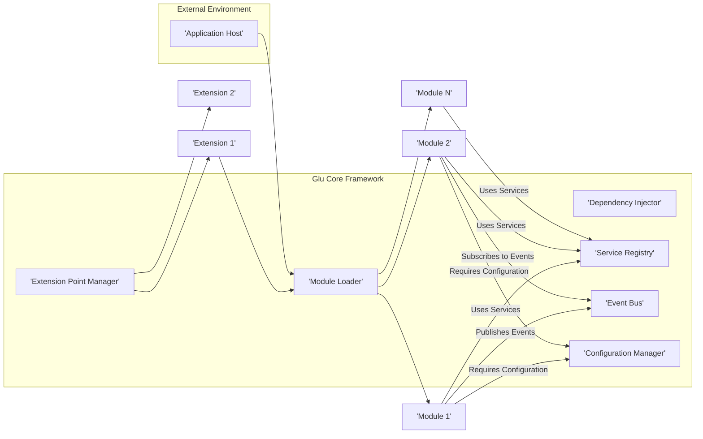
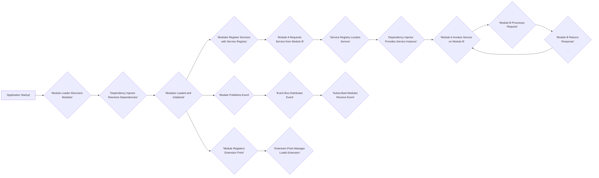
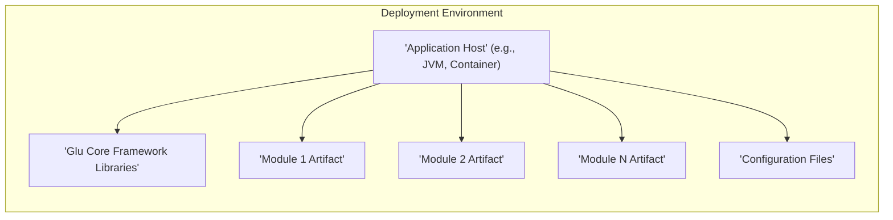

## Project Design Document: Glu - Modular Application Framework

**Version:** 1.1
**Date:** October 26, 2023
**Author:** AI Software Architect

### 1. Introduction

This document provides a detailed design overview of the Glu project, a framework designed to facilitate the creation of modular applications. The primary goal of this document is to clearly articulate the architecture, components, and data flow within Glu, serving as a solid foundation for subsequent threat modeling activities.

Glu enables the development of applications as a cohesive collection of independent, dynamically loadable modules. This modular approach significantly enhances code reusability, simplifies maintenance, and promotes extensibility.

### 2. Goals and Objectives

* **Enhanced Modularity:** To facilitate the development of applications as a collection of truly independent and self-contained modules.
* **Seamless Dynamic Loading:** To provide robust support for the runtime loading and unloading of modules without requiring application restarts or service interruptions.
* **Sophisticated Dependency Management:** To offer a declarative and efficient mechanism for modules to define and resolve dependencies on other modules or external services.
* **Flexible Extensibility:** To allow for the seamless extension of core framework functionalities through well-defined plugin or extension points.
* **Strict Loose Coupling:** To enforce minimal dependencies between modules, thereby improving maintainability, enabling independent development cycles, and reducing the impact of changes.
* **Transparent Abstraction:** To offer clear, well-defined interfaces and abstractions that govern module interactions and framework usage.

### 3. Architectural Overview

Glu adopts a plugin-based architecture where the core framework acts as the central orchestrator, providing the essential infrastructure for managing and coordinating modules. Modules are designed as self-contained units of functionality, allowing for independent development and deployment.

**Key Architectural Components:**

* **Module Loader:** Responsible for the dynamic discovery, loading, and unloading of modules during runtime. This component typically scans designated directories, repositories, or utilizes service discovery mechanisms to locate module artifacts.
* **Dependency Injector:** Manages the intricate web of dependencies between modules and services. It allows modules to explicitly declare their required dependencies, which are then automatically resolved and injected by the framework.
* **Service Registry:** A centralized directory where modules can register the services they provide and discover services offered by other modules. This promotes loose coupling and facilitates service-oriented interactions within the application.
* **Event Bus:** Provides a robust mechanism for asynchronous, decoupled communication between modules. Modules can publish events without needing to know the recipients, and other modules can subscribe to specific event types to react to relevant occurrences.
* **Configuration Manager:** Handles the loading, management, and provision of configuration parameters for both the application and individual modules. It supports various configuration sources and formats.
* **Extension Point Manager:** Facilitates the extension of the core framework's functionality. It defines specific points where extensions can be plugged in to modify or enhance the framework's behavior.
* **Modules:** Independent, self-contained units of functionality that contribute to the overall application capabilities. They interact with each other through well-defined interfaces and services.
* **Extensions:** Components that extend or modify the behavior of the core framework. They are typically loaded and managed by the Extension Point Manager.
* **Application Host:** The runtime environment in which the Glu framework and its constituent modules are deployed and executed. This could be a standalone application, a containerized environment (like Docker), or an application server.

### 4. Component Details

This section provides a more in-depth description of each key component within the Glu architecture, outlining their responsibilities and interactions.

#### 4.1. Module Loader

* **Responsibilities:**
    * **Discovery:** Locating available modules by scanning predefined directories, querying module repositories, or using service discovery mechanisms.
    * **Loading:** Loading module artifacts (e.g., JAR files, OSGi bundles, shared libraries) into the application runtime.
    * **Unloading:** Safely removing modules from the runtime environment when they are no longer needed.
    * **Lifecycle Management:** Managing the lifecycle of modules, including initialization, activation, deactivation, and destruction.
    * **Dependency Resolution:** Collaborating with the Dependency Injector to ensure all module dependencies are met before loading.
    * **Isolation:** Providing isolation between modules, often using separate classloaders, to prevent dependency conflicts and unintended interactions.
* **Key Interactions:**
    * Interacts with the file system, module repositories, or service discovery services to locate module artifacts.
    * Communicates extensively with the Dependency Injector to resolve module dependencies and instantiate module components.
    * Notifies the Service Registry when modules are successfully loaded or unloaded, allowing services to become available or unavailable.
    * May interact with the Configuration Manager to load module-specific configuration settings during the loading process.
    * Interacts with the Extension Point Manager to load and manage extensions provided by modules.

#### 4.2. Dependency Injector

* **Responsibilities:**
    * **Object Management:** Managing the creation, lifecycle, and disposal of objects (often referred to as beans or components) within the application.
    * **Dependency Resolution:** Analyzing dependency declarations from modules and resolving them by locating and providing the required dependencies.
    * **Dependency Injection:** Injecting resolved dependencies into objects through various mechanisms, such as constructor injection, setter injection, or field injection.
    * **Service Registration:** Providing a mechanism for modules to register their services, making them available for injection into other modules.
* **Key Interactions:**
    * Receives dependency declarations from modules, typically through annotations, configuration files, or programmatic APIs.
    * Interacts closely with the Service Registry to locate and retrieve instances of registered services to satisfy dependencies.
    * Instantiates and configures module components based on their dependency requirements.
    * Provides fully configured and dependency-injected instances of objects to requesting modules.

#### 4.3. Service Registry

* **Responsibilities:**
    * **Service Cataloging:** Maintaining a comprehensive registry of available services provided by the loaded modules.
    * **Service Registration:** Allowing modules to register their provided services, typically associating them with specific interfaces or contracts.
    * **Service Discovery:** Enabling modules to discover and locate services offered by other modules based on their interfaces or identifiers.
    * **Service Lookup:** Providing efficient mechanisms for retrieving instances of registered services.
    * **Versioning (Optional):** Potentially supporting service versioning to manage compatibility between different versions of services.
* **Key Interactions:**
    * Receives service registration requests from modules, including details about the service interface and implementation.
    * Handles service lookup requests from modules seeking to utilize the services offered by others.
    * May interact with the Dependency Injector to obtain instances of the registered services when a lookup request is made.

#### 4.4. Event Bus

* **Responsibilities:**
    * **Asynchronous Communication:** Facilitating asynchronous communication between modules, allowing them to interact without direct dependencies.
    * **Event Publication:** Enabling modules to publish events to notify other parts of the application about specific occurrences or state changes.
    * **Event Subscription:** Allowing modules to subscribe to specific event types, indicating their interest in receiving notifications about those events.
    * **Event Delivery:** Managing the efficient and reliable delivery of published events to all registered subscribers.
    * **Event Filtering (Optional):** Potentially supporting event filtering mechanisms to allow subscribers to receive only events that match specific criteria.
* **Key Interactions:**
    * Receives event publication requests from modules, containing the event data.
    * Routes published events to all modules that have registered as subscribers for that specific event type.
    * Manages the registration and unregistration of event subscribers.

#### 4.5. Configuration Manager

* **Responsibilities:**
    * **Configuration Loading:** Loading application and module configurations from diverse sources, such as configuration files (e.g., properties, YAML, JSON), environment variables, and remote configuration servers.
    * **Configuration Access:** Providing a consistent and unified way for modules and the framework to access configuration parameters.
    * **Configuration Management:** Supporting different configuration formats and potentially allowing for dynamic configuration updates without requiring restarts.
    * **Configuration Validation (Optional):** Potentially providing mechanisms for validating configuration values against predefined schemas or rules.
* **Key Interactions:**
    * Provides initial configuration data to the Module Loader during the module loading process.
    * Provides configuration data to individual modules upon request.
    * May interact with external configuration sources to retrieve configuration information.

#### 4.6. Extensions

* **Responsibilities:**
    * **Extending Functionality:** Adding new features or modifying the behavior of the core framework.
    * **Customization:** Tailoring the framework to specific application needs.
    * **Integration:** Integrating with external systems or libraries.
* **Key Interactions:**
    * Registered and managed by the Extension Point Manager.
    * Can interact with any part of the core framework through defined APIs.
    * May provide new services that can be registered in the Service Registry.
    * Can listen to events on the Event Bus.

#### 4.7. Extension Point Manager

* **Responsibilities:**
    * **Discovery of Extensions:** Locating available extensions.
    * **Loading of Extensions:** Loading extension artifacts.
    * **Management of Extensions:** Managing the lifecycle of extensions.
    * **Providing Extension Points:** Defining specific locations in the framework where extensions can be plugged in.
* **Key Interactions:**
    * Interacts with the Module Loader to discover extensions provided by modules.
    * Manages the lifecycle of loaded extensions.
    * Provides access to extension points for modules and other framework components.

### 5. Data Flow

The typical data flow within a Glu application encompasses several key stages, from startup to inter-module communication:

**Detailed Data Flow Description:**

1. **Application Startup:** The Application Host initiates the Glu framework.
2. **Module Loader Discovers Modules:** The Module Loader scans configured locations to identify available modules.
3. **Dependency Injector Resolves Dependencies:** The Dependency Injector analyzes module dependency declarations.
4. **Modules Loaded and Initialized:** The Module Loader loads module artifacts, and the Dependency Injector initializes module components, injecting dependencies.
5. **Modules Register Services with Service Registry:** Modules register the services they offer with the Service Registry.
6. **Module A Requests Service from Module B:** A module (Module A) requires a service provided by another module (Module B).
7. **Service Registry Locates Service:** Module A queries the Service Registry for the desired service.
8. **Dependency Injector Provides Service Instance:** The Service Registry, potentially with the Dependency Injector, provides an instance of the requested service.
9. **Module A Invokes Service on Module B:** Module A calls a method on the service instance provided by Module B.
10. **Module B Processes Request:** Module B executes the requested operation.
11. **Module B Returns Response:** Module B sends a response back to Module A.
12. **Module Publishes Event:** A module publishes an event to signal an occurrence.
13. **Event Bus Distributes Event:** The Event Bus routes the event to subscribed modules.
14. **Subscribed Modules Receive Event:** Modules subscribed to the event type receive the notification.
15. **Module Registers Extension Point:** A module defines a point where the framework can be extended.
16. **Extension Point Manager Loads Extension:** The Extension Point Manager loads and activates an extension that targets the registered extension point.

### 6. Security Considerations (Pre-Threat Modeling)

This section outlines potential security considerations that will be further analyzed during the threat modeling process.

* **Module Integrity:**
    * **Threat:** Malicious or compromised modules could be loaded, potentially injecting harmful code or exfiltrating data.
    * **Consideration:** Implementing mechanisms for verifying module authenticity and integrity (e.g., digital signatures, checksums).
* **Module Isolation:**
    * **Threat:** A compromised module could access resources or data belonging to other modules or the core framework.
    * **Consideration:** Enforcing strong isolation between modules using techniques like separate classloaders and security managers.
* **Dependency Vulnerabilities:**
    * **Threat:** Modules might depend on third-party libraries with known security vulnerabilities.
    * **Consideration:** Implementing dependency scanning and management practices to identify and mitigate vulnerable dependencies.
* **Service Access Control:**
    * **Threat:** Unauthorized modules could access sensitive services.
    * **Consideration:** Implementing access control mechanisms to restrict service access based on module identity or roles.
* **Event Tampering:**
    * **Threat:** Malicious modules could publish forged or manipulated events, leading to incorrect application behavior.
    * **Consideration:** Implementing mechanisms for verifying the source and integrity of events.
* **Configuration Security:**
    * **Threat:** Sensitive configuration data (e.g., API keys, database credentials) could be exposed if not stored and managed securely.
    * **Consideration:** Encrypting sensitive configuration data and restricting access to configuration sources.
* **Communication Security:**
    * **Threat:** If modules communicate over a network, the communication channel could be vulnerable to eavesdropping or tampering.
    * **Consideration:** Using secure communication protocols (e.g., TLS) for inter-module communication.
* **Permissions and Roles:**
    * **Threat:** Lack of proper authorization could allow modules to perform actions they are not intended to.
    * **Consideration:** Implementing a robust permissions and roles system to control module capabilities.
* **Extension Security:**
    * **Threat:** Malicious extensions could compromise the core framework or other modules.
    * **Consideration:** Implementing a review process for extensions and potentially sandboxing extension execution.
* **Input Validation:**
    * **Threat:** Modules might not properly validate input received from other modules, leading to vulnerabilities like injection attacks.
    * **Consideration:** Emphasizing the importance of input validation at module boundaries.

### 7. Deployment Diagram

A typical deployment scenario for a Glu application involves packaging the core framework and individual module artifacts within a suitable runtime environment.

**Deployment Components:**

* **Application Host:** The runtime environment where the Glu application executes. This could be a Java Virtual Machine (JVM), a Docker container, or another suitable hosting environment.
* **Glu Core Framework Libraries:** The compiled libraries and components that constitute the core of the Glu framework.
* **Module Artifacts:** The packaged modules, typically as JAR files or other archive formats, containing the compiled code and resources for each module.
* **Configuration Files:** Files containing the application-level and module-specific configuration settings, often in formats like properties, YAML, or JSON.

### 8. Technologies Used

* **Primary Programming Language:** Java (based on the project's GitHub repository).
* **Dependency Injection Framework:**  Likely a framework such as:
    * Spring Framework
    * Google Guice
    * Jakarta CDI (Contexts and Dependency Injection)
* **Module Loading Mechanism:** Potential technologies include:
    * Custom Classloader implementations
    * OSGi (Open Services Gateway initiative)
    * Java 9+ Module System
* **Event Bus Implementation:** Possible choices include:
    * Guava EventBus
    * Project Reactor
    * Apache Kafka (for distributed eventing)
* **Configuration Management Library:** Examples include:
    * Apache Commons Configuration
    * Typesafe Config (Lightbend Config)
    * MicroProfile Config
* **Build Tool:** Commonly used build tools for Java projects include:
    * Apache Maven
    * Gradle

### 9. Future Considerations

* **Advanced Module Versioning and Compatibility:** Implementing mechanisms for managing different versions of modules and ensuring compatibility.
* **Remote Module Loading and Management:** Enabling the dynamic loading and management of modules from remote repositories or marketplaces.
* **Enhanced Monitoring and Management Capabilities:** Providing tools and interfaces for monitoring module health, performance, and dependencies.
* **Improved Security Features:** Incorporating more advanced security features such as module signing, sandboxing, and fine-grained access control.
* **Support for Polyglot Modules:** Exploring the possibility of supporting modules implemented in different programming languages.
* **Distributed Deployment and Scalability:** Designing the framework to facilitate the deployment of Glu applications across multiple nodes or containers for improved scalability and resilience.

This revised design document provides a more detailed and comprehensive overview of the Glu project's architecture, components, and data flow. It serves as an enhanced foundation for understanding the system and will be invaluable for conducting thorough threat modeling to identify and mitigate potential security risks effectively.