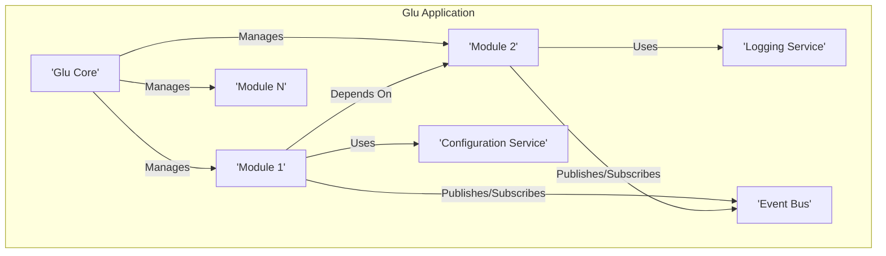
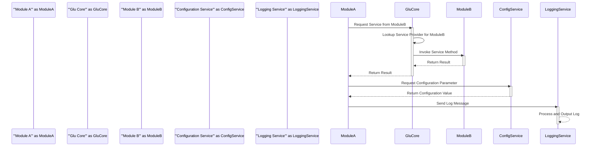

# Project Design Document: Glu - Modular Application Framework

**Version:** 1.1
**Date:** October 26, 2023
**Author:** AI Software Architect

## 1. Introduction

This document provides an enhanced and detailed design overview of the Glu project, a Java-based framework for building modular applications. The primary objective of this document is to offer a clear and comprehensive articulation of Glu's architecture, constituent components, and intricate data flow mechanisms. This level of detail is crucial for effectively conducting subsequent threat modeling exercises, enabling a thorough understanding of the system's operational dynamics and potential attack vectors.

## 2. Goals and Objectives

The overarching goals of the Glu framework are:

* **Facilitate Modular Application Development:** To empower developers to construct applications by assembling independent and reusable modules, promoting code organization and maintainability.
* **Provide Comprehensive Module Lifecycle Management:** To offer robust mechanisms for managing the entire lifecycle of modules, encompassing loading, starting, stopping, and unloading procedures.
* **Enable Seamless Dependency Injection:** To allow modules to explicitly declare and consume dependencies on other modules or external services, fostering loose coupling and testability.
* **Support Flexible Inter-Module Communication:** To provide diverse and adaptable mechanisms for modules to interact and exchange information, accommodating various communication patterns.
* **Offer an Extensible and Customizable Framework:** To design the framework with extensibility in mind, allowing developers to tailor and augment core functionalities to meet specific application needs.

## 3. High-Level Architecture

Glu applications are architected around a central core framework that orchestrates a collection of independent modules. These modules encapsulate distinct functionalities and interact with each other through well-defined interfaces, promoting a decoupled and maintainable system.

**Key Components:**

* **Glu Core:** The central orchestrator responsible for managing the lifecycle of modules, implementing dependency injection, and facilitating communication between modules.
* **Modules:** Independent and self-contained units of functionality loaded and managed by the Glu Core. Each module exposes a clear interface and can interact with other modules based on defined dependencies and communication mechanisms.
* **Configuration Service:** A dedicated service (potentially implemented as a module) responsible for providing configuration parameters to the application and its constituent modules. This service centralizes configuration management.
* **Logging Service:** A service (potentially implemented as a module) dedicated to handling logging activities within the application, providing a consistent logging mechanism for all modules.
* **Event Bus (Optional):** A mechanism (potentially a module) facilitating asynchronous communication between modules through a publish/subscribe pattern.

## 4. Detailed Design

### 4.1. Glu Core

The Glu Core serves as the central nervous system of the framework, encompassing the following critical functionalities:

* **Module Loading and Discovery:**
    * Identifies available modules by scanning designated locations such as directories or the classpath.
    * Reads module metadata, including dependency declarations, entry points, and version information.
    * Loads module classes into the application's classloader, ensuring proper isolation.
* **Comprehensive Module Lifecycle Management:**
    * Provides a well-defined API for managing module states: starting, stopping, and unloading.
    * Enforces dependency constraints during startup and shutdown sequences, ensuring modules are initialized and terminated in the correct order.
    * Executes module-defined initialization and destruction callbacks, allowing modules to perform setup and cleanup tasks.
* **Robust Dependency Injection Mechanism:**
    * Manages the creation and injection of module dependencies based on declared requirements.
    * Supports various dependency injection patterns, including constructor injection, setter injection, and field injection.
    * Enables modules to register services, making their functionalities available for injection into other modules.
* **Flexible Inter-Module Communication:**
    * Offers multiple mechanisms for modules to interact, catering to different communication needs:
        * **Direct Method Calls:** Enables synchronous communication through well-defined interfaces exposed by modules.
        * **Event Bus Integration:** Facilitates asynchronous, decoupled communication using a publish/subscribe pattern. Modules can publish events that other interested modules can subscribe to.
        * **Service Lookup and Invocation:** Allows modules to discover and invoke services registered by other modules through a central registry.
* **Centralized Configuration Management Integration:**
    * Interacts with the Configuration Service to retrieve and provide configuration parameters to individual modules.
    * May support dynamic configuration updates, allowing for runtime adjustments without requiring application restarts.
* **Unified Error Handling and Exception Management:**
    * Provides a consistent framework for handling errors and exceptions occurring within modules.
    * May include centralized error logging, reporting, and potentially mechanisms for fault tolerance and recovery.

### 4.2. Modules

Modules are the fundamental building blocks of Glu applications, characterized by:

* **Encapsulation of Specific Functionality:** Each module is designed to encapsulate a distinct and cohesive set of functionalities, promoting modularity and separation of concerns.
* **Well-Defined Interfaces:** Modules expose clear and documented interfaces, defining the services and functionalities they offer to other modules.
* **Explicit Dependency Declarations:** Modules explicitly declare their dependencies on other modules or external services, allowing the Glu Core to manage and resolve these dependencies.
* **Managed Lifecycle:** Modules undergo a managed lifecycle, with the Glu Core orchestrating their initialization, operation, and termination phases.
* **Service Registration Capability:** Modules can register their functionalities as services, making them discoverable and accessible to other modules through the Glu Core's service registry.

### 4.3. Configuration Service

The Configuration Service plays a vital role in managing application and module settings:

* **Secure Storage of Configuration Data:** Responsible for securely storing configuration parameters, potentially utilizing various backends like files, databases, or specialized configuration management systems.
* **Provisioning of Configuration Values:** Provides a mechanism for the Glu Core and individual modules to retrieve their respective configuration settings.
* **Support for Dynamic Updates (Optional):** May offer the capability to update configuration parameters at runtime without requiring application restarts, enhancing flexibility and responsiveness.
* **Adaptable Configuration Source Integration:** Designed to integrate with diverse configuration sources, including property files, YAML files, environment variables, and potentially remote configuration servers.

### 4.4. Logging Service

The Logging Service provides a centralized and consistent approach to application logging:

* **Centralized Log Message Reception:** Receives log messages originating from various modules and the Glu Core, providing a unified logging point.
* **Flexible Log Message Formatting:** Supports configurable formatting of log messages, allowing for customization of log output.
* **Configurable Log Output Destinations:** Enables routing of log messages to various destinations, including console output, log files, and remote logging aggregators.
* **Support for Standard Log Levels:** Implements standard logging levels (e.g., DEBUG, INFO, WARNING, ERROR, FATAL) to categorize log messages based on severity.

### 4.5. Event Bus (Optional)

The optional Event Bus facilitates asynchronous communication:

* **Publish/Subscribe Pattern Implementation:** Enables modules to publish events without direct knowledge of subscribers, and allows modules to subscribe to specific event types.
* **Decoupled Communication:** Promotes loose coupling between modules, as publishers and subscribers are not directly dependent on each other.
* **Support for Different Event Transports:** May support various underlying transport mechanisms for event delivery, such as in-memory queues or message brokers.

## 5. Deployment Architecture

Glu applications offer flexibility in deployment scenarios:

* **Standalone Java Application Deployment:** The Glu application can be deployed as a self-contained Java process.
* **Containerized Deployment (e.g., Docker):** Packaging the Glu application as a Docker image enables consistent and portable deployments within containerized environments.
* **Orchestrated Deployment (e.g., Kubernetes):** Leveraging orchestration platforms like Kubernetes allows for scalable and resilient deployments of Glu applications, managing multiple instances and handling failures.
* **Cloud Platform Deployments (e.g., AWS, Azure, GCP):** Glu applications can be deployed and managed on various cloud platforms, leveraging cloud-specific services for scalability, reliability, and management.

## 6. Data Flow

The primary data flow within a Glu application centers around interactions between modules, orchestrated by the Glu Core.

**Detailed Data Flow Scenarios:**

* **Inter-Module Service Invocation:**
    1. A module (e.g., `ModuleA`) requires a service provided by another module (e.g., `ModuleB`).
    2. `ModuleA` sends a request to the `GluCore` to access the service.
    3. The `GluCore` utilizes its dependency injection mechanism to locate the appropriate instance of `ModuleB` that provides the requested service.
    4. The `GluCore` invokes the specified method on `ModuleB`.
    5. `ModuleB` processes the request and returns the result to the `GluCore`.
    6. The `GluCore` relays the result back to `ModuleA`.
* **Configuration Retrieval:**
    1. A module (e.g., `ModuleA`) needs to retrieve a configuration parameter.
    2. `ModuleA` sends a request to the `Configuration Service`.
    3. The `Configuration Service` retrieves the requested configuration value from its configured source.
    4. The `Configuration Service` returns the configuration value to `ModuleA`.
* **Logging:**
    1. A module (e.g., `ModuleA`) generates a log message.
    2. `ModuleA` sends the log message to the `Logging Service`.
    3. The `Logging Service` processes the log message, formats it according to its configuration, and outputs it to the configured destinations.

## 7. Security Considerations (Pre-Threat Modeling)

Prior to formal threat modeling, several critical security considerations emerge from the Glu architecture:

* **Robust Module Isolation:** Ensuring strong isolation between modules is paramount to prevent a compromised module from affecting other parts of the application. This includes:
    * **Classloader Isolation:** Utilizing separate classloaders for each module to prevent namespace collisions and unauthorized access to classes.
    * **Access Control Mechanisms:** Implementing mechanisms to control the resources and services that each module can access, limiting the potential impact of a compromised module.
* **Secure Dependency Management:** The process of resolving and loading module dependencies must be secured to prevent the introduction of malicious or vulnerable libraries:
    * **Dependency Verification:** Implementing mechanisms to verify the integrity and authenticity of module dependencies, such as using checksums or digital signatures.
    * **Vulnerability Scanning:** Integrating with vulnerability scanning tools to identify and prevent the use of known vulnerable dependencies.
* **Secure Inter-Module Communication:** Protecting communication channels between modules is crucial, especially when exchanging sensitive data:
    * **Encryption:** Employing encryption protocols (e.g., TLS/SSL) for communication channels to protect data in transit.
    * **Authentication and Authorization:** Implementing mechanisms to authenticate communicating modules and authorize their access to specific services or data.
* **Configuration Service Security:** Securing the Configuration Service is vital to prevent unauthorized modification of application settings:
    * **Access Control:** Restricting access to the Configuration Service to authorized entities only.
    * **Encryption of Sensitive Data:** Encrypting sensitive configuration data at rest and in transit.
* **Logging Security Measures:** Protecting log data from unauthorized access and preventing the logging of sensitive information:
    * **Access Control for Log Data:** Restricting access to log files and logging infrastructure.
    * **Data Sanitization:** Implementing measures to sanitize log messages and prevent the inadvertent logging of sensitive data.
* **Module Lifecycle Security:** Securing the module loading and unloading processes is essential to prevent malicious module injection or tampering with legitimate modules:
    * **Signed Modules:** Requiring modules to be digitally signed to ensure their authenticity and integrity.
    * **Secure Module Loading Procedures:** Implementing secure mechanisms for loading modules, verifying their source and integrity.
* **Input Validation Across Modules:** Each module must rigorously validate inputs received from other modules or external sources to prevent injection attacks and other input-related vulnerabilities.
* **Authentication and Authorization Framework:** Implementing a comprehensive authentication and authorization framework to control access to application functionalities and resources at the module level.

## 8. Assumptions and Constraints

* **Java Runtime Environment (JRE) Dependency:** Glu assumes the availability of a compatible JRE for execution.
* **Standard Module Packaging Format:** Modules are expected to be packaged in a standard format, such as JAR files.
* **Configuration Service Format Compatibility:** The Configuration Service is assumed to support a defined configuration format (e.g., properties, YAML).
* **Logging Framework Integration:** The Logging Service may rely on a specific logging framework (e.g., Logback, Log4j).
* **Performance Considerations:** The design should account for performance implications, particularly in inter-module communication scenarios.
* **Scalability Requirements:** The architecture should be adaptable to meet varying scalability demands.

## 9. Future Considerations

* **Support for Remote Module Loading:** Enabling the loading of modules from remote repositories or artifactories.
* **Mechanisms for Dynamic Module Updates:** Implementing capabilities for updating modules without requiring a full application restart.
* **Exploration of Advanced Inter-Module Communication Patterns:** Investigating more sophisticated communication paradigms like message queues or reactive streams for enhanced flexibility and resilience.
* **Integration with Application Monitoring and Management Tools:** Providing hooks and interfaces for seamless integration with monitoring and management platforms.

This enhanced design document provides a more in-depth and comprehensive overview of the Glu project. It serves as a robust foundation for subsequent threat modeling activities, empowering security professionals to identify potential vulnerabilities and devise appropriate security controls effectively.