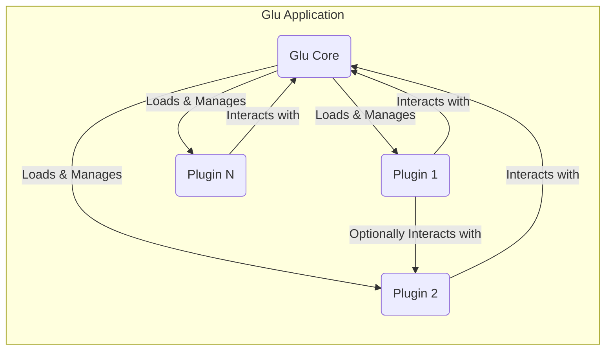
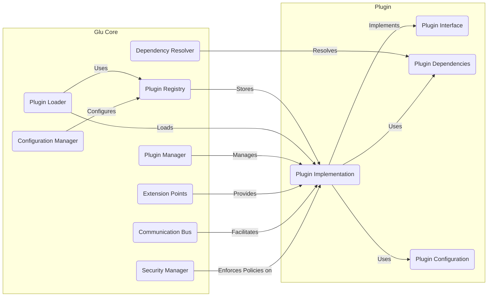
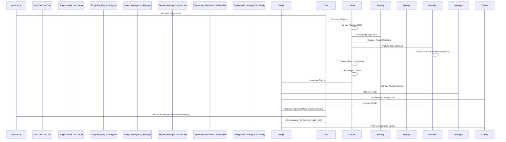

# Project Design Document: Glu - A Dynamic Plugin Framework

**Version:** 1.1
**Date:** October 26, 2023
**Author:** AI Software Architect

## 1. Introduction

This document provides an enhanced design specification for Glu, a dynamic plugin framework tailored for Java applications. Glu's primary objective is to enable applications to discover, load, manage, and interact with plugins seamlessly at runtime. This design document serves as a detailed blueprint of the system's architecture and will be instrumental in subsequent threat modeling exercises. It aims to provide a comprehensive understanding of Glu's components, interactions, and potential security considerations.

## 2. Goals and Objectives

*   **Robust Dynamic Plugin Loading:**  Enable applications to discover and load plugins from various sources without requiring application restarts or service interruptions.
*   **Strong Plugin Isolation:** Implement robust mechanisms to isolate plugins from the core application and from each other, preventing unintended interference, ensuring stability, and enhancing security. This includes memory and classloader isolation.
*   **Sophisticated Dependency Management:**  Provide a comprehensive system for managing dependencies required by plugins, including versioning and conflict resolution.
*   **Well-Defined Plugin Communication:** Define clear, secure, and efficient interfaces and mechanisms for plugins to interact with the core application and, when necessary and authorized, with other plugins.
*   **Highly Extensible Framework:** Design the Glu framework itself to be extensible, allowing for the addition of new plugin types, management strategies, and communication protocols without requiring core modifications.
*   **Comprehensive Security Posture:** Implement proactive and reactive security measures to mitigate risks associated with dynamically loaded and potentially untrusted code, including mechanisms for verification and control.

## 3. System Architecture

The Glu framework employs a modular architecture, with a central core component orchestrating the lifecycle and interactions of dynamically loaded plugins.

### 3.1. High-Level Architecture

*   **Glu Core:** The central orchestrator responsible for all aspects of plugin management, including discovery, loading, lifecycle management, communication facilitation, and security enforcement.
*   **Plugins:** Independent, self-contained modules that extend the functionality of the host Glu application. They adhere to defined interfaces and interact with the core through specified channels.

### 3.2. Detailed Architecture

*   **Plugin Registry:** A central repository maintaining a comprehensive catalog of available and loaded plugins, including detailed metadata (name, version, description, dependencies, entry point, security attributes, etc.) and their current runtime state.
*   **Plugin Loader:** The component responsible for locating plugin artifacts from configured sources, verifying their integrity (e.g., through checksums or signatures), loading plugin classes into isolated classloaders, and managing class dependencies.
*   **Plugin Manager:** Provides the core functionalities for managing the lifecycle of plugins, including loading, starting, stopping, unloading, updating, and potentially hot-swapping plugins. It also monitors plugin health and resource usage.
*   **Extension Points:** Well-defined interfaces or abstract classes within the Glu Core that plugins can implement to extend the application's functionality in a type-safe and controlled manner. These act as contracts between the core and plugins.
*   **Communication Bus:** A secure and reliable mechanism (e.g., event bus, message queue, API endpoints) that allows plugins to communicate with the Glu Core and, under specific conditions and with proper authorization, with other plugins. This component enforces communication policies.
*   **Configuration Manager:** Handles the loading, management, and provision of configuration settings for both the Glu framework itself and individual plugins. It supports various configuration sources and formats and may include features for dynamic configuration updates.
*   **Security Manager:** A critical component responsible for enforcing security policies, managing plugin permissions, verifying plugin signatures, and potentially sandboxing plugin execution to mitigate security risks.
*   **Dependency Resolver:** Analyzes plugin dependencies (specified in plugin metadata), retrieves the required libraries or other plugins, and ensures compatibility and avoids conflicts.
*   **Plugin Interface:** A standardized set of contracts (interfaces) that all plugins must implement to interact with the Glu Core. This defines the common methods for initialization, activation, deactivation, communication, and lifecycle events.
*   **Plugin Implementation:** The actual code of the plugin, implementing the `Plugin Interface` and providing the specific functionalities intended by the plugin developer.
*   **Plugin Dependencies:** A declaration of external libraries or other plugins required by a specific plugin to function correctly. This information is used by the `Dependency Resolver`.
*   **Plugin Configuration:**  Configuration settings specific to a particular plugin, often loaded and managed by the `Configuration Manager`.

## 4. Components

This section provides a more detailed description of the key components within the Glu framework.

*   **Plugin Registry:**
    *   Stores comprehensive metadata about each plugin, including name, version, author, description, dependencies, entry point class, supported extension points, security permissions, and digital signature information.
    *   Maintains the current runtime state of each plugin (e.g., loaded, initialized, started, stopped, failed).
    *   Provides APIs for querying and retrieving plugin information based on various criteria.
    *   Supports versioning of plugins and allows for querying plugins based on version constraints.
*   **Plugin Loader:**
    *   Discovers plugin artifacts (e.g., JAR files, directories) from configurable locations (local filesystem, remote repositories).
    *   Verifies the integrity and authenticity of plugin artifacts using mechanisms like checksums and digital signature verification.
    *   Manages isolated classloaders for each plugin to prevent classloading conflicts and ensure plugin isolation.
    *   Handles the loading of plugin classes and resources into the appropriate classloader.
    *   Provides mechanisms for handling plugin updates and replacements.
*   **Plugin Manager:**
    *   Orchestrates the complete lifecycle of plugins, including loading, initialization, starting, stopping, unloading, and updating.
    *   Manages plugin activation and deactivation based on application state or external triggers.
    *   Monitors plugin health, resource usage (CPU, memory), and potential errors.
    *   Provides APIs for programmatically managing plugin states.
    *   May support features like plugin hot-swapping (replacing a running plugin with a new version).
*   **Extension Points:**
    *   Clearly defined interfaces or abstract classes within the Glu Core that act as integration points for plugins.
    *   Plugins implement these interfaces to provide specific functionalities to the core application.
    *   The Glu Core interacts with plugins exclusively through these extension points, ensuring loose coupling and maintainability.
    *   May support different types of extension points (e.g., service providers, event listeners).
*   **Communication Bus:**
    *   Enables asynchronous and synchronous communication between plugins and the Glu Core, and potentially between plugins.
    *   Supports various communication patterns, such as publish/subscribe, request/response, and message queues.
    *   Provides mechanisms for secure communication, including authentication and authorization.
    *   May offer features like message filtering and routing.
*   **Configuration Manager:**
    *   Loads and manages configuration settings for the Glu framework itself (e.g., plugin directories, security settings) and for individual plugins.
    *   Supports various configuration sources (e.g., property files, YAML, environment variables, databases).
    *   Provides APIs for plugins to access their configuration settings in a type-safe manner.
    *   May support dynamic configuration updates without requiring plugin restarts.
*   **Security Manager:**
    *   Enforces security policies related to plugin loading, execution, and communication.
    *   Verifies plugin signatures to ensure authenticity and prevent tampering.
    *   Manages plugin permissions, controlling access to system resources and core application functionalities.
    *   May employ sandboxing techniques to isolate plugin execution and limit potential damage.
    *   Provides mechanisms for auditing plugin activities and security events.
*   **Dependency Resolver:**
    *   Analyzes the dependencies declared by each plugin.
    *   Retrieves the required dependency artifacts (libraries, other plugins) from configured repositories.
    *   Resolves dependency conflicts and ensures compatibility between different versions of dependencies.
    *   May support different dependency resolution strategies.
*   **Plugin Interface:**
    *   Defines the mandatory contract that all plugins must adhere to.
    *   Includes methods for initialization, activation, deactivation, handling configuration changes, and communication with the core.
    *   Provides a standardized way for the Glu Core to interact with plugins.
*   **Plugin Implementation:**
    *   Contains the specific business logic and functionality provided by the plugin.
    *   Implements the `Plugin Interface` and interacts with the Glu Core through defined extension points and the communication bus.
    *   May utilize external libraries or services as declared in its dependencies.
*   **Plugin Dependencies:**
    *   A manifest or configuration file within the plugin artifact that lists the external libraries or other plugins required by this plugin.
    *   May specify version constraints for dependencies.
*   **Plugin Configuration:**
    *   A configuration file or set of settings specific to a particular plugin, defining its behavior and parameters.
    *   Typically loaded and managed by the `Configuration Manager`.

## 5. Data Flow

The following describes the typical data flow during plugin loading, interaction, and communication:

1. **Plugin Discovery Initiation:** The `Plugin Loader` starts the discovery process based on configured settings or explicit requests.
2. **Plugin Location and Retrieval:** The `Plugin Loader` scans designated directories or queries remote repositories for plugin artifacts.
3. **Metadata Extraction and Verification:** The `Plugin Loader` extracts metadata from the plugin artifact (e.g., from a manifest file, annotations, or a dedicated descriptor file) and the `Security Manager` verifies the plugin's signature.
4. **Registration and Dependency Analysis:** The extracted metadata is stored in the `Plugin Registry`, and the `Dependency Resolver` analyzes the plugin's declared dependencies.
5. **Dependency Resolution and Retrieval:** The `Dependency Resolver` retrieves the required dependencies.
6. **Classloader Creation and Class Loading:** The `Plugin Loader` creates an isolated classloader for the plugin and loads its classes and resources.
7. **Instantiation and Initialization:** The `Plugin Loader` instantiates the main plugin class, and the `Plugin Manager` calls the initialization method defined in the `Plugin Interface`.
8. **Configuration Loading:** The `Configuration Manager` loads the plugin's specific configuration.
9. **Activation and Extension Point Registration:** When the plugin is activated by the `Plugin Manager`, it registers its implementations of the defined `Extension Points` with the Glu Core.
10. **Interaction via Extension Points:** The Glu application interacts with the plugin by invoking methods on the registered extension point implementations.
11. **Communication via Communication Bus:** Plugins can send and receive messages or events via the `Communication Bus` to interact with the Glu Core or other authorized plugins.
12. **Configuration Updates:** The `Configuration Manager` may push configuration updates to running plugins.

## 6. Security Considerations

Security is paramount in a dynamic plugin framework like Glu. The following are key security considerations and mitigation strategies:

*   **Robust Plugin Isolation:** Employing distinct and isolated classloaders for each plugin is crucial to prevent plugins from accessing the internal state, classes, or resources of the core application or other plugins. This limits the scope of potential damage from malicious plugins. Memory isolation techniques should also be considered.
*   **Mandatory Code Signing and Verification:** Enforce mandatory code signing for all plugin artifacts. The `Security Manager` must verify the digital signature of each plugin before loading to ensure authenticity and integrity, confirming the plugin originates from a trusted source and hasn't been tampered with.
*   **Fine-grained Permissions and Sandboxing:** Implement a granular permission system to control the resources and functionalities that plugins can access. This includes access to file systems, network resources, system properties, and core application APIs. Consider employing sandboxing technologies (e.g., Java Security Manager with custom policies, OS-level sandboxing) to further restrict plugin behavior and limit potential damage.
*   **Strict Input Validation and Sanitization:** Implement rigorous input validation and sanitization for all data received from plugins to prevent injection attacks (e.g., SQL injection, command injection) and other vulnerabilities. Treat all plugin input as potentially untrusted.
*   **Secure Communication Channels:** Ensure secure communication channels if plugins need to interact with external services or other parts of the application. Use secure protocols (e.g., HTTPS, TLS) and implement proper authentication and authorization mechanisms. The `Communication Bus` should enforce these security measures.
*   **Secure Dependency Management:**  Implement mechanisms to verify the integrity and source of plugin dependencies. Use trusted repositories and verify checksums or signatures of downloaded dependencies to prevent the introduction of vulnerable libraries. Regularly scan plugin dependencies for known vulnerabilities.
*   **Regular Security Audits and Penetration Testing:** Conduct regular security audits and penetration testing of the Glu framework and popular plugins to proactively identify and address potential vulnerabilities.
*   **Secure Plugin Update Mechanism:** Implement a secure and authenticated mechanism for updating plugins to patch vulnerabilities and introduce new features. Ensure that only authorized entities can push plugin updates.
*   **Comprehensive Monitoring and Logging:** Implement comprehensive monitoring of plugin activity and logging of relevant security events (e.g., permission requests, access violations, communication attempts) for security analysis, auditing, and incident response.
*   **Principle of Least Privilege:** Design the permission system and plugin interfaces based on the principle of least privilege, granting plugins only the necessary permissions to perform their intended functions.
*   **Plugin Blacklisting/Whitelisting:** Implement mechanisms for blacklisting or whitelisting plugins based on their identity or source to control which plugins are allowed to be loaded.

## 7. Deployment

The Glu framework is designed to be embedded within a host Java application. Typical deployment considerations include:

*   **Glu Core Integration:** Include the Glu Core library (e.g., as a JAR dependency) in the host application's build process.
*   **Plugin Deployment Strategy:** Define a strategy for deploying plugin artifacts. This could involve:
    *   Copying plugin JAR files to a designated directory on the application server.
    *   Deploying plugins as part of the application's deployment package.
    *   Utilizing a remote plugin repository or marketplace.
*   **Configuration:** Configure the Glu Core with settings such as:
    *   Plugin discovery paths or mechanisms.
    *   Security settings (e.g., signature verification keys, default permissions).
    *   Communication bus configuration.
    *   Dependency repository locations.
*   **Classloader Configuration:** Ensure the application's classloader setup allows for the creation of isolated classloaders for plugins.
*   **Security Policy Configuration:** Configure the security policies enforced by the `Security Manager`.
*   **Monitoring and Logging Setup:** Configure logging and monitoring systems to track plugin activity and potential security events.
*   **Plugin Management Interface:**  Consider providing an administrative interface (command-line or GUI) for managing plugins (e.g., loading, unloading, updating).

## 8. Technologies Used

*   **Core Programming Language:** Java
*   **Build Automation:** Likely Maven or Gradle (as indicated by the GitHub repository)
*   **Dependency Injection:** Potentially a framework like Spring or Guice for managing internal Glu components.
*   **Logging Framework:**  e.g., SLF4j with Logback or Log4j2 for logging Glu and plugin activities.
*   **Testing Frameworks:** e.g., JUnit, Mockito, potentially integration testing frameworks.
*   **Security Libraries:**  For signature verification, encryption, and secure communication (e.g., Java Cryptography Architecture (JCA)).
*   **Communication Bus Implementation:**  Potentially a message queue system (e.g., Kafka, RabbitMQ) or an event bus library.

## 9. Future Considerations

*   **Advanced Plugin Versioning and Compatibility Management:** Implement more sophisticated mechanisms for managing plugin versions, including semantic versioning, compatibility checks, and migration strategies.
*   **Remote Plugin Management and Monitoring:** Explore the possibility of managing and monitoring plugins remotely through a dedicated management interface or API.
*   **GUI for Plugin Management:** Develop a graphical user interface for administrators to manage plugins, view their status, and configure settings.
*   **Enhanced Plugin Communication Patterns:** Support more advanced and flexible communication patterns between plugins, such as service discovery and remote procedure calls.
*   **Plugin Resource Management and Quotas:** Implement mechanisms for managing and limiting the resources (CPU, memory, network) that individual plugins can consume.
*   **Dynamic Plugin Assembly:** Investigate the possibility of dynamically assembling plugins from smaller components or modules.
*   **Standardized Plugin Packaging and Distribution:** Define a standardized format for packaging and distributing Glu plugins.

This enhanced design document provides a more detailed and comprehensive overview of the Glu dynamic plugin framework, with a strong emphasis on security considerations. It serves as a solid foundation for development, testing, and, crucially, for conducting thorough threat modeling to ensure the security, stability, and robustness of the system.