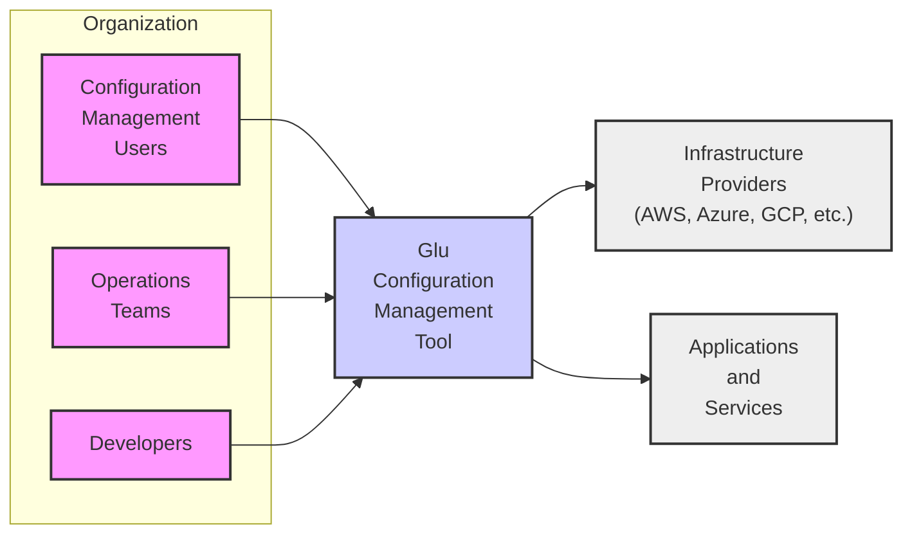
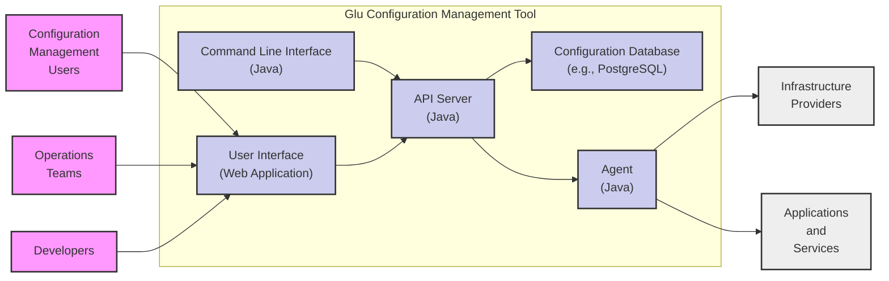

# BUSINESS POSTURE

- Business Priorities and Goals:
 - Goal: To provide a configuration management and orchestration tool that simplifies the deployment and management of applications and infrastructure across various environments.
 - Priority: Ease of use and flexibility for developers and operations teams to manage configurations and automate tasks.
 - Priority: Reliability and consistency in configuration management to reduce errors and ensure predictable deployments.
 - Priority: Support for diverse environments, including cloud and on-premises infrastructure.

- Business Risks:
 - Risk: Misconfiguration leading to service disruptions or security vulnerabilities due to errors in configuration management.
 - Risk: Unauthorized access to configuration data or orchestration capabilities, potentially leading to system compromise.
 - Risk: Inconsistent state management across environments causing application failures or unexpected behavior.
 - Risk: Lack of auditability and traceability of configuration changes, hindering troubleshooting and compliance efforts.
 - Risk: Vendor lock-in if the tool becomes too tightly integrated with specific infrastructure or platforms.

# SECURITY POSTURE

- Existing Security Controls:
 - security control: Code reviews are likely performed as part of the development process (standard practice for open-source projects on GitHub). Implemented in: Development process, GitHub pull requests.
 - security control: Version control using Git. Implemented in: GitHub repository.
 - security control: Dependency management using Maven (based on pom.xml). Implemented in: Build process.
 - security control:  Likely uses standard Java security practices for the application itself. Implemented in: Application code.
 - security control:  Relies on underlying infrastructure security for deployment environments (e.g., cloud provider security, on-premises network security). Implemented in: Deployment environment.

- Accepted Risks:
 - accepted risk: Reliance on community contributions for security vulnerability identification and patching (typical for open-source projects).
 - accepted risk: Potential delay in security patch availability compared to commercial solutions.
 - accepted risk: Security of deployment environment is assumed to be managed separately by the user.

- Recommended Security Controls:
 - security control: Implement automated Static Application Security Testing (SAST) in the CI/CD pipeline to identify potential vulnerabilities in the code.
 - security control: Implement Software Composition Analysis (SCA) in the CI/CD pipeline to manage and monitor dependencies for known vulnerabilities.
 - security control: Introduce signed releases of artifacts to ensure integrity and authenticity of distributed software.
 - security control: Provide guidance and documentation on secure configuration practices for users of the tool.
 - security control: Implement robust logging and auditing of configuration changes and orchestration activities.
 - security control:  Consider adding features for secrets management to avoid hardcoding sensitive information in configurations.

- Security Requirements:
 - Authentication:
  - requirement:  The tool should support authentication mechanisms to control access to configuration management and orchestration functionalities.
  - requirement:  Consider supporting multiple authentication methods (e.g., username/password, API keys, integration with identity providers).
 - Authorization:
  - requirement:  Implement role-based access control (RBAC) to manage user permissions and restrict access to specific configurations and actions based on roles.
  - requirement:  Authorization should be enforced at multiple levels, including access to the application itself and access to specific configuration resources.
 - Input Validation:
  - requirement:  All user inputs, including configuration data and orchestration commands, must be thoroughly validated to prevent injection attacks (e.g., command injection, YAML injection).
  - requirement:  Input validation should be performed on both the client-side (if applicable) and server-side.
 - Cryptography:
  - requirement:  Sensitive data at rest (e.g., configuration secrets) should be encrypted.
  - requirement:  Communication channels used for configuration management and orchestration should be encrypted (e.g., HTTPS).
  - requirement:  Consider using cryptographic signatures to verify the integrity of configuration data.

# DESIGN

## C4 CONTEXT



- Context Diagram Elements:
 - Element:
  - Name: Configuration Management Users
  - Type: User
  - Description: Users who interact with Glu to manage configurations, including viewing, creating, updating, and deleting configurations.
  - Responsibilities: Define and manage application and infrastructure configurations using Glu.
  - Security controls: Authentication and authorization to access Glu.
 - Element:
  - Name: Operations Teams
  - Type: User
  - Description: Operations teams use Glu to automate deployments, manage infrastructure configurations, and ensure system stability.
  - Responsibilities: Automate infrastructure management and application deployments using Glu. Monitor system health and configuration consistency.
  - Security controls: Role-based access control within Glu to manage operational tasks. Audit logging of operational actions.
 - Element:
  - Name: Developers
  - Type: User
  - Description: Developers use Glu to define application configurations, manage environment-specific settings, and integrate configuration management into their development workflows.
  - Responsibilities: Define application configurations and integrate Glu into development pipelines.
  - Security controls: Access control to manage application configurations. Version control of configuration definitions.
 - Element:
  - Name: Glu Configuration Management Tool
  - Type: Software System
  - Description: The Glu application itself, providing configuration management and orchestration capabilities.
  - Responsibilities: Store, manage, and apply configurations. Orchestrate tasks across different environments. Provide an interface for users to interact with configurations.
  - Security controls: Authentication, authorization, input validation, secure configuration storage, audit logging.
 - Element:
  - Name: Infrastructure Providers (AWS, Azure, GCP, etc.)
  - Type: External System
  - Description: Cloud providers or on-premises infrastructure where applications and Glu itself might be deployed.
  - Responsibilities: Provide the underlying infrastructure for applications and Glu to run.
  - Security controls: Infrastructure security controls provided by the cloud provider or organization (network security, access control, etc.). Glu relies on these for its deployment environment security.
 - Element:
  - Name: Applications and Services
  - Type: External System
  - Description: The applications and services that are being managed and configured by Glu.
  - Responsibilities: Run business logic and provide services to end-users.
  - Security controls: Application-level security controls. Glu helps manage their configuration but doesn't directly implement their application security.

## C4 CONTAINER



- Container Diagram Elements:
 - Element:
  - Name: API Server
  - Type: Container
  - Description:  Backend API server built using Java, responsible for handling requests from the UI and CLI, managing configurations, and orchestrating tasks.
  - Responsibilities: Expose API endpoints for configuration management and orchestration. Implement business logic and authorization. Interact with the database and agents.
  - Security controls: Authentication and authorization for API access. Input validation for all API requests. Secure communication (HTTPS). Rate limiting to prevent abuse.
 - Element:
  - Name: Configuration Database
  - Type: Container
  - Description: Persistent storage for configuration data, application state, and audit logs. Could be a relational database like PostgreSQL or similar.
  - Responsibilities: Store configuration data, application state, and audit logs persistently. Ensure data integrity and availability.
  - Security controls: Database access control (authentication and authorization). Encryption at rest for sensitive data. Regular backups. Network security to restrict access to the database.
 - Element:
  - Name: User Interface
  - Type: Container
  - Description: Web-based user interface for interacting with Glu. Allows users to manage configurations, view status, and trigger orchestrations.
  - Responsibilities: Provide a user-friendly interface for configuration management. Authenticate users and interact with the API server.
  - Security controls: Authentication and authorization. Secure communication (HTTPS). Input validation on the client-side. Protection against common web vulnerabilities (e.g., XSS, CSRF).
 - Element:
  - Name: Command Line Interface
  - Type: Container
  - Description: Command-line interface for interacting with Glu, suitable for automation and scripting.
  - Responsibilities: Provide a command-line interface for configuration management and orchestration. Authenticate users and interact with the API server.
  - Security controls: Authentication and authorization. Secure communication (HTTPS or similar if communicating over network). Input validation.
 - Element:
  - Name: Agent
  - Type: Container
  - Description: Agents deployed on target infrastructure (e.g., servers, VMs, containers) to execute orchestration tasks and apply configurations.
  - Responsibilities: Execute tasks and apply configurations on target systems. Communicate with the API server to receive instructions and report status.
  - Security controls: Secure communication with the API server (mutual TLS recommended). Agent authentication and authorization. Principle of least privilege for agent permissions on target systems. Secure storage of agent credentials (if any).

## DEPLOYMENT

- Possible Deployment Architectures:
 - Standalone Deployment: Glu components (API Server, Database, UI) are deployed on a single server or VM. Suitable for small deployments or development environments.
 - Distributed Deployment: Glu components are deployed across multiple servers or VMs for scalability and high availability. Database can be on a separate dedicated server or cluster. Agents are deployed on target infrastructure.
 - Cloud-Native Deployment: Glu components are containerized (e.g., using Docker) and deployed on a container orchestration platform like Kubernetes. Database can be a managed cloud database service. Agents are deployed as containers or VMs in the target environment.

- Detailed Deployment Architecture (Cloud-Native Deployment on Kubernetes):

```mermaid
flowchart LR
    subgraph "Kubernetes Cluster"
        subgraph "Namespace: glu-system"
            APIPod["API Server Pod"]:::pod
            DBPod["Database Pod\n(e.g., PostgreSQL)"]:::pod
            UIPod["UI Pod"]:::pod
            APISvc["API Service"]:::service
            UISvc["UI Service"]:::service
        end
        subgraph "Namespace: target-environment"
            AgentPod["Agent Pod"]:::pod
        end
    end
    LB["Load Balancer"]:::infrastructure
    Users["Users"]:::user
    Infra["Target\nInfrastructure"]:::infrastructure
    Apps["Target\nApplications"]:::infrastructure

    Users --> LB --> UISvc
    Users --> LB --> APISvc (API Requests)
    UIPod --> APISvc
    APIPod --> DBPod
    APIPod --> AgentPod
    AgentPod --> Infra
    AgentPod --> Apps

    classDef pod fill:#cff,stroke:#333,stroke-width:2px
    classDef service fill:#dff,stroke:#333,stroke-width:2px
    classDef infrastructure fill:#eee,stroke:#333,stroke-width:2px
    classDef user fill:#f9f,stroke:#333,stroke-width:2px
```

- Deployment Diagram Elements:
 - Element:
  - Name: Kubernetes Cluster
  - Type: Infrastructure
  - Description: Kubernetes cluster providing the container orchestration platform for Glu.
  - Responsibilities: Manage container deployments, scaling, and networking. Provide a runtime environment for Glu components.
  - Security controls: Kubernetes RBAC, network policies, pod security policies, cluster security hardening.
 - Element:
  - Name: Namespace: glu-system
  - Type: Kubernetes Namespace
  - Description: Dedicated Kubernetes namespace for deploying core Glu components (API Server, Database, UI).
  - Responsibilities: Isolation of Glu system components. Resource management for Glu system.
  - Security controls: Kubernetes namespace isolation, namespace-level RBAC.
 - Element:
  - Name: API Server Pod
  - Type: Kubernetes Pod
  - Description: Pod running the Glu API Server container.
  - Responsibilities: Host the API Server application.
  - Security controls: Container security (image scanning, least privilege user), Kubernetes network policies.
 - Element:
  - Name: Database Pod
  - Type: Kubernetes Pod
  - Description: Pod running the Configuration Database container (e.g., PostgreSQL).
  - Responsibilities: Host the Configuration Database.
  - Security controls: Container security, database access control, Kubernetes network policies, persistent volume security.
 - Element:
  - Name: UI Pod
  - Type: Kubernetes Pod
  - Description: Pod running the Glu UI container.
  - Responsibilities: Host the Glu User Interface.
  - Security controls: Container security, Kubernetes network policies.
 - Element:
  - Name: API Service
  - Type: Kubernetes Service
  - Description: Kubernetes service exposing the API Server Pods.
  - Responsibilities: Load balancing and service discovery for API Server Pods.
  - Security controls: Kubernetes service account, network policies.
 - Element:
  - Name: UI Service
  - Type: Kubernetes Service
  - Description: Kubernetes service exposing the UI Pods.
  - Responsibilities: Load balancing and service discovery for UI Pods.
  - Security controls: Kubernetes service account, network policies.
 - Element:
  - Name: Namespace: target-environment
  - Type: Kubernetes Namespace
  - Description: Kubernetes namespace representing a target environment where agents are deployed.
  - Responsibilities: Isolation of agents for different target environments.
  - Security controls: Kubernetes namespace isolation, namespace-level RBAC.
 - Element:
  - Name: Agent Pod
  - Type: Kubernetes Pod
  - Description: Pod running the Glu Agent container in the target environment.
  - Responsibilities: Execute tasks and apply configurations on target infrastructure and applications within the target environment.
  - Security controls: Container security, agent authentication and authorization, Kubernetes network policies, service account with limited permissions.
 - Element:
  - Name: Load Balancer
  - Type: Infrastructure
  - Description: Cloud load balancer or ingress controller routing traffic to the UI and API services.
  - Responsibilities: Expose Glu UI and API to users. Load balancing and SSL termination.
  - Security controls: HTTPS termination, access control lists, DDoS protection.
 - Element:
  - Name: Users
  - Type: User
  - Description: Users accessing Glu UI and API.
  - Responsibilities: Interact with Glu to manage configurations.
  - Security controls: Authentication via UI and API.
 - Element:
  - Name: Target Infrastructure
  - Type: Infrastructure
  - Description: Target infrastructure (VMs, servers, cloud resources) managed by Glu agents.
  - Responsibilities: Host applications and services being configured by Glu.
  - Security controls: Infrastructure security controls (OS hardening, network security, access control).
 - Element:
  - Name: Target Applications
  - Type: Infrastructure
  - Description: Applications and services running on the target infrastructure.
  - Responsibilities: Provide business functionality.
  - Security controls: Application-level security controls.

## BUILD

```mermaid
flowchart LR
    Developer["Developer"]:::dev --> VCS["Version Control\n(GitHub)"]:::vcs
    VCS --> BuildServer["Build Server\n(GitHub Actions)"]:::ci
    BuildServer --> Test["Automated Tests"]:::test
    Test --> SAST["SAST Scanner"]:::security_tool
    SAST --> SCA["SCA Scanner"]:::security_tool
    SCA --> BuildArtifacts["Build Artifacts\n(JAR, Docker Image)"]:::artifact
    BuildArtifacts --> Registry["Artifact Registry\n(GitHub Packages, Docker Hub)"]:::registry

    classDef dev fill:#f9f,stroke:#333,stroke-width:2px
    classDef vcs fill:#ccf,stroke:#333,stroke-width:2px
    classDef ci fill:#cce,stroke:#333,stroke-width:2px
    classDef test fill:#dff,stroke:#333,stroke-width:2px
    classDef security_tool fill:#eff,stroke:#333,stroke-width:2px
    classDef artifact fill:#aaffaa,stroke:#333,stroke-width:2px
    classDef registry fill:#aaccaa,stroke:#333,stroke-width:2px
```



- Build Process Description:
 - Developers commit code changes to the Version Control System (GitHub).
 - A Build Server (e.g., GitHub Actions) is triggered on code changes (e.g., push, pull request).
 - The Build Server compiles the code, runs automated tests (unit tests, integration tests).
 - Static Application Security Testing (SAST) is performed to identify potential security vulnerabilities in the code.
 - Software Composition Analysis (SCA) is performed to identify vulnerabilities in dependencies.
 - If tests and security checks pass, Build Artifacts (e.g., JAR files, Docker images) are created.
 - Build Artifacts are published to an Artifact Registry (e.g., GitHub Packages, Docker Hub).

- Build Process Elements:
 - Element:
  - Name: Developer
  - Type: Person
  - Description: Software developers writing and committing code.
  - Responsibilities: Write code, perform local testing, commit code changes.
  - Security controls: Secure development practices, code reviews.
 - Element:
  - Name: Version Control (GitHub)
  - Type: System
  - Description: GitHub repository hosting the source code.
  - Responsibilities: Version control, code collaboration, trigger CI/CD pipelines.
  - Security controls: Access control to the repository, branch protection, audit logs.
 - Element:
  - Name: Build Server (GitHub Actions)
  - Type: System
  - Description: Automated build and CI/CD system using GitHub Actions.
  - Responsibilities: Automate build, test, and security checks. Orchestrate the build pipeline.
  - Security controls: Secure build environment, access control to CI/CD configurations, secrets management for build credentials.
 - Element:
  - Name: Automated Tests
  - Type: Process
  - Description: Automated unit tests and integration tests.
  - Responsibilities: Verify code functionality and prevent regressions.
  - Security controls: Test coverage for security-relevant functionalities.
 - Element:
  - Name: SAST Scanner
  - Type: Security Tool
  - Description: Static Application Security Testing tool to analyze source code for vulnerabilities.
  - Responsibilities: Identify potential security flaws in the code.
  - Security controls: Regularly updated vulnerability rules, configuration for relevant security checks.
 - Element:
  - Name: SCA Scanner
  - Type: Security Tool
  - Description: Software Composition Analysis tool to analyze dependencies for known vulnerabilities.
  - Responsibilities: Identify vulnerable dependencies.
  - Security controls: Regularly updated vulnerability database, integration with dependency management tools.
 - Element:
  - Name: Build Artifacts (JAR, Docker Image)
  - Type: Artifact
  - Description: Compiled and packaged software artifacts.
  - Responsibilities: Deployable units of software.
  - Security controls: Signed artifacts to ensure integrity and authenticity (recommended).
 - Element:
  - Name: Artifact Registry (GitHub Packages, Docker Hub)
  - Type: System
  - Description: Registry for storing and distributing build artifacts.
  - Responsibilities: Securely store and distribute build artifacts.
  - Security controls: Access control to the registry, vulnerability scanning of stored images (if applicable), audit logs.

# RISK ASSESSMENT

- Critical Business Processes:
 - Configuration Management: Ensuring consistent and correct configurations across all environments is critical for application availability and performance.
 - Deployment Automation: Automated deployments rely on Glu to orchestrate tasks and apply configurations, impacting release cycles and time to market.
 - Infrastructure Management: Glu might be used to manage infrastructure configurations, impacting infrastructure stability and security.

- Data Sensitivity:
 - Configuration Data: Configuration data might contain sensitive information such as database credentials, API keys, and other secrets. Sensitivity: High. Requires encryption at rest and in transit, and strict access control.
 - Audit Logs: Audit logs contain information about configuration changes and user activities. Sensitivity: Medium. Important for compliance and security monitoring. Requires secure storage and access control.
 - Application State: Glu might store application state information. Sensitivity: Depends on the application. Could be low to high depending on the data stored. Requires appropriate access control and potentially encryption.

# QUESTIONS & ASSUMPTIONS

- Business Posture Questions:
 - Question: What is the target user profile for Glu? Is it primarily for startups, SMEs, or large enterprises?
 - Question: What are the key compliance requirements that Glu needs to address (e.g., SOC 2, GDPR, HIPAA)?
 - Assumption: The primary business goal is to improve efficiency and reduce errors in configuration management and application deployments.

- Security Posture Questions:
 - Question: Are there any existing security policies or frameworks that Glu needs to comply with?
 - Question: What is the organization's risk appetite regarding open-source software and security vulnerabilities?
 - Assumption: Security is a high priority for Glu, especially given its role in configuration management and potential handling of sensitive data.

- Design Questions:
 - Question: What are the expected scalability and performance requirements for Glu?
 - Question: What are the supported infrastructure platforms and environments for Glu agents?
 - Question: What are the preferred database options for Glu?
 - Assumption: Glu is designed to be modular and extensible to support different deployment scenarios and infrastructure environments.
 - Assumption: The design prioritizes security best practices, including authentication, authorization, input validation, and encryption.