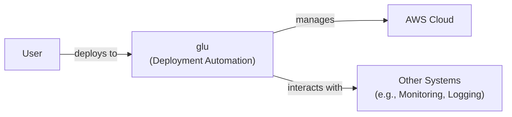
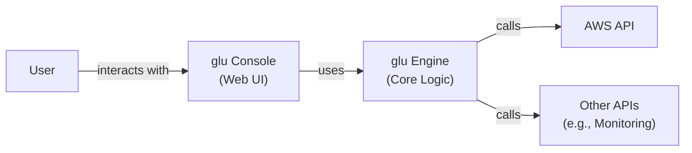
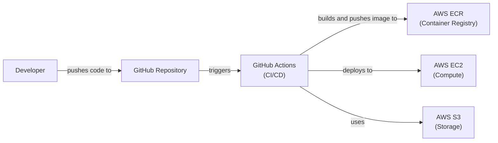
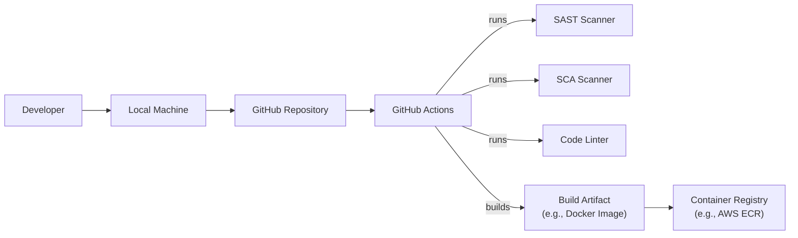

Okay, let's create a design document for the `glu` project, keeping in mind its purpose and potential security considerations.

# BUSINESS POSTURE

Business Priorities and Goals:

*   Provide a robust and reliable automation platform for cloud deployments (primarily AWS).
*   Simplify complex deployment processes, making them repeatable and less error-prone.
*   Enable faster iteration cycles for development teams by automating infrastructure provisioning and application deployment.
*   Reduce operational overhead associated with manual deployment tasks.
*   Improve consistency and standardization across deployments.
*   Facilitate collaboration between development and operations teams (DevOps).
*   Minimize downtime during deployments.
*   Provide a solution that is easy to learn and use, with good documentation and community support.

Most Important Business Risks:

*   Unauthorized access to cloud resources due to vulnerabilities in `glu` or its deployment scripts.
*   Accidental or malicious misconfiguration of cloud resources, leading to service disruptions or data breaches.
*   Data loss or corruption due to errors in deployment scripts or `glu`'s internal logic.
*   Dependency on a single maintainer or a small group of maintainers, creating a risk of project abandonment or slow response to security issues.
*   Lack of sufficient auditing and logging, making it difficult to track down the root cause of problems or security incidents.
*   Inability to scale to meet the demands of larger or more complex deployments.
*   Exposure of sensitive information (e.g., API keys, passwords) during the deployment process.
*   Supply chain attacks targeting `glu` or its dependencies.

# SECURITY POSTURE

Existing Security Controls:

*   security control: Code reviews are performed (as indicated by the GitHub repository's collaborative development model). Location: GitHub pull requests.
*   security control: Use of Infrastructure as Code (IaC) principles, promoting consistency and reducing manual errors. Location: `glu` scripts and project structure.
*   security control: Integration with AWS IAM for access control (implied, as `glu` interacts with AWS services). Location: AWS IAM policies and roles used by `glu` scripts.
*   security control: Use of Groovy and other established technologies, potentially benefiting from their respective security communities and updates. Location: Project dependencies and build configuration.

Accepted Risks:

*   accepted risk: Reliance on third-party libraries and dependencies, which may introduce vulnerabilities.
*   accepted risk: Potential for user error in writing `glu` scripts, leading to misconfigurations or security issues.
*   accepted risk: The project's maturity level and the size of its active user/maintainer base may impact the speed of vulnerability patching.

Recommended Security Controls:

*   Implement Static Application Security Testing (SAST) to scan `glu`'s codebase for vulnerabilities.
*   Implement Software Composition Analysis (SCA) to identify and manage vulnerabilities in third-party dependencies.
*   Implement Dynamic Application Security Testing (DAST) to test the running application for vulnerabilities.
*   Provide detailed security documentation and guidelines for users, including best practices for writing secure `glu` scripts.
*   Establish a clear vulnerability disclosure and response process.
*   Implement robust logging and auditing to track all actions performed by `glu`.
*   Consider implementing a mechanism for securely storing and managing secrets (e.g., AWS Secrets Manager, HashiCorp Vault).
*   Regularly review and update AWS IAM policies to follow the principle of least privilege.

Security Requirements:

*   Authentication:
    *   `glu` itself does not handle user authentication directly. It relies on the underlying AWS credentials and IAM roles for authentication to AWS services.
    *   Requirement: Ensure that AWS credentials used by `glu` are securely managed and rotated regularly.
    *   Requirement: Use IAM roles with the least privilege necessary for `glu` to perform its tasks.

*   Authorization:
    *   `glu` uses AWS IAM for authorization to control access to AWS resources.
    *   Requirement: Define granular IAM policies that restrict `glu`'s access to only the resources it needs.
    *   Requirement: Implement a mechanism for controlling which users or systems can execute `glu` scripts (e.g., through CI/CD pipelines with appropriate access controls).

*   Input Validation:
    *   `glu` scripts are written in Groovy and may interact with user-provided input.
    *   Requirement: Validate all user-provided input to prevent injection attacks (e.g., command injection, script injection).
    *   Requirement: Sanitize any user input that is used in shell commands or other sensitive contexts.

*   Cryptography:
    *   `glu` may handle sensitive data, such as API keys or passwords.
    *   Requirement: Use strong encryption algorithms and secure key management practices to protect sensitive data at rest and in transit.
    *   Requirement: Avoid hardcoding secrets in `glu` scripts. Use a secure secrets management solution.
    *   Requirement: Ensure that any communication with AWS services uses TLS/SSL encryption.

# DESIGN

## C4 CONTEXT

Element Descriptions:

*   Element:
    *   Name: User
    *   Type: Person
    *   Description: A developer or operations engineer who uses `glu` to automate deployments.
    *   Responsibilities: Writing and executing `glu` scripts, configuring deployment parameters, monitoring deployments.
    *   Security controls: Strong passwords, multi-factor authentication (if applicable), access control to `glu` execution environment.

*   Element:
    *   Name: glu (Deployment Automation)
    *   Type: Software System
    *   Description: The `glu` deployment automation platform.
    *   Responsibilities: Orchestrating deployments, managing cloud resources, executing deployment scripts.
    *   Security controls: Input validation, secure handling of secrets, least privilege access to AWS resources, regular security updates.

*   Element:
    *   Name: AWS Cloud
    *   Type: External System
    *   Description: Amazon Web Services, the cloud platform where resources are deployed.
    *   Responsibilities: Providing cloud infrastructure and services (e.g., EC2, S3, RDS).
    *   Security controls: AWS IAM, VPC security groups, network ACLs, encryption at rest and in transit, AWS security best practices.

*   Element:
    *   Name: Other Systems (e.g., Monitoring, Logging)
    *   Type: External System
    *   Description: Systems that interact with `glu` or the deployed applications, such as monitoring and logging services.
    *   Responsibilities: Monitoring application health, collecting logs, providing alerts.
    *   Security controls: Secure communication channels, access control to monitoring and logging data.

## C4 CONTAINER

Element Descriptions:

*   Element:
    *   Name: User
    *   Type: Person
    *   Description: A developer or operations engineer.
    *   Responsibilities: Interacting with the `glu` Console.
    *   Security controls: Authentication, authorization.

*   Element:
    *   Name: glu Console (Web UI)
    *   Type: Container (Web Application)
    *   Description: The web-based user interface for `glu`.
    *   Responsibilities: Providing a user-friendly way to interact with `glu`, displaying deployment status, managing configurations.
    *   Security controls: Authentication, authorization, input validation, secure communication (HTTPS), protection against XSS and CSRF.

*   Element:
    *   Name: glu Engine (Core Logic)
    *   Type: Container (Application)
    *   Description: The core logic of `glu`, responsible for executing deployment scripts and interacting with cloud providers.
    *   Responsibilities: Parsing `glu` scripts, managing deployments, interacting with AWS APIs.
    *   Security controls: Input validation, secure handling of secrets, least privilege access to AWS resources.

*   Element:
    *   Name: AWS API
    *   Type: External System (API)
    *   Description: The API provided by Amazon Web Services.
    *   Responsibilities: Providing access to AWS services and resources.
    *   Security controls: AWS IAM, API rate limiting, request signing.

*   Element:
    *   Name: Other APIs (e.g., Monitoring)
    *   Type: External System (API)
    *   Description: APIs of other systems that `glu` interacts with.
    *   Responsibilities: Providing specific functionalities (e.g., monitoring, logging).
    *   Security controls: API authentication, authorization, secure communication.

## DEPLOYMENT

Possible Deployment Solutions:

1.  Local Execution: Running `glu` directly on a developer's machine or a dedicated server.
2.  CI/CD Pipeline: Integrating `glu` into a CI/CD pipeline (e.g., Jenkins, GitLab CI, GitHub Actions).
3.  Containerized Deployment: Running `glu` within a Docker container.

Chosen Solution (for detailed description): CI/CD Pipeline (GitHub Actions)

Element Descriptions:

*   Element:
    *   Name: Developer
    *   Type: Person
    *   Description: A developer working on the project.
    *   Responsibilities: Writing code, committing changes, triggering deployments.
    *   Security controls: Strong passwords, multi-factor authentication, code signing (optional).

*   Element:
    *   Name: GitHub Repository
    *   Type: Source Code Repository
    *   Description: The repository hosting the project's source code.
    *   Responsibilities: Storing code, managing versions, triggering CI/CD pipelines.
    *   Security controls: Access control, branch protection rules, code review policies.

*   Element:
    *   Name: GitHub Actions (CI/CD)
    *   Type: CI/CD Platform
    *   Description: The CI/CD platform used to automate the build, test, and deployment process.
    *   Responsibilities: Building Docker images, running tests, deploying applications.
    *   Security controls: Secure access to secrets, least privilege access to AWS resources, audit logging.

*   Element:
    *   Name: AWS ECR (Container Registry)
    *   Type: Container Registry
    *   Description: Amazon Elastic Container Registry, used to store Docker images.
    *   Responsibilities: Storing and managing Docker images.
    *   Security controls: IAM policies, image scanning, private repository access.

*   Element:
    *   Name: AWS EC2 (Compute)
    *   Type: Compute Service
    *   Description: Amazon Elastic Compute Cloud, used to run the deployed application.
    *   Responsibilities: Providing virtual machines for running applications.
    *   Security controls: IAM roles, security groups, network ACLs, SSH key management.

*   Element:
    *   Name: AWS S3 (Storage)
    *   Type: Storage Service
    *   Description: Amazon Simple Storage Service, used for storing artifacts or configuration files.
    *   Responsibilities: Providing object storage.
    *   Security controls: IAM policies, bucket policies, encryption at rest and in transit.

## BUILD

Build Process Description:

1.  Developer commits code changes to the GitHub repository.
2.  GitHub Actions workflow is triggered.
3.  The workflow checks out the code.
4.  SAST scanner (e.g., SonarQube) analyzes the code for security vulnerabilities.
5.  SCA scanner (e.g., Snyk) analyzes dependencies for known vulnerabilities.
6.  Code linter (e.g., Checkstyle) checks for code style and potential errors.
7.  If all checks pass, the workflow builds the application (e.g., creates a Docker image).
8.  The build artifact is pushed to a container registry (e.g., AWS ECR).

Security Controls:

*   SAST scanning to identify vulnerabilities in the codebase.
*   SCA scanning to manage vulnerabilities in dependencies.
*   Code linting to enforce coding standards and prevent common errors.
*   Secure build environment (GitHub Actions) with limited access.
*   Use of signed commits to ensure code integrity.
*   Regular updates to build tools and dependencies.

# RISK ASSESSMENT

Critical Business Processes:

*   Automated deployment of cloud infrastructure and applications.
*   Management of cloud resources.
*   Continuous integration and continuous delivery (CI/CD) pipelines.

Data Sensitivity:

*   Configuration files: May contain sensitive information such as API keys, database credentials, and other secrets. Sensitivity: High
*   Deployment scripts: May contain logic that interacts with sensitive data or systems. Sensitivity: Medium to High
*   Logs: May contain sensitive information about user activity, system errors, or security events. Sensitivity: Medium
*   Application data: The data processed and stored by the deployed applications may have varying levels of sensitivity. Sensitivity: Depends on the specific application.

# QUESTIONS & ASSUMPTIONS

Questions:

*   What specific AWS services are most commonly used with `glu`?
*   Are there any existing security policies or compliance requirements that `glu` must adhere to?
*   What is the expected scale of deployments (number of resources, frequency of deployments)?
*   What level of support is provided for `glu` users?
*   Are there any plans for future development or new features?
*   What is the process for reporting and addressing security vulnerabilities in `glu`?
*   Are there any specific monitoring or logging tools used in conjunction with `glu`?
*   How are secrets (e.g., API keys, passwords) currently managed in `glu` deployments?

Assumptions:

*   BUSINESS POSTURE: The primary goal is to simplify and automate cloud deployments on AWS. The organization has a moderate risk appetite, prioritizing stability and security but also valuing agility and ease of use.
*   SECURITY POSTURE: AWS IAM is used for access control. Basic security practices (e.g., code reviews) are followed. There is a willingness to improve security posture.
*   DESIGN: `glu` primarily interacts with AWS services. The deployment environment is likely a CI/CD pipeline or a developer's local machine. The build process involves standard tools and practices.