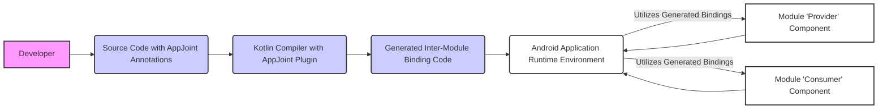

# Project Design Document: AppJoint

**Version:** 1.1
**Date:** October 26, 2023
**Author:** Gemini (AI Language Model)

## 1. Introduction

This document provides an enhanced design overview of the AppJoint library, as described in the GitHub repository: [https://github.com/prototypez/appjoint](https://github.com/prototypez/appjoint). This document is intended to serve as a robust foundation for subsequent threat modeling activities. It elaborates on the system's architecture, key components, data flow with more granularity, and deployment model, providing a deeper understanding for security analysis.

## 2. Goals

The primary goal of AppJoint is to significantly simplify the development of modular Android applications. It aims to achieve this by:

*   Enforcing a strong separation of concerns between distinct features or modules within an Android application, promoting better code organization.
*   Dramatically reducing the amount of boilerplate code typically required for inter-module communication and dependency management.
*   Potentially improving build times, especially for large projects, by enabling more independent compilation of modules.
*   Substantially enhancing code maintainability and testability by fostering a modular architecture.

## 3. System Overview

AppJoint is a Kotlin library that employs annotations and a custom Kotlin compiler plugin to automatically generate the necessary code for seamless and type-safe interaction between different modules of an Android application. It operates predominantly during the compilation phase, generating interfaces and concrete implementations that facilitate connections between components defined in separate modules. This compile-time approach aims to minimize runtime overhead.

Here's a high-level overview of the system's operation:

**Explanation of the Diagram:**

*   **Developer:** The software engineer integrating and utilizing AppJoint within their Android project.
*   **Source Code with AppJoint Annotations:** The Kotlin source code of the Android application, incorporating AppJoint annotations to define module boundaries and inter-module dependencies.
*   **Kotlin Compiler with AppJoint Plugin:** The standard Kotlin compiler augmented with the custom AppJoint compiler plugin. This plugin is responsible for processing the AppJoint annotations.
*   **Generated Inter-Module Binding Code:** The Kotlin code automatically produced by the AppJoint plugin. This code establishes the mechanisms for communication and dependency resolution between modules.
*   **Android Application Runtime Environment:** The environment in which the compiled Android application is executed on a device or emulator.
*   **Module 'Provider' Component & Module 'Consumer' Component:** Represent distinct components residing in different modules of the Android application that require interaction. The 'Provider' exposes functionality, and the 'Consumer' utilizes it.

## 4. Key Components

The AppJoint library's functionality is centered around these key components:

*   **Annotations:** These annotations act as declarative markers within the code, guiding the compiler plugin's code generation process.
    *   `@BindComponent`:  Used to annotate Kotlin interfaces. This interface serves as the explicitly defined public API contract for a specific module. Other modules interact with this module solely through this interface. This promotes encapsulation and reduces coupling.
    *   `@BindEntry`: Applied to concrete Kotlin classes within a module. These classes are the actual implementations of the interfaces annotated with `@BindComponent`. The compiler plugin uses this information to generate the necessary binding logic.
    *   `@ComponentFactory`: Used to annotate Kotlin interfaces that define how instances of the `@BindComponent` interface are created. This allows developers to control the instantiation process, potentially injecting dependencies or applying custom logic during object creation.

*   **Compiler Plugin:** This is the core processing unit of AppJoint, operating during the Kotlin compilation phase.
    *   **Annotation Scanning and Parsing:** The plugin meticulously scans the entire codebase for the presence of AppJoint annotations (`@BindComponent`, `@BindEntry`, `@ComponentFactory`). It then parses these annotations to extract relevant information, such as the annotated interface, its implementing class, and the factory (if specified).
    *   **Dependency Graph Construction:** Based on the discovered annotations, the plugin builds an internal representation of the dependencies between modules. This graph helps in understanding how modules are connected and which modules rely on others.
    *   **Code Generation Logic:** The plugin's primary function is to generate Kotlin code that facilitates inter-module communication. This generated code typically includes:
        *   Concrete implementations (or wrappers) for the `@BindComponent` interfaces, allowing other modules to access the functionality.
        *   Factory implementations (if a `@ComponentFactory` is not provided) to create instances of the component interfaces.
        *   Utility classes or extension functions that provide a convenient way for modules to obtain instances of the exposed component interfaces from other modules. This often involves a registry or service locator pattern implemented through the generated code.
    *   **Type Safety Enforcement:** The compiler plugin ensures that interactions between modules are type-safe. It leverages the information from the annotations to generate code that prevents incompatible types from being used during inter-module communication, catching potential errors at compile time.

*   **Runtime Library (Minimal Footprint):** While AppJoint primarily operates at compile time, a small runtime library might exist to provide essential utilities for the generated code. Based on the repository, this library appears to be very lean, focusing on core functionalities needed by the generated bindings. It might contain base classes or interfaces used by the generated code to facilitate the inter-module communication mechanism.

## 5. Data Flow

The data flow within the AppJoint system can be broken down into two distinct phases: the **Compilation Phase** and the **Runtime Phase**.

**Compilation Phase Data Flow:**

1. **Source Code Input:** The process begins with the Android project's source code, which includes AppJoint annotations strategically placed to define module boundaries and dependencies.
2. **Compiler Plugin Invocation:** The Kotlin compiler, configured with the AppJoint plugin, starts the compilation process.
3. **Annotation Discovery and Parsing:** The AppJoint compiler plugin scans all source files, identifying and parsing the `@BindComponent`, `@BindEntry`, and `@ComponentFactory` annotations.
4. **Dependency Graph Construction:** The plugin analyzes the relationships defined by the annotations to build a dependency graph representing the connections between modules.
5. **Code Generation:** Based on the dependency graph and the information extracted from the annotations, the plugin generates Kotlin source code. This generated code implements the necessary mechanisms for inter-module communication.
6. **Integration with Compilation:** The generated Kotlin code is then fed back into the Kotlin compiler, where it is compiled along with the original source code.
7. **Output of Compilation:** The result of the compilation process is the `.class` files (or ultimately the DEX files for Android) that include both the original application logic and the code generated by the AppJoint plugin.

**Runtime Phase Data Flow:**

1. **Application Startup:** When the Android application starts, the generated code is loaded into memory along with the rest of the application code.
2. **Module Interaction via Generated Code:** When a component in one module needs to interact with a component exposed by another module, it utilizes the generated binding code. This typically involves accessing a generated factory or registry to obtain an instance of the target module's `@BindComponent` interface.
3. **Method Invocation and Delegation:**  The calling module invokes methods on the obtained instance of the `@BindComponent` interface. The generated implementation then delegates this call to the actual implementation within the target module (the class annotated with `@BindEntry`).
4. **Data Exchange:** Data is exchanged between the modules through the method calls and their parameters/return values, adhering to the contract defined by the `@BindComponent` interface.

## 6. Security Considerations (Detailed)

Building upon the preliminary considerations, here's a more detailed look at potential security implications:

*   **Malicious Code Injection via Annotations:**
    *   **Threat:** A malicious actor with control over parts of the codebase could craft annotations in a way that causes the compiler plugin to generate unintended or malicious code. This could involve exploiting vulnerabilities in the plugin's parsing or code generation logic.
    *   **Mitigation:** The compiler plugin must be rigorously tested and designed to prevent the generation of arbitrary code based on annotation inputs. Input validation and sanitization within the plugin are crucial.
*   **Dependency Manipulation and Substitution:**
    *   **Threat:** If an attacker can influence the project's dependencies (e.g., through a compromised dependency repository), they might be able to substitute a legitimate module with a malicious one that exposes the same `@BindComponent` interface.
    *   **Mitigation:** Employing dependency management best practices, such as using dependency verification and secure repositories, is essential. AppJoint itself can't directly prevent this, as it operates on the resolved dependencies.
*   **Compromised Build Environment:**
    *   **Threat:** If the development or CI/CD environment is compromised, an attacker could modify the AppJoint compiler plugin itself to inject malicious code into the generated bindings.
    *   **Mitigation:** Implementing robust security measures for the build environment, including access controls, integrity checks for build tools, and regular security audits, is paramount.
*   **Unintended Exposure of Functionality:**
    *   **Threat:**  Incorrect or overly permissive use of `@BindComponent` could unintentionally expose internal functionalities of a module to other parts of the application, potentially violating the principle of least privilege.
    *   **Mitigation:** Developers need to carefully design the public API of each module and only expose necessary functionalities through the `@BindComponent` interface. Code reviews and architectural guidelines can help prevent such issues.
*   **Vulnerabilities in Generated Code:**
    *   **Threat:**  Bugs or vulnerabilities in the AppJoint compiler plugin could lead to the generation of insecure code. For example, the generated code might not properly handle certain edge cases or might be susceptible to injection attacks if it involves string manipulation based on external input (though this is less likely given the compile-time nature).
    *   **Mitigation:** Thorough testing of the compiler plugin and the generated code is crucial. Static analysis tools can be used to identify potential vulnerabilities in the generated code.
*   **Information Disclosure through Inter-Module Communication:**
    *   **Threat:** While AppJoint aims for type safety, vulnerabilities in the generated code or improper handling of data passed between modules could lead to unintended information disclosure.
    *   **Mitigation:** Secure coding practices should be followed within the modules, and the generated code should be reviewed for potential information leaks.

## 7. Deployment Model

AppJoint is integrated into an Android application project as a build-time dependency. The deployment process involves:

*   **Applying the Gradle Plugin:** The AppJoint Gradle plugin is applied to the project's top-level `build.gradle.kts` (or `.gradle`) file. This makes the plugin available to the project.
*   **Adding Dependencies:** The core AppJoint library dependency is added to the `dependencies` block of the module-level `build.gradle.kts` files where AppJoint annotations will be used.
*   **Annotation Usage in Source Code:** Developers then utilize the `@BindComponent`, `@BindEntry`, and `@ComponentFactory` annotations within their Kotlin source code to define module boundaries and inter-module dependencies.
*   **Compilation and Code Generation:** During the standard Android application build process (initiated via Gradle), the Kotlin compiler is invoked. The registered AppJoint compiler plugin intercepts this process and performs annotation processing and code generation.
*   **Integration into Application Package:** The generated Kotlin code is compiled along with the rest of the application code, and the resulting `.class` files (and ultimately DEX files) are included in the final application package (APK or AAB). There is no separate runtime deployment of AppJoint.

## 8. Assumptions and Constraints

*   **Kotlin Programming Language:** AppJoint is specifically designed for Android projects utilizing the Kotlin programming language.
*   **Gradle Build System Dependency:** It relies heavily on the Gradle build system for Android projects and its plugin mechanism.
*   **Kotlin Compiler Plugin Infrastructure:**  AppJoint's functionality is entirely dependent on the stability and security of the Kotlin compiler plugin infrastructure.
*   **Developer Adherence to Best Practices:** The security and intended functionality of AppJoint rely on developers using the annotations correctly, following established architectural patterns, and designing module boundaries appropriately.
*   **Secure Development and Build Environment:** A fundamental assumption is that the development and build environments are reasonably secure and not compromised by malicious actors.

## 9. Future Considerations

*   **Enhanced Access Control Mechanisms:** Exploring more sophisticated mechanisms for controlling access between modules, potentially beyond the simple interface-based approach. This could involve annotation-based access modifiers or more fine-grained permission systems.
*   **Integration with Dynamic Feature Modules:**  Further investigation and optimization of AppJoint's compatibility and performance when used with Android's Dynamic Feature Modules.
*   **Formal Security Audits and Penetration Testing:**  Regular and thorough security audits of the AppJoint compiler plugin and the code it generates are crucial to proactively identify and address potential vulnerabilities. Penetration testing of applications using AppJoint can also provide valuable insights.
*   **Improved Error Handling and Reporting:** Enhancing the compiler plugin's error reporting capabilities to provide more informative messages to developers regarding incorrect annotation usage or potential issues.
*   **Integration with Dependency Injection Frameworks (Advanced):**  Exploring more advanced integration patterns with dependency injection frameworks like Hilt or Dagger, potentially allowing AppJoint to leverage their features for managing inter-module dependencies.
*   **Support for Multiplatform Projects:** Investigating the feasibility of extending AppJoint's functionality to Kotlin Multiplatform projects to facilitate modularity across different platforms.

This enhanced design document provides a more in-depth understanding of the AppJoint library's architecture, components, and data flow. This detailed information is crucial for conducting a comprehensive threat model and identifying potential security vulnerabilities.