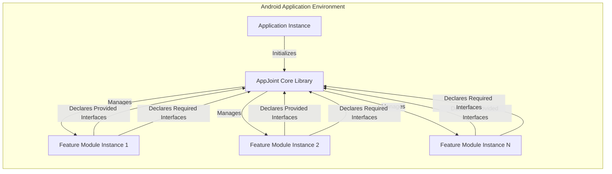
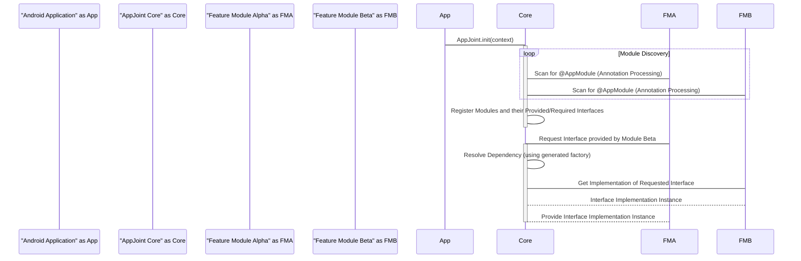

# Project Design Document: AppJoint

**Version:** 1.1
**Date:** October 26, 2023
**Author:** AI Software Architect

## 1. Introduction

This document provides an enhanced and more detailed design overview of the AppJoint project, a library designed to facilitate modular Android application development. This document serves as a foundational reference for understanding the system's architecture, individual components, and the flow of data within the framework. This detailed understanding is crucial for subsequent threat modeling activities.

### 1.1. Project Overview

AppJoint simplifies the creation of modular Android applications by establishing a framework for loosely coupled communication and managed dependencies between distinct modules. It achieves this through the strategic use of annotation processing and automated code generation. This approach minimizes boilerplate code, enhances maintainability, and promotes a more organized project structure.

### 1.2. Goals

*   To enforce a clear separation of concerns by delineating features and functionalities into independent Android modules.
*   To minimize inter-module dependencies, thereby enabling independent development, testing, and potential deployment of individual modules.
*   To streamline communication and dependency management between modules through an intuitive and automated mechanism.
*   To contribute to faster build times by enabling incremental compilation of independent modules.
*   To foster code reusability by allowing modules to expose functionalities that can be consumed by other parts of the application.

### 1.3. Target Audience

This document is intended for a diverse audience involved in the lifecycle of applications utilizing AppJoint:

*   Software architects and engineers responsible for the design, development, and maintenance of Android applications leveraging AppJoint.
*   Security engineers tasked with identifying, analyzing, and mitigating potential security vulnerabilities within the application.
*   Quality assurance engineers and testers who require a comprehensive understanding of the system's architecture for effective test planning and execution.
*   New team members onboarding onto projects utilizing AppJoint to quickly grasp the project's modular structure.

## 2. System Architecture

The architectural foundation of AppJoint centers around a core module and a collection of independent feature modules. The "AppJoint Core Module" provides the essential infrastructure for module registration, dependency resolution, and inter-module communication. "Feature Modules" encapsulate specific, self-contained functionalities of the application.

### 2.1. Key Components

*   **AppJoint Core Library:** This library serves as the central orchestrator for the modular application. It encompasses the logic for module discovery, registration, dependency management, and inter-module communication. Key elements include:
    *   **`AppJoint` Class (Singleton):** The primary entry point for interacting with the AppJoint framework. Responsible for initialization and providing access to core functionalities.
    *   **Annotation Processors (Build-time):** These components process AppJoint-specific annotations within feature modules during the compilation phase, generating necessary code for module registration and dependency wiring.
    *   **Module Registry (In-memory):** A runtime data structure that maintains a mapping of registered modules and the interfaces they provide and require.
    *   **Dependency Resolver:**  The component responsible for analyzing module dependencies and ensuring that all required interfaces are available at runtime.
    *   **Interface Provider:**  A mechanism for retrieving concrete implementations of interfaces provided by different modules.

*   **Feature Modules:** These are independent Android library modules, each encapsulating a distinct feature or set of functionalities. Each feature module:
    *   **Provides Interfaces:** Defines and implements interfaces that expose its functionalities to other modules.
    *   **Requires Interfaces:** Declares dependencies on interfaces provided by other modules.
    *   **Uses AppJoint Annotations:**  Employs annotations to signal its presence to the AppJoint core and to define its provided and required interfaces.
    *   **Contains Feature Logic:** Houses the implementation of the specific feature, including business logic, UI components, and data handling.

*   **Application Instance:** The standard entry point for an Android application. It is responsible for initializing the AppJoint Core Library during the application's startup sequence.

## 3. Component Details

### 3.1. AppJoint Core Library

*   **Responsibilities:**
    *   Initializing and managing the lifecycle of all registered feature modules.
    *   Dynamically discovering and registering feature modules during the application's initialization phase.
    *   Analyzing and resolving dependencies between modules based on their declared provided and required interfaces.
    *   Facilitating secure and efficient communication between modules through the retrieval of interface implementations.
    *   Providing a clear API for accessing module instances and their exposed functionalities.

*   **Key Functionalities:**
    *   **Module Discovery and Registration:** At application startup, the core library scans the classpath for classes annotated with AppJoint's module registration annotations (e.g., `@AppModule`).
    *   **Dependency Injection/Wiring:** The core library manages the connections between modules by ensuring that when a module requires an interface, it receives an instance of a module that provides that interface. This is often achieved through generated factory classes.
    *   **Interface Lookup and Resolution:** When a module needs to interact with another module, it requests a specific interface from the core library. The core library then resolves this request by locating the module providing that interface and returning its implementation.
    *   **Code Generation Details:** The annotation processors generate code that handles the boilerplate of module registration, dependency wiring, and interface implementation retrieval. This generated code is crucial for the runtime behavior of AppJoint.

*   **Technologies Used:**
    *   Java and/or Kotlin programming languages.
    *   Android SDK for core Android functionalities.
    *   Annotation Processing API for build-time code generation.
    *   Reflection (used judiciously, primarily for initial module discovery and instantiation, but the core dependency resolution relies on generated code for performance and safety).

### 3.2. Feature Modules

*   **Responsibilities:**
    *   To encapsulate a specific, well-defined feature or set of related functionalities within the application.
    *   To clearly define and implement interfaces that expose the module's capabilities to other parts of the application.
    *   To explicitly declare any interfaces required from other modules to perform its functions.
    *   To register itself with the AppJoint core library using specific annotations, making it discoverable and manageable.

*   **Key Functionalities:**
    *   **Interface Definition and Implementation:** Defining contracts (interfaces) for interaction with other modules and providing concrete implementations of these interfaces.
    *   **Feature Implementation:** Containing the core logic, UI components, data access layers, and other elements necessary for the feature's functionality.
    *   **Dependency Declaration using Annotations:** Utilizing annotations like `@ProvidesInterface` and `@RequiresInterface` to inform the AppJoint core about its capabilities and needs.

*   **Technologies Used:**
    *   Java and/or Kotlin programming languages.
    *   Android SDK components relevant to the feature's implementation.
    *   Potentially other third-party libraries specific to the feature's requirements.

### 3.3. Application Instance

*   **Responsibilities:**
    *   To initiate the AppJoint framework during the application's startup process.
    *   To potentially provide initial configuration parameters to the AppJoint core library.

*   **Key Functionalities:**
    *   **`AppJoint.init(context)`:** The primary method call to initialize the AppJoint framework, passing the application context.

*   **Technologies Used:**
    *   Java and/or Kotlin programming languages.
    *   Android SDK (specifically the `android.app.Application` class).

## 4. Data Flow

The primary data flow within AppJoint encompasses the module registration process and the subsequent communication between these modules.

### 4.1. Module Registration Flow (Build and Runtime)

1. **Build Time:** During the application's build process, the AppJoint annotation processors analyze the codebase for modules annotated with `@AppModule` and other relevant AppJoint annotations.
2. **Code Generation:** The annotation processors generate code (e.g., factory classes, module registry entries) that facilitates module registration and dependency wiring at runtime.
3. **Runtime Initialization:** When the Android application starts, the `Application` class initializes the AppJoint core library by calling `AppJoint.init(context)`.
4. **Module Discovery (Runtime):** The core library utilizes the generated code to discover and register available feature modules. This typically involves iterating through the generated module registry.
5. **Dependency Mapping:** The core library builds an internal map of modules and the interfaces they provide and require, based on the information extracted from the generated code.

### 4.2. Inter-Module Communication Flow (Runtime)

1. A module (e.g., Feature Module Alpha) needs to interact with functionality provided by another module (e.g., Feature Module Beta).
2. Feature Module Alpha requests a specific interface from the AppJoint core library, indicating the desired functionality.
3. The core library consults its internal dependency map to identify the module that provides the requested interface.
4. Using the generated factory classes, the core library obtains an instance of the interface implementation from Feature Module Beta.
5. The core library returns the interface implementation instance to Feature Module Alpha.
6. Feature Module Alpha can now interact with Feature Module Beta through the obtained interface, without direct knowledge of Beta's concrete implementation details.

## 5. Security Considerations

This section provides a more detailed overview of potential security considerations relevant to AppJoint's design, serving as a foundation for subsequent threat modeling.

*   **Vulnerabilities in Annotation Processors:** Maliciously crafted input or vulnerabilities within the AppJoint annotation processors could lead to the generation of insecure or unexpected code during the build process. This could potentially introduce vulnerabilities that are difficult to detect.
*   **Module Isolation and Access Control:** While AppJoint promotes modularity, it's crucial to ensure proper isolation between modules. Mechanisms should be in place to prevent unintended access to internal data or functionalities of other modules. Lack of proper access control could lead to information leakage or unauthorized actions.
*   **Dependency Management Risks:**  While AppJoint manages dependencies *between* modules, vulnerabilities in the *external* dependencies of individual feature modules remain a concern. A compromised dependency in one module could potentially affect the entire application. AppJoint's modularity can make it more challenging to centrally manage and update these external dependencies.
*   **Risks Associated with Reflection:** Although AppJoint aims to minimize direct reflection usage in favor of generated code, any use of reflection, especially for module instantiation or method invocation, introduces potential security risks. Malicious actors could potentially exploit reflection to bypass security checks or execute arbitrary code.
*   **Security of Inter-Module Communication:** The mechanism used for inter-module communication needs to be robust against eavesdropping and tampering. If communication relies on insecure channels or shared memory without proper safeguards, sensitive data could be exposed or manipulated.
*   **Module Registration Integrity:** The process of module registration should be secure to prevent malicious modules from registering themselves and gaining unauthorized access to application resources or the ability to interfere with other modules. The integrity of the generated module registry is paramount.
*   **Code Injection through Module Replacement:** If the mechanism for loading or selecting modules can be compromised, a malicious actor might be able to replace a legitimate module with a compromised one, potentially gaining control over parts of the application's functionality.
*   **Data Serialization/Deserialization Risks:** If modules exchange data through serialization, vulnerabilities in the serialization/deserialization process could be exploited to inject malicious data or code.

## 6. Deployment Considerations

AppJoint is designed to be integrated into Android applications as a set of library dependencies managed by Gradle.

*   **Gradle Dependency Management:** The `appjoint-core` library will be a required dependency for all feature modules. The `appjoint-compiler` library will be added as an `annotationProcessor` dependency in the application's `build.gradle` file.
*   **Modular Project Structure:** Developers will structure their applications into multiple Android library modules, each representing a distinct feature.
*   **Annotation-Driven Configuration:** Developers will use AppJoint-provided annotations within their feature modules to declare provided and required interfaces, enabling the framework to manage dependencies.
*   **Build Process Integration:** The AppJoint annotation processors will automatically run during the application's build process, generating the necessary code for module interaction.

## 7. Future Considerations

*   **Support for Dynamic Feature Modules:** Exploring the possibility of integrating with Android's Dynamic Feature Modules to allow for on-demand downloading and loading of features.
*   **Advanced Dependency Resolution Strategies:** Implementing more sophisticated dependency resolution mechanisms, such as support for optional dependencies or different scopes of dependencies.
*   **Pluggable Communication Mechanisms:**  Allowing developers to choose or implement different communication mechanisms between modules, potentially offering options for asynchronous communication or event-based interactions.
*   **Enhanced Tooling and IDE Support:** Developing IDE plugins or tools to simplify the process of creating, managing, and visualizing module dependencies within an AppJoint-based application. This could include features for dependency conflict detection and resolution.
*   **Security Auditing Tools:**  Developing tools or guidelines to assist developers in auditing the security of their AppJoint-based applications, potentially focusing on common vulnerabilities related to modular architectures.

This revised document provides a more detailed and comprehensive design overview of the AppJoint project. It aims to offer a clearer understanding of the system's architecture, components, and data flow, making it a more effective resource for subsequent threat modeling and development activities.