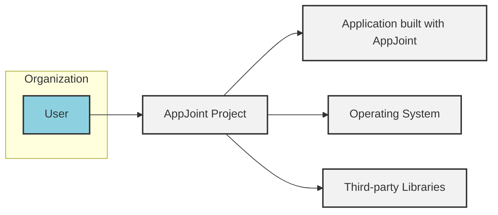
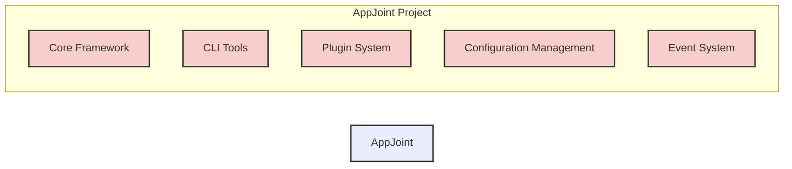

# BUSINESS POSTURE

This project, AppJoint, is a framework designed to simplify and accelerate the development of complex, modular applications. The primary business goal is to provide developers with a robust and extensible platform that reduces development time, promotes code reusability, and enhances application maintainability. This framework targets organizations that need to build and manage applications efficiently, especially those with evolving requirements and a need for adaptable systems.

Key business priorities are:
- Rapid application development and deployment.
- Increased developer productivity and efficiency.
- Enhanced application modularity and maintainability.
- Support for building scalable and extensible applications.
- Reduced long-term maintenance costs through code reusability and simplified architecture.

Most important business risks that need to be addressed:
- Security vulnerabilities in the framework itself could be inherited by all applications built upon it, leading to widespread impact.
- Performance bottlenecks within the framework could limit the scalability and responsiveness of applications.
- Lack of adoption and developer support could render the framework ineffective and underutilized.
- Incompatibility issues with existing systems and technologies could hinder integration efforts.
- Complexity of the framework could lead to a steep learning curve and slow down initial development.

# SECURITY POSTURE

Existing security controls:
- security control: Repository hosted on GitHub, leveraging GitHub's infrastructure security. Implemented by: GitHub platform.
- security control: Open-source project, allowing community review and potential security contributions. Implemented by: Open-source nature of the project.

Accepted risks:
- accepted risk: Prototype stage, implying security is not the primary focus initially, and vulnerabilities may exist.
- accepted risk: Reliance on community contributions for security improvements, which may be inconsistent or delayed.
- accepted risk: Lack of formal security audits or penetration testing at this stage.

Recommended security controls:
- recommended security control: Implement automated security scanning (SAST/DAST) in the CI/CD pipeline.
- recommended security control: Establish a process for reporting and addressing security vulnerabilities.
- recommended security control: Define and document secure coding guidelines for framework development and application development using the framework.
- recommended security control: Implement input validation and output encoding mechanisms within the framework.
- recommended security control: Provide secure configuration management practices and guidance for applications built on the framework.

Security requirements:
- Authentication:
  - Applications built with AppJoint may require authentication. The framework should provide mechanisms or guidance for integrating authentication solutions.
  - Framework components and CLI tools should have appropriate authentication and authorization mechanisms if they expose management interfaces.
- Authorization:
  - Applications built with AppJoint will need authorization controls. The framework should facilitate the implementation of role-based access control or other authorization models.
  - Access to framework configuration and management functions should be restricted based on roles and permissions.
- Input validation:
  - The framework must enforce or guide developers to implement robust input validation to prevent injection attacks (e.g., SQL injection, command injection, cross-site scripting).
  - All external inputs to the framework and applications built with it should be validated.
- Cryptography:
  - The framework should provide secure cryptographic functions or libraries for applications that require encryption, hashing, or digital signatures.
  - Sensitive data handled by the framework itself, such as configuration secrets, should be encrypted at rest and in transit.

# DESIGN

## C4 CONTEXT



Context Diagram Elements:

- Name: User
  - Type: Person
  - Description: Developers and operators who interact with the AppJoint project, including framework developers, application developers using AppJoint, and system administrators deploying and managing applications.
  - Responsibilities:
    - Develop and maintain the AppJoint framework.
    - Develop applications using the AppJoint framework.
    - Deploy and operate applications built with AppJoint.
  - Security controls:
    - Access control to development environments (security control: implemented by organization's access management system).
    - Code review processes (security control: implemented by development team).
    - Secure coding training (security control: implemented by organization's security training program).

- Name: AppJoint Project
  - Type: Software System
  - Description: The AppJoint framework itself, including its core components, libraries, CLI tools, and documentation. It is the central piece of software being designed and analyzed.
  - Responsibilities:
    - Provide a platform for building modular and extensible applications.
    - Offer core functionalities such as component management, dependency injection, and configuration management.
    - Ensure the framework is robust, performant, and secure.
  - Security controls:
    - Code repository access control (security control: implemented by GitHub).
    - Vulnerability scanning of dependencies (recommended security control).
    - Secure development lifecycle practices (recommended security control).

- Name: Application built with AppJoint
  - Type: Software System
  - Description: Applications developed using the AppJoint framework. These are the end products that leverage AppJoint's capabilities.
  - Responsibilities:
    - Implement specific business logic and functionalities.
    - Utilize AppJoint framework features for modularity and extensibility.
    - Meet application-specific security and performance requirements.
  - Security controls:
    - Application-level authentication and authorization (security requirement).
    - Input validation and output encoding (security requirement).
    - Secure configuration management (security requirement).

- Name: Operating System
  - Type: Software System
  - Description: The underlying operating system on which AppJoint and applications built with it are deployed. This could be Linux, Windows, macOS, etc.
  - Responsibilities:
    - Provide a runtime environment for AppJoint and applications.
    - Manage system resources and security.
  - Security controls:
    - Operating system hardening (security control: implemented by system administrators).
    - Regular security patching (security control: implemented by system administrators).
    - Access control to the operating system (security control: implemented by system administrators).

- Name: Third-party Libraries
  - Type: Software System
  - Description: External libraries and packages used by AppJoint framework and applications built with it. These are dependencies managed by package managers.
  - Responsibilities:
    - Provide reusable functionalities to AppJoint and applications.
    - Maintain their own security and stability.
  - Security controls:
    - Dependency vulnerability scanning (recommended security control).
    - Review and selection of trusted libraries (security control: implemented by development team).
    - Keeping dependencies up-to-date (security control: implemented by development team/CI).

## C4 CONTAINER



Container Diagram Elements:

- Name: Core Framework
  - Type: Container
  - Description: The foundational components of AppJoint, providing core functionalities like dependency injection, component lifecycle management, and base utilities. This is the heart of the framework.
  - Responsibilities:
    - Manage application components and their dependencies.
    - Provide core APIs and abstractions for application development.
    - Handle framework initialization and bootstrapping.
  - Security controls:
    - Input validation within core functionalities (security requirement).
    - Secure handling of configuration data (security requirement).
    - Code review and security testing of core components (recommended security control).

- Name: CLI Tools
  - Type: Container
  - Description: Command-line interface tools for developers to interact with AppJoint, such as project scaffolding, component generation, and application management tasks.
  - Responsibilities:
    - Provide developer tooling for project setup and management.
    - Automate common development tasks.
    - Facilitate interaction with the framework.
  - Security controls:
    - Authentication and authorization for CLI access if it exposes sensitive operations (security requirement).
    - Input validation for CLI commands and arguments (security requirement).
    - Secure storage of any credentials used by CLI tools (security requirement).

- Name: Plugin System
  - Type: Container
  - Description: The mechanism for extending AppJoint's functionality through plugins or extensions. This allows for modularity and customization.
  - Responsibilities:
    - Enable dynamic loading and management of plugins.
    - Provide APIs for plugin development and integration.
    - Isolate plugins from the core framework and each other to some extent.
  - Security controls:
    - Plugin validation and verification to prevent malicious plugins (recommended security control).
    - Access control for plugin installation and management (security requirement).
    - Sandboxing or isolation of plugins to limit the impact of vulnerabilities (recommended security control).

- Name: Configuration Management
  - Type: Container
  - Description: Handles the loading, parsing, and management of application and framework configurations. This includes reading configuration files, environment variables, and potentially external configuration sources.
  - Responsibilities:
    - Load and parse configuration data from various sources.
    - Provide a consistent interface for accessing configuration values.
    - Manage configuration updates and changes.
  - Security controls:
    - Secure storage of sensitive configuration data (e.g., secrets) (security requirement).
    - Access control to configuration data (security requirement).
    - Input validation for configuration values (security requirement).

- Name: Event System
  - Type: Container
  - Description: Provides an event-driven architecture within AppJoint, allowing components to communicate asynchronously and react to events within the application.
  - Responsibilities:
    - Dispatch and handle events within the application.
    - Enable loose coupling between components through event-based communication.
    - Provide mechanisms for event subscription and publishing.
  - Security controls:
    - Access control for event publishing and subscription if sensitive events are involved (security requirement).
    - Input validation for event data (security requirement).
    - Protection against event flooding or denial-of-service attacks (recommended security control).

## DEPLOYMENT

Deployment Solution: Containerized Deployment on Cloud Platform (e.g., Kubernetes)

```mermaid
flowchart LR
    subgraph "Cloud Platform (e.g., AWS, GCP, Azure)"
    subgraph "Kubernetes Cluster"
    A["Load Balancer"]:::deployment_node
    B["Worker Node 1"]:::deployment_node
    C["Worker Node 2"]:::deployment_node
    end
    end

    D["Container Registry"]:::deployment_node

    B -->|runs| E["AppJoint Application Container"]:::container_instance
    C -->|runs| F["AppJoint Application Container"]:::container_instance
    A -->|routes traffic to| B
    A -->|routes traffic to| C
    D -->|pulls image| B
    D -->|pulls image| C

    style "Kubernetes Cluster" fill:#f0f0f0,stroke:#333,stroke-width:2px
    classDef deployment_node fill:#ccebc5,stroke:#333,stroke-width:2px
    classDef container_instance fill:#dec2e3,stroke:#333,stroke-width:2px
```

Deployment Diagram Elements:

- Name: Cloud Platform (e.g., AWS, GCP, Azure)
  - Type: Deployment Environment
  - Description: The cloud infrastructure provider hosting the Kubernetes cluster and other deployment resources.
  - Responsibilities:
    - Provide underlying infrastructure for compute, networking, and storage.
    - Ensure the availability and scalability of the cloud platform.
    - Implement platform-level security controls.
  - Security controls:
    - Cloud provider's security measures (security control: implemented by cloud provider).
    - Network security groups and firewalls (security control: implemented by cloud provider/organization).
    - Identity and Access Management (IAM) for cloud resources (security control: implemented by cloud provider/organization).

- Name: Kubernetes Cluster
  - Type: Deployment Environment
  - Description: A Kubernetes cluster deployed on the cloud platform, responsible for orchestrating and managing containerized applications.
  - Responsibilities:
    - Container orchestration and management.
    - Service discovery and load balancing within the cluster.
    - Resource management and scaling of applications.
  - Security controls:
    - Kubernetes Role-Based Access Control (RBAC) (security control: implemented by Kubernetes).
    - Network policies to control traffic within the cluster (security control: implemented by Kubernetes).
    - Secrets management for sensitive data within Kubernetes (security control: implemented by Kubernetes).
    - Regular security updates and patching of Kubernetes components (security control: implemented by operations team).

- Name: Load Balancer
  - Type: Deployment Node
  - Description: A load balancer in front of the Kubernetes cluster, distributing incoming traffic across application instances.
  - Responsibilities:
    - Distribute incoming traffic to application containers.
    - Provide high availability and fault tolerance.
    - Potentially handle TLS termination.
  - Security controls:
    - TLS/SSL termination and encryption (security control: implemented by load balancer).
    - Web Application Firewall (WAF) integration (recommended security control).
    - DDoS protection (security control: implemented by cloud provider/load balancer).

- Name: Worker Node 1 & Worker Node 2
  - Type: Deployment Node
  - Description: Worker nodes in the Kubernetes cluster where application containers are deployed and run.
  - Responsibilities:
    - Execute containerized applications.
    - Provide compute resources for applications.
    - Manage local storage and networking for containers.
  - Security controls:
    - Operating system hardening on worker nodes (security control: implemented by operations team).
    - Container runtime security (security control: implemented by container runtime).
    - Regular security patching of worker nodes (security control: implemented by operations team).

- Name: AppJoint Application Container
  - Type: Container Instance
  - Description: A container image packaging the AppJoint application and its dependencies, running as an instance within a Kubernetes pod on a worker node.
  - Responsibilities:
    - Run the AppJoint application code.
    - Serve application requests.
    - Utilize framework functionalities.
  - Security controls:
    - Container image vulnerability scanning (recommended security control).
    - Principle of least privilege for container runtime (security control: implemented by container runtime/Kubernetes).
    - Application-level security controls (authentication, authorization, input validation) (security requirement).

- Name: Container Registry
  - Type: Deployment Node
  - Description: A container registry (e.g., Docker Hub, private registry) storing container images for AppJoint applications.
  - Responsibilities:
    - Store and manage container images.
    - Provide access control to container images.
    - Ensure the integrity and security of container images.
  - Security controls:
    - Access control to the container registry (security control: implemented by container registry).
    - Vulnerability scanning of container images in the registry (recommended security control).
    - Image signing and verification (recommended security control).

## BUILD

```mermaid
flowchart LR
    A["Developer"]:::person --> B["Code Repository (GitHub)"]
    B --> C["CI/CD Pipeline (GitHub Actions)"]
    C --> D["Build Process (Compilation, Packaging)"]
    D --> E["Security Checks (SAST, Linter, Dependency Scan)"]
    E --> F["Container Image Build"]
    F --> G["Container Registry"]:::deployment_node
    G --> H["Deployment Environment"]

    classDef person fill:#8dd1e1,stroke:#333,stroke-width:2px
    classDef deployment_node fill:#ccebc5,stroke:#333,stroke-width:2px
```



Build Process Elements:

- Name: Developer
  - Type: Person
  - Description: Software developers writing and committing code for the AppJoint framework and applications.
  - Responsibilities:
    - Write and maintain code.
    - Perform local testing and code reviews.
    - Commit code changes to the repository.
  - Security controls:
    - Secure development workstations (security control: implemented by organization).
    - Code review practices (security control: implemented by development team).
    - Secure coding training (security control: implemented by organization's security training program).

- Name: Code Repository (GitHub)
  - Type: System
  - Description: GitHub repository hosting the source code of the AppJoint project.
  - Responsibilities:
    - Version control and source code management.
    - Collaboration and code sharing.
    - Triggering CI/CD pipelines.
  - Security controls:
    - Access control to the repository (security control: implemented by GitHub).
    - Branch protection and code review enforcement (security control: implemented by GitHub).
    - Audit logging of repository activities (security control: implemented by GitHub).

- Name: CI/CD Pipeline (GitHub Actions)
  - Type: System
  - Description: Automated CI/CD pipeline using GitHub Actions to build, test, and deploy AppJoint applications.
  - Responsibilities:
    - Automate the build, test, and deployment process.
    - Enforce build consistency and repeatability.
    - Integrate security checks into the pipeline.
  - Security controls:
    - Secure configuration of CI/CD pipelines (security control: implemented by development/operations team).
    - Secrets management for CI/CD credentials (security control: implemented by GitHub Actions/secrets management).
    - Audit logging of CI/CD pipeline activities (security control: implemented by GitHub Actions).

- Name: Build Process (Compilation, Packaging)
  - Type: Process
  - Description: Steps involved in compiling source code, packaging dependencies, and creating build artifacts.
  - Responsibilities:
    - Compile source code into executable binaries or bytecode.
    - Package dependencies and libraries.
    - Create distributable build artifacts (e.g., JAR files, Python packages, container images).
  - Security controls:
    - Use of trusted build tools and environments (security control: implemented by operations team/CI).
    - Verification of build artifacts' integrity (recommended security control).
    - Minimizing build dependencies and supply chain risks (recommended security control).

- Name: Security Checks (SAST, Linter, Dependency Scan)
  - Type: Process
  - Description: Automated security checks integrated into the CI/CD pipeline to identify vulnerabilities and code quality issues.
  - Responsibilities:
    - Static Application Security Testing (SAST) to find code-level vulnerabilities.
    - Code linting to enforce coding standards and best practices.
    - Dependency scanning to identify vulnerable dependencies.
  - Security controls:
    - Configuration and tuning of security scanning tools (security control: implemented by security/development team).
    - Automated reporting and alerting of security findings (security control: implemented by CI/CD pipeline).
    - Integration with vulnerability management systems (recommended security control).

- Name: Container Image Build
  - Type: Process
  - Description: Building container images from build artifacts and base images, preparing them for deployment.
  - Responsibilities:
    - Create container images based on defined Dockerfiles or similar.
    - Optimize container image size and security.
    - Tag and version container images.
  - Security controls:
    - Use of minimal and hardened base images (recommended security control).
    - Multi-stage builds to reduce image size and exposure (recommended security control).
    - Container image scanning for vulnerabilities (recommended security control).

- Name: Container Registry
  - Type: Deployment Node
  - Description: Container registry where built container images are stored and managed.
  - Responsibilities:
    - Store and manage container images.
    - Provide access to container images for deployment.
    - Ensure the integrity and security of container images.
  - Security controls:
    - Access control to the container registry (security control: implemented by container registry).
    - Vulnerability scanning of container images in the registry (recommended security control).
    - Image signing and verification (recommended security control).

- Name: Deployment Environment
  - Type: Environment
  - Description: Target environment where the built application is deployed (e.g., Kubernetes cluster).
  - Responsibilities:
    - Run and host the deployed application.
    - Provide runtime environment and resources.
    - Ensure the availability and security of the deployed application.
  - Security controls:
    - Deployment environment security controls (as described in Deployment section).
    - Monitoring and logging of deployed applications (security control: implemented by operations team).
    - Incident response and security patching for deployed applications (security control: implemented by operations team).

# RISK ASSESSMENT

Critical business process we are trying to protect:
- Application development and deployment lifecycle.
- Operation of applications built using the AppJoint framework.

Data we are trying to protect and their sensitivity:
- Source code of the AppJoint framework and applications: Highly sensitive, as it contains intellectual property and potential vulnerabilities.
- Configuration data: Potentially sensitive, especially if it includes secrets, API keys, or database credentials.
- Application data: Sensitivity depends on the specific applications built with AppJoint. Could range from public data to highly confidential personal or financial information.
- Build artifacts and container images: Sensitive, as they represent the deployable application and could contain vulnerabilities if compromised.
- Logs and audit trails: Moderately sensitive, as they can contain information about system behavior and potential security incidents.

# QUESTIONS & ASSUMPTIONS

Questions:
- What is the intended scale and performance requirements for applications built with AppJoint?
- What are the specific types of applications that AppJoint is primarily designed for (e.g., web applications, backend services, desktop applications)?
- What are the expected security compliance requirements for applications built with AppJoint (e.g., GDPR, HIPAA, PCI DSS)?
- What is the level of security expertise within the development and operations teams who will be using and managing AppJoint?
- Are there any specific third-party libraries or services that AppJoint will heavily rely on?
- What is the process for managing and distributing updates and security patches for the AppJoint framework itself?

Assumptions:
- AppJoint is intended for building web applications and backend services.
- Deployment environment is assumed to be a cloud-based Kubernetes cluster.
- Security is a growing concern for the project, but initial focus is on functionality and usability.
- Developers using AppJoint will have varying levels of security awareness and expertise.
- The organization using AppJoint has a moderate risk appetite, typical for a startup or growing company, but still needs to address fundamental security risks.
- The project will evolve towards a more mature security posture as it gains adoption and moves beyond the prototype stage.