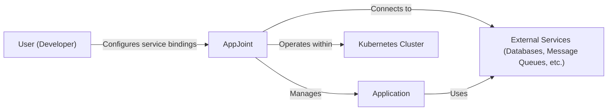
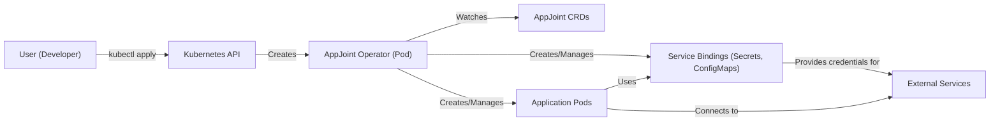
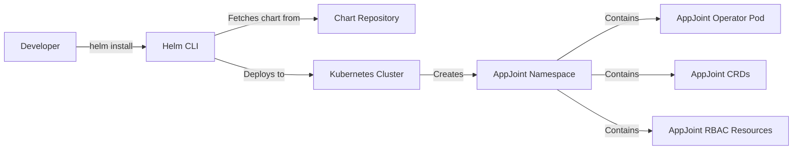
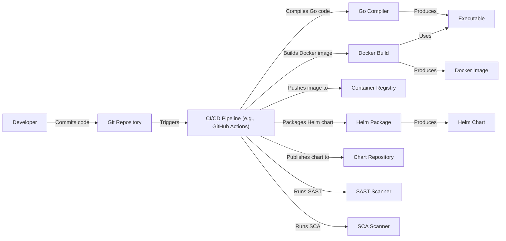

Okay, let's create a design document for the AppJoint project.

# BUSINESS POSTURE

AppJoint appears to be a relatively new project (based on commit history) aiming to simplify the integration of external services (like databases, message queues, etc.) into applications, particularly within Kubernetes environments. It seems targeted at developers looking for an easier way to manage service bindings without complex configuration.

Business Priorities:

*   Reduce developer friction when connecting applications to external services.
*   Improve portability and maintainability of applications by abstracting service connection details.
*   Potentially target cloud-native (Kubernetes) deployments.
*   Gain adoption and build a community around the project.

Business Goals:

*   Provide a user-friendly and efficient way to manage service bindings.
*   Support a variety of common services (databases, message queues, etc.).
*   Ensure the solution is robust and reliable.
*   Potentially offer commercial support or a managed service in the future.

Most Important Business Risks:

*   Low Adoption: If developers don't find AppJoint significantly easier or more beneficial than existing solutions, it won't gain traction.
*   Security Vulnerabilities: Given that AppJoint handles service credentials and connections, security vulnerabilities could expose sensitive data or compromise applications.
*   Lack of Service Support: If AppJoint doesn't support the services developers need, its utility is limited.
*   Maintenance Burden: If the project is not well-maintained, bugs and compatibility issues could arise, hindering adoption.
*   Competition: Existing solutions or new entrants in the market could overshadow AppJoint.

# SECURITY POSTURE

Existing Security Controls:

*   security control: Kubernetes RBAC: The project utilizes Kubernetes Role-Based Access Control (RBAC) to manage permissions within the cluster. (Implicit in Kubernetes deployment).
*   security control: Kubernetes Secrets: The project likely uses Kubernetes Secrets to store sensitive information like service credentials. (Inferred from the nature of the project).
*   security control: Go programming language: Using Go can provide some memory safety benefits compared to languages like C/C++. (Implicit in the codebase).
*   security control: Network Policies: Network policies are used to control traffic flow between pods. (Inferred from the nature of the project).

Accepted Risks:

*   accepted risk: Reliance on Kubernetes Security: The project's security heavily relies on the underlying Kubernetes cluster being properly configured and secured.
*   accepted risk: Operator Privileges: The AppJoint operator likely requires elevated privileges within the Kubernetes cluster to manage resources.
*   accepted risk: Third-Party Service Security: AppJoint connects to external services, and the security of those services is outside the project's direct control.
*   accepted risk: Supply Chain Security: Dependencies used by AppJoint could introduce vulnerabilities.

Recommended Security Controls:

*   security control: Implement a robust secrets management strategy. Consider integrating with external secret management solutions like HashiCorp Vault for enhanced security and auditability.
*   security control: Conduct regular security audits and penetration testing to identify and address potential vulnerabilities.
*   security control: Implement a Software Bill of Materials (SBOM) to track all dependencies and their versions, enabling faster response to disclosed vulnerabilities.
*   security control: Sign container images and verify signatures before deployment to ensure image integrity.
*   security control: Implement static code analysis (SAST) and dynamic application security testing (DAST) in the CI/CD pipeline.
*   security control: Implement runtime application self-protection (RASP) capabilities to detect and mitigate attacks at runtime.

Security Requirements:

*   Authentication:
    *   The AppJoint operator must authenticate securely with the Kubernetes API. (Existing control, using Kubernetes service accounts).
    *   Connections to external services must use strong authentication mechanisms (e.g., API keys, certificates).
*   Authorization:
    *   The AppJoint operator should have the minimum necessary permissions (principle of least privilege) within the Kubernetes cluster. (Existing control, using Kubernetes RBAC).
    *   Access to managed services should be controlled based on the application's needs.
*   Input Validation:
    *   All user-provided input (e.g., service configurations) must be strictly validated to prevent injection attacks or other vulnerabilities.
    *   Configuration files should be validated against a schema.
*   Cryptography:
    *   Sensitive data (e.g., credentials) must be encrypted at rest and in transit. (Existing control, using Kubernetes Secrets and TLS).
    *   Use strong, industry-standard cryptographic algorithms and protocols.
*   Auditing:
    *   All security-relevant events (e.g., successful and failed authentication attempts, configuration changes) should be logged and monitored.

# DESIGN

## C4 CONTEXT

Element Descriptions:

*   Element:
    *   Name: User (Developer)
    *   Type: Person
    *   Description: The developer who configures and uses AppJoint to connect their applications to external services.
    *   Responsibilities: Defines service bindings, deploys applications, interacts with AppJoint.
    *   Security controls: Authentication to Kubernetes cluster, RBAC within the cluster.

*   Element:
    *   Name: AppJoint
    *   Type: Software System
    *   Description: The core AppJoint system, responsible for managing service bindings and connecting applications to external services.
    *   Responsibilities: Parses service binding configurations, creates Kubernetes resources, manages connections to external services.
    *   Security controls: RBAC, Secrets management, input validation, secure communication with Kubernetes API and external services.

*   Element:
    *   Name: App
    *   Type: Software System
    *   Description: Application that is using AppJoint to connect to external services.
    *   Responsibilities: Business logic of application.
    *   Security controls: Network Policies, secure communication with external services.

*   Element:
    *   Name: External Services
    *   Type: Software System
    *   Description: External services (databases, message queues, etc.) that applications need to connect to.
    *   Responsibilities: Providing specific services (e.g., data storage, message brokering).
    *   Security controls: Authentication, authorization, encryption, network security (managed by the service provider).

*   Element:
    *   Name: Kubernetes Cluster
    *   Type: Software System
    *   Description: The Kubernetes cluster where AppJoint and the applications are deployed.
    *   Responsibilities: Orchestrating containers, managing resources, providing networking and security.
    *   Security controls: Kubernetes RBAC, network policies, pod security policies, secrets management.

## C4 CONTAINER

Element Descriptions:

*   Element:
    *   Name: User (Developer)
    *   Type: Person
    *   Description: The developer who configures and uses AppJoint.
    *   Responsibilities: Defines service bindings, deploys applications, interacts with AppJoint.
    *   Security controls: Authentication to Kubernetes cluster, RBAC within the cluster.

*   Element:
    *   Name: Kubernetes API
    *   Type: API
    *   Description: The Kubernetes API server.
    *   Responsibilities: Exposes the Kubernetes API, handles requests, manages cluster state.
    *   Security controls: TLS, authentication, authorization (RBAC).

*   Element:
    *   Name: AppJoint Operator (Pod)
    *   Type: Container
    *   Description: The core component of AppJoint, running as a Kubernetes pod.
    *   Responsibilities: Watches for AppJoint CRDs, creates and manages Kubernetes resources (pods, secrets, configmaps), handles service binding logic.
    *   Security controls: RBAC, secure communication with Kubernetes API, input validation.

*   Element:
    *   Name: AppJoint CRDs
    *   Type: Data
    *   Description: Custom Resource Definitions (CRDs) that define AppJoint's configuration objects (e.g., ServiceBindings).
    *   Responsibilities: Defining the schema for AppJoint configurations.
    *   Security controls: Schema validation.

*   Element:
    *   Name: Application Pods
    *   Type: Container
    *   Description: Pods running the user's application code.
    *   Responsibilities: Executing the application logic.
    *   Security controls: Network policies, secure communication with external services.

*   Element:
    *   Name: Service Bindings (Secrets, ConfigMaps)
    *   Type: Data
    *   Description: Kubernetes Secrets and ConfigMaps that store service connection information (credentials, endpoints, etc.).
    *   Responsibilities: Providing configuration data to application pods.
    *   Security controls: Kubernetes Secrets encryption, RBAC.

*   Element:
    *   Name: External Services
    *   Type: Software System
    *   Description: External services (databases, message queues, etc.).
    *   Responsibilities: Providing specific services.
    *   Security controls: Authentication, authorization, encryption, network security (managed by the service provider).

## DEPLOYMENT

Possible Deployment Solutions:

1.  Manual Deployment using `kubectl`.
2.  Helm Chart.
3.  GitOps with tools like ArgoCD or Flux.

Chosen Solution (for detailed description): Helm Chart

A Helm chart provides a convenient and repeatable way to deploy AppJoint to a Kubernetes cluster.

Element Descriptions:

*   Element:
    *   Name: Developer
    *   Type: Person
    *   Description: The developer deploying AppJoint.
    *   Responsibilities: Initiating the deployment using Helm.
    *   Security controls: Authentication to Kubernetes cluster, RBAC.

*   Element:
    *   Name: Helm CLI
    *   Type: Tool
    *   Description: The Helm command-line interface.
    *   Responsibilities: Managing Helm charts, interacting with the Kubernetes API.
    *   Security controls: TLS communication with the Kubernetes API.

*   Element:
    *   Name: Chart Repository
    *   Type: Repository
    *   Description: A repository hosting Helm charts (e.g., a public or private Helm repository).
    *   Responsibilities: Storing and serving Helm charts.
    *   Security controls: Access controls, potentially chart signing.

*   Element:
    *   Name: Kubernetes Cluster
    *   Type: Infrastructure
    *   Description: The target Kubernetes cluster.
    *   Responsibilities: Running the deployed resources.
    *   Security controls: Kubernetes security features (RBAC, network policies, etc.).

*   Element:
    *   Name: AppJoint Namespace
    *   Type: Namespace
    *   Description: A dedicated Kubernetes namespace for AppJoint resources.
    *   Responsibilities: Isolating AppJoint from other applications in the cluster.
    *   Security controls: RBAC, network policies.

*   Element:
    *   Name: AppJoint Operator Pod
    *   Type: Pod
    *   Description: The pod running the AppJoint operator.
    *   Responsibilities: Managing AppJoint resources.
    *   Security controls: RBAC, secure communication with the Kubernetes API.

*   Element:
    *   Name: AppJoint CRDs
    *   Type: CustomResourceDefinition
    *   Description: The Custom Resource Definitions for AppJoint.
    *   Responsibilities: Defining the AppJoint API objects.
    *   Security controls: Schema validation.

*   Element:
    *   Name: AppJoint RBAC Resources
    *   Type: Role, RoleBinding, ServiceAccount
    *   Description: RBAC resources (Role, RoleBinding, ServiceAccount) that grant AppJoint the necessary permissions.
    *   Responsibilities: Controlling AppJoint's access to Kubernetes resources.
    *   Security controls: Principle of least privilege.

## BUILD

The build process for AppJoint likely involves the following steps:

1.  Code Compilation: Compiling the Go code into an executable.
2.  Containerization: Building a Docker image containing the executable and any necessary dependencies.
3.  Image Pushing: Pushing the Docker image to a container registry.
4.  Chart Packaging: Packaging the Helm chart.
5.  Chart Publishing: Publishing the Helm chart to a chart repository.

Security Controls in Build Process:

*   security control: CI/CD Pipeline: Automating the build process ensures consistency and reduces the risk of manual errors. (e.g., GitHub Actions, Jenkins).
*   security control: SAST (Static Application Security Testing): Analyzing the source code for potential vulnerabilities. (e.g., GoSec).
*   security control: SCA (Software Composition Analysis): Identifying vulnerabilities in third-party dependencies. (e.g., Snyk, Dependabot).
*   security control: Container Image Scanning: Scanning the Docker image for known vulnerabilities. (e.g., Trivy, Clair).
*   security control: Signed Commits: Developers sign their commits to ensure code integrity and traceability.
*   security control: Least Privilege: The CI/CD pipeline should have the minimum necessary permissions to perform its tasks.

# RISK ASSESSMENT

Critical Business Processes:

*   Application Deployment: Ensuring applications can be deployed and connected to services reliably.
*   Service Binding Management: Providing a secure and efficient way to manage service connections.
*   Data Access: Protecting sensitive data accessed by applications through connected services.

Data Sensitivity:

*   Service Credentials: Highly sensitive. Compromise could lead to unauthorized access to external services and data breaches.
*   Application Configuration: Potentially sensitive, depending on the application. Could contain API keys, secrets, or other confidential information.
*   Application Data: Varies in sensitivity depending on the application. Could range from non-sensitive to highly sensitive (e.g., PII, financial data).

# QUESTIONS & ASSUMPTIONS

Questions:

*   What specific external services does AppJoint intend to support initially?
*   What is the expected scale of deployments (number of applications, services, clusters)?
*   Are there any specific compliance requirements (e.g., HIPAA, PCI DSS) that need to be considered?
*   What is the long-term vision for AppJoint (e.g., open-source project, commercial product)?
*   What level of logging and monitoring is planned for AppJoint itself?
*   How will updates and patching be handled for AppJoint and its dependencies?
*   What is the process for handling security vulnerabilities discovered in AppJoint?

Assumptions:

*   BUSINESS POSTURE: Assumes a relatively small, agile startup environment with a moderate risk appetite.
*   SECURITY POSTURE: Assumes a basic level of Kubernetes security is in place. Assumes developers are familiar with Kubernetes concepts.
*   DESIGN: Assumes a cloud-native (Kubernetes-centric) deployment model. Assumes the use of standard Kubernetes tools and practices.