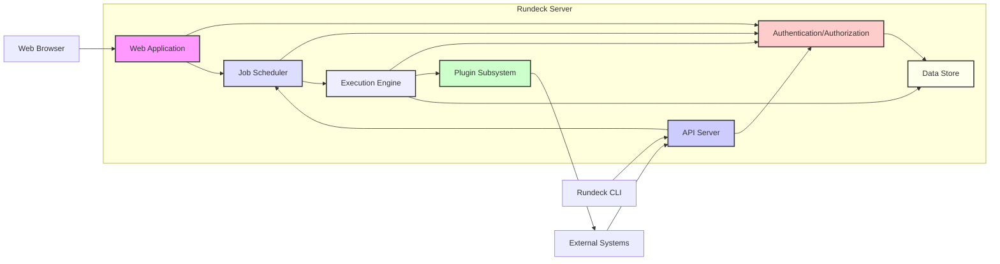

# Project Design Document: Rundeck Automation Platform

**Version:** 1.1
**Date:** October 26, 2023
**Author:** AI Software Architect

## 1. Introduction

This document provides a detailed architectural design of the Rundeck automation platform. It outlines the key components, their interactions, and the overall system architecture. This document serves as a foundation for subsequent threat modeling activities, ensuring a comprehensive understanding of the system's structure and potential vulnerabilities. This revision aims to provide more granular detail and clarity compared to the initial version.

## 2. Goals and Objectives

The primary goals of Rundeck are to:

- Provide a centralized, secure, and auditable platform for automating operational tasks across diverse environments.
- Enable self-service automation capabilities for authorized users, reducing reliance on specialized teams.
- Offer a flexible and intuitive user interface for defining, scheduling, and executing complex automation workflows (Jobs).
- Facilitate seamless integration with a wide range of infrastructure components, cloud services, and application platforms through its plugin architecture.
- Provide robust access control mechanisms and comprehensive auditing capabilities to ensure compliance and security.
- Foster collaboration and knowledge sharing among operations teams by centralizing automation definitions and execution history.

## 3. High-Level Architecture

Rundeck follows a client-server architecture. The core components include a central server that manages job definitions, execution, and user access, and various clients (web UI, CLI, API) that interact with the server.



## 4. Component Details

This section details the key components of the Rundeck architecture:

- **Web Application:**
    - Functionality: Serves as the primary user interface, built typically using web technologies. It allows users to interact with Rundeck for tasks such as:
        - Defining and managing Rundeck Projects.
        - Creating, editing, and deleting Job definitions.
        - Manually triggering Job executions and viewing their progress.
        - Managing node configurations and inventories.
        - Configuring system settings and user preferences.
        - Accessing execution history and reports.
    - Interactions: Communicates with the API Server via HTTP/HTTPS for all backend operations, sending requests and receiving data. Relies on the Authentication/Authorization component to verify user credentials and permissions before granting access to resources and functionalities.
    - Data Handled: Receives user input for job definitions (including scripts, workflows, and options), execution parameters, node filters, and system configurations. Renders data retrieved from the Data Store for display, such as job lists, execution logs, and node details.
    - Security Considerations:
        - Susceptible to common web application vulnerabilities like Cross-Site Scripting (XSS), Cross-Site Request Forgery (CSRF), and injection attacks if input is not properly handled.
        - Requires secure communication over HTTPS to protect sensitive data in transit (e.g., user credentials, job details).
        - Session management needs to be implemented securely to prevent session hijacking.

- **API Server:**
    - Functionality: Exposes a RESTful API (typically using JSON over HTTP/HTTPS) that provides a programmatic interface to Rundeck's functionalities. This allows:
        - The Web Application to perform backend operations.
        - The Rundeck CLI to interact with the server.
        - External systems and applications to integrate with Rundeck for automation purposes.
    - Interactions:
        - Receives requests from the Web Application, Rundeck CLI, and external systems.
        - Communicates with the Authentication/Authorization component to authenticate and authorize incoming requests.
        - Interacts with the Job Scheduler to schedule and manage job executions.
        - Communicates with the Execution Engine to initiate and monitor job execution processes.
        - Reads and writes data to the Data Store for persistence.
    - Data Handled:
        - Receives and processes API requests containing job definitions, execution commands, authentication tokens, and configuration data.
        - Returns responses containing job status, execution logs, lists of resources (jobs, nodes, executions), and error messages.
    - Security Considerations:
        - Requires robust authentication and authorization mechanisms (e.g., API keys, OAuth 2.0) to prevent unauthorized access and manipulation of resources.
        - Vulnerable to API-specific attacks such as injection flaws, broken authentication, excessive data exposure, and lack of resources & rate limiting.
        - Proper input validation and output encoding are crucial to prevent injection vulnerabilities.

- **Job Scheduler:**
    - Functionality: Responsible for managing the scheduling and execution of Rundeck Jobs. This includes:
        - Processing requests to schedule job executions based on defined schedules (cron-like expressions) or manual triggers.
        - Maintaining a queue of jobs to be executed.
        - Triggering the Execution Engine to initiate job execution at the appropriate time.
    - Interactions:
        - Receives job execution requests from the API Server and potentially internal components.
        - Interacts with the Authentication/Authorization component to ensure the user or system initiating the schedule has the necessary permissions.
        - Communicates with the Execution Engine to start job executions.
        - May interact with the Data Store to retrieve job schedules and update execution status.
    - Data Handled: Stores job schedules, execution triggers, and the current state of scheduled jobs.
    - Security Considerations:
        - Needs to ensure that only authorized jobs are scheduled and executed, preventing malicious or unintended automation.
        - Vulnerable to denial-of-service attacks if not properly configured to handle a large number of scheduled jobs.

- **Execution Engine:**
    - Functionality: The core component responsible for executing the steps defined within a Rundeck Job. This involves:
        - Interpreting the job definition and its steps.
        - Utilizing configured Node Executors (via the Plugin Subsystem) to connect to target nodes.
        - Executing commands or scripts on target nodes.
        - Collecting output and status from the executed steps.
        - Managing workflows and handling conditional logic within jobs.
    - Interactions:
        - Receives job execution instructions from the Job Scheduler.
        - Interacts with the Plugin Subsystem to utilize Node Executors and other plugins.
        - Connects to target nodes using configured protocols (e.g., SSH, WinRM, Ansible).
        - Writes execution logs and status updates to the Data Store.
    - Data Handled:
        - Processes job definitions, execution parameters, and node attributes.
        - Handles sensitive information such as credentials for accessing target nodes (ideally managed securely via credential providers or secrets management).
        - Collects and manages execution output, which may contain sensitive data.
    - Security Considerations:
        - A critical component for security, as it directly interacts with target systems.
        - Requires secure handling of credentials and secure communication with target nodes.
        - Highly vulnerable to command injection if job definitions or user-provided input are not properly sanitized.
        - Plugin security is paramount, as malicious plugins could compromise the Execution Engine and target systems.

- **Data Store:**
    - Functionality: Provides persistent storage for Rundeck's configuration, job definitions, execution history, user information, access control policies, and other persistent data. Typically implemented using a relational database (e.g., MySQL, PostgreSQL) or an embedded database (e.g., H2 for smaller deployments).
    - Interactions: Accessed by all other components for reading and writing data. The Authentication/Authorization component relies heavily on the Data Store for user and permission information.
    - Data Handled: Stores a wide range of sensitive information, including:
        - User credentials (hashed and salted).
        - Job definitions (which may contain sensitive logic or parameters).
        - Execution logs (which can contain sensitive output from executed commands).
        - API tokens and other authentication secrets.
        - Access control lists and role definitions.
    - Security Considerations:
        - Requires strong access controls at the database level to restrict access to authorized Rundeck components only.
        - Encryption at rest should be implemented to protect sensitive data stored in the database.
        - Vulnerable to SQL injection attacks if data access layers are not properly implemented and parameterized queries are not used.
        - Regular backups and disaster recovery plans are essential.

- **Authentication/Authorization:**
    - Functionality: Responsible for verifying the identity of users (authentication) and determining their access rights to Rundeck resources and functionalities (authorization). Supports various authentication mechanisms, including:
        - Local user accounts managed within Rundeck.
        - Integration with directory services like LDAP and Active Directory.
        - OAuth 2.0 and other single sign-on (SSO) providers.
    - Enforces access control policies based on roles, groups, and permissions defined within Rundeck.
    - Interactions:
        - Used by the Web Application, API Server, Job Scheduler, and other components to authenticate and authorize user actions and API requests.
        - Interacts with the Data Store to retrieve user credentials, roles, and permissions.
        - May interact with external authentication providers (e.g., LDAP servers) to verify user credentials.
    - Data Handled: Stores user credentials (hashed and salted), user roles, group memberships, and permission mappings.
    - Security Considerations:
        - A critical security component; vulnerabilities here can lead to unauthorized access and privilege escalation.
        - Vulnerable to brute-force attacks, credential stuffing, and authorization bypass if not properly implemented and configured.
        - Secure storage and handling of user credentials are paramount.
        - Proper session management and protection against session hijacking are essential.

- **Plugin Subsystem:**
    - Functionality: Provides an extensible architecture that allows developers to create and integrate plugins to extend Rundeck's functionality. Common plugin types include:
        - **Node Executors:** For executing commands on different types of target nodes (e.g., SSH, WinRM, Ansible).
        - **Notification Plugins:** For sending notifications about job execution status (e.g., email, Slack, PagerDuty).
        - **Log Appenders:** For routing execution logs to external systems.
        - **Resource Model Sources:** For dynamically discovering and managing node inventories.
        - **Authentication and Authorization Providers:** For integrating with custom authentication systems.
    - Interactions:
        - The Execution Engine utilizes Node Executor plugins to interact with target nodes.
        - Other components may interact with specific plugins to leverage their functionalities.
    - Data Handled: Varies depending on the specific plugin. May handle credentials, connection details, data exchanged with external systems, and configuration parameters.
    - Security Considerations:
        - Plugins represent a significant attack surface if not developed and managed securely.
        - Malicious or poorly written plugins can introduce vulnerabilities such as code execution, data leakage, or denial of service.
        - Requires a mechanism for verifying the authenticity and integrity of plugins.
        - Administrators should carefully review and approve plugins before installation.

- **Rundeck CLI:**
    - Functionality: A command-line interface that allows users to interact with the Rundeck API from their terminal. Provides functionalities for:
        - Managing projects, jobs, and executions.
        - Triggering job executions.
        - Viewing execution logs and status.
        - Automating Rundeck operations through scripting.
    - Interactions: Communicates with the API Server via HTTP/HTTPS, sending API requests and receiving responses.
    - Data Handled: Accepts user commands and displays output from the API Server. May handle API tokens or credentials for authentication.
    - Security Considerations:
        - Requires secure handling of API tokens or credentials used for authentication.
        - The system where the CLI is used needs to be secured to prevent unauthorized access to credentials.

- **External Systems:**
    - Functionality: Represents the target infrastructure, applications, and services that Rundeck automates. This can include:
        - Servers (physical or virtual).
        - Cloud platforms (AWS, Azure, GCP).
        - Databases.
        - Network devices.
        - Application servers.
        - Monitoring systems.
    - Interactions: Interacted with by the Execution Engine via configured Node Executors or other plugins.
    - Data Handled: Depends on the specific automation tasks being performed. May involve executing commands, transferring files, retrieving data, and configuring services.
    - Security Considerations:
        - Secure communication channels (e.g., SSH, HTTPS) and proper authentication/authorization are crucial when interacting with external systems.
        - Credentials used to access external systems must be managed securely.
        - The principle of least privilege should be applied when configuring access for Rundeck to external systems.

## 5. Data Flow

The following diagram illustrates a typical data flow for executing a Rundeck Job:

```mermaid
graph LR
    A["User (Web UI/CLI)"] --> B("API Server"): "Request Job Execution"
    B --> C("Authentication/Authorization"): "Verify User Permissions"
    C --> B: "Authorization Granted"
    B --> D("Job Scheduler"): "Schedule Job Execution"
    D --> E("Execution Engine"): "Initiate Job Execution"
    E --> F("Plugin Subsystem"): "Execute Steps on Target Nodes"
    F --> G["Target Nodes"]: "Execute Commands/Scripts"
    G --> F: "Return Output"
    F --> E: "Return Execution Status and Logs"
    E --> H("Data Store"): "Store Execution Logs and Status"
    H --> B: "Acknowledge Data Storage"
    B --> A: "Return Job Execution Status and Logs"
    style A fill:#fff,stroke:#333,stroke-width:2px
    style B fill:#ccf,stroke:#333,stroke-width:2px
    style C fill:#fcc,stroke:#333,stroke-width:2px
    style D fill:#ddf,stroke:#333,stroke-width:2px
    style E fill:#eef,stroke:#333,stroke-width:2px
    style F fill:#cfc,stroke:#333,stroke-width:2px
    style G fill:#bbb,stroke:#333,stroke-width:2px
    style H fill:#ffe,stroke:#333,stroke-width:2px
```

## 6. Security Considerations

This section outlines key security considerations for the Rundeck platform:

- **Authentication and Authorization:**
    - Enforce strong authentication mechanisms, such as multi-factor authentication (MFA), especially for privileged accounts.
    - Implement and regularly review role-based access control (RBAC) policies to ensure users have only the necessary permissions.
    - Enforce strong password policies, including complexity requirements and regular password rotation.
    - Securely manage API tokens and other authentication credentials.

- **Data Protection:**
    - Encrypt sensitive data at rest within the Data Store using appropriate encryption algorithms.
    - Protect data in transit using TLS/SSL for all communication channels, including web traffic and API requests.
    - Implement secure logging practices and protect audit logs from unauthorized access and modification.
    - Consider data masking or redaction for sensitive information in execution logs.

- **Input Validation and Sanitization:**
    - Implement robust input validation and sanitization techniques to prevent injection attacks (e.g., command injection, SQL injection) in job definitions, user inputs, and API requests.
    - Use parameterized queries when interacting with the Data Store.
    - Sanitize output to prevent cross-site scripting (XSS) vulnerabilities.

- **Secure Communication:**
    - Enforce HTTPS for all web traffic and API communication.
    - Use secure protocols (e.g., SSH with key-based authentication) for communication with target nodes.
    - Secure internal communication between Rundeck components.

- **Plugin Security:**
    - Establish a process for reviewing and validating plugins before deployment.
    - Only use trusted and verified plugins from reputable sources.
    - Implement mechanisms for managing plugin permissions and restricting their access to system resources.
    - Keep plugins updated to patch known vulnerabilities.

- **Auditing and Logging:**
    - Maintain comprehensive audit logs that record user actions, job executions, system events, and security-related activities.
    - Securely store audit logs and protect them from tampering.
    - Regularly review audit logs for suspicious activity.

- **Vulnerability Management:**
    - Implement a process for identifying, assessing, and remediating security vulnerabilities in Rundeck and its dependencies.
    - Regularly apply security patches and updates.
    - Conduct periodic security assessments and penetration testing.

- **Secrets Management:**
    - Utilize secure secrets management solutions (e.g., HashiCorp Vault, CyberArk) to store and manage sensitive credentials and API keys.
    - Avoid storing secrets directly in job definitions, configuration files, or code.
    - Implement the principle of least privilege when granting access to secrets.

- **Deployment Security:**
    - Secure the underlying infrastructure where Rundeck is deployed.
    - Implement network segmentation and firewalls to restrict access to Rundeck components.
    - Follow security best practices for the chosen deployment environment (on-premise, cloud, containerized).

## 7. Deployment Considerations

Rundeck can be deployed in various environments, each with its own security implications:

- **On-Premise:** Requires careful consideration of network security, physical security, and access control to the underlying infrastructure.
- **Cloud:** Leveraging cloud services can provide enhanced scalability and resilience, but requires proper configuration of cloud security controls (e.g., IAM roles, security groups, network policies). Consider using managed services where appropriate.
- **Containerized (Docker, Kubernetes):** Offers portability and scalability but introduces new security considerations related to container image security, orchestration platform security, and network policies within the cluster.

## 8. Future Considerations

- **Enhanced integration with external secrets management providers for more robust credential handling.**
- **Improved plugin security framework with automated scanning and verification processes.**
- **More granular and dynamic access control policies based on context and attributes.**
- **Advanced analytics and reporting capabilities for security monitoring and threat detection.**
- **Integration with security information and event management (SIEM) systems for centralized security logging and analysis.**
- **Support for immutable infrastructure and infrastructure-as-code (IaC) principles for more secure and repeatable deployments.**

This improved document provides a more detailed and comprehensive overview of the Rundeck architecture, offering a stronger foundation for subsequent threat modeling activities. The enhanced component descriptions and expanded security considerations aim to facilitate a more thorough identification of potential vulnerabilities and attack vectors.