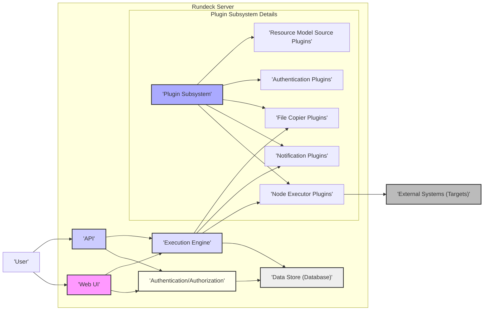

## Project Design Document: Rundeck for Threat Modeling (Improved)

**1. Introduction**

This document provides an enhanced architectural overview of Rundeck, an open-source automation platform, specifically tailored for subsequent threat modeling activities. It builds upon the previous version by providing more granular details about components, their interactions, and data flows, with a stronger emphasis on security-relevant aspects. This document aims to be a comprehensive and accurate representation of the system's architecture, facilitating a thorough security analysis.

**2. Project Overview**

Rundeck is a versatile job scheduler and runbook automation system designed for DevOps and IT operations. It empowers users to define, schedule, and execute automated tasks across diverse systems and infrastructure. Key features include:

*   Centralized definition and management of automation jobs.
*   Robust access control mechanisms for jobs, nodes, and other resources.
*   Sophisticated workflow orchestration capabilities with conditional logic, error handling, and looping constructs.
*   Extensive integration capabilities with a wide array of infrastructure providers, cloud platforms, and third-party tools via a plugin architecture.
*   Real-time monitoring of job executions with detailed logging and reporting.
*   User-friendly web interface and comprehensive RESTful API for programmatic interaction.

**3. Architecture Overview**

Rundeck employs a client-server architecture where various components collaborate to manage job definitions, scheduling, and execution. The following diagram illustrates the high-level architecture:

**4. Key Components**

*   **Web UI:**
    *   Provides a browser-based graphical interface for user interaction.
    *   Facilitates job creation, editing, and manual execution.
    *   Displays real-time job execution status, logs, and history.
    *   Enables management of user accounts, roles, and permissions.
    *   Built using web technologies, typically Java-based frameworks and JavaScript.

*   **API:**
    *   Offers a RESTful API for programmatic access and integration with other systems.
    *   Supports various operations, including job management, execution control, node inventory access, and user administration.
    *   Typically uses JSON or XML for request and response payloads.
    *   Authentication and authorization are enforced for all API endpoints.

*   **Execution Engine:**
    *   The central component responsible for processing and orchestrating job executions.
    *   Manages job scheduling based on defined triggers (time-based, event-based, or manual).
    *   Interprets job definitions, including workflow steps and node targeting.
    *   Dispatches tasks to appropriate Node Executor plugins.
    *   Handles error conditions, retries, and workflow branching logic.
    *   Collects and manages execution logs.

*   **Data Store (Database):**
    *   Persistently stores Rundeck's configuration and operational data.
    *   Contains sensitive information such as:
        *   Job definitions (including potentially embedded credentials or sensitive parameters).
        *   Execution history and logs.
        *   User accounts, roles, and permissions.
        *   Node definitions and associated attributes.
        *   Audit logs of user actions and system events.
        *   Potentially encrypted credentials for accessing target systems.
    *   Supports various relational database systems (e.g., H2, MySQL, PostgreSQL).

*   **Authentication/Authorization:**
    *   Manages user authentication and access control.
    *   Supports multiple authentication mechanisms:
        *   Local user accounts.
        *   LDAP (Lightweight Directory Access Protocol).
        *   Active Directory.
        *   Single Sign-On (SSO) protocols (e.g., SAML, OAuth 2.0) via plugins.
        *   API Key authentication.
    *   Enforces role-based access control (RBAC) to restrict access to jobs, nodes, and other resources based on user roles and permissions.

*   **Plugin Subsystem:**
    *   Provides an extensible architecture for integrating with external systems and extending Rundeck's functionality.
    *   Key plugin types include:
        *   **Node Executor Plugins:** Responsible for executing commands on target nodes (e.g., SSH, WinRM, Ansible).
        *   **Notification Plugins:** Used for sending notifications about job execution status (e.g., email, Slack, PagerDuty).
        *   **File Copier Plugins:** Facilitate transferring files to and from target nodes (e.g., SCP, SFTP).
        *   **Authentication Plugins:** Extend the available authentication mechanisms.
        *   **Resource Model Source Plugins:** Provide dynamic node inventory from external sources (e.g., cloud providers, CMDBs).
    *   Plugins execute within the Rundeck server process and have access to Rundeck's internal APIs.

*   **External Systems (Targets):**
    *   The remote systems and infrastructure that Rundeck manages and automates.
    *   Can be servers, virtual machines, cloud instances, network devices, applications, etc.
    *   Rundeck interacts with these systems using protocols defined by the configured Node Executor plugins.

**5. Data Flow (Detailed)**

Here are more detailed descriptions of key data flows within the Rundeck system, highlighting security implications:

*   **User Login via Web UI:**
    *   User submits login credentials (username/password).
    *   The Web UI sends the credentials to the Authentication/Authorization component.
    *   The Authentication/Authorization component verifies the credentials against the configured authentication source (local store, LDAP, etc.).
    *   Upon successful authentication, a session ID is generated and stored (typically in a cookie).
    *   Authorization checks are performed to determine the user's roles and permissions.
    *   The Web UI displays content based on the user's authorized access.

*   **API Request with Authentication:**
    *   Client sends an API request with authentication credentials (e.g., API key in the header or OAuth 2.0 token).
    *   The API component forwards the credentials to the Authentication/Authorization component.
    *   The Authentication/Authorization component validates the credentials.
    *   Authorization checks are performed to verify if the authenticated user/system has permission to access the requested resource or perform the requested action.
    *   The API processes the request and returns a response.

*   **Job Execution Workflow:**
    *   A job execution is triggered (manually or scheduled).
    *   The Execution Engine retrieves the job definition from the Data Store.
    *   For each step in the workflow:
        *   The Execution Engine determines the target nodes based on the job definition.
        *   The appropriate Node Executor plugin is selected based on the node's configuration.
        *   The Execution Engine securely passes necessary information (including potentially credentials) to the plugin.
        *   The Node Executor plugin establishes a connection to the target node (e.g., via SSH).
        *   The plugin executes the defined command or script on the target node.
        *   Output and error streams are captured and returned to the Execution Engine.
    *   The Execution Engine updates the job execution status and logs in the Data Store.
    *   Notification plugins may be triggered to send alerts based on execution status.

*   **Access Control for Job Modification:**
    *   A user attempts to create or modify a job definition via the Web UI or API.
    *   The request is intercepted by the Authentication/Authorization component.
    *   Authorization checks are performed to ensure the user has the necessary permissions to modify jobs.
    *   If authorized, the job definition is stored or updated in the Data Store.

**6. Security Considerations (Detailed)**

This section expands on the preliminary security considerations, providing more specific examples and categorizations:

*   **Authentication and Authorization:**
    *   **Vulnerable Authentication Mechanisms:** Weak password policies, lack of multi-factor authentication (MFA), vulnerabilities in SSO integration.
    *   **Authorization Bypass:** Flaws in the RBAC implementation allowing unauthorized access to jobs or nodes.
    *   **Session Management Issues:** Session fixation, session hijacking, insecure session storage.
    *   **API Key Management:** Exposure or compromise of API keys.

*   **Data Security:**
    *   **Sensitive Data at Rest:** Lack of encryption for sensitive data in the Data Store (e.g., credentials, API keys, sensitive job parameters).
    *   **Sensitive Data in Transit:** Unencrypted communication between Rundeck components or between Rundeck and target systems.
    *   **Logging of Sensitive Information:** Accidental logging of passwords or other sensitive data.
    *   **Backup Security:** Insecure storage or access control for Rundeck backups.

*   **Web UI Security:**
    *   **Cross-Site Scripting (XSS):** Vulnerabilities allowing attackers to inject malicious scripts into web pages viewed by other users.
    *   **Cross-Site Request Forgery (CSRF):** Exploiting user sessions to perform unauthorized actions.
    *   **Insecure Direct Object References (IDOR):** Allowing access to resources by manipulating object identifiers.
    *   **Clickjacking:** Tricking users into clicking unintended links or buttons.

*   **API Security:**
    *   **Broken Authentication/Authorization:** Missing or weak authentication and authorization checks for API endpoints.
    *   **Excessive Data Exposure:** API endpoints returning more data than necessary.
    *   **Lack of Input Validation:** Allowing injection attacks (e.g., SQL injection, command injection) through API parameters.
    *   **Rate Limiting and Denial of Service (DoS):** Lack of mechanisms to prevent API abuse.

*   **Plugin Security:**
    *   **Vulnerable Plugins:** Exploitable vulnerabilities in third-party plugins.
    *   **Malicious Plugins:** Plugins designed to compromise the Rundeck server or target systems.
    *   **Excessive Plugin Permissions:** Plugins granted more permissions than necessary.
    *   **Insecure Plugin Communication:** Vulnerabilities in how Rundeck interacts with plugins.

*   **Execution Security:**
    *   **Command Injection:** Vulnerabilities in job definitions allowing attackers to execute arbitrary commands on target systems.
    *   **Credential Management:** Insecure storage or handling of credentials used to access target systems.
    *   **Log Forgery/Tampering:** Ability for malicious actors to manipulate execution logs.
    *   **Unintended Actions:** Jobs performing actions beyond their intended scope due to misconfiguration or vulnerabilities.

*   **Infrastructure Security:**
    *   **Operating System and Network Vulnerabilities:** Exploitable flaws in the underlying infrastructure.
    *   **Insecure Deployment Configurations:** Misconfigured firewalls, exposed ports, weak security settings.
    *   **Lack of Security Hardening:** Missing security patches, default configurations.

**7. Deployment Model Security Implications**

The chosen deployment model significantly impacts the security landscape:

*   **Standalone Server:**  A single point of failure and a concentrated attack surface. Security relies heavily on the host system's security.
*   **Clustered Deployment:** Introduces complexities in securing inter-node communication. Requires secure shared storage and synchronization mechanisms.
*   **Containerized Deployment:** Security depends on the container image's security, the container runtime environment, and the orchestration platform's security.
*   **Cloud-Based Deployment:** Security is a shared responsibility model. Requires careful configuration of cloud services and adherence to security best practices provided by the cloud provider.

**8. Assumptions and Constraints**

*   This design document assumes a reasonably standard deployment of Rundeck. Highly customized deployments may have additional security considerations.
*   The focus is primarily on the Rundeck application itself. The security of the underlying operating systems, networks, and target systems are considered external dependencies.
*   Threat modeling activities will utilize this document as a foundation for identifying specific threats and vulnerabilities.

**9. Conclusion**

This improved design document provides a more detailed and security-focused architectural overview of Rundeck. By elaborating on the components, data flows, and potential security considerations, it aims to facilitate a more comprehensive and effective threat modeling process. This detailed understanding is crucial for identifying and mitigating potential vulnerabilities, ensuring the security and integrity of the automation platform and the systems it manages.