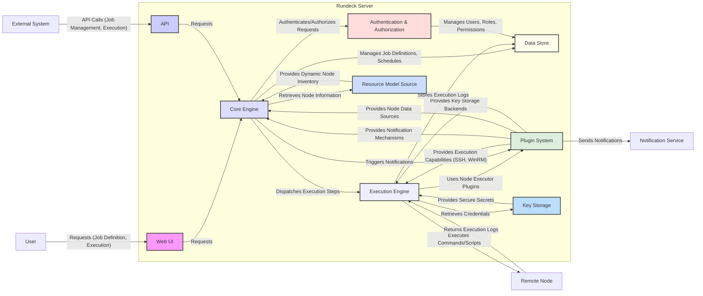

# Project Design Document: Rundeck

**Version:** 1.1
**Date:** October 26, 2023
**Author:** AI Software Architect

## 1. Introduction

This document provides a detailed design overview of the Rundeck project, an open-source automation service. This document is intended to serve as a foundation for subsequent threat modeling activities. It outlines the key components, their interactions, data flows, and security considerations within the Rundeck ecosystem, with a focus on aspects relevant to security analysis.

## 2. Goals

* Provide a comprehensive and detailed architectural overview of Rundeck.
* Clearly identify key components and their specific responsibilities and interactions.
* Describe the primary data flows within the system, highlighting sensitive data paths.
* Highlight important security considerations and potential threats relevant for threat modeling.
* Serve as a precise and reliable reference point for security analysis and risk assessment.

## 3. Target Audience

This document is intended for:

* Security engineers and architects involved in threat modeling and security assessments.
* Developers working on or integrating with Rundeck, requiring a deep understanding of its architecture.
* Operations teams responsible for deploying, managing, and securing Rundeck instances.

## 4. Project Overview

Rundeck is a web-based automation service that empowers users to define, schedule, and execute automated tasks (Jobs) across a diverse and distributed infrastructure. It provides a centralized platform for orchestrating operational workflows, enabling self-service automation for various teams and reducing manual effort. Rundeck focuses on operational automation, allowing users to codify operational procedures and delegate their execution securely.

## 5. System Architecture

Rundeck's architecture is modular and comprises the following key components, each with specific responsibilities:

* **Web User Interface (UI):**
    * Presents a graphical interface for user interaction with Rundeck functionalities.
    * Enables users to create, edit, and manage Job definitions, projects, and nodes.
    * Displays real-time execution status, historical logs, and reports.
    * Manages user roles, permissions, and access control policies through interactive elements.
* **Application Programming Interface (API):**
    * Offers a programmatic interface for interacting with Rundeck's core functionalities.
    * Facilitates integration with external systems, CI/CD pipelines, and other automation tools.
    * Supports various authentication methods, including API tokens, basic authentication, and potentially OAuth 2.0.
    * Provides endpoints for managing Jobs, executions, nodes, projects, and system configurations.
* **Core Engine:**
    * Serves as the central orchestrator and decision-making unit of Rundeck.
    * Manages the lifecycle of Job definitions, including storage, retrieval, and versioning.
    * Handles Job scheduling based on defined schedules or triggers.
    * Receives and processes Job execution requests from the UI or API.
    * Enforces access control policies before initiating any action.
    * **Dispatcher:** A sub-component responsible for distributing Job execution steps to the appropriate Execution Engine.
* **Execution Engine:**
    * Responsible for the actual execution of the steps defined within a Job.
    * Establishes connections to target nodes using configured plugins (e.g., SSH, WinRM).
    * Executes commands or scripts on remote nodes within a defined security context.
    * Manages the execution context, including environment variables and working directories.
    * Streams execution logs back to the Core Engine for persistence and display.
* **Data Store:**
    * Persistently stores Rundeck's operational data and configuration.
    * Includes Job definitions, execution history and logs, user and role information, project configurations, node definitions, and system settings.
    * Typically implemented using a relational database system like H2 (for small deployments), MySQL, or PostgreSQL.
    * Data at rest may contain sensitive information requiring appropriate encryption.
* **Authentication and Authorization Module:**
    * Manages user identities and authenticates users attempting to access Rundeck.
    * Supports various authentication mechanisms, including local user accounts, LDAP, Active Directory, PAM, and potentially OAuth 2.0.
    * Enforces role-based access control (RBAC), defining permissions for different users and groups based on their assigned roles within specific projects.
* **Plugin System:**
    * Provides a modular architecture for extending Rundeck's core functionalities.
    * Supports various plugin types, including:
        * **Node Executors:**  Responsible for executing commands on remote nodes (e.g., SSH, WinRM, Ansible).
        * **Notification Plugins:**  Enable sending notifications upon Job completion or failure (e.g., email, Slack, PagerDuty).
        * **Resource Model Sources:**  Provide dynamic information about target nodes (e.g., files, cloud provider APIs, CMDBs).
        * **Key Storage Providers:**  Securely store and retrieve sensitive credentials (e.g., JCEKS, HashiCorp Vault, CyberArk).
        * **Workflow Step Plugins:**  Extend the available actions within a Job workflow.
* **Resource Model Source:**
    * Provides a dynamic inventory of target nodes where Jobs can be executed.
    * Can be configured to retrieve node information from static files, cloud provider APIs (AWS EC2, Azure VMs, GCP Compute Engine), configuration management databases (CMDBs), or other dynamic sources.
    * Node information typically includes hostname, IP address, operating system, and other relevant attributes.
* **Key Storage:**
    * Securely stores sensitive information such as passwords, SSH private keys, API tokens, and other secrets required for Job execution.
    * Provides an API for authorized components (primarily the Execution Engine) to retrieve stored keys.
    * Supports various storage backends, offering different levels of security and management capabilities. Access control to the Key Storage is critical.

## 6. Data Flow

The following outlines the primary data flows within Rundeck, highlighting the components involved and the type of data being transferred:

* **Job Definition Creation/Update:**
    * User interacts with the **Web UI** or sends a request to the **API**.
    * The **Core Engine** receives the Job definition data.
    * The **Core Engine** authenticates and authorizes the request via the **Authentication and Authorization Module**.
    * The Job definition is stored in the **Data Store**.
* **Job Execution Request Initiation:**
    * User initiates a Job execution through the **Web UI** or sends a request to the **API**.
    * The request is received by the **Core Engine**.
* **Authentication and Authorization for Execution:**
    * The **Core Engine** verifies the user's identity and permissions against the **Authentication and Authorization Module**. This includes checking if the user has permission to execute the specific Job in the relevant project.
* **Node Selection and Contextualization:**
    * The **Core Engine** queries the configured **Resource Model Source** to determine the target nodes for the Job execution based on the Job definition's node filters.
    * The **Core Engine** prepares the execution context, including variables and options.
* **Execution Dispatch and Orchestration:**
    * The **Core Engine's Dispatcher** assigns the execution to an available **Execution Engine**.
* **Remote Execution and Command Delivery:**
    * The **Execution Engine** connects to the target nodes using the appropriate **Node Executor Plugin** (e.g., SSH).
    * The **Execution Engine** retrieves necessary credentials from the **Key Storage** if required for authentication on the remote node.
    * Commands or scripts defined in the Job steps are securely transmitted and executed on the **Remote Node**.
* **Execution Logging and Streaming:**
    * Execution logs are generated on the **Remote Node** and streamed back to the **Execution Engine**.
    * The **Execution Engine** forwards the logs to the **Core Engine**.
    * The **Core Engine** stores the execution logs in the **Data Store**.
    * The **Web UI** can retrieve and display these logs in real-time.
* **Notification Delivery:**
    * Upon Job completion, failure, or other defined triggers, the **Core Engine** utilizes configured **Notification Plugins** to send notifications to external services (e.g., email servers, Slack APIs).
* **Plugin Installation/Update:**
    * An administrator uploads or installs a plugin through the **Web UI** or potentially via a command-line interface.
    * The plugin file is stored on the Rundeck server.
    * The **Core Engine** or a dedicated plugin management component loads and initializes the plugin.

## 7. Security Considerations

The following security aspects are critical for threat modeling Rundeck and understanding potential vulnerabilities:

* **Authentication and Authorization:**
    * **Threats:** Brute-force attacks against login forms, credential stuffing, unauthorized API access, privilege escalation.
    * **Considerations:** Strength of password policies, enforcement of multi-factor authentication (MFA), secure storage of user credentials (hashing and salting), proper management and rotation of API tokens, granularity and effectiveness of RBAC implementation, auditing of authentication attempts and authorization decisions.
* **Input Validation:**
    * **Threats:** Command injection, SQL injection, cross-site scripting (XSS), path traversal vulnerabilities.
    * **Considerations:** Rigorous validation and sanitization of all user inputs received through the Web UI and API, especially within Job definitions, script content, and node filters. Use of parameterized queries for database interactions. Encoding output to prevent XSS.
* **Secrets Management:**
    * **Threats:** Exposure of sensitive credentials stored in the Data Store or Key Storage, unauthorized access to secrets, insecure transmission of secrets.
    * **Considerations:** Secure storage of secrets at rest using encryption, access control mechanisms for the Key Storage, secure retrieval and handling of secrets by the Execution Engine, secure transmission of secrets over the network (e.g., using HTTPS), lifecycle management of secrets (rotation, revocation).
* **Execution Security:**
    * **Threats:** Unauthorized command execution on remote nodes, compromised remote nodes affecting Rundeck, man-in-the-middle attacks during communication with remote nodes.
    * **Considerations:** Secure configuration of Node Executor plugins (e.g., using SSH key-based authentication instead of passwords), secure communication protocols (e.g., SSH, WinRM over HTTPS), proper management of SSH keys, restricting the user context under which commands are executed on remote nodes (least privilege principle), auditing of executed commands.
* **Plugin Security:**
    * **Threats:** Malicious or vulnerable plugins introducing security flaws, insecure plugin updates, compromised plugin repositories.
    * **Considerations:** Validation and auditing of plugin code before installation, secure mechanisms for plugin installation and updates, restricting plugin installation to authorized administrators, monitoring for known vulnerabilities in installed plugins, using plugins from trusted sources.
* **API Security:**
    * **Threats:** Unauthorized access to API endpoints, API abuse, data breaches through API vulnerabilities.
    * **Considerations:** Secure authentication and authorization for API requests (e.g., API tokens, OAuth 2.0), rate limiting and request throttling to prevent abuse, input validation for all API endpoints, secure transmission of API requests and responses (HTTPS), proper error handling to avoid information leakage.
* **Web UI Security:**
    * **Threats:** Cross-site scripting (XSS), cross-site request forgery (CSRF), session hijacking, clickjacking.
    * **Considerations:** Implementation of security headers (e.g., Content Security Policy, HTTP Strict Transport Security), secure session management (e.g., using secure and HTTP-only cookies), protection against CSRF attacks (e.g., using anti-CSRF tokens), input validation and output encoding to prevent XSS.
* **Logging and Auditing:**
    * **Threats:** Insufficient logging hindering incident response, tampering with audit logs, unauthorized access to audit logs.
    * **Considerations:** Comprehensive logging of user actions, Job executions, system events, and security-related events, secure storage and access control to audit logs, regular review of audit logs for suspicious activity, integration with security information and event management (SIEM) systems.
* **Network Security:**
    * **Threats:** Unauthorized access to the Rundeck server, network sniffing, denial-of-service attacks.
    * **Considerations:** Secure network configuration and firewall rules to restrict access to the Rundeck server, use of network segmentation, encryption of network traffic (TLS/SSL), protection against common network attacks.
* **Data Store Security:**
    * **Threats:** Unauthorized access to sensitive data stored in the database, data breaches, data integrity issues.
    * **Considerations:** Secure configuration of the database server, access control mechanisms for the database, encryption of data at rest and in transit, regular backups and disaster recovery mechanisms, patching database vulnerabilities.
* **Operating System and Infrastructure Security:**
    * **Threats:** Vulnerabilities in the underlying operating system or infrastructure components, misconfigurations.
    * **Considerations:** Regular patching and updates of the operating system and other software components, secure configuration of the server environment, hardening of the operating system, implementing appropriate security controls at the infrastructure level.

## 8. Deployment Considerations

Rundeck's deployment architecture significantly impacts its security posture:

* **On-Premise:** Requires careful consideration of network security, physical security, and infrastructure management. Security responsibilities are primarily with the deploying organization.
* **Cloud-Based:** Leveraging cloud provider security services (e.g., firewalls, identity management) is crucial. Security responsibilities are shared between the cloud provider and the deploying organization. Specific cloud service configurations (e.g., EC2 instance security groups, Azure network security groups) are vital.
* **Containerized:** Requires securing the container images, the container runtime environment (e.g., Docker), and the orchestration platform (e.g., Kubernetes). Security considerations include image scanning, access control to the container registry, and network policies within the cluster.

## 9. Technologies Used

* **Programming Languages:** Java, Groovy
* **Web Technologies:** HTML, CSS, JavaScript
* **Frameworks:** Spring Boot, Grails
* **Data Stores:** H2 (default for small deployments), MySQL, PostgreSQL
* **Communication Protocols:** HTTP/HTTPS, SSH, WinRM
* **Plugin Interfaces:** Java-based

## 10. Future Considerations

* **Clustering and High Availability:** Implementing secure communication and data synchronization between cluster nodes. Securely managing shared secrets and configurations.
* **Integration with Identity Providers:** Ensuring secure and reliable integration with external identity providers (e.g., SAML, OAuth 2.0) for authentication and authorization.
* **Advanced Security Features:** Exploring and implementing features like secrets scanning within Job definitions, vulnerability management for Rundeck components and plugins, and integration with security scanning tools.

This document provides a comprehensive and detailed understanding of the Rundeck project's architecture and security considerations, serving as a robust foundation for thorough threat modeling and security assessments.