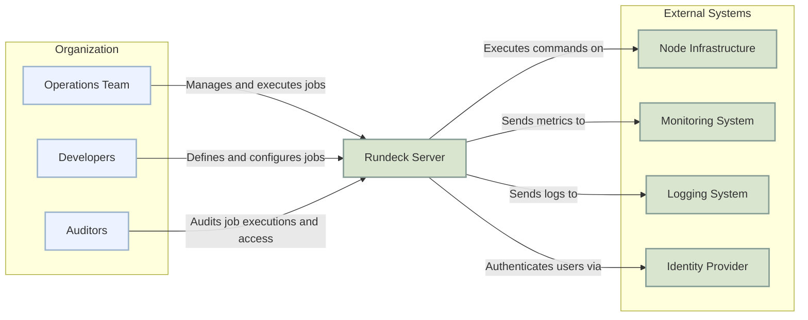
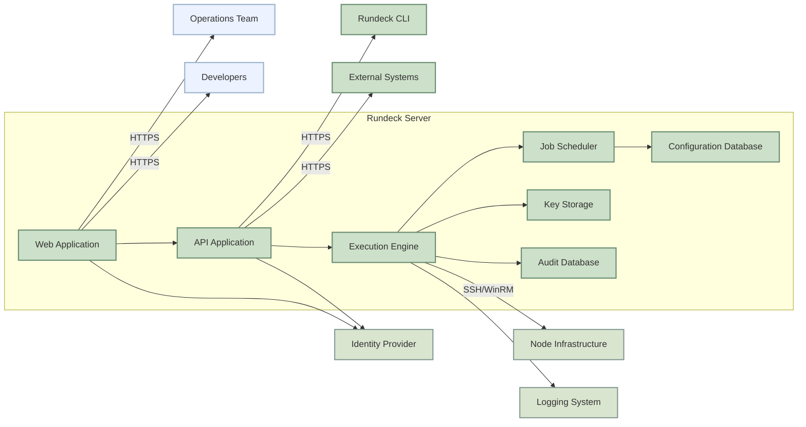
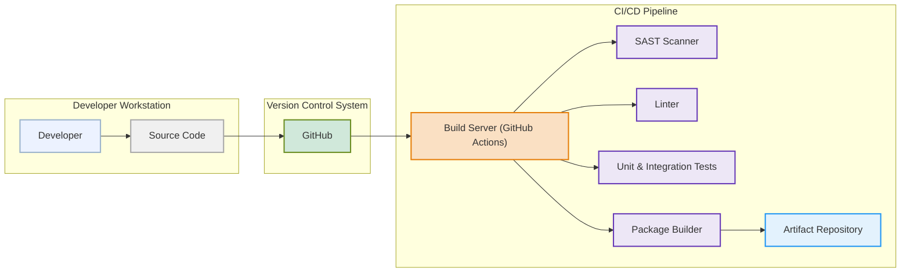

# BUSINESS POSTURE

Rundeck is an open-source automation platform designed to enable self-service operations and runbook automation. It aims to improve operational efficiency, reduce manual tasks, and empower teams to manage their infrastructure and applications more effectively.

- Business priorities and goals:
  - Improve operational efficiency by automating routine tasks.
  - Reduce manual errors and inconsistencies in operations.
  - Enable self-service operations for different teams, reducing dependencies on central operations teams.
  - Enhance auditability and control over operational processes.
  - Provide a centralized platform for managing and executing operational workflows across diverse environments.

- Most important business risks:
  - Operational disruption due to misconfigured or malicious automation workflows.
  - Unauthorized access to sensitive systems and data through Rundeck.
  - Data breaches or leaks due to insecure handling of credentials and sensitive information within automation workflows.
  - System downtime or performance degradation caused by resource exhaustion or mismanaged automation jobs.
  - Compliance violations if Rundeck is not properly secured and audited, especially in regulated industries.

# SECURITY POSTURE

- Security controls:
  - security control: Authentication and authorization mechanisms to control access to Rundeck and its functionalities. (Implemented within Rundeck application)
  - security control: Role-Based Access Control (RBAC) to manage user permissions and access to projects and resources. (Implemented within Rundeck application)
  - security control: Secure storage of credentials and secrets used in automation workflows. (Implemented within Rundeck application, using Key Storage)
  - security control: Audit logging of user actions and job executions for monitoring and compliance. (Implemented within Rundeck application)
  - security control: HTTPS for web interface to protect communication between users and Rundeck server. (Deployment configuration)
  - security control: Input validation to prevent injection attacks in job definitions and workflow parameters. (Implemented within Rundeck application)
  - security control: Secure software development lifecycle practices, including code reviews and testing. (Development process, see GitHub repository history and community practices)
  - security control: Regular security updates and patching of Rundeck software and underlying operating systems. (Operational procedure)

- Accepted risks:
  - accepted risk: Potential vulnerabilities in third-party libraries and dependencies used by Rundeck. (Mitigated by dependency scanning and updates)
  - accepted risk: Risk of insider threats or compromised accounts with excessive privileges. (Mitigated by RBAC and audit logging)
  - accepted risk: Complexity of managing and securing a distributed automation platform across diverse environments. (Mitigated by proper design and operational procedures)

- Recommended security controls:
  - security control: Implement a Web Application Firewall (WAF) in front of Rundeck web interface to protect against common web attacks.
  - security control: Integrate with a centralized Identity Provider (IdP) for user authentication (e.g., LDAP, Active Directory, SAML, OAuth).
  - security control: Implement secrets management solution external to Rundeck for storing and retrieving sensitive credentials.
  - security control: Conduct regular penetration testing and vulnerability assessments of Rundeck deployment.
  - security control: Implement security scanning in CI/CD pipeline for Rundeck code and configurations.

- Security requirements:
  - Authentication:
    - Requirement: Securely authenticate users accessing Rundeck web interface and API.
    - Requirement: Support multi-factor authentication (MFA) for enhanced security.
    - Requirement: Integrate with enterprise identity providers for centralized user management.
  - Authorization:
    - Requirement: Implement fine-grained role-based access control (RBAC) to manage user permissions.
    - Requirement: Control access to projects, jobs, nodes, and other Rundeck resources based on user roles.
    - Requirement: Enforce least privilege principle for user access.
  - Input validation:
    - Requirement: Validate all user inputs, including job definitions, workflow parameters, and API requests.
    - Requirement: Sanitize inputs to prevent injection attacks (e.g., command injection, SQL injection, cross-site scripting).
    - Requirement: Implement input validation on both client-side and server-side.
  - Cryptography:
    - Requirement: Use strong encryption algorithms for storing sensitive data, such as credentials in Key Storage.
    - Requirement: Protect sensitive data in transit using HTTPS for web interface and API communication.
    - Requirement: Consider encryption at rest for Rundeck data storage.

# DESIGN

## C4 CONTEXT



- Context Diagram Elements:
  - - Name: Operations Team
    - Type: Person
    - Description: Team responsible for day-to-day operations, incident response, and routine maintenance tasks. They use Rundeck to execute automated jobs for these activities.
    - Responsibilities:
      - Execute pre-defined automation jobs.
      - Monitor job execution status and logs.
      - Trigger ad-hoc jobs for operational tasks.
    - Security controls:
      - Role-Based Access Control (RBAC) within Rundeck to limit access to specific projects and jobs.
      - Multi-Factor Authentication (MFA) for Rundeck login.
      - Audit logging of job executions and user actions.
  - - Name: Developers
    - Type: Person
    - Description: Development teams responsible for application development and deployment. They use Rundeck to automate deployment pipelines, environment provisioning, and application management tasks.
    - Responsibilities:
      - Define and configure automation jobs for deployment and application management.
      - Integrate Rundeck into CI/CD pipelines.
      - Test and validate automation workflows.
    - Security controls:
      - Role-Based Access Control (RBAC) within Rundeck to control access to job definitions and configurations.
      - Version control for job definitions and configurations.
      - Code review process for job definitions.
  - - Name: Auditors
    - Type: Person
    - Description: Security and compliance team responsible for auditing system access, job executions, and overall security posture of the automation platform.
    - Responsibilities:
      - Review audit logs for compliance and security monitoring.
      - Investigate security incidents related to Rundeck.
      - Ensure Rundeck adheres to security policies and regulations.
    - Security controls:
      - Dedicated audit logging and reporting features within Rundeck.
      - Read-only access to audit logs and job execution history.
      - Secure storage and retention of audit logs.
  - - Name: Rundeck Server
    - Type: Software System
    - Description: The central Rundeck server application that orchestrates and executes automation jobs. It provides a web interface and API for users to interact with the system.
    - Responsibilities:
      - Job scheduling and execution.
      - Workflow orchestration.
      - User authentication and authorization.
      - Credential management (Key Storage).
      - Audit logging.
      - Web UI and API access.
    - Security controls:
      - Authentication and authorization mechanisms.
      - Role-Based Access Control (RBAC).
      - Secure credential storage (Key Storage).
      - Audit logging.
      - Input validation.
      - HTTPS for web interface and API.
  - - Name: Node Infrastructure
    - Type: Software System
    - Description: The target infrastructure (servers, virtual machines, cloud instances, network devices, etc.) that Rundeck manages and automates.
    - Responsibilities:
      - Execute commands and scripts initiated by Rundeck.
      - Provide access for Rundeck to manage and monitor resources.
    - Security controls:
      - Network segmentation to isolate Rundeck and managed nodes.
      - Secure communication protocols (e.g., SSH, WinRM) for Rundeck to connect to nodes.
      - Node authentication and authorization mechanisms.
      - Hardening of node operating systems and applications.
  - - Name: Monitoring System
    - Type: Software System
    - Description: External monitoring system used to collect metrics and monitor the health and performance of Rundeck server and executed jobs.
    - Responsibilities:
      - Collect metrics from Rundeck server.
      - Monitor job execution status and performance.
      - Alert on anomalies and failures.
    - Security controls:
      - Secure API for Rundeck to send metrics to the monitoring system.
      - Access control to monitoring data.
  - - Name: Logging System
    - Type: Software System
    - Description: Centralized logging system used to collect and store audit logs and application logs from Rundeck server and potentially from executed jobs.
    - Responsibilities:
      - Collect audit logs from Rundeck server.
      - Store and manage logs for auditing and security analysis.
      - Provide search and analysis capabilities for logs.
    - Security controls:
      - Secure API for Rundeck to send logs to the logging system.
      - Access control to log data.
      - Log data integrity and retention policies.
  - - Name: Identity Provider
    - Type: Software System
    - Description: External Identity Provider (e.g., LDAP, Active Directory, SAML, OAuth) used for user authentication to Rundeck.
    - Responsibilities:
      - User authentication and identity management.
      - Provide authentication services to Rundeck.
    - Security controls:
      - Secure authentication protocols (e.g., SAML, OAuth).
      - Strong password policies and account management.
      - Multi-Factor Authentication (MFA).

## C4 CONTAINER



- Container Diagram Elements:
  - - Name: Web Application
    - Type: Container
    - Description: Provides the web-based user interface for Rundeck. Allows users to manage projects, define jobs, execute jobs, and view results. Built using a web framework (e.g., Grails).
    - Responsibilities:
      - Present user interface for Rundeck functionalities.
      - Handle user authentication and authorization via API Application.
      - Interact with API Application to perform actions.
    - Security controls:
      - HTTPS for all web traffic.
      - Session management and security.
      - Input validation on web forms.
      - Protection against common web vulnerabilities (e.g., XSS, CSRF).
  - - Name: API Application
    - Type: Container
    - Description: Provides a RESTful API for programmatic access to Rundeck functionalities. Used by the Web Application, CLI, and external systems. Built using a web framework (e.g., Grails).
    - Responsibilities:
      - Expose Rundeck functionalities through a RESTful API.
      - Handle authentication and authorization for API requests.
      - Interact with Execution Engine and other internal components.
    - Security controls:
      - HTTPS for all API traffic.
      - API authentication and authorization (e.g., API keys, tokens).
      - Input validation for API requests.
      - Rate limiting and throttling to prevent abuse.
  - - Name: Execution Engine
    - Type: Container
    - Description: The core component responsible for executing automation jobs and workflows. Manages job execution, workflow orchestration, and interaction with nodes. Written in Java.
    - Responsibilities:
      - Job execution and workflow orchestration.
      - Node communication and command execution (via SSH/WinRM).
      - Credential retrieval from Key Storage.
      - Logging job execution details to Audit Database and Logging System.
      - Interaction with Job Scheduler.
    - Security controls:
      - Secure credential handling and retrieval from Key Storage.
      - Secure communication with nodes (SSH/WinRM).
      - Input validation for job definitions and workflow steps.
      - Resource management and isolation for job executions.
  - - Name: Job Scheduler
    - Type: Container
    - Description: Schedules jobs to be executed at specific times or intervals. Triggers job executions based on defined schedules. Part of the Execution Engine.
    - Responsibilities:
      - Job scheduling and triggering.
      - Managing job schedules and dependencies.
      - Interacting with Execution Engine to initiate job executions.
    - Security controls:
      - Access control to job schedules.
      - Audit logging of schedule changes and job triggers.
  - - Name: Key Storage
    - Type: Container
    - Description: Secure storage for credentials, secrets, and other sensitive information used in automation workflows. Provides an encrypted storage mechanism.
    - Responsibilities:
      - Securely store credentials and secrets.
      - Provide API for retrieving credentials for job executions.
      - Encryption of stored data.
      - Access control to stored credentials.
    - Security controls:
      - Encryption at rest for stored data.
      - Access control to credentials based on roles and projects.
      - Audit logging of credential access and modifications.
  - - Name: Audit Database
    - Type: Container
    - Description: Database used to store audit logs, job execution history, and user activity logs. Used for auditing, monitoring, and compliance purposes.
    - Type: Database (e.g., embedded H2, external database like MySQL, PostgreSQL)
    - Responsibilities:
      - Store audit logs and job execution history.
      - Provide data for audit reporting and security analysis.
    - Security controls:
      - Access control to audit data.
      - Data integrity and retention policies.
      - Encryption at rest for audit data (if required).
  - - Name: Configuration Database
    - Type: Container
    - Description: Database used to store Rundeck configuration, project definitions, job definitions, and user configurations.
    - Type: Database (e.g., embedded H2, external database like MySQL, PostgreSQL)
    - Responsibilities:
      - Store Rundeck configuration data.
      - Store project and job definitions.
      - Store user configurations and RBAC settings.
    - Security controls:
      - Access control to configuration data.
      - Data integrity and backup procedures.
      - Encryption at rest for configuration data (if required).
  - - Name: Rundeck CLI
    - Type: Container
    - Description: Command-line interface for interacting with Rundeck API. Allows users to manage Rundeck from the command line.
    - Responsibilities:
      - Provide command-line access to Rundeck functionalities.
      - Interact with Rundeck API.
    - Security controls:
      - Secure storage of CLI credentials.
      - HTTPS communication with Rundeck API.
      - User authentication and authorization via API.
  - - Name: External Systems
    - Type: Container
    - Description: Represents external systems that integrate with Rundeck API, such as CI/CD pipelines, orchestration tools, or other automation platforms.
    - Responsibilities:
      - Integrate with Rundeck API to trigger jobs or manage Rundeck resources.
    - Security controls:
      - Secure API integration with Rundeck API (HTTPS, API keys/tokens).
      - Proper authentication and authorization when interacting with Rundeck API.

## DEPLOYMENT

Deployment Solution: **On-Premise Deployment on Virtual Machines**

```mermaid
flowchart LR
    subgraph "Load Balancer Layer"
    LB["Load Balancer"]:::deployment_node
    end

    subgraph "Application Layer"
    RS1["Rundeck Server 1"]:::deployment_node
    RS2["Rundeck Server 2"]:::deployment_node
    end

    subgraph "Database Layer"
    DB["Database Server"]:::deployment_node
    end

    subgraph "Node Infrastructure"
    N1["Node 1"]:::deployment_node
    N2["Node 2"]:::deployment_node
    "...":::deployment_node
    NN["Node N"]:::deployment_node
    end

    U["Users"] --> LB -- HTTPS --> RS1 & RS2
    RS1 & RS2 --> DB
    RS1 & RS2 -- SSH/WinRM --> N1 & N2 & "..." & NN

    classDef deployment_node fill:#E8E0F3,stroke:#9775FA,stroke-width:2px
```

- Deployment Diagram Elements:
  - - Name: Load Balancer
    - Type: Deployment Node (Virtual Machine or Hardware Appliance)
    - Description: Distributes incoming HTTPS traffic across multiple Rundeck Server instances for high availability and scalability.
    - Responsibilities:
      - Load balancing of web traffic.
      - SSL termination.
      - Health checks for Rundeck Servers.
    - Security controls:
      - HTTPS termination and encryption.
      - Web Application Firewall (WAF) capabilities (optional).
      - Access control to load balancer management interface.
  - - Name: Rundeck Server 1 & Rundeck Server 2
    - Type: Deployment Node (Virtual Machines)
    - Description: Instances of Rundeck Server application deployed on virtual machines. Run the Web Application, API Application, Execution Engine, and Job Scheduler containers.
    - Responsibilities:
      - Run Rundeck application components.
      - Process user requests and API calls.
      - Execute automation jobs.
    - Security controls:
      - Hardened operating system.
      - Security patches and updates.
      - Network segmentation.
      - Access control to server instances.
      - Intrusion Detection/Prevention System (IDS/IPS) (optional).
  - - Name: Database Server
    - Type: Deployment Node (Virtual Machine or Dedicated Database Server)
    - Description: Dedicated database server hosting the Configuration Database and Audit Database for Rundeck. Can be an external database like MySQL, PostgreSQL, or a managed database service.
    - Responsibilities:
      - Host Rundeck databases.
      - Ensure database availability and performance.
      - Data backup and recovery.
    - Security controls:
      - Database access control and authentication.
      - Database encryption at rest and in transit.
      - Regular database backups.
      - Hardened database server operating system.
      - Network segmentation.
  - - Name: Node 1, Node 2, ..., Node N
    - Type: Deployment Node (Physical Servers, Virtual Machines, Cloud Instances)
    - Description: Represents the target infrastructure being managed by Rundeck. Can be a mix of different operating systems and environments.
    - Responsibilities:
      - Execute commands and scripts initiated by Rundeck.
      - Provide access for Rundeck to manage resources.
    - Security controls:
      - Node authentication and authorization.
      - Secure communication protocols (SSH/WinRM).
      - Hardened operating systems and applications.
      - Network segmentation.
      - Regular security patching.

## BUILD



- Build Process Elements:
  - - Name: Developer
    - Type: Person
    - Description: Software developer who writes and modifies the Rundeck source code.
    - Responsibilities:
      - Write and commit code changes.
      - Perform local testing.
      - Code reviews (part of development process, not explicitly in build).
    - Security controls:
      - Secure workstation.
      - Code review process.
      - Access control to source code repository.
  - - Name: Source Code
    - Type: Artifact
    - Description: Rundeck source code written in Java, Groovy, and other languages. Stored in a version control system.
    - Responsibilities:
      - Represent the codebase of Rundeck.
    - Security controls:
      - Version control (Git).
      - Access control to repository.
      - Branching and merging strategies.
  - - Name: GitHub
    - Type: VCS (Version Control System)
    - Description: GitHub repository hosting the Rundeck source code. Used for version control, collaboration, and triggering CI/CD pipelines.
    - Responsibilities:
      - Source code version control.
      - Collaboration platform.
      - Trigger CI/CD pipelines on code changes.
    - Security controls:
      - Access control to repository (authentication and authorization).
      - Audit logging of repository actions.
      - Branch protection rules.
  - - Name: Build Server (GitHub Actions)
    - Type: CI/CD
    - Description: GitHub Actions workflow configured to automatically build, test, and package Rundeck upon code changes.
    - Responsibilities:
      - Automate build process.
      - Run security scans (SAST, linters).
      - Execute unit and integration tests.
      - Package Rundeck artifacts.
    - Security controls:
      - Secure build environment.
      - Access control to CI/CD configuration.
      - Audit logging of build process.
      - Secrets management for build credentials.
  - - Name: SAST Scanner
    - Type: Tool
    - Description: Static Application Security Testing (SAST) tool used to scan the source code for potential security vulnerabilities.
    - Responsibilities:
      - Identify potential security vulnerabilities in code.
      - Report findings to developers.
    - Security controls:
      - Regularly updated vulnerability rules.
      - Secure configuration of SAST tool.
  - - Name: Linter
    - Type: Tool
    - Description: Code linter used to enforce code style and quality standards. Can also detect potential code defects.
    - Responsibilities:
      - Enforce code quality and style guidelines.
      - Detect potential code defects and inconsistencies.
    - Security controls:
      - Secure configuration of linter.
  - - Name: Unit & Integration Tests
    - Type: Tool
    - Description: Automated unit and integration tests to verify the functionality and correctness of the code.
    - Responsibilities:
      - Verify code functionality.
      - Detect regressions.
    - Security controls:
      - Secure test environment.
      - Test data management.
  - - Name: Package Builder
    - Type: Tool
    - Description: Tool used to package the built artifacts into distributable formats (e.g., JAR, WAR, DEB, RPM).
    - Responsibilities:
      - Package Rundeck artifacts.
      - Create release packages.
    - Security controls:
      - Secure packaging process.
      - Signing of release packages (optional).
  - - Name: Artifact Repository
    - Type: Artifact Repository
    - Description: Repository for storing and managing built artifacts (e.g., JAR, WAR, DEB, RPM). Can be a service like Maven Central, JFrog Artifactory, or GitHub Packages.
    - Responsibilities:
      - Store and manage Rundeck artifacts.
      - Provide access to artifacts for deployment.
    - Security controls:
      - Access control to artifact repository.
      - Integrity checks for artifacts.
      - Audit logging of artifact access.

# RISK ASSESSMENT

- Critical business processes we are trying to protect:
  - Automated operational tasks and workflows. Disruption of these processes can lead to service outages, delays in incident response, and increased manual effort.
  - Access to managed infrastructure and applications. Unauthorized access through Rundeck can lead to data breaches, system compromise, and operational disruption.
  - Credential management for automation. Compromised credentials can be used to gain unauthorized access to managed systems.
  - Auditability and compliance of operational processes. Lack of proper auditing can lead to compliance violations and difficulty in incident investigation.

- Data we are trying to protect and their sensitivity:
  - Credentials and secrets stored in Key Storage. These are highly sensitive as they provide access to managed systems.
  - Audit logs and job execution history. Sensitive as they may contain information about operational activities and potential security incidents.
  - Rundeck configuration data, including job definitions and project settings. Sensitive as misconfiguration can lead to security vulnerabilities or operational issues.
  - Data processed within automation workflows. Sensitivity depends on the specific workflows, but may include sensitive application data, infrastructure configurations, or user information.

# QUESTIONS & ASSUMPTIONS

- Questions:
  - What is the expected scale of Rundeck deployment (number of users, jobs, managed nodes)?
  - What are the specific compliance requirements for Rundeck deployment (e.g., PCI DSS, HIPAA, GDPR)?
  - What is the organization's risk tolerance for operational disruptions and security incidents?
  - What existing security infrastructure and tools are available for integration with Rundeck (e.g., WAF, IdP, SIEM, secrets management)?
  - What is the process for managing and updating Rundeck and its dependencies?

- Assumptions:
  - Rundeck will be deployed in a typical enterprise environment with a need for high availability and security.
  - The organization has a dedicated operations team and development teams who will use Rundeck.
  - Security is a high priority for the organization, and they are willing to invest in security controls for Rundeck.
  - Rundeck will be integrated with existing monitoring and logging systems.
  - The organization has a process for managing user identities and access control.