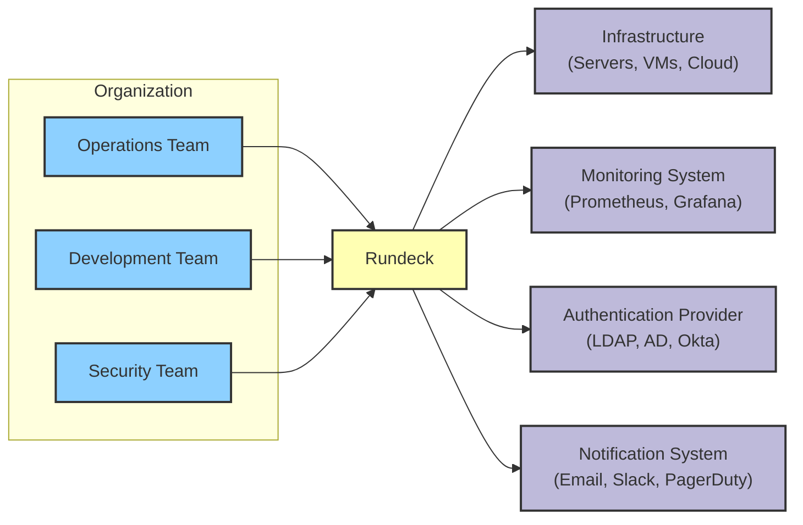
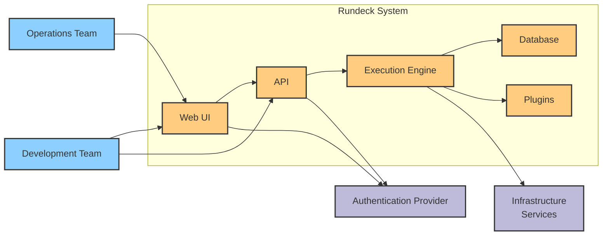
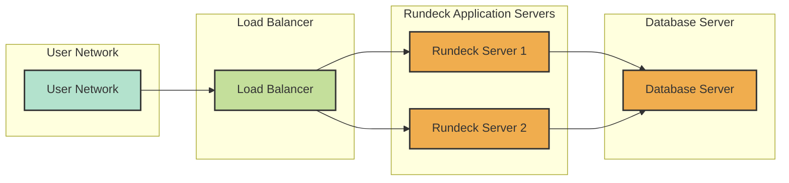
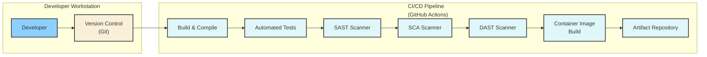

# BUSINESS POSTURE

- Business Priorities and Goals:
  - Goal: Provide a self-service automation platform for operations and development teams.
  - Goal: Enable efficient and reliable execution of operational tasks and workflows.
  - Goal: Improve system uptime and reduce manual errors through automation.
  - Priority: Operational efficiency and automation.
  - Priority: Reliability and consistency of operations.
  - Priority: Self-service capabilities for authorized users.

- Business Risks:
  - Risk: Unauthorized access to automation workflows could lead to unintended system changes or data breaches.
  - Risk: Misconfigured or vulnerable automation jobs could disrupt critical systems or processes.
  - Risk: Data breaches through compromised credentials or insecure storage of sensitive information used in automation.
  - Risk: System unavailability due to software vulnerabilities or infrastructure failures affecting automation execution.
  - Risk: Compliance violations if automation processes do not adhere to regulatory requirements or internal policies.

# SECURITY POSTURE

- Existing Security Controls:
  - security control: Authentication mechanisms for user login (username/password, LDAP, Active Directory, etc.) - Implemented in Rundeck core and configurable via settings.
  - security control: Authorization model based on roles and access control lists (ACLs) to manage user permissions - Implemented in Rundeck core and configurable via project settings and ACL files.
  - security control: Input validation on user inputs and API requests to prevent injection attacks - Implemented throughout Rundeck codebase.
  - security control: Secure communication channels (HTTPS) for web UI and API access - Configurable via web server settings.
  - security control: Audit logging of user actions and system events for monitoring and incident response - Implemented in Rundeck core and configurable via logging settings.
  - security control: Password encryption for stored credentials and sensitive data - Implemented in Rundeck core using encryption mechanisms.
  - security control: Secure software development lifecycle practices are likely followed by the open-source project, including code reviews and testing, though specific details are not provided in the repository.
  - security control: Deployment model is flexible, allowing users to deploy Rundeck in various environments (on-premise, cloud) based on their security requirements.

- Accepted Risks:
  - accepted risk: Potential vulnerabilities in open-source dependencies used by Rundeck.
  - accepted risk: Misconfigurations by users leading to insecure deployments or access control issues.
  - accepted risk: Reliance on user-provided plugins which might introduce security vulnerabilities if not properly vetted.
  - accepted risk: Complexity of ACL management potentially leading to overly permissive or restrictive access controls.

- Recommended Security Controls:
  - security control: Implement automated Static Application Security Testing (SAST) and Dynamic Application Security Testing (DAST) in the development pipeline to identify and remediate vulnerabilities early.
  - security control: Implement Software Composition Analysis (SCA) to continuously monitor and manage open-source dependencies for known vulnerabilities.
  - security control: Implement robust secrets management practices for storing and accessing credentials used in automation jobs, potentially using dedicated secrets management solutions.
  - security control: Regularly conduct security audits and penetration testing to identify and address security weaknesses in Rundeck deployments.
  - security control: Implement security awareness training for Rundeck users and administrators to promote secure usage and configuration practices.

- Security Requirements:
  - Authentication:
    - requirement: Strong authentication mechanisms to verify user identities before granting access to Rundeck.
    - requirement: Support for multi-factor authentication (MFA) to enhance login security.
    - requirement: Integration with existing identity providers (LDAP, Active Directory, SAML, OAuth) for centralized user management.
  - Authorization:
    - requirement: Granular role-based access control (RBAC) to manage user permissions and restrict access to specific projects, jobs, and resources.
    - requirement: Policy-based authorization to enforce fine-grained access control based on attributes and context.
    - requirement: Least privilege principle should be applied when assigning permissions to users and roles.
  - Input Validation:
    - requirement: Comprehensive input validation for all user inputs and API requests to prevent injection attacks (SQL injection, command injection, cross-site scripting).
    - requirement: Input sanitization and encoding to mitigate risks associated with untrusted data.
    - requirement: Use of secure coding practices to avoid common input validation vulnerabilities.
  - Cryptography:
    - requirement: Use of strong encryption algorithms for protecting sensitive data at rest and in transit.
    - requirement: Secure storage and management of cryptographic keys.
    - requirement: Proper implementation of cryptographic protocols (HTTPS, TLS) for secure communication.
    - requirement: Hashing and salting of passwords for secure storage.

# DESIGN

- C4 CONTEXT

  - C4 Context Elements:
    - - Name: Operations Team
      - Type: Person
      - Description: Team responsible for day-to-day operations, incident response, and infrastructure management. They use Rundeck to automate operational tasks.
      - Responsibilities: Automating operational workflows, managing infrastructure, responding to incidents, using Rundeck for self-service operations.
      - Security controls: Role-based access control within Rundeck, authentication via organization's identity provider.
    - - Name: Development Team
      - Type: Person
      - Description: Team responsible for developing and deploying applications. They use Rundeck for automating deployment pipelines and development-related tasks.
      - Responsibilities: Automating application deployments, managing development environments, using Rundeck for CI/CD workflows.
      - Security controls: Role-based access control within Rundeck, authentication via organization's identity provider.
    - - Name: Security Team
      - Type: Person
      - Description: Team responsible for ensuring the security of systems and applications. They may use Rundeck for security automation tasks and monitoring.
      - Responsibilities: Security monitoring, vulnerability management, security automation, auditing Rundeck configurations and usage.
      - Security controls: Role-based access control within Rundeck, access to Rundeck audit logs, security configuration reviews.
    - - Name: Rundeck
      - Type: Software System
      - Description: Open-source automation platform that allows users to define, schedule, and execute automated workflows across various systems and infrastructure.
      - Responsibilities: Orchestrating automation workflows, managing job definitions, executing jobs, providing a web UI and API for user interaction, logging and auditing.
      - Security controls: Authentication, authorization, input validation, secure configuration management, audit logging, encryption of sensitive data.
    - - Name: Infrastructure (Servers, VMs, Cloud)
      - Type: External System
      - Description: The underlying infrastructure where applications and Rundeck itself are deployed. This includes servers, virtual machines, cloud instances, and network components.
      - Responsibilities: Hosting Rundeck application, executing automated tasks triggered by Rundeck, providing resources for automation workflows.
      - Security controls: Infrastructure security controls (firewalls, intrusion detection systems, access control lists), operating system hardening, security patching.
    - - Name: Monitoring System (Prometheus, Grafana)
      - Type: External System
      - Description: System used for monitoring the health and performance of Rundeck and the infrastructure it manages.
      - Responsibilities: Monitoring Rundeck application and infrastructure, collecting metrics and logs, providing dashboards and alerts.
      - Security controls: Access control to monitoring dashboards and data, secure communication channels for data collection.
    - - Name: Authentication Provider (LDAP, AD, Okta)
      - Type: External System
      - Description: External system used for authenticating users accessing Rundeck.
      - Responsibilities: User authentication, identity management, providing user credentials to Rundeck.
      - Security controls: Authentication provider's security controls (MFA, password policies, access control), secure communication protocols (LDAP over TLS, SAML, OAuth).
    - - Name: Notification System (Email, Slack, PagerDuty)
      - Type: External System
      - Description: System used by Rundeck to send notifications about job executions, alerts, and other events.
      - Responsibilities: Sending notifications to users or teams based on Rundeck events.
      - Security controls: Secure configuration of notification channels, access control to notification settings.

- C4 CONTAINER

  - C4 Container Elements:
    - - Name: Web UI
      - Type: Container
      - Description: Provides a graphical user interface for users to interact with Rundeck, define jobs, execute workflows, and view results.
      - Responsibilities: User interface for Rundeck, job definition and management, workflow execution initiation, displaying job results, user authentication and authorization (delegated to API).
      - Security controls: HTTPS for web traffic, session management, input validation on UI inputs, integration with API for secure backend communication.
    - - Name: API
      - Type: Container
      - Description: Provides a RESTful API for programmatic access to Rundeck functionalities, allowing integration with other systems and automation tools.
      - Responsibilities: Exposing Rundeck functionalities via API endpoints, handling API requests, authentication and authorization for API access, communication with Execution Engine.
      - Security controls: API authentication (API keys, tokens, session-based), authorization checks for API requests, input validation on API requests, rate limiting, secure API design principles.
    - - Name: Execution Engine
      - Type: Container
      - Description: The core component of Rundeck responsible for processing job definitions, orchestrating workflow execution, and interacting with target systems.
      - Responsibilities: Job execution orchestration, workflow management, scheduling jobs, interacting with plugins, managing job state, logging job execution details.
      - Security controls: Secure job execution environment, access control to job definitions and execution, secure communication with plugins and target systems, input validation for job parameters.
    - - Name: Database
      - Type: Container
      - Description: Stores Rundeck configuration data, job definitions, execution history, user information, and other persistent data.
      - Responsibilities: Persistent storage for Rundeck data, data integrity and availability, providing data access to other Rundeck components.
      - Security controls: Database access control, encryption at rest for sensitive data, database hardening, regular backups, secure database configuration.
    - - Name: Plugins
      - Type: Container
      - Description: Extensible components that provide integrations with various systems, technologies, and services, extending Rundeck's capabilities.
      - Responsibilities: Integrating with external systems, providing custom steps and functionalities for automation workflows.
      - Security controls: Plugin vetting and validation, secure plugin development practices, isolation of plugin execution, access control to plugin installation and configuration.

- DEPLOYMENT

  - Deployment Architecture Options:
    - Option 1: On-Premise Deployment - Rundeck deployed on servers within the organization's own data center.
    - Option 2: Cloud Deployment - Rundeck deployed on cloud infrastructure (e.g., AWS, Azure, GCP) using virtual machines or containers.
    - Option 3: Hybrid Deployment - Combination of on-premise and cloud components, with Rundeck potentially managing resources across both environments.

  - Detailed Deployment Architecture (On-Premise - Example):

  - Deployment Elements (On-Premise - Example):
    - - Name: Load Balancer
      - Type: Infrastructure
      - Description: Distributes incoming user traffic across multiple Rundeck application servers for high availability and scalability.
      - Responsibilities: Load balancing web traffic, SSL termination, health checks for Rundeck servers.
      - Security controls: HTTPS termination, DDoS protection, access control lists, security hardening.
    - - Name: Rundeck Server 1 & 2
      - Type: Server
      - Description: Instances of the Rundeck application running on dedicated servers. These servers host the Web UI, API, and Execution Engine containers.
      - Responsibilities: Hosting Rundeck application, processing user requests, executing automation workflows.
      - Security controls: Operating system hardening, security patching, firewall rules, intrusion detection system, access control to server resources.
    - - Name: Database Server
      - Type: Server
      - Description: Dedicated server hosting the database system used by Rundeck to store persistent data.
      - Responsibilities: Database management, data storage and retrieval, ensuring database availability and integrity.
      - Security controls: Database access control, database hardening, encryption at rest, regular backups, security patching, firewall rules.
    - - Name: User Network
      - Type: Network
      - Description: The network from which users access the Rundeck web UI and API.
      - Responsibilities: Providing network connectivity for users to access Rundeck.
      - Security controls: Network segmentation, firewall rules, intrusion prevention system, network monitoring.

- BUILD

  - Build Process:
    - Developer commits code changes to Version Control (Git).
    - CI/CD Pipeline (e.g., GitHub Actions) is triggered upon code commit.
    - Build & Compile step compiles the source code and builds the application.
    - Automated Tests step executes unit tests, integration tests, and other automated tests.
    - SAST Scanner (Static Application Security Testing) step performs static code analysis to identify potential security vulnerabilities in the source code.
    - SCA Scanner (Software Composition Analysis) step scans dependencies for known vulnerabilities.
    - DAST Scanner (Dynamic Application Security Testing) step performs dynamic analysis on a deployed instance to find runtime vulnerabilities.
    - Container Image Build step builds container images (if applicable) for deployment.
    - Artifact Repository step publishes build artifacts (binaries, container images, etc.) to an artifact repository.

  - Build Security Controls:
    - security control: Version control system (Git) to track code changes and ensure code integrity.
    - security control: Automated CI/CD pipeline to automate build, test, and deployment processes, reducing manual errors.
    - security control: Static Application Security Testing (SAST) to identify vulnerabilities in source code.
    - security control: Software Composition Analysis (SCA) to manage and monitor open-source dependencies for vulnerabilities.
    - security control: Dynamic Application Security Testing (DAST) to find runtime vulnerabilities in deployed application.
    - security control: Automated testing (unit, integration, security tests) to ensure code quality and security.
    - security control: Secure build environment to protect build infrastructure and artifacts.
    - security control: Artifact signing and verification to ensure artifact integrity and authenticity.
    - security control: Access control to CI/CD pipeline and artifact repository to restrict unauthorized access and modifications.

# RISK ASSESSMENT

- Critical Business Processes:
  - Automation of critical operational tasks (e.g., system restarts, deployments, backups).
  - Incident response and remediation workflows.
  - Self-service operations for authorized users.
  - Scheduled maintenance and system administration tasks.

- Data Sensitivity:
  - High Sensitivity: Credentials (passwords, API keys, SSH keys) used in automation jobs.
  - Medium Sensitivity: Job definitions and workflow configurations, which may contain sensitive information or business logic.
  - Medium Sensitivity: Audit logs, which may contain user actions and system events relevant to security and compliance.
  - Low Sensitivity: System configuration data, application logs (excluding sensitive information).

# QUESTIONS & ASSUMPTIONS

- Questions:
  - What specific authentication providers are currently integrated with Rundeck in the target environment?
  - What is the current level of RBAC implementation and granularity within Rundeck?
  - Are there any specific compliance requirements (e.g., PCI DSS, HIPAA, GDPR) that Rundeck needs to adhere to?
  - What is the organization's risk appetite regarding open-source software and third-party plugins?
  - What are the existing monitoring and logging solutions in place that Rundeck needs to integrate with?
  - What is the process for managing secrets and credentials used in automation jobs?
  - What is the current security awareness level of Rundeck users and administrators?

- Assumptions:
  - Rundeck is intended to be used in an enterprise environment with a need for robust security and access control.
  - The organization values data confidentiality, integrity, and availability for its systems and operations.
  - Standard security best practices are desired for the deployment and operation of Rundeck.
  - The organization has existing infrastructure and security tools that Rundeck will need to integrate with.
  - The deployment environment is assumed to be on-premise for the detailed deployment diagram example, but cloud or hybrid deployments are also possible.