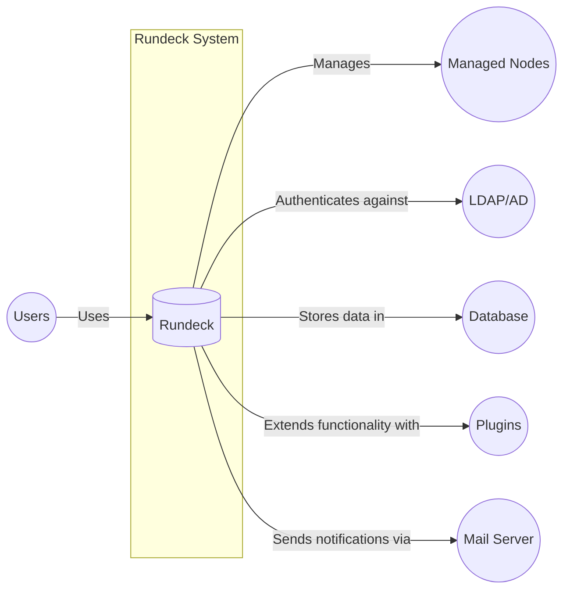
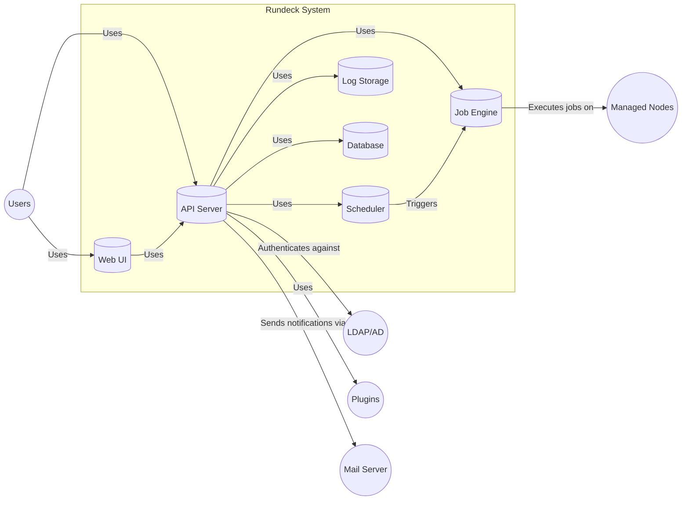
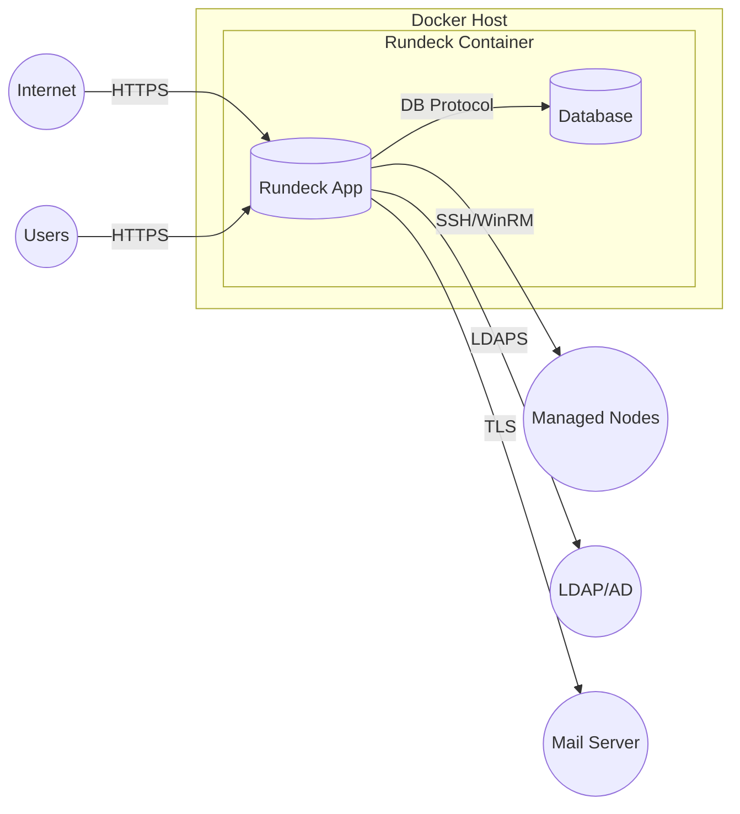
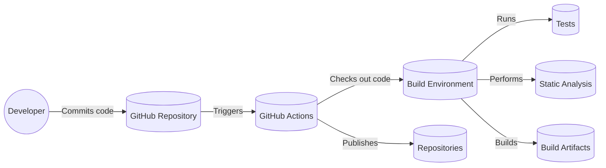

# BUSINESS POSTURE

Rundeck is an open-source project that provides a web-based interface and a set of tools to automate operational tasks across a set of nodes. It allows users to run commands, scripts, and jobs on remote servers, and provides features like access control, scheduling, logging, and workflow management. Given its nature, the business posture can be inferred as follows:

Priorities and Goals:

*   Enable operational efficiency by automating routine tasks.
*   Provide a centralized platform for managing and executing operational procedures.
*   Reduce human error and improve consistency in operations.
*   Facilitate collaboration and knowledge sharing among operations teams.
*   Improve visibility and auditability of operational activities.
*   Support infrastructure management across diverse environments.

Business Risks:

*   Unauthorized access to Rundeck could lead to unauthorized execution of commands and jobs on managed nodes, potentially causing significant damage or data breaches.
*   Compromise of Rundeck or its underlying infrastructure could expose sensitive operational data, including credentials, configurations, and logs.
*   Misconfiguration or misuse of Rundeck could lead to unintended execution of commands or jobs, resulting in system instability or data loss.
*   Lack of proper access control and auditing could hinder compliance efforts and make it difficult to track down the source of operational issues.
*   Vulnerabilities in Rundeck or its dependencies could be exploited by attackers to gain control of managed systems.
*   Reliance on community support (for the open-source version) may lead to delays in addressing critical security issues or implementing necessary features.

# SECURITY POSTURE

Existing Security Controls (from the provided GitHub repository and general knowledge of the project):

*   security control: Authentication: Rundeck supports multiple authentication methods, including username/password, LDAP, and Active Directory. (Mentioned in documentation and source code)
*   security control: Authorization: Rundeck provides role-based access control (RBAC) to restrict user permissions and limit access to specific projects, jobs, and nodes. (Mentioned in documentation and source code)
*   security control: Audit Logging: Rundeck logs user activity, including job executions, configuration changes, and authentication events. (Mentioned in documentation and source code)
*   security control: Encryption: Rundeck supports HTTPS for secure communication between the web interface and the server. Data at rest encryption depends on the underlying database and storage configuration. (Mentioned in documentation)
*   security control: Input Validation: Rundeck performs input validation to prevent common web vulnerabilities like cross-site scripting (XSS) and SQL injection. (Inferred from source code and security best practices)
*   security control: API Security: Rundeck API uses tokens for authentication. (Mentioned in documentation)
*   accepted risk: Community-supported security updates: While the Rundeck community actively addresses security issues, there is no guaranteed response time for vulnerability fixes in the open-source version.
*   accepted risk: Limited built-in secrets management: Rundeck relies on external tools or plugins for secure storage and management of sensitive credentials.
*   accepted risk: Security of custom scripts and commands: Rundeck executes user-provided scripts and commands, which may contain vulnerabilities or malicious code if not properly reviewed and secured.

Recommended Security Controls:

*   Implement a robust secrets management solution to securely store and manage credentials used by Rundeck.
*   Regularly review and update Rundeck and its dependencies to address security vulnerabilities.
*   Implement a web application firewall (WAF) to protect Rundeck from common web attacks.
*   Enable multi-factor authentication (MFA) for all Rundeck users, especially those with administrative privileges.
*   Implement network segmentation to isolate Rundeck and its managed nodes from other systems.
*   Conduct regular security assessments and penetration testing to identify and address potential vulnerabilities.
*   Implement a robust monitoring and alerting system to detect and respond to suspicious activity.

Security Requirements:

*   Authentication:
    *   Support for strong password policies.
    *   Integration with existing enterprise identity providers (e.g., SAML, OAuth).
    *   Option for multi-factor authentication (MFA).
*   Authorization:
    *   Fine-grained access control based on roles and responsibilities.
    *   Ability to restrict access to specific projects, jobs, nodes, and actions.
    *   Support for least privilege principle.
*   Input Validation:
    *   Strict validation of all user inputs to prevent injection attacks (e.g., SQL injection, command injection, XSS).
    *   Sanitization of user-provided data before displaying it in the web interface.
*   Cryptography:
    *   Use of strong encryption algorithms for secure communication (HTTPS).
    *   Secure storage of sensitive data, including credentials and API keys.
    *   Support for data at rest encryption.

# DESIGN

## C4 CONTEXT

Element List:

*   1.  Name: Users
    2.  Type: Person
    3.  Description: Individuals who interact with Rundeck to manage and automate tasks.
    4.  Responsibilities:
        *   Define and execute jobs.
        *   Manage nodes and resources.
        *   Configure Rundeck settings.
        *   View execution logs and reports.
    5.  Security controls:
        *   Authentication (username/password, LDAP, Active Directory, MFA).
        *   Authorization (RBAC).

*   1.  Name: Rundeck
    2.  Type: Software System
    3.  Description: The core Rundeck application that provides the web interface, API, and job execution engine.
    4.  Responsibilities:
        *   Provide a web interface for users to interact with the system.
        *   Manage job definitions and schedules.
        *   Execute jobs on managed nodes.
        *   Store execution logs and reports.
        *   Enforce access control and security policies.
    5.  Security controls:
        *   Authentication and authorization mechanisms.
        *   Input validation and sanitization.
        *   Audit logging.
        *   HTTPS encryption.

*   1.  Name: Managed Nodes
    2.  Type: Software System
    3.  Description: The servers, virtual machines, or containers that are managed by Rundeck.
    4.  Responsibilities:
        *   Execute commands and scripts sent by Rundeck.
        *   Provide system information and status to Rundeck.
    5.  Security controls:
        *   Secure communication with Rundeck (e.g., SSH, WinRM).
        *   Operating system and application-level security hardening.

*   1.  Name: LDAP/AD
    2.  Type: Software System
    3.  Description: External directory service used for user authentication and authorization.
    4.  Responsibilities:
        *   Store user accounts and group memberships.
        *   Authenticate users who log in to Rundeck.
    5.  Security controls:
        *   Secure communication with Rundeck (e.g., LDAPS).
        *   Standard LDAP/AD security best practices.

*   1.  Name: Database
    2.  Type: Software System
    3.  Description: Database used by Rundeck to store configuration data, job definitions, execution logs, and other persistent information.
    4.  Responsibilities:
        *   Store and retrieve Rundeck data.
        *   Ensure data integrity and consistency.
    5.  Security controls:
        *   Database access control and authentication.
        *   Data encryption at rest and in transit.
        *   Regular database backups and security patching.

*   1.  Name: Plugins
    2.  Type: Software System
    3.  Description: Optional extensions that add functionality to Rundeck, such as integrations with other tools or custom job steps.
    4.  Responsibilities:
        *   Extend Rundeck's capabilities.
        *   Integrate with external systems.
    5.  Security controls:
        *   Plugin-specific security measures.
        *   Code review and security testing of plugins.

*   1.  Name: Mail Server
    2.  Type: Software System
    3.  Description: External mail server used by Rundeck to send email notifications.
    4.  Responsibilities:
        *   Send email notifications to users.
    5.  Security controls:
        *   Secure communication with Rundeck (e.g., TLS).
        *   Standard mail server security best practices.

## C4 CONTAINER

Element List:

*   1.  Name: Web UI
    2.  Type: Web Application
    3.  Description: The user interface for interacting with Rundeck.
    4.  Responsibilities:
        *   Provide a graphical interface for users to manage jobs, nodes, and configurations.
        *   Display execution logs and reports.
        *   Interact with the API Server to perform actions.
    5.  Security controls:
        *   Authentication and authorization through the API Server.
        *   Input validation and sanitization.
        *   HTTPS encryption.

*   1.  Name: API Server
    2.  Type: Web Application
    3.  Description: The central component that handles requests from the Web UI and other clients.
    4.  Responsibilities:
        *   Process API requests.
        *   Authenticate and authorize users.
        *   Interact with other components to perform actions.
        *   Manage access control and security policies.
    5.  Security controls:
        *   Authentication (token-based, LDAP, Active Directory).
        *   Authorization (RBAC).
        *   Input validation and sanitization.
        *   HTTPS encryption.
        *   Rate limiting.

*   1.  Name: Job Engine
    2.  Type: Application
    3.  Description: The component responsible for executing jobs on managed nodes.
    4.  Responsibilities:
        *   Receive job execution requests from the API Server and Scheduler.
        *   Execute commands and scripts on managed nodes.
        *   Collect and store execution output.
    5.  Security controls:
        *   Secure communication with managed nodes (e.g., SSH, WinRM).
        *   Sandboxing or isolation of job executions (if applicable).

*   1.  Name: Scheduler
    2.  Type: Application
    3.  Description: The component responsible for scheduling job executions.
    4.  Responsibilities:
        *   Trigger job executions based on predefined schedules.
        *   Manage scheduled jobs and their status.
    5.  Security controls:
        *   Secure storage of schedule information.

*   1.  Name: Log Storage
    2.  Type: Data Storage
    3.  Description: Stores execution logs and other relevant data.
    4.  Responsibilities:
        *   Store and retrieve execution logs.
        *   Provide access to logs for auditing and troubleshooting.
    5.  Security controls:
        *   Access control to logs.
        *   Data encryption (if applicable).

*   1.  Name: Database
    2.  Type: Database
    3.  Description: Stores configuration data, job definitions, and other persistent information.
    4.  Responsibilities:
        *   Store and retrieve Rundeck data.
        *   Ensure data integrity and consistency.
    5.  Security controls:
        *   Database access control and authentication.
        *   Data encryption at rest and in transit.
        *   Regular database backups and security patching.

*   1.  Name: Users
    2.  Type: Person
    3.  Description: Individuals who interact with Rundeck to manage and automate tasks.
    4.  Responsibilities:
        *   Define and execute jobs.
        *   Manage nodes and resources.
        *   Configure Rundeck settings.
        *   View execution logs and reports.
    5.  Security controls:
        *   Authentication (username/password, LDAP, Active Directory, MFA).
        *   Authorization (RBAC).

*   1.  Name: Managed Nodes
    2.  Type: Software System
    3.  Description: The servers, virtual machines, or containers that are managed by Rundeck.
    4.  Responsibilities:
        *   Execute commands and scripts sent by Rundeck.
        *   Provide system information and status to Rundeck.
    5.  Security controls:
        *   Secure communication with Rundeck (e.g., SSH, WinRM).
        *   Operating system and application-level security hardening.

*   1.  Name: LDAP/AD
    2.  Type: Software System
    3.  Description: External directory service used for user authentication and authorization.
    4.  Responsibilities:
        *   Store user accounts and group memberships.
        *   Authenticate users who log in to Rundeck.
    5.  Security controls:
        *   Secure communication with Rundeck (e.g., LDAPS).
        *   Standard LDAP/AD security best practices.

*   1.  Name: Plugins
    2.  Type: Software System
    3.  Description: Optional extensions that add functionality to Rundeck, such as integrations with other tools or custom job steps.
    4.  Responsibilities:
        *   Extend Rundeck's capabilities.
        *   Integrate with external systems.
    5.  Security controls:
        *   Plugin-specific security measures.
        *   Code review and security testing of plugins.

*   1.  Name: Mail Server
    2.  Type: Software System
    3.  Description: External mail server used by Rundeck to send email notifications.
    4.  Responsibilities:
        *   Send email notifications to users.
    5.  Security controls:
        *   Secure communication with Rundeck (e.g., TLS).
        *   Standard mail server security best practices.

## DEPLOYMENT

Possible deployment solutions:

1.  Standalone WAR file deployment on a Java application server (e.g., Tomcat, Jetty).
2.  Docker container deployment.
3.  RPM/DEB package installation on a Linux server.
4.  Deployment using configuration management tools (e.g., Ansible, Chef, Puppet).

Chosen solution (Docker container deployment):

Element List:

*   1.  Name: Docker Host
    2.  Type: Operating System
    3.  Description: The physical or virtual machine that hosts the Docker engine and runs the Rundeck container.
    4.  Responsibilities:
        *   Provide the runtime environment for Docker containers.
        *   Manage resources allocated to containers.
    5.  Security controls:
        *   Operating system hardening.
        *   Firewall configuration.
        *   Regular security updates.
        *   Docker security best practices (e.g., using non-root user, limiting container capabilities).

*   1.  Name: Rundeck Container
    2.  Type: Container
    3.  Description: The isolated environment that runs the Rundeck application and its dependencies.
    4.  Responsibilities:
        *   Run the Rundeck application.
        *   Provide a consistent and reproducible environment for Rundeck.
    5.  Security controls:
        *   Container image security scanning.
        *   Use of minimal base images.
        *   Regular updates of container images.
        *   Resource limits (CPU, memory).

*   1.  Name: Rundeck App
    2.  Type: Application
    3.  Description: Instance of Rundeck application.
    4.  Responsibilities:
        *   Provide a web interface for users to interact with the system.
        *   Manage job definitions and schedules.
        *   Execute jobs on managed nodes.
        *   Store execution logs and reports.
        *   Enforce access control and security policies.
    5.  Security controls:
        *   Authentication and authorization mechanisms.
        *   Input validation and sanitization.
        *   Audit logging.
        *   HTTPS encryption.

*   1.  Name: Database
    2.  Type: Database
    3.  Description: Database used by Rundeck to store configuration data, job definitions, execution logs, and other persistent information.
    4.  Responsibilities:
        *   Store and retrieve Rundeck data.
        *   Ensure data integrity and consistency.
    5.  Security controls:
        *   Database access control and authentication.
        *   Data encryption at rest and in transit.
        *   Regular database backups and security patching.

*   1.  Name: Internet
    2.  Type: Network
    3.  Description: Public network.
    4.  Responsibilities: N/A
    5.  Security controls: N/A

*   1.  Name: Users
    2.  Type: Person
    3.  Description: Individuals who interact with Rundeck to manage and automate tasks.
    4.  Responsibilities:
        *   Define and execute jobs.
        *   Manage nodes and resources.
        *   Configure Rundeck settings.
        *   View execution logs and reports.
    5.  Security controls:
        *   Authentication (username/password, LDAP, Active Directory, MFA).
        *   Authorization (RBAC).

*   1.  Name: Managed Nodes
    2.  Type: Software System
    3.  Description: The servers, virtual machines, or containers that are managed by Rundeck.
    4.  Responsibilities:
        *   Execute commands and scripts sent by Rundeck.
        *   Provide system information and status to Rundeck.
    5.  Security controls:
        *   Secure communication with Rundeck (e.g., SSH, WinRM).
        *   Operating system and application-level security hardening.

*   1.  Name: LDAP/AD
    2.  Type: Software System
    3.  Description: External directory service used for user authentication and authorization.
    4.  Responsibilities:
        *   Store user accounts and group memberships.
        *   Authenticate users who log in to Rundeck.
    5.  Security controls:
        *   Secure communication with Rundeck (e.g., LDAPS).
        *   Standard LDAP/AD security best practices.

*   1.  Name: Mail Server
    2.  Type: Software System
    3.  Description: External mail server used by Rundeck to send email notifications.
    4.  Responsibilities:
        *   Send email notifications to users.
    5.  Security controls:
        *   Secure communication with Rundeck (e.g., TLS).
        *   Standard mail server security best practices.

## BUILD

Rundeck build process:

1.  Developers commit code changes to the GitHub repository.
2.  GitHub Actions workflows are triggered by commits or pull requests.
3.  The workflows perform the following steps:
    *   Checkout the code.
    *   Set up the build environment (Java, Gradle).
    *   Run unit and integration tests.
    *   Perform static code analysis using linters and code quality tools (Checkstyle, SpotBugs).
    *   Build the Rundeck WAR file and other artifacts (RPM, DEB, Docker image).
    *   Publish the artifacts to appropriate repositories (e.g., Maven Central, Docker Hub).

Security Controls:

*   security control: Code review: All code changes are reviewed by other developers before being merged into the main branch.
*   security control: Static code analysis: Linters and code quality tools are used to identify potential security vulnerabilities and code quality issues.
*   security control: Dependency management: Gradle is used to manage project dependencies and ensure that only approved versions are used.
*   security control: Automated builds: GitHub Actions provides a consistent and reproducible build process.
*   security control: Artifact signing: Build artifacts can be signed to ensure their integrity and authenticity. (Potentially, not explicitly mentioned in the repository)

# RISK ASSESSMENT

Critical Business Processes:

*   Automated execution of operational tasks across managed nodes.
*   Centralized management of operational procedures and configurations.
*   Auditing and reporting of operational activities.

Data Sensitivity:

*   Configuration data: Contains information about managed nodes, including hostnames, IP addresses, and potentially sensitive configuration settings. Sensitivity: Medium to High.
*   Job definitions: Contains scripts, commands, and parameters used to execute jobs on managed nodes. Sensitivity: Medium to High.
*   Execution logs: Contains the output of executed jobs, which may include sensitive information depending on the nature of the tasks. Sensitivity: Low to High.
*   User credentials: Usernames, passwords (hashed), and API tokens used to authenticate with Rundeck. Sensitivity: High.
*   Audit logs: Contains information about user activity, including login attempts, job executions, and configuration changes. Sensitivity: Medium.

# QUESTIONS & ASSUMPTIONS

Questions:

*   What is the specific threat model or compliance requirements that Rundeck needs to adhere to (e.g., SOC 2, PCI DSS)?
*   What is the expected scale of the Rundeck deployment (number of users, nodes, jobs)?
*   Are there any specific security concerns or requirements from the operations team or other stakeholders?
*   What is the process for handling security vulnerabilities discovered in Rundeck or its dependencies?
*   What external systems or services does Rundeck integrate with, and what are the security implications of those integrations?
*   What is the expected level of support and maintenance for the Rundeck deployment?
*   Are there any plans to use Rundeck in a cloud environment (e.g., AWS, Azure, GCP)? If so, what are the specific security considerations for that environment?
*   What is the process for managing secrets and credentials used by Rundeck?
*   What kind of monitoring and alerting capabilities are in place for the Rundeck deployment?

Assumptions:

*   BUSINESS POSTURE: The organization has a moderate risk appetite and prioritizes operational efficiency and security.
*   SECURITY POSTURE: The organization has basic security controls in place, such as firewalls, intrusion detection systems, and regular security patching.
*   DESIGN: Rundeck will be deployed in a secure environment with appropriate network segmentation and access controls. The database will be properly secured and backed up. The organization will follow security best practices for managing Rundeck and its managed nodes.