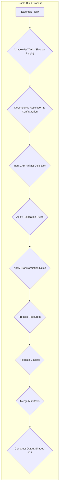
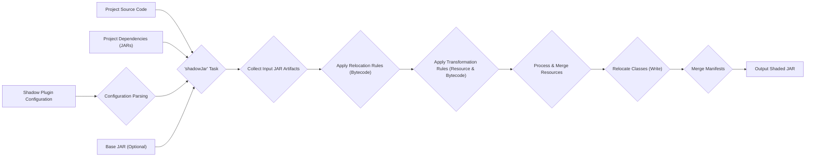
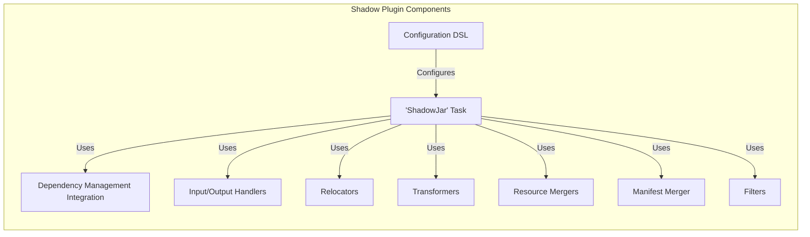

# Project Design Document: Gradle Shadow Plugin

**Version:** 1.1
**Date:** October 26, 2023
**Author:** AI Software Architect

## 1. Introduction

This document provides an enhanced design overview of the Gradle Shadow plugin, a widely used Gradle plugin for creating shaded JAR files. Shading involves bundling the dependencies of a Java project into a single JAR, often with package name relocation to prevent class name collisions. This revised document offers a deeper understanding of the plugin's architecture, data flow, and key components, serving as a robust foundation for subsequent threat modeling activities. It aims to be more detailed and provide a clearer picture of the plugin's inner workings.

## 2. Goals

The primary goals of this design document are to:

* Clearly and comprehensively articulate the architecture and functionality of the Gradle Shadow plugin, including internal processes.
* Identify and describe the key components and their interactions within the plugin with greater detail.
* Detail the data flow and processing steps involved in creating a shaded JAR, including data transformations.
* Provide sufficient and granular detail to enable effective and targeted threat modeling of the plugin.
* Serve as a definitive reference document for developers, security analysts, and anyone seeking a deep understanding of the plugin.

## 3. Architectural Overview

The Gradle Shadow plugin functions as a custom Gradle task (`ShadowJar`) that extends the standard JAR creation process. It intercepts the output of dependency resolution and manipulates the contents of the resulting JAR files to produce a single, shaded JAR. The plugin's core logic revolves around reading, transforming, and writing JAR file contents.

## 4. Data Flow

The creation of a shaded JAR involves a detailed data flow with specific transformations at each stage:

* **Input:**
    * **Project Source Code:** The compiled `.class` files of the project being built.
    * **Project Dependencies (JARs):**  JAR files of libraries declared as dependencies in the `build.gradle` file, obtained after Gradle's dependency resolution.
    * **Shadow Plugin Configuration (Data Structures):**  Internal representations of the settings defined in `build.gradle`, including:
        * **Relocation Specifications:**  Data structures defining source and destination package patterns for relocation.
        * **Transformation Specifications:** Data structures defining how resources and classes should be modified.
        * **Filter Specifications:** Data structures defining which files or classes to exclude.
        * **Manifest Merge Strategy:**  Specification of how manifest files should be combined.
    * **Base JAR (Optional):** The output of the standard `jar` task, if configured to be used as a starting point.

* **Processing Steps:**
    * **Dependency Resolution and Configuration Parsing:** Gradle resolves dependencies, and the Shadow plugin parses its configuration from `build.gradle`, creating internal data structures.
    * **Input JAR Artifact Collection:** The plugin gathers the resolved dependency JARs and the optional base JAR into a collection of input artifacts.
    * **Relocation Application (Bytecode Manipulation):** Based on relocation specifications, the plugin iterates through the classes in the input JARs and performs bytecode manipulation:
        * **Class Reading:** Reads the bytecode of each class.
        * **Package Name Updates:** Modifies the package declaration within the class bytecode.
        * **Reference Updates:** Updates references to relocated classes within the constant pool and other parts of the bytecode.
    * **Transformation Application (Resource and Class Modification):** The plugin applies configured transformations:
        * **Resource Transformation:** Modifies resource files based on defined rules (e.g., appending, replacing).
        * **Class Transformation (Bytecode Manipulation):**  Applies custom bytecode modifications as specified in the configuration.
    * **Resource Processing and Merging:** Resources from different input JARs are processed. If conflicts occur (same path in multiple JARs), the configured merging strategy is applied.
    * **Class Relocation (Writing Modified Classes):** The modified class files (after relocation and transformation) are written to the output shaded JAR.
    * **Manifest Merging:** The `META-INF/MANIFEST.MF` files from all input JARs are merged into a single manifest for the shaded JAR, following the configured strategy. This involves handling attribute conflicts.
    * **Output Shaded JAR Construction:** All processed classes and resources, along with the merged manifest, are packaged into the final shaded JAR file.

* **Output:**
    * **Shaded JAR File:** A single JAR file containing the project's compiled code and its dependencies, with packages potentially relocated and resources transformed.

## 5. Key Components

The Gradle Shadow plugin is composed of several interacting components:

* **`ShadowJar` Task (Gradle Task):** The primary entry point and orchestrator of the shading process. It manages the lifecycle of the shading operation and coordinates other components.
* **Dependency Management Integration (Gradle API):**  Leverages Gradle's dependency resolution mechanisms to obtain the required dependency artifacts.
* **Input/Output Handlers (JAR Reading/Writing):** Components responsible for reading the contents of input JAR files and writing the output shaded JAR file. This involves handling ZIP file formats and entry streams.
* **Relocators (Bytecode Processors):** Implement the core logic for renaming packages and updating class references within bytecode. Different relocator implementations might exist for various relocation strategies (e.g., simple prefixing, advanced pattern matching).
* **Transformers (Resource and Bytecode Modifiers):** Components that modify the content of resources and classes. Specific transformer implementations include:
    * **Appending Resource Transformer:** Appends content to existing resource files.
    * **Replacing Resource Transformer:** Replaces the content of resource files.
    * **Service Locator Transformer:**  Merges entries in `META-INF/services` files.
    * **Custom Bytecode Transformers:** Allow users to define custom logic for manipulating class bytecode.
* **Resource Mergers (Conflict Resolution):** Components responsible for merging resources from different input JARs when path conflicts occur. Implementations include strategies like "first found wins," "appending," or custom merging logic.
* **Manifest Merger (Attribute Combination):**  A component that merges the `MANIFEST.MF` files from all input JARs. It handles attribute conflicts based on predefined rules or user configuration.
* **Filters (Exclusion Logic):** Components that allow users to specify which files or classes should be excluded from the shading process based on patterns or other criteria.
* **Configuration DSL (Gradle API):** The Gradle API used to configure the Shadow plugin within the `build.gradle` file. This includes defining relocation rules, transformations, filters, and manifest merging strategies using specific data structures.

## 6. Security Considerations (Pre-Threat Modeling)

This section outlines potential security considerations that will be further investigated during threat modeling:

* **Transitive Dependency Vulnerabilities:** The shaded JAR inherently includes all transitive dependencies. Vulnerabilities in these dependencies become part of the final artifact, potentially increasing the attack surface.
* **Malicious Dependency Relocation:**  Incorrectly or maliciously configured relocation rules could lead to the unintentional overriding of critical classes or the introduction of subtle bugs that could be exploited. For example, relocating a security manager implementation.
* **Compromised Transformation Logic:** Malicious or flawed custom transformations could inject vulnerabilities or backdoors into the shaded JAR. This is especially concerning with custom bytecode transformations.
* **Manifest Manipulation Risks:**  Exploiting vulnerabilities in the manifest merging process could allow attackers to manipulate the application's entry point, permissions, or other critical attributes.
* **`build.gradle` Security:** The `build.gradle` file, containing the plugin's configuration, is a critical asset. Unauthorized modification could lead to the introduction of malicious relocations, transformations, or dependencies.
* **Supply Chain Attacks on Dependencies:** If any of the input dependency JARs are compromised, the resulting shaded JAR will also be compromised. This highlights the importance of verifying dependency integrity.
* **Resource Merging Vulnerabilities:**  Unintended consequences from resource merging, such as overwriting security-related configuration files with less secure versions, could introduce vulnerabilities.
* **Exposure of Internal Libraries:** Shading can inadvertently expose internal libraries that were not intended for public use, potentially revealing internal APIs or implementation details that could be exploited.
* **License Compatibility Issues:** While not strictly a security issue, incorrect shading could lead to the inclusion of libraries with incompatible licenses, creating legal risks.

## 7. Assumptions and Constraints

The design of the Gradle Shadow plugin operates under the following assumptions and constraints:

* **Gradle Execution Environment:** The plugin is designed to function within the Gradle build system and relies on its APIs and lifecycle.
* **Standard Java JAR Format Compliance:** The plugin assumes that input and output files adhere to the standard Java JAR file format.
* **User Configuration as Input:** The plugin's behavior is heavily dependent on the configuration provided by the user in the `build.gradle` file. Incorrect or malicious configuration can lead to unintended consequences.
* **Plugin Execution Permissions:** The plugin executes with the permissions granted to the Gradle build process. This implies that it has access to the file system and network resources available to the build process.
* **Availability of Dependencies:** The plugin assumes that the declared dependencies are available in the configured repositories.

## 8. Future Considerations

Potential future enhancements and their potential security implications include:

* **Enhanced Dependency Vulnerability Scanning Integration:**  Direct integration with vulnerability scanning tools to automatically identify and flag vulnerable dependencies before shading.
* **Policy-Based Shading Configuration:**  Introducing a more structured and policy-driven approach to configuration, allowing for the enforcement of security best practices.
* **Improved Bytecode Analysis and Validation:**  Implementing more sophisticated bytecode analysis to detect potentially harmful relocation or transformation patterns.
* **Secure Secret Management Integration:**  Mechanisms to securely handle secrets or sensitive information that might be present in resources or configurations during the shading process.
* **Fine-grained Control over Manifest Merging:**  Providing more granular control over how specific manifest attributes are merged to prevent unintended overwrites or omissions.
* **Support for Signed JARs:**  Enhancements to ensure that the signing of the shaded JAR is handled correctly and securely.
* **Auditing and Logging of Shading Operations:**  Implementing comprehensive logging of shading operations for auditing and forensic purposes.

This enhanced design document provides a more detailed and comprehensive understanding of the Gradle Shadow plugin's architecture and functionality. It serves as a valuable resource for developers and security analysts and provides a solid foundation for conducting thorough threat modeling activities.