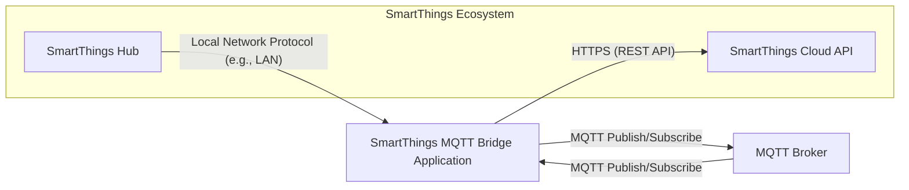

## Project Design Document: SmartThings MQTT Bridge (Improved)

**1. Introduction**

This document provides an enhanced and more detailed design overview of the SmartThings MQTT Bridge project, based on the GitHub repository [https://github.com/stjohnjohnson/smartthings-mqtt-bridge](https://github.com/stjohnjohnson/smartthings-mqtt-bridge). This revised document aims to provide a clearer articulation of the system's architecture, components, data flow, and crucial security considerations, specifically tailored for subsequent threat modeling activities.

**2. Goals**

The primary goal of the SmartThings MQTT Bridge remains to seamlessly bridge the communication gap between a SmartThings ecosystem and an MQTT broker. This enables:

*   Bidirectional control of SmartThings devices through MQTT messaging.
*   Real-time reception of SmartThings device status updates as MQTT messages.
*   Facilitating integration of SmartThings devices with a broader range of systems and applications leveraging the MQTT protocol.

**3. Architecture Overview**

The SmartThings MQTT Bridge operates as a central intermediary, responsible for translating events and commands between the SmartThings cloud infrastructure and a designated MQTT broker.

**4. Component Details**

This section provides a more granular description of the key components within the SmartThings MQTT Bridge system.

*   **SmartThings Hub:**
    *   The physical hardware hub serving as the central controller for local SmartThings devices (e.g., smart bulbs, sensors, locks).
    *   Utilizes a local network protocol (likely a proprietary LAN protocol) for communication with the SmartThings MQTT Bridge application.
    *   Relays device state changes and events to the SmartThings Cloud API.
    *   Receives commands from the SmartThings Cloud API to manage and control connected devices.

*   **SmartThings Cloud API:**
    *   The cloud-based application programming interface provided by SmartThings, enabling external applications to interact with the SmartThings ecosystem.
    *   Serves as the primary interface for the bridge application to subscribe to device events and dispatch control commands.
    *   Requires robust authentication and authorization mechanisms to ensure secure access.

*   **SmartThings MQTT Bridge Application:**
    *   The core software component of this project, acting as the translation layer between the two ecosystems.
    *   Key responsibilities include:
        *   Establishing and maintaining a connection with the SmartThings Hub on the local network.
        *   Authenticating with the SmartThings Cloud API using provided credentials (e.g., API keys, OAuth tokens).
        *   Subscribing to relevant device event streams from the SmartThings Cloud API, filtering for desired devices and events.
        *   Transforming SmartThings device events into standardized MQTT messages, publishing them to configured MQTT topics.
        *   Subscribing to designated MQTT topics for incoming control commands.
        *   Translating received MQTT commands into corresponding SmartThings API calls to control target devices.
        *   Managing configuration parameters, such as MQTT broker connection details and SmartThings API credentials.
        *   Implementing logging and error handling mechanisms for operational monitoring.

*   **MQTT Broker:**
    *   A message broker implementing the Message Queuing Telemetry Transport (MQTT) protocol, facilitating lightweight, publish-subscribe communication.
    *   Receives MQTT messages published by the bridge application (representing SmartThings device events).
    *   Routes messages to interested clients (subscribers), including the bridge application itself for command reception.
    *   Common examples include Mosquitto, Eclipse Mosquitto, and cloud-based MQTT services.

**5. Data Flow (Detailed)**

This section provides a more detailed breakdown of the data flow within the system for different operational scenarios.

*   **SmartThings Device Event to MQTT Message:**
    1. A physical state change occurs on a SmartThings device (e.g., a motion sensor detects movement).
    2. The SmartThings Hub detects this state change through its local communication with the device.
    3. The SmartThings Hub reports the device event, including relevant data (e.g., device ID, attribute, value), to the SmartThings Cloud API.
    4. The SmartThings MQTT Bridge application, having an active subscription to these events via the SmartThings Cloud API, receives a notification containing the event data (typically in JSON format).
    5. The bridge application processes the received event data, potentially performing transformations or filtering.
    6. The bridge application constructs an MQTT message, typically with a topic reflecting the device and attribute, and a payload containing the event data (often in JSON or a similar format).
    7. The bridge application publishes the constructed MQTT message to the configured MQTT broker.
    8. Any MQTT clients subscribed to the relevant topic on the MQTT broker receive the device event message.

*   **MQTT Command to SmartThings Device Action:**
    1. An external system or application publishes an MQTT message to a specific topic that the SmartThings MQTT Bridge application is subscribed to for commands.
    2. The bridge application receives the MQTT message, extracting the command and target device information from the topic and/or payload.
    3. The bridge application translates the received MQTT command into a corresponding API call to the SmartThings Cloud API. This involves mapping the MQTT command to a specific SmartThings device capability and action.
    4. The bridge application sends the constructed API call (typically an HTTPS request) to the SmartThings Cloud API, including necessary authentication credentials.
    5. The SmartThings Cloud API authenticates the request and, upon successful authorization, relays the command to the appropriate SmartThings Hub.
    6. The SmartThings Hub, upon receiving the command, communicates with the target SmartThings device using its local network protocol.
    7. The SmartThings device executes the received command, resulting in a change in its state or behavior.

**6. Key Interactions and Interfaces (Specific Protocols)**

This section clarifies the specific protocols and interfaces used for communication between components.

*   **SmartThings Hub <-> SmartThings MQTT Bridge Application:**
    *   Likely utilizes a proprietary local network protocol, potentially involving UDP or TCP-based communication. The exact protocol details are often undocumented and may require reverse engineering or reliance on community findings.

*   **SmartThings MQTT Bridge Application <-> SmartThings Cloud API:**
    *   Communication occurs over HTTPS, adhering to RESTful API principles.
    *   Authentication and authorization are typically handled using OAuth 2.0 or API keys, requiring secure storage and management of these credentials.
    *   Event subscriptions may utilize Server-Sent Events (SSE) or WebSockets for real-time updates.
    *   Data is exchanged primarily in JSON format.

*   **SmartThings MQTT Bridge Application <-> MQTT Broker:**
    *   Communication adheres to the MQTT protocol, typically over TCP/IP.
    *   Secure connections can be established using TLS/SSL encryption.
    *   Authentication can be implemented using usernames and passwords.

**7. Configuration Details**

The SmartThings MQTT Bridge application relies on configuration parameters for proper operation. These are typically managed through configuration files or environment variables.

*   **MQTT Broker Connection Parameters:**
    *   `mqtt_host`: Hostname or IP address of the MQTT broker.
    *   `mqtt_port`: Port number for MQTT communication (typically 1883 or 8883 for TLS).
    *   `mqtt_username`: Username for MQTT broker authentication (optional).
    *   `mqtt_password`: Password for MQTT broker authentication (optional).
    *   `mqtt_tls_enabled`: Boolean flag to enable TLS/SSL encryption for MQTT communication.
    *   `mqtt_tls_certificate_path`: Path to the TLS certificate file (if required).

*   **SmartThings API Credentials:**
    *   `smartthings_api_token`: API key or OAuth token obtained from the SmartThings developer portal.
    *   `smartthings_hub_id` or `smartthings_location_id`: Identifies the target SmartThings environment.

*   **Topic Mapping Configuration:**
    *   Rules or patterns defining how SmartThings devices and attributes are mapped to MQTT topics for publishing events.
    *   Rules or patterns defining how MQTT topics are mapped to SmartThings device commands.

*   **Bridge Application Settings:**
    *   `log_level`: Configures the verbosity of application logging.
    *   `network_interface`: Specifies the network interface to bind to (if necessary).

**8. Deployment Considerations (Expanded)**

*   The SmartThings MQTT Bridge application requires a runtime environment capable of executing its code (e.g., Python, Node.js).
*   Deployment options include:
    *   Single-board computers (e.g., Raspberry Pi) on the local network.
    *   Containerization platforms (e.g., Docker) for portability and isolation.
    *   Virtual machines or cloud instances for more robust deployments.
*   Network connectivity is crucial: the bridge needs to communicate with the local SmartThings Hub network and the network where the MQTT broker is located.
*   Firewall rules may need to be configured to allow communication on necessary ports.
*   Resource considerations (CPU, memory) depend on the number of SmartThings devices and the frequency of events.

**9. Security Considerations (Detailed)**

This section expands on the security considerations, providing more specific examples and potential threats.

*   **Authentication and Authorization:**
    *   **Threat:** Unauthorized access to the SmartThings Cloud API if API keys or OAuth tokens are compromised.
    *   **Mitigation:** Securely store API credentials (e.g., using environment variables, secrets management tools). Implement proper access control on the system where the bridge is running. Regularly rotate API keys if possible.
    *   **Threat:** Unauthorized access to the MQTT broker if authentication is weak or disabled.
    *   **Mitigation:** Enforce strong authentication (usernames and passwords) on the MQTT broker. Consider using client certificates for enhanced security.
    *   **Threat:** Malicious actors publishing commands to the MQTT broker to control SmartThings devices.
    *   **Mitigation:** Implement MQTT topic-based authorization to restrict which clients can publish to command topics.

*   **Data Transmission Security:**
    *   **Threat:** Interception of communication with the SmartThings Cloud API, potentially exposing API keys or sensitive device data.
    *   **Mitigation:** Ensure all communication with the SmartThings Cloud API occurs over HTTPS (TLS/SSL).
    *   **Threat:** Interception of communication with the MQTT broker, potentially exposing device events or control commands.
    *   **Mitigation:** Enable TLS/SSL encryption for MQTT communication.

*   **Input Validation and Sanitization:**
    *   **Threat:** Malicious data injected through MQTT messages could potentially cause unexpected behavior or vulnerabilities in the bridge application.
    *   **Mitigation:** Implement robust input validation and sanitization on data received from the MQTT broker before processing and translating it into SmartThings API calls.
    *   **Threat:** Unexpected data formats or malicious payloads from the SmartThings Cloud API could cause errors or vulnerabilities.
    *   **Mitigation:** Implement validation of data received from the SmartThings Cloud API.

*   **Configuration Security:**
    *   **Threat:** Exposure of sensitive configuration data (e.g., API keys, MQTT credentials) if configuration files are not properly protected.
    *   **Mitigation:** Store sensitive configuration data securely (e.g., using environment variables, encrypted configuration files, secrets management services). Restrict access to configuration files.

*   **Network Security:**
    *   **Threat:** Unauthorized access to the bridge application or the MQTT broker if the network is not properly secured.
    *   **Mitigation:** Implement network segmentation to isolate the bridge application and the MQTT broker. Use firewalls to restrict access to necessary ports only.

*   **Update Management:**
    *   **Threat:** Vulnerabilities in the bridge application or its dependencies could be exploited if software is not kept up-to-date.
    *   **Mitigation:** Regularly update the bridge application and its dependencies with the latest security patches.

*   **Trust Boundaries:**
    *   **Boundary 1:** Between the local network where the SmartThings Hub resides and the network where the bridge application runs.
    *   **Boundary 2:** Between the bridge application and the untrusted network where the MQTT broker might reside.
    *   **Boundary 3:** Between the bridge application and the SmartThings Cloud API (controlled by a third party).

**10. Future Enhancements (More Specific)**

*   **Dynamic Topic Mapping:** Allow users to define more flexible and dynamic rules for mapping SmartThings devices and attributes to MQTT topics.
*   **Advanced Command Handling:** Implement support for more complex command structures and data transformations between MQTT and SmartThings.
*   **Improved Error Handling and Resilience:** Enhance error handling logic and implement mechanisms for automatic reconnection and recovery from failures.
*   **Web-Based Administration Interface:** Develop a web interface for easier configuration and monitoring of the bridge application.
*   **Support for Additional SmartThings Features:** Expand support for a wider range of SmartThings device capabilities and features.
*   **Metrics and Monitoring:** Integrate metrics collection and monitoring capabilities for performance analysis and troubleshooting.

This improved design document provides a more comprehensive and detailed understanding of the SmartThings MQTT Bridge project, offering a solid foundation for conducting thorough threat modeling activities. The enhanced descriptions of components, data flow, interactions, and security considerations will be invaluable in identifying potential vulnerabilities and developing effective mitigation strategies.
