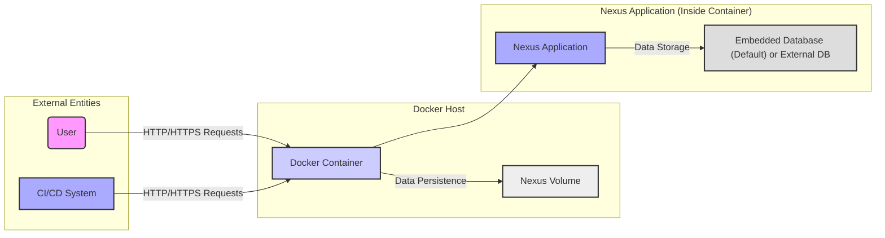
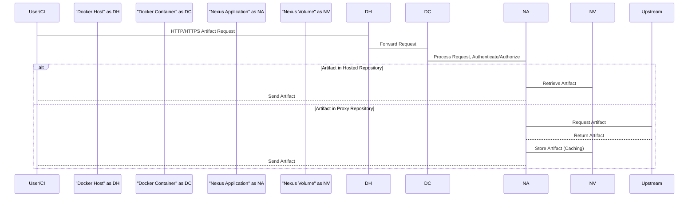
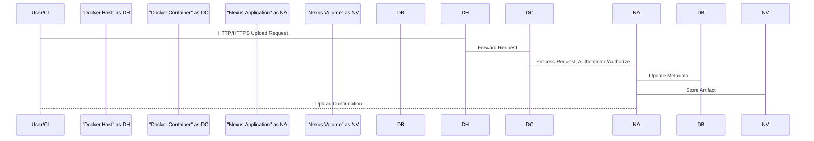

# Project Design Document: Dockerized Sonatype Nexus Repository Manager 3

**Version:** 1.1
**Date:** October 26, 2023
**Author:** AI Software Architect

## 1. Introduction

This document provides a detailed design overview of the Dockerized Sonatype Nexus Repository Manager 3 project, based on the repository found at [https://github.com/sonatype/docker-nexus3](https://github.com/sonatype/docker-nexus3). This document aims to clearly articulate the system's architecture, components, and data flow to facilitate effective threat modeling. It will serve as a foundational resource for identifying potential security vulnerabilities and designing appropriate mitigation strategies. This revision includes clarifications and expands on security considerations to better support the threat modeling process.

## 2. Goals

*   Clearly define the architecture and components of the Dockerized Nexus 3 deployment.
*   Illustrate the data flow within the system, including key interactions.
*   Identify key interaction points, trust boundaries, and data sensitivity.
*   Provide sufficient detail for subsequent threat modeling activities, enabling the identification of potential threats and attack vectors.

## 3. Scope

This document covers the design of running Sonatype Nexus Repository Manager 3 within a Docker container, as defined by the linked GitHub repository. It focuses on the containerized deployment, its immediate dependencies, and interactions with external entities. It does not delve into the intricate internal workings of the Nexus application itself, beyond its interaction with the container environment and its exposed interfaces. The scope includes common deployment scenarios but may not cover all possible configurations.

## 4. Target Audience

This document is intended for:

*   Security engineers and architects responsible for threat modeling, security assessments, and penetration testing.
*   Development and operations teams involved in deploying, configuring, and maintaining the Dockerized Nexus 3 instance.
*   Compliance officers and auditors assessing the security posture of the system.
*   Anyone needing a comprehensive understanding of the system's architecture from a security perspective.

## 5. System Overview

The core of this project is the deployment of Sonatype Nexus Repository Manager 3 within a Docker container. This approach offers portability, consistency, and ease of deployment across different environments. The Docker image encapsulates the Nexus application and its necessary runtime dependencies. The container interacts with persistent storage and potentially external databases.

**Key Components:**

*   **User:** An individual interacting with the Nexus repository through a web browser or command-line tools (e.g., developers, administrators).
*   **CI/CD System:** Automated systems that interact with Nexus to download dependencies or publish artifacts.
*   **Docker Host:** The physical or virtual machine running the Docker daemon and hosting the container.
*   **Docker Container:** The isolated and virtualized environment running the Nexus application and its dependencies.
*   **Nexus Application:** The Sonatype Nexus Repository Manager 3 software responsible for managing software artifacts.
*   **Nexus Volume:** A persistent storage volume mounted to the container to store Nexus data, ensuring data persistence across container restarts.
*   **Embedded Database (Default) or External DB:** Nexus uses a database to store metadata, configuration, and security information. It defaults to an embedded database but can be configured to use an external database for scalability and management.

## 6. Component Details

### 6.1. Docker Image

*   **Source:** Typically sourced from Docker Hub or a private registry, often based on a minimal Linux distribution like Alpine or CentOS with a compatible Java Development Kit (JDK).
*   **Content:** Includes the Nexus application binaries, the Java Runtime Environment (JRE) or JDK, necessary libraries, and potentially initialization scripts.
*   **Configuration:** May contain default configurations for Nexus, such as default ports, user accounts, and initial repository settings. These can be overridden via environment variables or mounted configuration files.
*   **Entrypoint:** Defines the command executed when the container starts, typically invoking the Nexus startup script.

### 6.2. Docker Container

*   **Isolation:** Provides process, network, and filesystem isolation from the host system and other containers. This isolation is a key security feature.
*   **Networking:** Exposes network ports (typically 8081 for HTTP and potentially others for specific protocols like raw socket connections for clustering) to allow external access to the Nexus application. Port mappings define how host ports are linked to container ports.
*   **Resource Limits:** Can be configured with resource constraints (CPU, memory, disk I/O) to prevent resource exhaustion and ensure fair resource allocation.
*   **User Context:** The container runs processes under a specific user ID. Running as a non-root user is a security best practice.
*   **Lifecycle:** Managed by the Docker daemon, including creation, starting, stopping, restarting, and removal.

### 6.3. Nexus Volume

*   **Persistence:** Crucial for maintaining Nexus data across container lifecycles. Data within the volume persists even if the container is deleted.
*   **Location:** Typically a directory on the Docker host file system or a named Docker volume managed by Docker.
*   **Content:** Stores a variety of critical Nexus data:
    *   Repository configurations (e.g., proxy settings, hosted repository definitions).
    *   User and security realm configurations (users, roles, permissions).
    *   Downloaded and proxied artifacts (the actual software components).
    *   Uploaded artifacts.
    *   Log files (application logs, access logs).
    *   Transaction logs.
    *   Database files (if using the embedded database).
    *   Temporary files.

### 6.4. Nexus Application

*   **Functionality:** Serves as a central repository manager supporting various software package formats (e.g., Maven, npm, NuGet, Docker). Provides features like proxying remote repositories, hosting internal artifacts, and managing component metadata.
*   **Access Control:** Implements authentication (verifying user identity) and authorization (granting access to resources based on identity and roles). Supports various authentication methods.
*   **Protocols:** Interacts with clients using standard protocols like HTTP and HTTPS. Also supports specific protocols for artifact management (e.g., Docker Registry API).
*   **Configuration:** Highly configurable through its web interface, REST API, or configuration files. Configuration includes security settings, repository definitions, and system parameters.
*   **Plugins:** Supports a plugin architecture for extending functionality. Plugin security is a consideration.

### 6.5. Database

*   **Embedded (Default):**  Nexus includes an embedded database (typically Apache Derby or H2 in newer versions) for ease of setup and smaller deployments. Data is stored within the Nexus Volume.
*   **External:**  Nexus can be configured to connect to external, more robust database systems like PostgreSQL or MySQL. This is recommended for production environments requiring high availability and scalability. Connection details (credentials, hostnames) need to be securely managed.

## 7. Data Flow

The following diagrams illustrate key data flow scenarios.

### 7.1. Artifact Download

### 7.2. Artifact Upload

**Detailed Data Flow Descriptions:**

*   **User/CI Authentication:** Users or CI/CD systems authenticate with Nexus via HTTP/HTTPS, providing credentials (username/password, API keys, tokens). The Docker host forwards the request to the container, and the Nexus application handles authentication against its configured security realms.
*   **Artifact Download (Hosted Repository):**
    1. A user or CI/CD system requests an artifact.
    2. The request reaches the Nexus application within the container.
    3. Nexus authenticates and authorizes the request.
    4. If the artifact is in a hosted repository, Nexus retrieves it from the Nexus Volume.
    5. The artifact is streamed back to the requester.
*   **Artifact Download (Proxy Repository):**
    1. A user or CI/CD system requests an artifact.
    2. The request reaches the Nexus application.
    3. Nexus authenticates and authorizes the request.
    4. If the artifact is in a proxy repository and not cached, Nexus fetches it from the upstream repository.
    5. Nexus stores a copy of the artifact in the Nexus Volume (caching).
    6. The artifact is streamed back to the requester.
*   **Artifact Upload:**
    1. A user or CI/CD system initiates an artifact upload.
    2. The request reaches the Nexus application.
    3. Nexus authenticates and authorizes the upload.
    4. Metadata about the artifact is stored in the database.
    5. The artifact data is written to the Nexus Volume.
    6. Nexus sends a confirmation response.
*   **Configuration Management:** Administrators interact with the Nexus web interface or API. These interactions update the database and configuration files within the Nexus Volume.

## 8. Security Considerations

This section outlines potential security considerations relevant to the Dockerized Nexus 3 deployment.

*   **Docker Host Security:**
    *   **Operating System Vulnerabilities:** Unpatched vulnerabilities in the host OS can be exploited to gain access to the host and potentially the container.
    *   **Docker Daemon Security:** Misconfigured or vulnerable Docker daemon can allow unauthorized container access or manipulation.
    *   **Access Control:** Insufficient access control to the Docker host can allow unauthorized users to manage containers.
*   **Docker Container Security:**
    *   **Image Vulnerabilities:** Vulnerabilities in the base image or Nexus application image can be exploited. Regular image scanning is crucial.
    *   **Container Configuration:**
        *   Running containers as root increases the attack surface.
        *   Excessive privileges granted to the container can be abused.
        *   Insecure default configurations within the Nexus application.
    *   **Resource Limits:** Lack of resource limits can lead to denial-of-service attacks against the host.
    *   **Secrets Management:** Improper handling of secrets (passwords, API keys) within the container or image.
*   **Nexus Application Security:**
    *   **Authentication and Authorization:**
        *   Weak or default credentials.
        *   Insecure access control policies allowing unauthorized access to repositories or administrative functions.
        *   Vulnerabilities in authentication mechanisms.
    *   **Vulnerabilities:** Known vulnerabilities in the Nexus application itself (e.g., cross-site scripting, SQL injection). Regular updates are essential.
    *   **Plugin Security:** Vulnerabilities in installed Nexus plugins can introduce security risks.
    *   **Session Management:** Insecure session handling can lead to session hijacking.
*   **Network Security:**
    *   **Exposure of Ports:** Exposing unnecessary ports increases the attack surface.
    *   **Lack of Encryption:** Communication over unencrypted HTTP exposes sensitive data (credentials, artifacts). HTTPS with TLS is crucial.
    *   **Network Segmentation:** Insufficient network segmentation can allow attackers to pivot to other systems if the Nexus instance is compromised.
    *   **Firewall Rules:** Incorrectly configured firewall rules can either block legitimate traffic or allow malicious traffic.
*   **Data Security:**
    *   **Storage Security:**
        *   Inadequate permissions on the Nexus Volume can allow unauthorized access to sensitive data.
        *   Lack of encryption for data at rest on the volume.
    *   **Database Security:**
        *   Weak database credentials.
        *   Unencrypted communication with external databases.
        *   Vulnerabilities in the database software.
*   **Supply Chain Security:**
    *   Compromised base images or Nexus application distributions.
    *   Malicious plugins.
*   **API Security:**
    *   Lack of proper authentication and authorization for the Nexus REST API.
    *   Exposure of sensitive information through the API.
    *   Vulnerabilities in the API endpoints.

## 9. Deployment Architecture

The Dockerized Nexus 3 can be deployed in various configurations, each with its own security implications:

*   **Standalone Instance:** A single Docker container running on a single Docker host. Simpler to manage but represents a single point of failure. Security relies heavily on the host and container configuration.
*   **Clustered Deployment:** Multiple Nexus instances running in separate containers, potentially across multiple Docker hosts, for high availability and scalability. Requires careful configuration of network communication and shared resources. Security considerations include inter-node communication security and consistency of security policies across nodes.
*   **Orchestration Platforms (e.g., Kubernetes):** Deployment and management using orchestration platforms like Kubernetes provide features like automated scaling, health checks, and self-healing. Security considerations include Kubernetes cluster security, network policies, and secrets management within the cluster.

## 10. Assumptions and Constraints

*   The Docker image used is from a trusted source and regularly updated.
*   The Docker host operating system is properly patched and secured.
*   Users are expected to interact with the Nexus instance over a network.
*   Persistent storage is configured using Docker volumes for data retention.
*   The default deployment utilizes the embedded database unless an external database is explicitly configured.
*   Network connectivity is required for accessing upstream repositories (for proxy repositories).

## 11. Threat Landscape

Based on the design, potential threat actors and their motivations could include:

*   **Malicious Insiders:** Users with legitimate access who may attempt to exfiltrate artifacts, modify configurations, or disrupt service.
*   **External Attackers:** Individuals or groups attempting to gain unauthorized access to the Nexus instance to steal proprietary artifacts, inject malicious components, or use it as a stepping stone to other systems.
*   **Automated Bots:** Scripts or programs attempting to exploit known vulnerabilities or brute-force credentials.

Common attack vectors could include:

*   Exploiting known vulnerabilities in the Nexus application or its dependencies.
*   Compromising Docker host security.
*   Gaining unauthorized access through weak credentials or insecure authentication mechanisms.
*   Man-in-the-middle attacks if communication is not encrypted.
*   Denial-of-service attacks targeting the application or the host.

## 12. Future Considerations

*   Integration with external authentication providers (e.g., LDAP, Active Directory, OAuth 2.0) to centralize user management.
*   Enforcement of HTTPS with properly configured TLS certificates for all communication.
*   Implementation of robust backup and disaster recovery mechanisms to protect against data loss.
*   Centralized logging and monitoring for security auditing and incident response.
*   Automated security scanning and vulnerability management processes for the Docker image and Nexus application.
*   Regular security audits and penetration testing to identify and address potential weaknesses.

This revised document provides a more detailed and security-focused design overview of the Dockerized Sonatype Nexus Repository Manager 3 project, enhancing its utility for threat modeling activities. The expanded security considerations and the introduction of a threat landscape section aim to provide a clearer understanding of potential risks and attack vectors.
