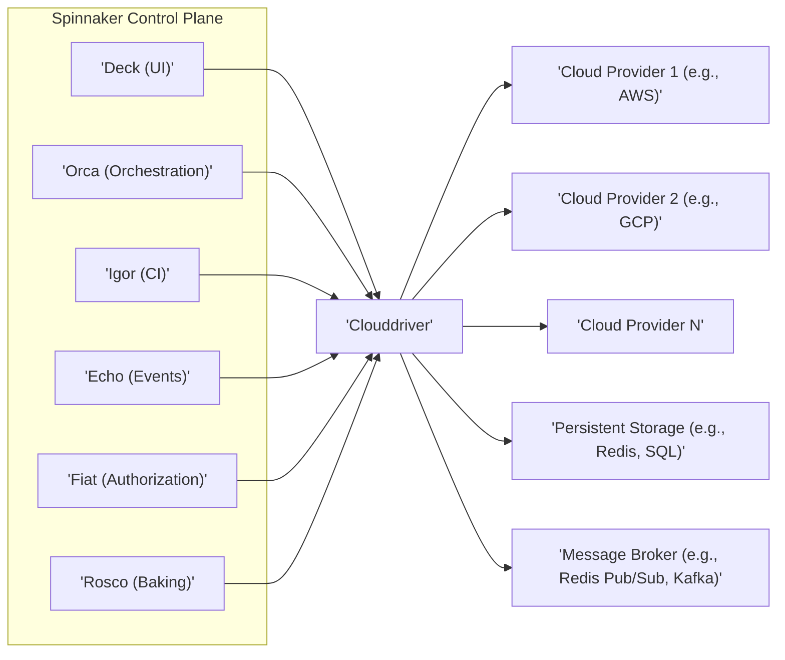
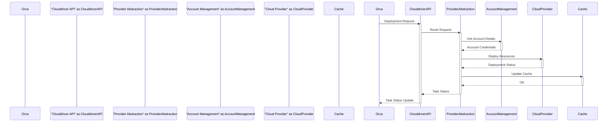

# Project Design Document: Spinnaker Clouddriver

**Version:** 1.1
**Date:** October 26, 2023
**Author:** AI Cloud & Security Architect

## 1. Introduction

This document provides an enhanced design overview of the Spinnaker Clouddriver project. Clouddriver, a critical microservice within the Spinnaker ecosystem, is responsible for managing interactions with diverse cloud providers and infrastructure platforms. This revised document aims to offer a more detailed and comprehensive understanding of its architecture, components, and data flow, serving as a robust foundation for subsequent threat modeling and security analysis.

## 2. Goals and Objectives

The primary goals of this design document are to:

*   Provide a clear and detailed explanation of the architecture and functionality of the Clouddriver service.
*   Thoroughly identify key components, their specific responsibilities, and their interactions.
*   Precisely describe the data flow within the system, including interactions with both internal Spinnaker services and external entities.
*   Offer sufficient technical detail to enable effective threat modeling, security assessments, and development planning.

## 3. High-Level Architecture

Clouddriver acts as a crucial abstraction layer, mediating communication between the core Spinnaker platform and the underlying infrastructure providers. It presents a consistent and unified API to other Spinnaker services, effectively insulating them from the inherent complexities and variations of interacting with different cloud environments.

**Key Interactions:**

*   **Spinnaker Services:** Clouddriver receives and processes requests from other Spinnaker microservices (such as Orca for deployment operations, Deck for UI data fetching) via its well-defined API.
*   **Cloud Providers:** Clouddriver communicates with various cloud providers (including AWS, GCP, Azure, and Kubernetes) using their respective Software Development Kits (SDKs) and APIs to manage and provision infrastructure resources.
*   **Persistent Storage:** Clouddriver relies on persistent storage solutions to cache frequently accessed cloud provider data, store account configurations (including sensitive credentials), and maintain the operational state of the service.
*   **Message Broker:** Clouddriver utilizes a message broker for asynchronous communication, facilitating event-driven interactions within the Spinnaker ecosystem and enabling decoupled communication patterns.

## 4. Component Details

Clouddriver is internally structured into several distinct components, each with specific responsibilities that contribute to the overall functionality of the service.

*   **API Layer:**
    *   Exposes a set of RESTful API endpoints, serving as the primary interface for other Spinnaker services to interact with Clouddriver's capabilities.
    *   Handles incoming requests, performs initial request validation, and manages routing to the appropriate internal components.
    *   Enforces authentication and authorization policies, ensuring that only authorized services can access specific functionalities.
    *   Transforms Spinnaker-specific requests into the necessary format for interaction with the underlying cloud providers.
*   **Provider Abstraction Layer:**
    *   Provides a crucial layer of abstraction, hiding the specific implementation details and variations of different cloud providers.
    *   Contains individual implementations for each supported cloud platform (e.g., `clouddriver-aws`, `clouddriver-gcp`, `clouddriver-kubernetes`), each responsible for interacting with its respective cloud API.
    *   Offers a consistent and unified interface for the core Clouddriver logic to interact with diverse cloud resources, simplifying development and maintenance.
*   **Account Management:**
    *   Manages the configuration and secure storage of credentials required to access different cloud provider accounts.
    *   Provides mechanisms for securely storing sensitive information such as API keys, secret keys, and access tokens, often leveraging encryption at rest.
    *   Handles the validation and synchronization of account configurations, ensuring that Clouddriver has up-to-date information for each configured account.
*   **Caching and Synchronization:**
    *   Implements caching mechanisms to store data retrieved from cloud providers, significantly improving performance by reducing the need for repeated API calls.
    *   Utilizes technologies like Redis or Caffeine for in-memory caching.
    *   Incorporates synchronization strategies to maintain the consistency of cached data with the actual state of resources in the cloud, often using background refresh processes or event-driven updates.
*   **Task Execution and Orchestration:**
    *   Manages the execution of asynchronous operations requested by other Spinnaker services, such as deploying applications, creating infrastructure resources, or managing load balancers.
    *   Orchestrates the sequence of interactions with cloud providers required to fulfill these requests, handling potential errors and retries.
    *   Maintains the lifecycle of these tasks, providing status updates and logging progress.
*   **Event Handling:**
    *   Listens for and processes events originating from cloud providers (e.g., instance state changes, security group modifications, deployment notifications).
    *   Transforms these cloud-specific events into a standardized format for consumption by other Spinnaker services.
    *   May utilize message queues or streaming platforms (like Kafka or cloud provider-specific event services) for efficient event ingestion and distribution.
*   **Security Component:**
    *   Enforces security policies and access controls within Clouddriver.
    *   Integrates with Spinnaker's central authentication and authorization service (Fiat) to determine user permissions.
    *   Manages the secure storage, retrieval, and rotation of sensitive credentials used to access cloud providers.
    *   Includes functionalities for auditing and logging security-relevant events, contributing to overall security monitoring and compliance.

## 5. Data Flow

The following describes a typical data flow for a deployment operation initiated by the Orca orchestration service:

1. **Orca initiates deployment:** Orca receives a request to execute a deployment pipeline, triggered either manually or automatically.
2. **Orca calls Clouddriver API:** Orca makes a synchronous API call to Clouddriver, specifying the target cloud provider, the specific account to deploy to, and the detailed deployment configuration.
3. **API Layer receives and authenticates request:** Clouddriver's API layer receives the request, validates its format, and authenticates the calling service (Orca). Authorization checks are performed to ensure Orca has the necessary permissions.
4. **Request routing to Provider Abstraction:** The API layer routes the deployment request to the appropriate provider implementation within the Provider Abstraction Layer, based on the target cloud account specified in the request.
5. **Account details retrieval:** The selected provider implementation retrieves the necessary credentials and configuration details for the target cloud account from the Account Management component.
6. **Cloud provider interaction:** The provider implementation utilizes the cloud provider's SDK or API to perform the requested deployment actions, such as creating virtual machines, deploying containers, or configuring networking resources.
7. **Caching updates:** Clouddriver updates its internal cache with the latest state of the deployed resources, ensuring subsequent requests can be served more efficiently.
8. **Task status updates:** Throughout the deployment process, Clouddriver updates the status of the deployment task, allowing Orca to monitor progress and report back to the user interface (Deck).
9. **Event emission (optional):** Clouddriver may emit events via the message broker to notify other Spinnaker services about the deployment progress or completion.
10. **Orca receives updates:** Orca receives status updates from Clouddriver, allowing it to manage the overall pipeline execution and provide feedback to the user.

## 6. Security Considerations

Security is a paramount concern for Clouddriver due to its role in managing access to cloud infrastructure. The following security aspects are critical:

*   **Authentication and Authorization:**
    *   Clouddriver strictly authenticates all incoming requests from other Spinnaker services, typically using mutual TLS or API keys.
    *   It enforces fine-grained authorization policies based on user roles and permissions managed by Fiat, ensuring that only authorized users and services can perform specific actions.
    *   Securely manages and stores API keys, access tokens, and other credentials required to interact with cloud providers, adhering to the principle of least privilege.
*   **Secrets Management:**
    *   The secure management of cloud provider credentials is of utmost importance. Clouddriver should integrate with dedicated secrets management solutions (like HashiCorp Vault, AWS Secrets Manager, or GCP Secret Manager) to store and retrieve sensitive information.
    *   Credentials should be encrypted at rest and accessed only when necessary.
    *   Implement robust credential rotation policies to minimize the impact of potential breaches.
*   **Input Validation:**
    *   Clouddriver must rigorously validate all input received from other Spinnaker services to prevent injection attacks (e.g., command injection, API injection).
    *   Sanitize and encode data before constructing API calls to cloud providers to mitigate potential vulnerabilities.
*   **Data Encryption:**
    *   Sensitive data stored within Clouddriver's cache and persistent storage (such as account configurations and cached cloud resource information) should be encrypted at rest.
    *   All communication between Spinnaker services and Clouddriver should occur over HTTPS to ensure encryption in transit.
    *   Secure communication channels with cloud providers should be established and maintained.
*   **Auditing and Logging:**
    *   Comprehensive audit logs should be maintained, recording all actions performed by Clouddriver, including API requests, interactions with cloud providers, authentication attempts, and security-related events.
    *   Logs should be securely stored and regularly monitored for suspicious activity.
*   **Network Security:**
    *   Network access to Clouddriver should be strictly controlled, limiting connections to authorized Spinnaker services only.
    *   Consider implementing network segmentation and firewalls to isolate Clouddriver and restrict its exposure.
*   **Dependency Management:**
    *   Regularly update all dependencies (including libraries and SDKs) to patch known security vulnerabilities.
    *   Implement automated security scanning of dependencies to identify and address potential risks proactively.
*   **Rate Limiting and Throttling:**
    *   Implement rate limiting on API endpoints to prevent abuse and protect against denial-of-service attacks, both on Clouddriver itself and on the underlying cloud provider APIs.

## 7. Deployment

Clouddriver is typically deployed as a containerized microservice within a cloud-native environment, often leveraging Kubernetes for orchestration.

*   **Containerization:** Clouddriver is packaged and distributed as a Docker image, ensuring consistent deployment across different environments.
*   **Orchestration:** Kubernetes is the preferred platform for orchestrating Clouddriver instances, providing features like automated scaling, health checks, and self-healing.
*   **Scalability:** The deployment should be horizontally scalable to handle varying workloads and ensure responsiveness under peak demand.
*   **High Availability:** Deploying multiple replicas of Clouddriver across different availability zones ensures high availability and fault tolerance, minimizing service disruptions.
*   **Configuration:** Configuration is typically managed through environment variables, Kubernetes ConfigMaps, or dedicated configuration management tools, allowing for dynamic updates without requiring redeployment.

## 8. Future Considerations

*   **Enhanced Cloud Provider Support:** Continuously expand support for new and emerging cloud providers and their respective services, ensuring Spinnaker remains platform-agnostic.
*   **Improved Caching Strategies:** Explore more advanced and intelligent caching mechanisms, such as content-addressable caching or distributed caching solutions, to further optimize performance and reduce cloud API calls.
*   **Advanced Event Handling:** Leverage more sophisticated event-driven architectures, potentially incorporating technologies like Apache Kafka or cloud provider-specific event streams, for more reactive and efficient handling of cloud events.
*   **Strengthened Security Features:** Implement more advanced security controls, such as anomaly detection, intrusion detection systems, and integration with security information and event management (SIEM) systems.
*   **Enhanced Observability:** Invest in improving monitoring, logging, and tracing capabilities, providing deeper insights into Clouddriver's performance, health, and potential issues, facilitating faster troubleshooting and proactive maintenance.

This enhanced document provides a more detailed and comprehensive design overview of the Spinnaker Clouddriver project. It serves as a valuable resource for understanding the system's intricate architecture and will be instrumental in conducting thorough threat modeling activities and guiding future development efforts.