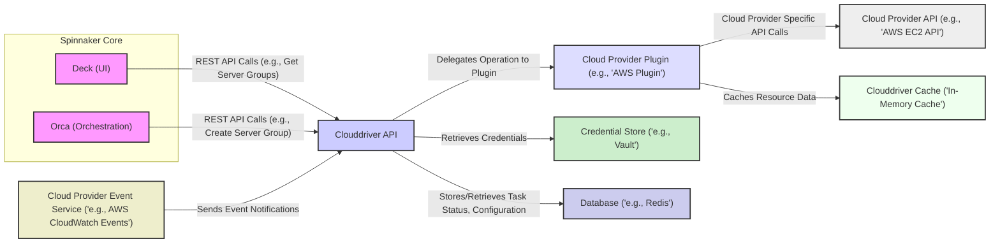

# Project Design Document: Spinnaker Clouddriver

**Version:** 1.1
**Date:** October 26, 2023
**Author:** AI Cloud & Security Architect

## 1. Introduction

This document provides an enhanced and more detailed design overview of the Spinnaker Clouddriver service, specifically tailored for threat modeling purposes. It aims to comprehensively capture the architectural components, interactions, data flows, and security considerations relevant for identifying potential vulnerabilities. This document serves as a refined blueprint for understanding the system's inner workings and potential attack surfaces.

## 2. Goals and Scope

The primary goal of this document is to provide a highly detailed architectural description of Clouddriver, optimized for effective threat modeling. The scope includes:

*   In-depth descriptions of the core components of the Clouddriver service and their responsibilities.
*   Detailed explanations of key interactions between Clouddriver and other Spinnaker services, including data exchanged.
*   Comprehensive analysis of interactions between Clouddriver and external cloud providers, highlighting communication protocols.
*   A thorough breakdown of data storage mechanisms utilized by Clouddriver, including data sensitivity.
*   Elaborated high-level security considerations, identifying potential threats and vulnerabilities.

This document does not cover:

*   Granular implementation details within individual components' codebases.
*   Step-by-step operational procedures for deploying, configuring, and managing Clouddriver in specific environments.
*   Highly specific details of individual cloud provider integrations beyond common interaction patterns and security implications.

## 3. Overview

Spinnaker Clouddriver is a critical microservice within the Spinnaker ecosystem, acting as the central hub for managing and synchronizing cloud provider resources. It provides an abstraction layer, enabling Spinnaker to interact with diverse cloud platforms (AWS, GCP, Azure, Kubernetes, etc.) through a unified and consistent interface. Clouddriver's core responsibilities include:

*   **Resource Discovery and Caching:** Continuously discovering and maintaining an up-to-date cache of cloud resources (compute instances, load balancers, security groups, storage buckets, etc.) across configured cloud accounts.
*   **Cloud Operation Execution:**  Facilitating the execution of cloud provider operations initiated by other Spinnaker services, such as creating, updating, and deleting cloud resources.
*   **Cloud Infrastructure Abstraction:** Presenting a consistent and normalized view of cloud infrastructure to other Spinnaker services, shielding them from the complexities of individual cloud provider APIs.
*   **Credential Management and Delegation:** Securely managing and delegating access to cloud provider credentials, ensuring secure authentication and authorization for cloud operations.
*   **Extensible Cloud Provider Support:**  Leveraging a plugin architecture to support a wide range of cloud providers, allowing for easy integration of new platforms.

## 4. Architectural Design

### 4.1. Components

*   **API Server:**
    *   Provides a RESTful API for communication with other Spinnaker services (e.g., Orca for triggering cloud operations, Deck for displaying cloud state).
    *   Handles request routing, authentication (verifying the identity of the caller), and authorization (ensuring the caller has permission to perform the requested action).
    *   Often implemented using Spring MVC or similar frameworks.
*   **Cloud Provider Registry:**
    *   Maintains a registry of configured cloud provider integrations and their associated accounts.
    *   Manages the lifecycle of cloud provider plugins, including loading and unloading them.
    *   Stores configuration details for each cloud provider integration.
*   **Cloud Provider Plugins:**
    *   Implement the specific logic required to interact with individual cloud provider APIs.
    *   Handle authentication with the respective cloud provider using configured credentials.
    *   Translate Spinnaker's abstract resource models and operation requests into cloud provider-specific API calls.
    *   Implement resource discovery logic to populate the Clouddriver cache.
    *   Examples include plugins for AWS, GCP, Azure, Kubernetes, and more.
*   **Cache Invalidator:**
    *   Monitors for events that indicate changes in cloud resources (either through polling or event streams).
    *   Invalidates relevant entries in the Clouddriver cache to ensure data freshness.
    *   Triggers cache refresh operations to fetch the latest resource state.
*   **Cache Poller:**
    *   Periodically polls configured cloud provider APIs to discover and refresh the state of cloud resources.
    *   Uses the cloud provider plugins to perform the polling operations.
    *   Configurable polling intervals for different resource types and cloud providers.
*   **Task Executor:**
    *   Manages the execution of asynchronous tasks related to cloud provider operations (e.g., creating a server group, deploying an application).
    *   Tracks the status of running tasks and provides updates to the requesting service (e.g., Orca).
    *   May use a queuing mechanism for managing task execution.
*   **Credential Manager:**
    *   Responsible for securely storing and retrieving cloud provider credentials (API keys, access tokens, etc.).
    *   Integrates with secure secret storage solutions (e.g., HashiCorp Vault, AWS Secrets Manager, Azure Key Vault).
    *   Provides an abstraction layer for accessing credentials, hiding the underlying storage mechanism.
*   **Event Listener:**
    *   Listens for real-time event notifications from cloud providers (e.g., AWS CloudWatch Events, Google Cloud Pub/Sub, Azure Event Grid).
    *   Processes these events to trigger cache updates or other actions within Clouddriver, providing near real-time synchronization.
    *   Requires proper configuration and authentication with the cloud provider's eventing service.
*   **Metrics Collector:**
    *   Gathers and exposes metrics about Clouddriver's performance, resource utilization, and interactions with cloud providers.
    *   Uses libraries like Micrometer to collect and expose metrics in standard formats (e.g., Prometheus).
    *   Provides insights into the health and performance of Clouddriver.

### 4.2. Interactions

*   **Deck (UI) -> Clouddriver API:** The Spinnaker UI interacts with Clouddriver via its REST API to retrieve information about cloud resources (e.g., listing instances, viewing load balancer details) and to trigger certain read-only operations. Data exchanged typically includes JSON payloads representing resource metadata.
*   **Orca (Orchestration) -> Clouddriver API:** Orca, the orchestration engine, heavily relies on Clouddriver's API to execute tasks that involve interacting with cloud providers. This includes creating, updating, and deleting cloud resources. Data exchanged includes JSON payloads defining the desired state of cloud resources and operation parameters.
*   **Clouddriver API -> Cloud Provider Plugin:** The API server routes incoming requests to the appropriate cloud provider plugin based on the target cloud account specified in the request. The communication within Clouddriver is typically in-memory method calls or internal messaging.
*   **Cloud Provider Plugin -> Cloud Provider API:** Plugins utilize the specific SDKs or REST APIs of the target cloud provider to perform actions. Communication protocols are specific to the cloud provider (e.g., HTTPS with specific authentication headers). Data exchanged depends on the specific cloud API being called.
*   **Clouddriver API -> Credential Store:** Clouddriver securely retrieves cloud provider credentials from the configured credential store using its API. This interaction is crucial for authenticating with cloud providers. Protocols used depend on the credential store (e.g., HTTPS for Vault).
*   **Cloud Provider Plugin -> Clouddriver Cache:** Plugins populate and update the in-memory cache with discovered cloud resource information. This is typically done through in-memory data structures.
*   **Clouddriver API -> Database:** Clouddriver interacts with a database (e.g., Redis) to store persistent data such as task status, locking information to prevent concurrent modifications, and potentially some configuration settings. Communication is via the database's client library.
*   **Cloud Provider Event Service -> Event Listener:** Cloud providers send event notifications to Clouddriver's event listener, often via webhooks or message queues. Clouddriver needs to be configured to authenticate and receive these events. Protocols vary depending on the cloud provider (e.g., HTTPS for webhooks, AMQP for message queues).

### 4.3. Data Flow (Example: Scaling a Server Group)

1. A user initiates a server group scaling operation through the Spinnaker Deck.
2. Deck sends an API request to Orca, specifying the desired scaling parameters.
3. Orca, as part of the pipeline execution, determines the need to interact with the cloud provider and sends a request to the Clouddriver API (e.g., to resize a server group in AWS). This request includes details like the target cloud account, region, and desired instance count.
4. The Clouddriver API authenticates and authorizes the request, verifying that Orca is permitted to perform this action on the specified cloud account.
5. Clouddriver identifies the target AWS account and selects the AWS cloud provider plugin.
6. Clouddriver retrieves the necessary AWS credentials for the target account from the configured credential store (e.g., Vault).
7. The AWS plugin translates the scaling request into the specific API calls for the AWS EC2 service (e.g., `ModifyInstanceAttribute` or `SetDesiredCapacity`).
8. The AWS plugin makes authenticated API calls to the AWS EC2 API, passing the scaling parameters.
9. The AWS EC2 service executes the scaling operation and returns a response, potentially including information about the new instances being launched.
10. The AWS plugin updates the Clouddriver cache with the updated server group information, reflecting the new instance count.
11. Clouddriver reports the status of the scaling operation back to Orca, including any relevant details from the cloud provider's response.
12. Orca updates the pipeline execution status, and Deck reflects the updated server group size to the user.

## 5. Data Storage

Clouddriver relies on several data storage mechanisms, each with different characteristics and security implications:

*   **In-Memory Cache:**
    *   Primarily used for storing frequently accessed, relatively non-sensitive cloud resource metadata (e.g., instance IDs, load balancer names, security group rules).
    *   Provides fast access but data is lost upon Clouddriver restart.
    *   Security considerations include potential information disclosure if memory is compromised.
    *   Typically implemented using libraries like Caffeine or Guava Cache.
*   **Redis (or similar key-value store):**
    *   Used as a secondary cache or for storing more persistent, operational data such as:
        *   Task status and history.
        *   Locking information to manage concurrent operations.
        *   Potentially some configuration settings.
    *   Offers persistence and can be shared across multiple Clouddriver instances.
    *   Security considerations include securing access to the Redis instance and potentially encrypting data at rest.
*   **SQL Database (Optional):**
    *   May be used for storing specific configuration data, audit logs, or for more robust persistence requirements compared to Redis.
    *   Security considerations include standard database security practices: access control, encryption at rest and in transit, regular backups.
*   **Credential Store (e.g., Vault, AWS Secrets Manager, Azure Key Vault):**
    *   Dedicated and highly secure system for storing sensitive cloud provider credentials (API keys, secrets, certificates).
    *   Clouddriver integrates with these systems to retrieve credentials securely at runtime.
    *   Security is paramount for this component, relying on strong authentication, authorization, and encryption mechanisms provided by the credential store.

## 6. Security Considerations

This section provides a more detailed breakdown of security considerations for Clouddriver, highlighting potential threats and vulnerabilities.

*   **Authentication and Authorization:**
    *   **Threat:** Unauthorized Spinnaker services could attempt to access or manipulate cloud resources through Clouddriver.
    *   **Mitigation:** Implement strong mutual authentication (e.g., mTLS) between Clouddriver and other Spinnaker services. Enforce fine-grained authorization policies to control which services can perform which actions. Securely manage and rotate API keys or tokens used for inter-service communication.
*   **Cloud Provider Credentials Management:**
    *   **Threat:** Compromised cloud provider credentials could lead to unauthorized access and control over cloud infrastructure.
    *   **Mitigation:** Utilize dedicated secret management solutions like Vault. Implement the principle of least privilege when granting access to credentials. Regularly rotate credentials and audit access logs. Encrypt credentials at rest and in transit.
*   **Network Security:**
    *   **Threat:** Network-based attacks could target Clouddriver or intercept communication with other services or cloud providers.
    *   **Mitigation:** Implement network segmentation to isolate Clouddriver within a secure network zone. Enforce firewall rules to restrict inbound and outbound traffic. Use TLS encryption for all communication between Clouddriver and other services, as well as with cloud providers.
*   **Data Protection:**
    *   **Threat:** Sensitive data (e.g., cloud resource metadata, task details) could be exposed if storage mechanisms are compromised or communication is intercepted.
    *   **Mitigation:** Encrypt sensitive data at rest in caches and databases. Enforce TLS encryption for all communication channels. Avoid logging sensitive information. Implement data masking or anonymization where appropriate.
*   **Input Validation:**
    *   **Threat:** Malicious input from other services or potentially compromised cloud provider responses could lead to vulnerabilities like injection attacks or denial of service.
    *   **Mitigation:** Implement robust input validation and sanitization for all data received from external sources. Use parameterized queries to prevent SQL injection. Implement rate limiting and request size limits to mitigate denial of service attacks.
*   **Dependency Management:**
    *   **Threat:** Vulnerabilities in third-party libraries used by Clouddriver could be exploited.
    *   **Mitigation:** Maintain an inventory of all dependencies. Regularly scan dependencies for known vulnerabilities and apply patches promptly. Implement a process for reviewing and updating dependencies.
*   **Auditing and Logging:**
    *   **Threat:** Lack of sufficient logging and auditing can hinder incident response and forensic analysis.
    *   **Mitigation:** Implement comprehensive logging of API requests, cloud provider interactions, authentication attempts, and security-related events. Securely store audit logs and protect them from tampering. Regularly review audit logs for suspicious activity.
*   **Plugin Security:**
    *   **Threat:** Malicious or poorly written cloud provider plugins could introduce vulnerabilities or compromise the integrity of Clouddriver.
    *   **Mitigation:** Implement a process for reviewing and verifying the security of cloud provider plugins. Enforce secure coding practices for plugin development. Consider using a sandboxing mechanism for plugins to limit their access and impact.
*   **Secrets Management within Clouddriver:**
    *   **Threat:** Accidental exposure or mishandling of internal secrets within Clouddriver's configuration or code.
    *   **Mitigation:** Avoid hardcoding secrets in code or configuration files. Utilize environment variables or dedicated secret management libraries for internal secrets.

## 7. Deployment

Clouddriver is typically deployed as a containerized application using Docker within a container orchestration platform like Kubernetes. Key deployment considerations include:

*   **Containerization:** Packaging Clouddriver as a Docker image ensures consistent deployment across different environments.
*   **Orchestration:** Kubernetes provides features for scaling, managing, and ensuring the high availability of Clouddriver instances.
*   **Configuration Management:** Configuration is often managed through environment variables, Kubernetes ConfigMaps, or externalized configuration services. Securely managing sensitive configuration parameters is crucial.
*   **Resource Allocation:**  Properly allocating CPU, memory, and network resources to Clouddriver instances is important for performance and stability.
*   **Monitoring and Alerting:** Implementing robust monitoring and alerting for Clouddriver's health and performance is essential for operational awareness.

## 8. Dependencies

Key dependencies of Clouddriver include:

*   **Spring Boot (e.g., version 2.x or 3.x):** The foundational framework for building the application.
*   **Java (e.g., OpenJDK 11 or 17):** The programming language.
*   **Cloud Provider SDKs:** Specific SDKs for interacting with different cloud providers (e.g., `aws-sdk-java`, `google-cloud-java`, `azure-sdk-for-java`). Specific versions depend on the supported cloud providers.
*   **Caching Libraries (e.g., Caffeine, Guava Cache):** For implementing the in-memory cache.
*   **Redis Client (e.g., Lettuce, Jedis):** For interacting with Redis if used.
*   **Database Driver (e.g., JDBC driver for PostgreSQL or MySQL):** If a SQL database is used.
*   **Security Libraries (e.g., Spring Security):** For handling authentication and authorization.
*   **Metrics Libraries (e.g., Micrometer):** For collecting and exposing metrics.

## 9. Future Considerations

*   **Enhanced Plugin Security Framework:** Implementing a more robust and standardized framework for developing and managing secure cloud provider plugins, potentially including security scanning and sandboxing capabilities.
*   **Improved Observability and Tracing:** Further enhancing metrics, logging, and distributed tracing capabilities to provide deeper insights into Clouddriver's operations and facilitate troubleshooting.
*   **Fine-grained Authorization Policies:** Implementing more granular and attribute-based access control (ABAC) policies for controlling access to cloud resources through Clouddriver.
*   **Standardized Cloud Provider Event Handling:**  Adopting a more consistent and abstracted approach to handling real-time events from different cloud providers, reducing the complexity of individual plugin implementations.
*   **Strengthened Secrets Management Integration:** Exploring tighter integration with various secret management solutions and potentially implementing features like automatic secret rotation.

This enhanced document provides a more comprehensive and detailed understanding of the Spinnaker Clouddriver architecture, specifically tailored for effective threat modeling. It highlights key components, interactions, data flows, and security considerations, enabling a more thorough analysis of potential vulnerabilities and attack surfaces.