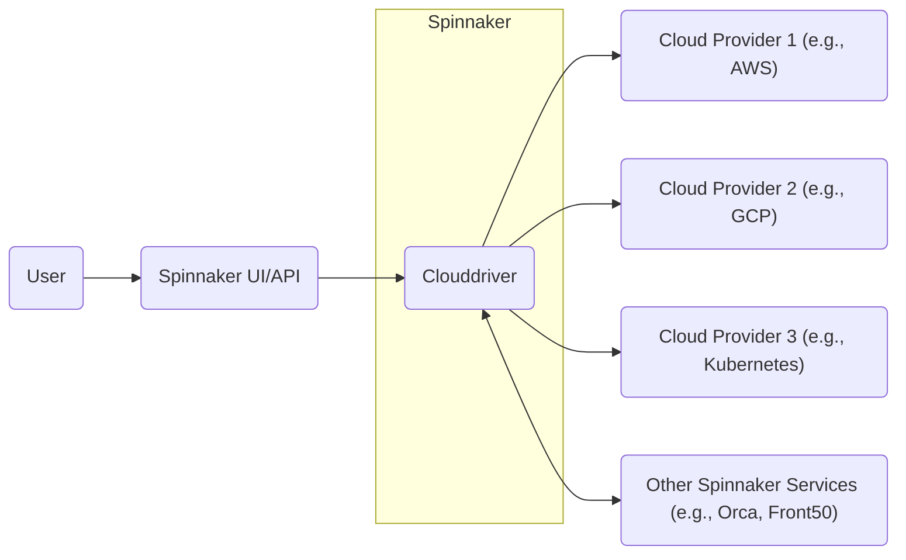
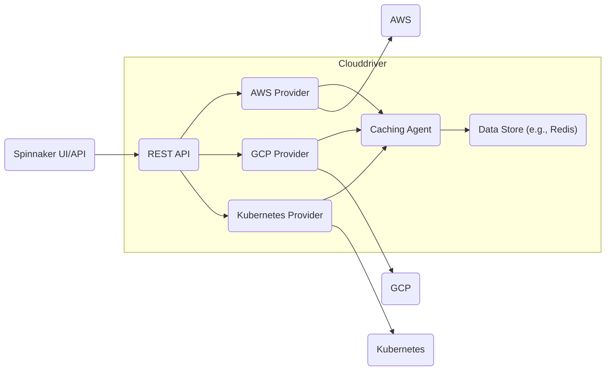
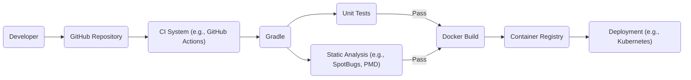

Okay, let's create a design document for Spinnaker's Clouddriver, focusing on aspects relevant to threat modeling.

# BUSINESS POSTURE

Spinnaker is an open-source, multi-cloud continuous delivery platform. Clouddriver is a core component, acting as the bridge between Spinnaker and various cloud providers (AWS, GCP, Azure, Kubernetes, etc.).  It handles cloud resource management and interactions.

Priorities and Goals:

*   Enable rapid and reliable software deployments across multiple cloud environments.
*   Provide a consistent abstraction layer over different cloud provider APIs.
*   Facilitate safe, automated deployments with features like canary analysis and rollbacks.
*   Support a wide range of deployment strategies (blue/green, rolling updates, etc.).
*   Offer extensibility to integrate with new cloud providers and custom deployment logic.
*   Maintain a high degree of availability and resilience, as it's a critical part of the deployment pipeline.

Business Risks:

*   Unauthorized access to cloud resources through Clouddriver, leading to data breaches, service disruption, or financial loss.
*   Compromise of Clouddriver, allowing attackers to inject malicious code or configurations into deployments.
*   Misconfiguration of Clouddriver, leading to unintended deployments, resource leaks, or security vulnerabilities.
*   Lack of visibility into cloud operations performed by Clouddriver, hindering auditing and incident response.
*   Downtime of Clouddriver, blocking deployments and impacting business operations.
*   Vulnerabilities in Clouddriver's dependencies, exposing the system to attack.
*   Failure to properly manage secrets (cloud provider credentials, API keys), leading to unauthorized access.

# SECURITY POSTURE

Existing Security Controls (based on the GitHub repository and common Spinnaker practices):

*   security control: Authentication: Spinnaker (and thus Clouddriver) supports various authentication mechanisms, including OAuth 2.0, SAML, X.509 certificates, and LDAP. This is configured at the Spinnaker level, not specifically within Clouddriver. Described in Spinnaker documentation and configuration files (e.g., `spinnaker-local.yml`).
*   security control: Authorization: Spinnaker provides role-based access control (RBAC) to restrict user actions based on their roles.  Clouddriver operations are subject to these permissions. Described in Spinnaker documentation and configuration files.
*   security control: API Security: Clouddriver exposes a REST API, which should be secured using HTTPS and appropriate authentication/authorization mechanisms. Described in Spinnaker documentation.
*   security control: Cloud Provider Credentials Management: Spinnaker (and Clouddriver) relies on cloud provider credentials (e.g., AWS IAM roles, GCP service accounts) to interact with cloud resources. These credentials should be managed securely, following the principle of least privilege. Described in Spinnaker and cloud provider documentation.
*   security control: Input Validation: Clouddriver should validate inputs received from the Spinnaker API and other sources to prevent injection attacks. Implemented within Clouddriver's code.
*   security control: Auditing: Spinnaker provides audit trails for user actions and deployments. Clouddriver operations should be included in these audit logs. Described in Spinnaker documentation.
*   security control: Dependency Management: Clouddriver uses various third-party libraries.  Efforts should be made to keep these dependencies up-to-date and scan for known vulnerabilities. Implemented in build process and dependency management files (e.g., `build.gradle`).

Accepted Risks:

*   accepted risk: Complexity of multi-cloud deployments: Managing deployments across different cloud providers introduces inherent complexity, increasing the risk of misconfiguration.
*   accepted risk: Reliance on third-party cloud provider APIs: Clouddriver's functionality depends on the availability and security of external cloud provider APIs.
*   accepted risk: Open-source nature: While beneficial for transparency and community contributions, the open-source nature of Spinnaker means that vulnerabilities may be publicly disclosed before patches are available.

Recommended Security Controls:

*   Implement a robust secrets management solution (e.g., HashiCorp Vault) to securely store and manage cloud provider credentials and other sensitive data.
*   Integrate static application security testing (SAST) and dynamic application security testing (DAST) tools into the Clouddriver build and deployment pipeline.
*   Implement a software composition analysis (SCA) tool to identify and track vulnerabilities in third-party dependencies.
*   Regularly conduct penetration testing and security assessments of Clouddriver and the entire Spinnaker deployment.
*   Implement network segmentation to isolate Clouddriver from other Spinnaker components and external networks.
*   Enable detailed logging and monitoring of Clouddriver's activities, including API calls, cloud provider interactions, and internal operations.

Security Requirements:

*   Authentication:
    *   Support for strong authentication mechanisms (multi-factor authentication).
    *   Integration with existing enterprise identity providers.
    *   Secure handling of session tokens and credentials.

*   Authorization:
    *   Fine-grained access control based on roles and responsibilities.
    *   Principle of least privilege for cloud provider credentials.
    *   Ability to restrict access to specific cloud resources and operations.

*   Input Validation:
    *   Strict validation of all inputs received from the Spinnaker API and other sources.
    *   Protection against common web vulnerabilities (e.g., XSS, SQL injection, command injection).
    *   Validation of cloud provider API responses.

*   Cryptography:
    *   Use of strong encryption algorithms and protocols (e.g., TLS 1.2+ for API communication).
    *   Secure storage of sensitive data at rest.
    *   Proper management of cryptographic keys.

# DESIGN

## C4 CONTEXT



Element Descriptions:

*   Element:
    *   Name: User
    *   Type: Person
    *   Description: A developer, operator, or other user interacting with Spinnaker.
    *   Responsibilities: Initiates deployments, manages applications, configures pipelines.
    *   Security controls: Authentication, Authorization (managed by Spinnaker).

*   Element:
    *   Name: Spinnaker UI/API
    *   Type: Software System
    *   Description: The user interface and API entry point for Spinnaker.
    *   Responsibilities: Provides a user interface for interacting with Spinnaker, handles API requests.
    *   Security controls: Authentication, Authorization, Input Validation, HTTPS.

*   Element:
    *   Name: Clouddriver
    *   Type: Software System
    *   Description: The core component of Spinnaker that interacts with cloud providers.
    *   Responsibilities: Manages cloud resources, executes deployments, retrieves cloud provider data.
    *   Security controls: Authentication, Authorization, Input Validation, Cloud Provider Credentials Management, Auditing.

*   Element:
    *   Name: Cloud Provider 1 (e.g., AWS)
    *   Type: External System
    *   Description: A cloud provider platform (e.g., Amazon Web Services).
    *   Responsibilities: Provides cloud infrastructure and services.
    *   Security controls: Managed by the cloud provider, accessed via secure APIs and credentials.

*   Element:
    *   Name: Cloud Provider 2 (e.g., GCP)
    *   Type: External System
    *   Description: A cloud provider platform (e.g., Google Cloud Platform).
    *   Responsibilities: Provides cloud infrastructure and services.
    *   Security controls: Managed by the cloud provider, accessed via secure APIs and credentials.

*   Element:
    *   Name: Cloud Provider 3 (e.g., Kubernetes)
    *   Type: External System
    *   Description: A container orchestration platform (e.g., Kubernetes).
    *   Responsibilities: Manages containerized applications.
    *   Security controls: Managed by the Kubernetes platform, accessed via secure APIs and credentials.

*   Element:
    *   Name: Other Spinnaker Services (e.g., Orca, Front50)
    *   Type: Software System
    *   Description: Other components of Spinnaker that interact with Clouddriver.
    *   Responsibilities: Orchestration (Orca), persistence (Front50), etc.
    *   Security controls: Internal communication security, authentication, authorization.

## C4 CONTAINER



Element Descriptions:

*   Element:
    *   Name: REST API
    *   Type: API
    *   Description: The primary interface for interacting with Clouddriver.
    *   Responsibilities: Handles requests from the Spinnaker API and other services.
    *   Security controls: Authentication, Authorization, Input Validation, HTTPS.

*   Element:
    *   Name: AWS Provider
    *   Type: Component
    *   Description: Code responsible for interacting with AWS APIs.
    *   Responsibilities: Manages AWS resources, executes AWS-specific operations.
    *   Security controls: AWS Credentials Management, IAM Role-Based Access, AWS API Security.

*   Element:
    *   Name: GCP Provider
    *   Type: Component
    *   Description: Code responsible for interacting with GCP APIs.
    *   Responsibilities: Manages GCP resources, executes GCP-specific operations.
    *   Security controls: GCP Credentials Management, Service Account-Based Access, GCP API Security.

*   Element:
    *   Name: Kubernetes Provider
    *   Type: Component
    *   Description: Code responsible for interacting with Kubernetes APIs.
    *   Responsibilities: Manages Kubernetes resources, executes Kubernetes-specific operations.
    *   Security controls: Kubernetes Credentials Management, RBAC, Kubernetes API Security.

*   Element:
    *   Name: Caching Agent
    *   Type: Component
    *   Description: Caches cloud provider data to improve performance and reduce API calls.
    *   Responsibilities: Retrieves and stores cloud provider data in the data store.
    *   Security controls: Data encryption (if sensitive data is cached), access control to the data store.

*   Element:
    *   Name: Data Store (e.g., Redis)
    *   Type: Data Store
    *   Description: Stores cached data and potentially other Clouddriver state.
    *   Responsibilities: Provides persistent storage for Clouddriver.
    *   Security controls: Access control, data encryption (if sensitive data is stored).

## DEPLOYMENT

Possible Deployment Solutions:

1.  Kubernetes: Deploy Clouddriver as a containerized application within a Kubernetes cluster. This is a common and recommended approach.
2.  Virtual Machines: Deploy Clouddriver on virtual machines within a cloud provider environment (e.g., AWS EC2 instances).
3.  Bare Metal: Deploy Clouddriver on physical servers. This is less common for cloud-native applications.

Chosen Solution (Kubernetes):

```mermaid
graph LR
    subgraph Kubernetes Cluster
        subgraph Namespace (spinnaker)
            pod1("Clouddriver Pod 1")
            pod2("Clouddriver Pod 2")
            pod3("Clouddriver Pod 3")
            service("Clouddriver Service")
            ingress("Ingress")
        end
        data_store("External Data Store (e.g., Redis)")
    end
    internet("Internet")
    internet --> ingress
    ingress --> service
    service --> pod1
    service --> pod2
    service --> pod3
    pod1 --> data_store
    pod2 --> data_store
    pod3 --> data_store
```

Element Descriptions:

*   Element:
    *   Name: Kubernetes Cluster
    *   Type: Infrastructure
    *   Description: The Kubernetes cluster where Spinnaker is deployed.
    *   Responsibilities: Provides the container orchestration environment.
    *   Security controls: Kubernetes security best practices (RBAC, network policies, pod security policies, etc.).

*   Element:
    *   Name: Namespace (spinnaker)
    *   Type: Logical Isolation
    *   Description: A Kubernetes namespace dedicated to Spinnaker components.
    *   Responsibilities: Provides logical isolation for Spinnaker resources.
    *   Security controls: Kubernetes namespace-level security policies.

*   Element:
    *   Name: Clouddriver Pod 1, Pod 2, Pod 3
    *   Type: Container Instance
    *   Description: Instances of the Clouddriver container running within Kubernetes pods.
    *   Responsibilities: Executes Clouddriver code.
    *   Security controls: Container security best practices (image scanning, least privilege, etc.).

*   Element:
    *   Name: Clouddriver Service
    *   Type: Service
    *   Description: A Kubernetes service that provides a stable endpoint for accessing Clouddriver pods.
    *   Responsibilities: Load balances traffic across Clouddriver pods.
    *   Security controls: Kubernetes service-level security policies.

*   Element:
    *   Name: Ingress
    *   Type: Ingress Controller
    *   Description: A Kubernetes ingress controller that manages external access to the Clouddriver service.
    *   Responsibilities: Routes external traffic to the Clouddriver service.
    *   Security controls: TLS termination, authentication, authorization (if configured).

*   Element:
    *   Name: External Data Store (e.g., Redis)
    *   Type: External Service
    *   Description: An external data store (e.g., Redis) used by Clouddriver for caching.
    *   Responsibilities: Provides persistent storage for cached data.
    *   Security controls: Access control, data encryption, network security.
* Element:
    *   Name: Internet
    *   Type: External Network
    *   Description: External network.
    *   Responsibilities: Provides access to Spinnaker.
    *   Security controls: Firewall, WAF.

## BUILD

Clouddriver, being a Java (and Groovy) project, typically uses Gradle as its build system. The build process likely involves the following steps:

1.  Developer commits code to the GitHub repository.
2.  A continuous integration (CI) system (e.g., GitHub Actions, Jenkins, Travis CI) is triggered.
3.  The CI system checks out the code.
4.  Gradle is used to compile the code, run unit tests, and potentially perform static analysis.
5.  If all tests and checks pass, a Docker image is built, containing the compiled Clouddriver application and its dependencies.
6.  The Docker image is pushed to a container registry (e.g., Docker Hub, Google Container Registry, Amazon ECR).
7.  Spinnaker (or another deployment tool) can then deploy this image to the target environment (e.g., Kubernetes).



Security Controls in Build Process:

*   Source Code Management: GitHub provides access control, versioning, and audit trails for code changes.
*   CI/CD Pipeline: Automates the build and deployment process, ensuring consistency and reducing manual errors.
*   Dependency Management: Gradle manages dependencies, but additional tools (e.g., OWASP Dependency-Check) should be used to scan for vulnerabilities.
*   Static Analysis: Tools like SpotBugs, PMD, or Find Security Bugs can be integrated into the Gradle build to identify potential security issues in the code.
*   Container Image Scanning: The Docker image should be scanned for vulnerabilities before being pushed to the registry. Tools like Clair, Trivy, or Anchore can be used.
*   Signed Commits: Developers should sign their commits to ensure code integrity.
*   Least Privilege: The CI/CD system should have the minimum necessary permissions to perform its tasks.

# RISK ASSESSMENT

Critical Business Processes:

*   Software Deployment: Clouddriver is critical for deploying software to various cloud environments. Any disruption or compromise of Clouddriver can directly impact the ability to release new features and updates.
*   Cloud Resource Management: Clouddriver manages cloud resources on behalf of the organization. Unauthorized access or misconfiguration can lead to significant financial and operational consequences.

Data Sensitivity:

*   Cloud Provider Credentials: Clouddriver handles sensitive cloud provider credentials, which, if compromised, could grant attackers access to the organization's entire cloud infrastructure. This is HIGH sensitivity data.
*   Deployment Configurations: Clouddriver stores and processes deployment configurations, which may contain sensitive information about the application and its environment. This is MEDIUM to HIGH sensitivity data.
*   Cached Cloud Data: Clouddriver caches cloud provider data, which may include information about running instances, network configurations, and other resources. This is MEDIUM sensitivity data.
*   Application Code (Indirectly): While Clouddriver doesn't directly store application code, it facilitates its deployment. A compromise of Clouddriver could allow attackers to inject malicious code into deployments. This is HIGH sensitivity data.
*   Audit Logs: Clouddriver's audit logs contain information about user actions and cloud operations. This is MEDIUM sensitivity data.

# QUESTIONS & ASSUMPTIONS

Questions:

*   What specific cloud providers are being used with Clouddriver? (This impacts the specific security controls and configurations needed.)
*   What is the existing secrets management solution, if any?
*   What is the current CI/CD pipeline used for building and deploying Clouddriver?
*   What are the specific compliance requirements (e.g., PCI DSS, HIPAA, SOC 2) that apply to the environment where Clouddriver is deployed?
*   What is the network topology and security zoning of the environment where Clouddriver is deployed?
*   What level of access do developers have to the production environment?
*   Are there any existing security monitoring and alerting systems in place?
*   What is the disaster recovery and business continuity plan for Spinnaker and Clouddriver?

Assumptions:

*   BUSINESS POSTURE: The organization prioritizes rapid and reliable software deployments. The organization has a moderate risk appetite, but prioritizes security for critical infrastructure components like Clouddriver.
*   SECURITY POSTURE: Basic security controls (authentication, authorization, HTTPS) are in place for Spinnaker. Cloud provider credentials are managed securely, following the principle of least privilege. There is some level of auditing and monitoring in place.
*   DESIGN: Clouddriver is deployed in a Kubernetes cluster. A data store (e.g., Redis) is used for caching. The build process uses Gradle and a CI/CD system.