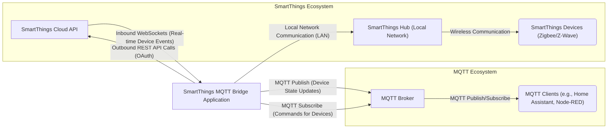

# Project Design Document: SmartThings MQTT Bridge

**Version:** 1.1
**Date:** October 26, 2023
**Author:** AI Cloud & Security Architect

## 1. Project Overview

The SmartThings MQTT Bridge is a crucial software application designed to seamlessly bridge the communication gap between a Samsung SmartThings home automation ecosystem and an MQTT (Message Queuing Telemetry Transport) broker. This bridge acts as a vital intermediary, intelligently translating events and commands flowing between these two distinct systems. Its primary function is to empower users with the ability to control their SmartThings devices and receive real-time status updates through a standard MQTT broker. This capability unlocks significant integration potential with a broader spectrum of home automation platforms, monitoring tools, and custom-built applications that natively support the MQTT protocol.

## 2. Goals and Objectives

* **Comprehensive Bidirectional Communication:**  Establish a robust two-way communication channel, enabling the transmission of commands *to* SmartThings devices via MQTT and the reception of SmartThings device status updates *as* MQTT messages. This ensures a fully interactive integration.
* **Simplified and Standardized Integration:** Provide a user-friendly and straightforward mechanism for integrating diverse SmartThings devices into existing or new MQTT-centric home automation environments, reducing complexity and promoting interoperability.
* **Granular Customization and Enhanced Flexibility:** Offer extensive configuration options, allowing users to fine-tune MQTT topic structures and message payloads to align with their specific needs and preferred conventions. This adaptability is key for seamless integration with various MQTT ecosystems.
* **Reliable and Resilient Operation:** Ensure consistent, dependable, and fault-tolerant communication between the SmartThings environment and the designated MQTT broker, minimizing disruptions and ensuring real-time responsiveness.
* **Streamlined and Accessible Deployment:** Facilitate a simple and intuitive installation and configuration process across a range of deployment platforms, lowering the barrier to entry for users with varying technical expertise.

## 3. Target Audience

This document is specifically tailored for the following key stakeholders:

* **Software Developers:**  Individuals responsible for the ongoing maintenance, feature enhancements, and collaborative contributions to the SmartThings MQTT Bridge codebase.
* **Cybersecurity Engineers:** Professionals tasked with performing thorough threat modeling exercises and implementing security measures to safeguard the integrity and confidentiality of the system.
* **System Operators/Administrators:** Personnel responsible for the deployment, configuration, ongoing management, and monitoring of the SmartThings MQTT Bridge within operational environments.
* **Home Automation End-Users:** Individuals who will directly benefit from using the bridge to integrate their SmartThings devices with their preferred MQTT-based home automation solutions and custom applications.

## 4. Scope

This detailed design document comprehensively outlines the core components, functionalities, and interactions of the SmartThings MQTT Bridge, based on the information available in the provided GitHub repository. The scope encompasses:

* **Architectural Overview:** A clear depiction of the bridge's architecture and its interactions with the external SmartThings and MQTT ecosystems.
* **Detailed Component Breakdown:** In-depth descriptions of the key software components that constitute the bridge.
* **Data Flow Analysis:** A comprehensive explanation of the pathways and transformations of data as it moves between the interconnected systems.
* **Technology Stack Identification:** A clear listing of the technologies, programming languages, and libraries utilized in the development of the bridge.
* **Deployment Considerations:**  An overview of various deployment models and their implications.
* **Initial Security Considerations:**  A preliminary assessment of key security aspects and potential vulnerabilities relevant for subsequent threat modeling activities.

The scope of this document explicitly excludes:

* **Low-Level Implementation Details:** Specific code implementations, algorithms, or data structures within the bridge's codebase.
* **Broker-Specific Configuration:** Detailed configuration instructions tailored to individual MQTT broker implementations (e.g., Mosquitto, HiveMQ).
* **Advanced or Experimental Features:** Functionalities or extensions not explicitly documented as part of the core functionality within the bridge's repository.
* **Platform Internals:**  Detailed explanations of the internal workings of either the Samsung SmartThings platform or the specific MQTT broker being used.

## 5. Architecture Diagram

## 6. Component Descriptions

The SmartThings MQTT Bridge is logically structured into the following core components, each with specific responsibilities:

* **SmartThings API Interaction Module:**
    * **Responsibility:**  Manages all communication with the SmartThings Cloud API.
    * **Functionality:**
        * Handles the initial OAuth authentication flow to obtain necessary access tokens.
        * Periodically refreshes access tokens to maintain API connectivity.
        * Executes REST API calls to retrieve device lists, device details, and current device states.
        * Establishes and maintains a persistent WebSocket connection to receive real-time event streams from the SmartThings cloud, ensuring timely updates.
        * Constructs and sends commands to SmartThings devices via authenticated API calls.
* **MQTT Broker Communication Module:**
    * **Responsibility:**  Manages the connection and communication with the designated MQTT broker.
    * **Functionality:**
        * Establishes a connection to the MQTT broker using configured credentials (hostname, port, username, password, TLS settings).
        * Publishes SmartThings device state updates as MQTT messages to configurable topics.
        * Subscribes to specific MQTT topics to receive commands intended for SmartThings devices.
        * Handles connection management, including reconnecting in case of network interruptions.
        * Potentially implements message queuing or buffering for reliability.
* **Central Configuration Management:**
    * **Responsibility:**  Loads, validates, and manages the bridge's configuration parameters.
    * **Functionality:**
        * Reads configuration settings from files (e.g., JSON, YAML) or environment variables.
        * Allows users to define MQTT broker connection details.
        * Enables customization of MQTT topic structures for publishing device states (e.g., using device names, capabilities).
        * Provides options for defining the MQTT topics to subscribe to for sending commands to SmartThings devices.
        * May include filtering options to select specific SmartThings devices to be bridged.
        * Validates configuration parameters to prevent errors.
* **SmartThings Event Processing Engine:**
    * **Responsibility:**  Processes real-time device events received from the SmartThings API.
    * **Functionality:**
        * Receives raw device event data from the SmartThings API Interaction Module.
        * Transforms these events into structured MQTT messages according to the configured topic structure and payload format.
        * Publishes the formatted MQTT messages to the MQTT Broker using the MQTT Broker Communication Module.
        * May include logic for filtering or transforming event data before publishing.
* **MQTT Command Processing Engine:**
    * **Responsibility:**  Processes incoming MQTT messages representing commands for SmartThings devices.
    * **Functionality:**
        * Receives MQTT messages from the MQTT Broker Communication Module on subscribed command topics.
        * Parses the MQTT message payload to extract the target device identifier and the desired command.
        * Translates the generic MQTT command into the specific API call required by the SmartThings API for the target device.
        * Utilizes the SmartThings API Interaction Module to send the translated command to the SmartThings platform.
        * May include error handling and logging for invalid or malformed commands.
* **Comprehensive Logging and Monitoring:**
    * **Responsibility:**  Provides detailed logging and monitoring capabilities for the bridge's operation.
    * **Functionality:**
        * Records significant events, informational messages, warnings, and errors encountered during the bridge's operation.
        * Allows configuration of logging levels to control the verbosity of the logs.
        * Supports different log output destinations (e.g., console, file).
        * May include metrics reporting for monitoring performance and identifying potential issues.

## 7. Data Flow

The following outlines the typical pathways and transformations of data within the SmartThings MQTT Bridge:

* **Initiating Connection and Synchronization:**
    1. On startup, the Bridge uses the Configuration Manager to load settings.
    2. The SmartThings API Interaction Module authenticates with the SmartThings Cloud API using OAuth.
    3. The MQTT Broker Communication Module establishes a connection to the configured MQTT Broker.
    4. The SmartThings API Interaction Module may initially retrieve a list of current devices and their states from the SmartThings API to provide an initial state synchronization.
* **SmartThings Device State Update Propagation to MQTT:**
    1. A physical SmartThings device changes its state (e.g., a door sensor opens).
    2. The SmartThings Hub detects the change and reports the event to the SmartThings Cloud API.
    3. The SmartThings Cloud API pushes the real-time event data to the Bridge via the established persistent WebSocket connection.
    4. The Bridge's SmartThings Event Processing Engine receives the raw event data.
    5. The Event Processor transforms the event data into a structured MQTT message, adhering to the configured topic structure and payload format (e.g., `smartthings/DEVICE_NAME/ATTRIBUTE/state: VALUE`).
    6. The Bridge's MQTT Broker Communication Module publishes the formatted MQTT message to the designated topic on the MQTT Broker.
    7. MQTT clients that have subscribed to the relevant topic on the MQTT Broker receive the device state update.
* **MQTT Command Transmission to SmartThings Device:**
    1. An MQTT client (e.g., a home automation controller) publishes a command message to a specific topic on the MQTT Broker (e.g., `smartthings/LIVING_ROOM_LIGHT/commands/set_level`).
    2. The Bridge's MQTT Broker Communication Module, having subscribed to this command topic, receives the MQTT message.
    3. The Bridge's MQTT Command Processing Engine parses the MQTT message payload to identify the target SmartThings device and the intended command (e.g., set the "LIVING_ROOM_LIGHT" level to "80").
    4. The Command Processor translates the generic MQTT command into the specific API call required by the SmartThings Cloud API to control the target device (e.g., a POST request to `/devices/{deviceId}/commands` with the appropriate parameters).
    5. The Bridge's SmartThings API Interaction Module sends the constructed command to the SmartThings Cloud API.
    6. The SmartThings Cloud API relays the command to the appropriate SmartThings Hub.
    7. The SmartThings Hub communicates the command to the target physical device (e.g., via Zigbee or Z-Wave).
    8. The SmartThings device executes the received command.

## 8. Technology Stack

The SmartThings MQTT Bridge is typically built using the following technologies:

* **Primary Programming Language:**  Node.js (predominantly used for building such integration bridges due to its asynchronous nature and rich ecosystem).
* **MQTT Client Library (Node.js):**  A robust MQTT client library for Node.js, such as `mqtt.js` or `node-red-node-mqtt`, to handle MQTT protocol interactions.
* **HTTP/HTTPS Client Library (Node.js):** A library for making HTTP and HTTPS requests to interact with the SmartThings REST API, such as `axios` or the built-in `https` module.
* **WebSocket Client Library (Node.js):** A library for establishing and managing WebSocket connections for receiving real-time events from the SmartThings API, such as `ws` or `socket.io-client`.
* **Configuration Management Libraries (Node.js):** Libraries for parsing configuration files in formats like JSON (built-in `JSON` object) or YAML (`js-yaml`).
* **Logging Library (Node.js):** A logging library for managing application logs, such as `winston`, `pino`, or `bunyan`.
* **Potentially:**  A process management tool like `pm2` or `systemd` for ensuring the bridge runs reliably in the background.

## 9. Deployment Model

The SmartThings MQTT Bridge offers flexibility in its deployment options:

* **Direct Installation on a Local Server:** The bridge can be installed and executed directly on a local machine, such as a Raspberry Pi, a home server, or a desktop computer. This requires Node.js and its dependencies to be installed on the host operating system.
* **Containerization using Docker:** Packaging the bridge as a Docker container provides a self-contained environment with all necessary dependencies. This simplifies deployment and management across different systems and ensures consistency. Container orchestration platforms like Docker Compose or Kubernetes can be used for managing containerized deployments.
* **Deployment on a Cloud Instance:** The bridge can be deployed on a virtual machine or a container service (e.g., AWS EC2, Google Cloud Compute Engine, Azure Virtual Machines, AWS ECS, Google Cloud Run, Azure Container Instances) in a cloud environment, offering scalability and high availability.

The chosen deployment model will have implications for network configuration, resource management, and security considerations.

## 10. Key Security Considerations

The following outlines crucial security considerations that are essential for threat modeling and ensuring the security of the SmartThings MQTT Bridge:

* **Secure Handling of SmartThings API Credentials (OAuth Tokens):**
    * **Threat:**  Compromise of OAuth access and refresh tokens could allow unauthorized access to the user's SmartThings account and control over their devices.
    * **Considerations:** Implement secure storage mechanisms for these tokens (e.g., encrypted files, secure key stores). Avoid storing credentials in plain text. Ensure proper access controls to the storage location.
* **Secure Management of MQTT Broker Credentials:**
    * **Threat:**  Exposure of MQTT broker credentials (username/password) could allow unauthorized parties to publish or subscribe to MQTT topics, potentially disrupting the system or gaining control over devices.
    * **Considerations:** Store MQTT broker credentials securely. Utilize strong, unique passwords. Consider using certificate-based authentication where supported by the MQTT broker.
* **Encryption of Communication Channels:**
    * **Threat:**  Unencrypted communication between the bridge and the SmartThings API or the MQTT broker could expose sensitive data (device states, commands) to eavesdropping.
    * **Considerations:** Enforce the use of HTTPS/WSS for communication with the SmartThings API. Configure the MQTT client to use TLS/SSL for secure communication with the MQTT broker.
* **Input Validation and Sanitization:**
    * **Threat:**  Improper validation of data received from the SmartThings API or MQTT broker could lead to vulnerabilities like injection attacks (e.g., command injection) or unexpected behavior.
    * **Considerations:** Implement robust input validation and sanitization for all data received from external sources. Specifically, carefully handle data within MQTT payloads and API responses.
* **Authorization and Access Control within the MQTT Broker:**
    * **Threat:**  Lack of proper authorization on the MQTT broker could allow unauthorized clients to publish commands or subscribe to sensitive device state topics.
    * **Considerations:** Leverage the MQTT broker's authentication and authorization mechanisms to restrict access to specific topics based on client credentials. Follow the principle of least privilege.
* **Dependency Vulnerability Management:**
    * **Threat:**  Using outdated or vulnerable dependencies (Node.js libraries) could expose the bridge to known security flaws.
    * **Considerations:** Regularly audit and update dependencies to their latest secure versions. Utilize tools like `npm audit` or `yarn audit` to identify and address vulnerabilities.
* **Secure Logging Practices:**
    * **Threat:**  Logs may inadvertently contain sensitive information (e.g., device names, user identifiers). Unsecured logs could be accessed by unauthorized individuals.
    * **Considerations:** Implement secure storage and access controls for log files. Avoid logging sensitive data unnecessarily. Consider redacting or masking sensitive information in logs.
* **Network Security Measures:**
    * **Threat:**  The network where the bridge is deployed might be vulnerable to attacks, potentially compromising the bridge itself or the communication channels.
    * **Considerations:** Implement firewall rules to restrict network access to the bridge and the MQTT broker. Isolate the bridge within a secure network segment if possible.
* **Protection Against Code Injection (If Applicable):**
    * **Threat:** If the bridge incorporates any form of scripting or plugin functionality, vulnerabilities could allow malicious code execution.
    * **Considerations:**  Carefully design and implement any scripting or plugin capabilities with security in mind. Sanitize inputs and outputs. Implement appropriate sandboxing or isolation techniques.

This initial set of security considerations provides a strong starting point for a more in-depth threat modeling process. A thorough threat model will systematically analyze each component and data flow to identify potential vulnerabilities, assess their risk, and define appropriate mitigation strategies.