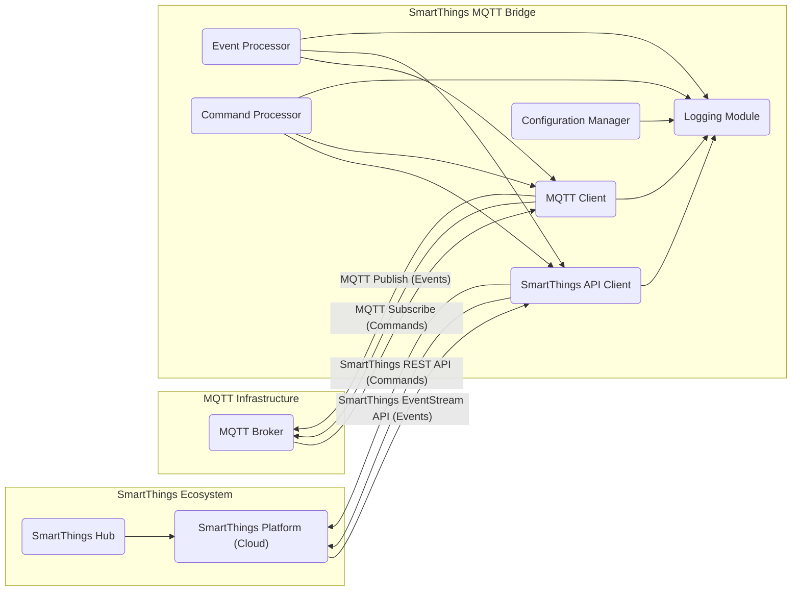

# Project Design Document: SmartThings MQTT Bridge

**Version:** 1.1
**Date:** October 26, 2023
**Author:** AI Software Architect

## 1. Introduction

This document provides a detailed design overview of the SmartThings MQTT Bridge project, as found on GitHub at [https://github.com/stjohnjohnson/smartthings-mqtt-bridge](https://github.com/stjohnjohnson/smartthings-mqtt-bridge). This document aims to clearly articulate the system's architecture, components, data flow, and key considerations for subsequent threat modeling activities.

The SmartThings MQTT Bridge acts as an intermediary service, translating real-time events and commands between the Samsung SmartThings ecosystem and a standard MQTT broker. This enables seamless integration with a wider range of home automation systems, custom dashboards, and other applications that utilize the MQTT protocol, effectively extending the interoperability of a SmartThings smart home setup.

## 2. Goals and Objectives

*   Provide a clear and comprehensive understanding of the SmartThings MQTT Bridge architecture and its operational principles.
*   Identify and describe the core components of the bridge and their specific responsibilities and interactions.
*   Detail the flow of data through the system for both event reporting and command execution.
*   Highlight potential areas of interest and specific concerns relevant to security analysis and threat modeling exercises.

## 3. High-Level Architecture

The SmartThings MQTT Bridge operates as a persistent application, typically running on a local network, facilitating communication between two distinct external systems:

*   **SmartThings Platform:** The cloud-based platform provided by Samsung, responsible for managing SmartThings devices, executing automations, and providing a central API for interaction. The bridge communicates with this platform via its publicly documented REST API.
*   **MQTT Broker:** A message broker implementing the lightweight MQTT publish/subscribe protocol. The bridge establishes a persistent connection to this broker to publish messages representing SmartThings device state changes and subscribe to topics for receiving commands intended for SmartThings devices.

The core function of the bridge is to act as a bidirectional translator, converting SmartThings event notifications into structured MQTT messages and transforming MQTT commands into actionable requests for the SmartThings API.

## 4. Detailed Design

### 4.1. Components

*   **SmartThings API Client:**
    *   Manages secure authentication with the SmartThings API using a long-lived OAuth Personal Access Token.
    *   Establishes and maintains a subscription to the SmartThings EventStream API to receive real-time device events.
    *   Constructs and sends REST API calls to the SmartThings platform to execute commands on devices.
    *   Implements logic to handle API rate limits, error responses, and potential transient network issues.
*   **MQTT Client:**
    *   Establishes and maintains a persistent connection to the configured MQTT broker, potentially using TLS/SSL for encrypted communication.
    *   Authenticates with the MQTT broker using provided credentials (username/password or client certificates, if configured).
    *   Publishes MQTT messages to designated topics representing SmartThings device events and their attributes.
    *   Subscribes to specific MQTT topics to receive commands intended for controlling SmartThings devices.
    *   Handles MQTT connection management, including automatic reconnection attempts in case of connection loss.
*   **Configuration Manager:**
    *   Loads and validates configuration parameters from a designated file (e.g., `config.yaml`, `.env` file) or environment variables.
    *   Manages sensitive settings securely, such as:
        *   SmartThings Personal Access Token.
        *   MQTT broker address (hostname or IP address) and port.
        *   MQTT broker authentication credentials (username, password, or paths to client certificates).
        *   MQTT topic prefixes and mappings for devices and commands.
        *   Optional filtering rules for specific devices or events.
*   **Event Processor:**
    *   Receives raw event data from the SmartThings API Client.
    *   Parses and transforms the SmartThings event data into a structured format suitable for MQTT publication (typically JSON).
    *   Constructs the MQTT topic based on configured mappings and the device/attribute involved in the event.
    *   Publishes the formatted MQTT message to the MQTT Broker via the MQTT Client.
*   **Command Processor:**
    *   Receives MQTT messages from the MQTT Client on the subscribed command topics.
    *   Parses the MQTT message payload to extract the target SmartThings device ID, the command to be executed, and any associated parameters.
    *   Constructs the appropriate SmartThings API request (including the target device ID and command) based on the parsed MQTT message.
    *   Sends the API request to the SmartThings API via the SmartThings API Client.
    *   May implement error handling and logging for failed command executions.
*   **Logging Module:**
    *   Provides comprehensive logging functionality for monitoring, debugging, and auditing purposes.
    *   Logs application startup, configuration loading, API interactions (requests and responses), MQTT connection status, and event/command processing details.
    *   Supports different logging levels (e.g., DEBUG, INFO, WARNING, ERROR) and output destinations (e.g., console, file).

### 4.2. Data Flow

The system facilitates bidirectional data flow between the SmartThings ecosystem and the MQTT infrastructure:

*   **SmartThings Event to MQTT Message:**
    1. A state change or event occurs on a device managed by the SmartThings Hub.
    2. The SmartThings Hub reports this event to the SmartThings Platform.
    3. The authenticated SmartThings API Client, running within the bridge, receives this event notification via the EventStream API.
    4. The Event Processor receives the raw event data from the SmartThings API Client.
    5. The Event Processor transforms the event data into a structured MQTT message, including the appropriate topic and payload, based on the configured mappings.
    6. The MQTT Client publishes the formatted MQTT message to the configured MQTT Broker.

*   **MQTT Command to SmartThings Device Action:**
    1. An external system or application publishes an MQTT message to the configured MQTT Broker on a topic that the bridge is subscribed to for commands.
    2. The MQTT Client within the bridge receives the MQTT message.
    3. The Command Processor receives the MQTT message from the MQTT Client.
    4. The Command Processor parses the message payload to identify the target SmartThings device and the specific command to be executed, along with any necessary parameters.
    5. The Command Processor constructs a corresponding API request for the SmartThings API, targeting the identified device and command.
    6. The SmartThings API Client sends the constructed API request to the SmartThings Platform.
    7. The SmartThings Platform receives the command request and relays it to the appropriate SmartThings Hub.
    8. The SmartThings Hub executes the command on the target device, resulting in the desired action.

### 4.3. Key Interactions

*   **SmartThings API Client <-> SmartThings Platform:**  Secure communication over HTTPS using REST API calls for subscribing to events and sending commands. Authentication is handled via the OAuth Personal Access Token.
*   **MQTT Client <-> MQTT Broker:** Communication using the MQTT protocol, potentially secured with TLS/SSL. Authentication may involve usernames/passwords or client certificates.
*   **Configuration Manager <-> Configuration Source:** Reading and validating configuration parameters from files or environment variables.
*   **Event Processor <-> SmartThings API Client:** Receiving and processing real-time event data from the SmartThings platform.
*   **Event Processor <-> MQTT Client:** Publishing formatted MQTT messages to the broker.
*   **Command Processor <-> MQTT Client:** Receiving MQTT messages containing commands for SmartThings devices.
*   **Command Processor <-> SmartThings API Client:** Sending API requests to the SmartThings platform to execute commands.
*   **All Components <-> Logging Module:**  Reporting application status, errors, and significant events for monitoring and debugging.

## 5. Deployment Architecture

The SmartThings MQTT Bridge is typically deployed as a lightweight, long-running service within a local network environment. Common deployment options include:

*   **Single-Board Computers (e.g., Raspberry Pi):** A popular and energy-efficient choice for home automation tasks, providing a dedicated platform for the bridge.
*   **Containerization (e.g., Docker):** Enables portable and isolated deployments across various operating systems and infrastructure, simplifying management and updates.
*   **Virtual Machines:** Provides a more isolated environment compared to running directly on the host OS.
*   **General-Purpose Computers:** Can be run on a desktop or server operating system, suitable for development or less resource-constrained environments.

The bridge requires reliable network connectivity to both the internet (for communication with the SmartThings Platform) and the local network (for communication with the MQTT Broker). Firewall rules may need to be configured to allow outbound connections to the SmartThings API and inbound/outbound connections to the MQTT Broker.

## 6. Security Considerations (For Threat Modeling)

This section outlines potential security vulnerabilities and threats that should be thoroughly evaluated during threat modeling:

*   **SmartThings API Authentication and Authorization:**
    *   **Threat:** Compromise of the SmartThings Personal Access Token.
        *   **Impact:** Unauthorized access to the user's SmartThings account, potentially allowing control over all connected devices and access to personal information.
        *   **Considerations:** Secure storage of the token, token revocation procedures, and the principle of least privilege for the token's scope.
    *   **Threat:**  Man-in-the-middle attacks intercepting the initial token exchange (if applicable).
        *   **Impact:**  Exposure of the access token.
        *   **Considerations:**  Enforce HTTPS for all communication with the SmartThings API.
*   **MQTT Broker Authentication and Authorization:**
    *   **Threat:** Weak or default MQTT broker credentials.
        *   **Impact:** Unauthorized access to the MQTT broker, allowing eavesdropping on device events and injection of malicious commands.
        *   **Considerations:**  Enforce strong authentication mechanisms (username/password, client certificates), and implement appropriate authorization rules to restrict topic access.
    *   **Threat:**  Unencrypted communication with the MQTT broker.
        *   **Impact:**  Eavesdropping on MQTT messages, potentially revealing device states and commands.
        *   **Considerations:**  Enforce TLS/SSL encryption for all MQTT communication.
*   **Data Transmission Security:**
    *   **Threat:**  Lack of encryption for communication with the SmartThings API.
        *   **Impact:**  Exposure of the access token and sensitive data exchanged with the SmartThings platform.
        *   **Considerations:**  Ensure all communication with the SmartThings API utilizes HTTPS.
    *   **Threat:**  Lack of encryption for communication with the MQTT broker.
        *   **Impact:**  Exposure of device states and commands transmitted over MQTT.
        *   **Considerations:**  Enforce TLS/SSL encryption for all MQTT communication.
*   **Configuration Management:**
    *   **Threat:**  Storing sensitive configuration data (tokens, MQTT credentials) in plaintext.
        *   **Impact:**  Exposure of credentials if the configuration file is compromised.
        *   **Considerations:**  Implement secure storage mechanisms for sensitive data, such as encryption or using dedicated secrets management solutions. Restrict file system permissions on configuration files.
    *   **Threat:**  Exposure of configuration data through insecure environment variables.
        *   **Impact:**  Potential for unauthorized access to sensitive information.
        *   **Considerations:**  Carefully manage environment variable permissions and consider alternative secure storage methods.
*   **Input Validation:**
    *   **Threat:**  Malicious or malformed data received from the SmartThings API.
        *   **Impact:**  Potential for application crashes or unexpected behavior.
        *   **Considerations:**  Implement robust input validation and sanitization for data received from the SmartThings API.
    *   **Threat:**  Malicious or malformed MQTT messages injected into the system.
        *   **Impact:**  Potential for unauthorized device control or application errors.
        *   **Considerations:**  Implement input validation and sanitization for data received from the MQTT broker.
*   **Logging:**
    *   **Threat:**  Logging sensitive information (e.g., access tokens, MQTT passwords, detailed device data).
        *   **Impact:**  Exposure of sensitive information if log files are compromised.
        *   **Considerations:**  Implement careful logging practices, avoiding the logging of sensitive data. Secure log file storage and access.
*   **Update Mechanism:**
    *   **Threat:**  Compromised update mechanism leading to the installation of malicious code.
        *   **Impact:**  Complete compromise of the bridge and potentially the local network.
        *   **Considerations:**  Implement secure update mechanisms, such as signed updates and verifying checksums.
*   **Dependencies:**
    *   **Threat:**  Vulnerabilities in third-party libraries used by the bridge.
        *   **Impact:**  Potential for various security exploits depending on the vulnerability.
        *   **Considerations:**  Regularly audit and update dependencies to patch known vulnerabilities.
*   **Code Security:**
    *   **Threat:**  Software vulnerabilities within the bridge's codebase (e.g., injection flaws, buffer overflows).
        *   **Impact:**  Potential for remote code execution or denial of service.
        *   **Considerations:**  Employ secure coding practices, conduct code reviews, and perform security testing.

## 7. Assumptions and Constraints

*   It is assumed that the SmartThings Hub and connected devices are functioning correctly and are configured by the user.
*   It is assumed that the MQTT Broker is properly installed, configured, and accessible on the network.
*   The inherent security of the SmartThings Platform and the MQTT Broker infrastructure is considered outside the direct scope of this document, but their secure configuration is crucial for the overall system security.
*   This design document reflects the understanding of the project at the time of writing and may require updates as the project evolves or new information becomes available.

## 8. Future Considerations

*   Implementation of more sophisticated MQTT topic mapping and customization options.
*   Support for different MQTT message payload formats beyond simple JSON.
*   Advanced error handling, retry mechanisms, and circuit breaker patterns for improved resilience.
*   Integration with other home automation platforms or protocols beyond MQTT.
*   Development of a user-friendly interface for configuration and monitoring.

This improved design document provides a more comprehensive and detailed understanding of the SmartThings MQTT Bridge, offering valuable insights for conducting thorough and effective threat modeling activities. By carefully considering the components, data flow, and potential security vulnerabilities outlined, security professionals can better identify and mitigate potential risks associated with this project.