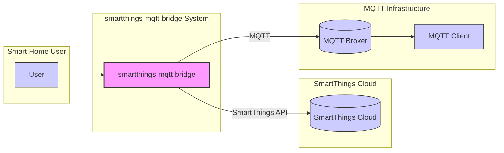
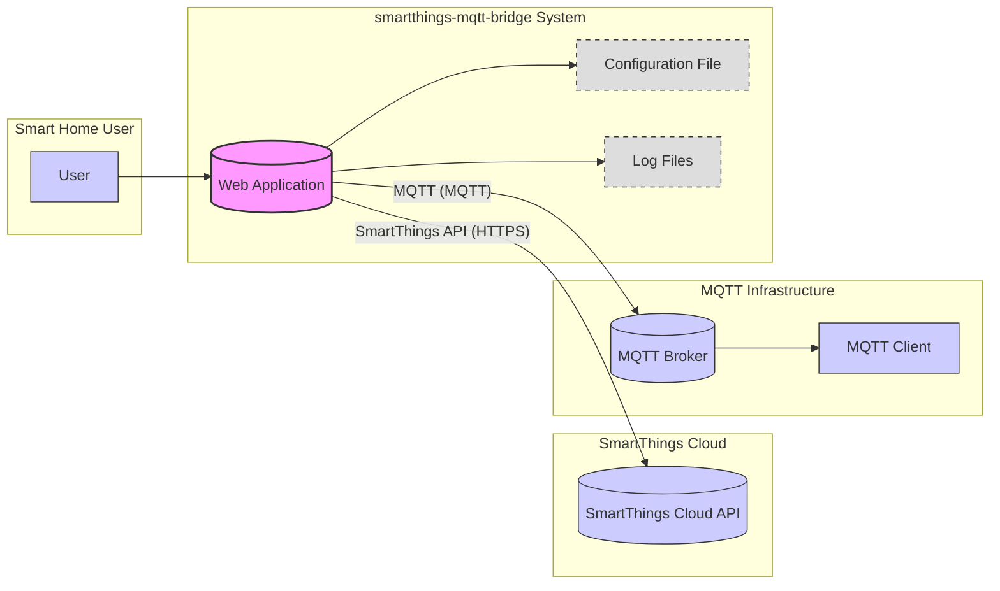

# BUSINESS POSTURE

This project, smartthings-mqtt-bridge, aims to bridge the gap between SmartThings ecosystem and the MQTT protocol. By doing so, it enables users to integrate their SmartThings-connected smart home devices with a wider range of home automation platforms, custom applications, and services that utilize MQTT.

Business Priorities and Goals:

- Interoperability: The primary goal is to enhance the interoperability of SmartThings devices. By providing an MQTT interface, the project allows users to connect SmartThings devices to systems that are not natively supported by SmartThings, increasing the utility and flexibility of their smart home setup.
- Data Accessibility:  Exposing SmartThings device data via MQTT makes it easily accessible for monitoring, logging, analysis, and integration with other data processing systems. This can be valuable for users who want to gain deeper insights into their smart home environment or build custom dashboards and automation rules.
- Customization and Control: MQTT enables more granular control and customization options compared to the standard SmartThings interfaces. Users can leverage MQTT to create complex automation scenarios, integrate with open-source home automation platforms, and build personalized smart home experiences.
- Community and Openness: By providing an open-source bridge, the project fosters community collaboration and innovation around SmartThings and MQTT integration. It allows users to contribute, extend, and adapt the bridge to their specific needs.

Business Risks:

- Security Risks: Exposing SmartThings devices to MQTT introduces new security considerations. If not properly secured, the MQTT broker and the bridge itself could become points of vulnerability, potentially allowing unauthorized access to smart home devices and data.
- Reliability and Availability: The bridge acts as a critical component in the integration. Its reliability and availability are crucial for maintaining seamless operation of the connected smart home ecosystem. Downtime or malfunctions in the bridge can disrupt home automation and device control.
- Complexity and Maintenance: Setting up and maintaining the bridge and the associated MQTT infrastructure can add complexity to the user's smart home setup. Users need technical expertise to configure, troubleshoot, and keep the system running smoothly.
- Compatibility and Updates: Changes in the SmartThings API or MQTT protocol could potentially break the bridge's functionality. Ongoing maintenance and updates are necessary to ensure compatibility and address any issues arising from platform updates.

# SECURITY POSTURE

Existing Security Controls:

- security control: SmartThings API Access Control: The bridge relies on the SmartThings API for device interaction. SmartThings API access is controlled by OAuth 2.0, requiring users to authorize the bridge application to access their SmartThings devices. This is documented in the SmartThings API documentation.
- security control: MQTT Broker Security: The security of the MQTT communication heavily depends on the configuration of the MQTT broker. Users are responsible for securing their MQTT broker, including setting up authentication, authorization, and encryption (TLS/SSL). This is external to the bridge itself and depends on the chosen MQTT broker solution.
- security control: Configuration Management: The bridge configuration, including SmartThings API keys and MQTT broker details, is typically stored in a configuration file. Security of this configuration file depends on the user's system security practices, such as file system permissions.

Accepted Risks:

- accepted risk: Reliance on User-Managed MQTT Broker Security: The project relies on users to properly secure their MQTT brokers. Insecurely configured MQTT brokers can expose the system to vulnerabilities. This risk is accepted as the project cannot enforce security configurations on external MQTT brokers.
- accepted risk: SmartThings API Security: The bridge's security is inherently tied to the security of the SmartThings API. Vulnerabilities in the SmartThings API could potentially impact the bridge. This risk is accepted as the project depends on a third-party API.
- accepted risk: Configuration File Security:  Insecure storage or access control to the bridge's configuration file could expose sensitive information. This risk is partially accepted, as the project can provide guidance on secure configuration practices, but ultimately user responsibility is involved.

Recommended Security Controls:

- recommended security control: Input Validation: Implement robust input validation for all data received from the SmartThings API and MQTT broker to prevent injection attacks and data corruption.
- recommended security control: Secure Configuration Defaults: Provide secure default configurations and guide users towards secure setup practices, including strong password generation and secure storage of API keys and credentials.
- recommended security control: Least Privilege Principle: Ensure the bridge application operates with the least privileges necessary to perform its functions, both in terms of SmartThings API access and system-level permissions.
- recommended security control: Security Audits and Vulnerability Scanning: Regularly conduct security audits and vulnerability scans of the bridge codebase and dependencies to identify and address potential security flaws.
- recommended security control: Secure Logging and Monitoring: Implement secure logging practices to monitor bridge activity and detect potential security incidents. Ensure logs do not expose sensitive information and are protected from unauthorized access.
- recommended security control: Dependency Management: Implement secure dependency management practices to ensure all third-party libraries and components are up-to-date and free from known vulnerabilities. Use dependency scanning tools to identify and address vulnerable dependencies.

Security Requirements:

- Authentication:
    - Requirement: The bridge must securely authenticate with the SmartThings API using OAuth 2.0.
    - Requirement: The bridge should support authentication mechanisms for MQTT clients connecting to the MQTT broker, as configured by the user on their MQTT broker.
- Authorization:
    - Requirement: The bridge must adhere to the authorization policies defined by the SmartThings API, ensuring it only accesses authorized devices and data.
    - Requirement: The bridge should respect authorization mechanisms configured on the MQTT broker, ensuring only authorized MQTT clients can subscribe to and publish to relevant topics.
- Input Validation:
    - Requirement: The bridge must validate all input received from the SmartThings API to prevent injection attacks and data integrity issues.
    - Requirement: The bridge must validate all input received from MQTT clients to prevent injection attacks and ensure data conforms to expected formats.
- Cryptography:
    - Requirement: The bridge should support encrypted communication with the SmartThings API (HTTPS).
    - Requirement: The bridge should encourage and support encrypted communication with the MQTT broker (MQTT over TLS/SSL), relying on the MQTT broker's capabilities.
    - Requirement: Sensitive data, such as API keys and credentials, should be stored securely, ideally encrypted at rest if stored locally.

# DESIGN

## C4 CONTEXT



Context Diagram Elements:

- Element:
    - Name: User
    - Type: Person
    - Description: The end-user who interacts with the smart home system. This user manages their SmartThings devices, configures the MQTT bridge, and interacts with MQTT clients to control and monitor their smart home.
    - Responsibilities:
        - Manages SmartThings devices and automations through the SmartThings app.
        - Configures and deploys the smartthings-mqtt-bridge.
        - Uses MQTT clients to interact with SmartThings devices via the bridge.
        - Secures their MQTT broker and related infrastructure.
    - Security controls:
        - User authentication for SmartThings account.
        - User authentication for MQTT clients (managed on MQTT Broker).
        - Secure configuration of MQTT broker.

- Element:
    - Name: SmartThings Cloud
    - Type: External System
    - Description: The cloud platform provided by SmartThings that manages smart home devices, automations, and user accounts. The bridge interacts with the SmartThings Cloud via the SmartThings API.
    - Responsibilities:
        - Manages SmartThings devices and their states.
        - Provides the SmartThings API for external applications to interact with devices.
        - Handles user authentication and authorization for API access.
    - Security controls:
        - security control: OAuth 2.0 authentication for API access.
        - security control: API rate limiting and security measures to protect against abuse.
        - security control: Data encryption in transit and at rest within the SmartThings Cloud.

- Element:
    - Name: smartthings-mqtt-bridge
    - Type: Software System
    - Description: The system being designed. It acts as a bridge between the SmartThings ecosystem and the MQTT protocol. It retrieves device data from the SmartThings Cloud via the SmartThings API and publishes it to an MQTT broker. It also translates MQTT commands into SmartThings API calls to control devices.
    - Responsibilities:
        - Authenticates with the SmartThings API.
        - Retrieves device data from the SmartThings Cloud.
        - Publishes device data to the MQTT broker.
        - Receives commands from the MQTT broker.
        - Translates MQTT commands into SmartThings API calls to control devices.
        - Manages configuration and logging.
    - Security controls:
        - security control: Secure storage of SmartThings API credentials.
        - security control: Input validation for data from SmartThings API and MQTT.
        - security control: Secure logging practices.
        - security control: Least privilege operation.

- Element:
    - Name: MQTT Broker
    - Type: External System
    - Description: An MQTT broker is a message broker that uses the MQTT protocol. It receives messages from clients, filters the messages based on topics, and distributes them to subscribing clients. The bridge publishes SmartThings device data to the MQTT broker and subscribes to command topics.
    - Responsibilities:
        - Receives MQTT messages from publishers (smartthings-mqtt-bridge).
        - Routes MQTT messages to subscribers (MQTT Clients).
        - Manages MQTT topics and subscriptions.
        - Handles MQTT client authentication and authorization (optional, depending on broker configuration).
        - Provides message persistence (optional, depending on broker configuration).
    - Security controls:
        - security control: MQTT client authentication (username/password, client certificates).
        - security control: MQTT authorization (ACLs, topic-based permissions).
        - security control: Encryption of MQTT communication (TLS/SSL).
        - security control: Broker access control and firewall rules.

- Element:
    - Name: MQTT Client
    - Type: External System
    - Description: Any application or device that connects to the MQTT broker to subscribe to SmartThings device data or publish commands to control SmartThings devices via the bridge. Examples include home automation platforms, custom dashboards, and mobile apps.
    - Responsibilities:
        - Connects to the MQTT broker.
        - Subscribes to MQTT topics to receive device data.
        - Publishes MQTT messages to send commands to devices.
        - Processes and utilizes SmartThings device data received via MQTT.
    - Security controls:
        - security control: MQTT client authentication (username/password, client certificates).
        - security control: MQTT authorization (topic-based permissions enforced by the broker).
        - security control: Secure storage of MQTT broker credentials.
        - security control: Secure communication with the MQTT broker (TLS/SSL).

## C4 CONTAINER



Container Diagram Elements:

- Element:
    - Name: Web Application
    - Type: Application
    - Description: The core component of the smartthings-mqtt-bridge. This is likely a Node.js application (based on typical implementations and repository structure) that handles communication with both the SmartThings API and the MQTT broker. It's responsible for fetching device states, publishing them to MQTT, and processing MQTT commands to control devices via the SmartThings API.
    - Responsibilities:
        - Handles user configuration and setup.
        - Authenticates with SmartThings API using OAuth 2.0.
        - Polls or subscribes to SmartThings API for device state updates.
        - Publishes device state updates to the MQTT Broker.
        - Subscribes to MQTT topics for device commands.
        - Translates MQTT commands to SmartThings API calls.
        - Manages logging and error handling.
        - Reads configuration from the Configuration File.
        - Writes logs to Log Files.
    - Security controls:
        - security control: Input validation for all external data (SmartThings API, MQTT).
        - security control: Secure handling and storage of SmartThings API credentials (in Configuration File).
        - security control: Secure logging practices (to Log Files).
        - security control: Least privilege execution environment.
        - security control: Dependency vulnerability scanning during development and build.

- Element:
    - Name: Configuration File
    - Type: Data Store
    - Description: A file (e.g., JSON, YAML, or environment variables) that stores the configuration settings for the bridge. This includes SmartThings API credentials, MQTT broker connection details, device mappings, and other operational parameters.
    - Responsibilities:
        - Stores sensitive configuration data, including API keys and MQTT credentials.
        - Provides configuration parameters to the Web Application at startup and during runtime.
    - Security controls:
        - security control: Secure file system permissions to restrict access to the configuration file.
        - security control: Encryption of sensitive data within the configuration file (recommended but might not be implemented).
        - security control: Avoid storing plaintext credentials directly in the file if possible (consider environment variables or secrets management).

- Element:
    - Name: Log Files
    - Type: Data Store
    - Description: Files where the Web Application writes logs of its operations, including events, errors, and debugging information. These logs are crucial for monitoring, troubleshooting, and security auditing.
    - Responsibilities:
        - Stores application logs.
        - Provides audit trail of bridge activity.
        - Helps in debugging and troubleshooting issues.
    - Security controls:
        - security control: Secure file system permissions to restrict access to log files.
        - security control: Log rotation and management to prevent excessive disk usage and maintain performance.
        - security control: Avoid logging sensitive information in plain text.
        - security control: Consider centralized logging solutions for better security monitoring and analysis.

## DEPLOYMENT

Deployment Architecture: Single Instance on Local Network

```mermaid
flowchart LR
    subgraph "User's Local Network"
        subgraph "Compute Instance (e.g., Raspberry Pi, Server)"
            SMB[smartthings-mqtt-bridge Container]
        end
        MB[(MQTT Broker Container)]
        DHCP[(DHCP Server)]
        Router[(Home Router/Firewall)]
        SmartThingsHub[(SmartThings Hub)]
        UserDevice[(User Device (Laptop, Phone))]
    end
    Internet[(Internet)]
    SmartThingsCloud[(SmartThings Cloud)]

    UserDevice -- "Local Network" --> Router
    UserDevice -- "Local Network" --> SMB
    UserDevice -- "Local Network" --> MB
    SMB -- "Local Network" --> Router
    SMB -- "Local Network" --> MB
    SMB -- "Local Network" --> SmartThingsHub
    MB -- "Local Network" --> Router
    SmartThingsHub -- "Local Network" --> Router

    Router -- "Internet" --> Internet
    Internet -- "Internet" --> SmartThingsCloud
    SMB -- "Internet (via Router)" --> SmartThingsCloud
    SmartThingsHub -- "Internet (via Router)" --> SmartThingsCloud

    style SMB fill:#f9f,stroke:#333,stroke-width:2px
    style MB fill:#ccf,stroke:#333,stroke-width:1px
    style DHCP fill:#ddd,stroke:#333,stroke-width:1px
    style Router fill:#ddd,stroke:#333,stroke-width:1px
    style SmartThingsHub fill:#ddd,stroke:#333,stroke-width:1px
    style UserDevice fill:#ddd,stroke:#333,stroke-width:1px
    style Internet fill:#ddd,stroke:#333,stroke-width:1px
    style SmartThingsCloud fill:#ccf,stroke:#333,stroke-width:1px
```

Deployment Diagram Elements:

- Element:
    - Name: Compute Instance (e.g., Raspberry Pi, Server)
    - Type: Infrastructure - Compute
    - Description: A physical or virtual machine within the user's local network where the smartthings-mqtt-bridge application is deployed. This could be a Raspberry Pi, a home server, or a VM.
    - Responsibilities:
        - Hosts and runs the smartthings-mqtt-bridge application.
        - Provides compute resources (CPU, memory, storage) for the bridge.
        - Provides network connectivity within the local network and to the internet (via Router).
    - Security controls:
        - security control: Operating system security hardening and patching.
        - security control: Firewall rules to restrict inbound and outbound traffic.
        - security control: Physical security of the device (if applicable).
        - security control: Regular security updates and maintenance of the OS and runtime environment.

- Element:
    - Name: smartthings-mqtt-bridge Container
    - Type: Container
    - Description: A containerized instance of the smartthings-mqtt-bridge application running on the Compute Instance. Containerization provides isolation, portability, and simplified deployment.
    - Responsibilities:
        - Executes the bridge application code.
        - Manages application dependencies and runtime environment.
        - Isolates the bridge application from the host OS and other containers.
    - Security controls:
        - security control: Container image vulnerability scanning.
        - security control: Container runtime security (e.g., Docker security best practices).
        - security control: Least privilege container user and capabilities.
        - security control: Regular updates of container base image and application dependencies.

- Element:
    - Name: MQTT Broker Container
    - Type: Container
    - Description: A containerized instance of an MQTT broker (e.g., Mosquitto, EMQX) running on the user's local network, potentially on the same Compute Instance or a separate one.
    - Responsibilities:
        - Provides MQTT messaging services for the smart home system.
        - Manages MQTT topics, subscriptions, and message routing.
        - Handles MQTT client connections and authentication.
    - Security controls:
        - security control: MQTT broker configuration security (authentication, authorization, TLS/SSL).
        - security control: Container image vulnerability scanning.
        - security control: Container runtime security.
        - security control: Firewall rules to restrict access to the MQTT broker port.

- Element:
    - Name: Home Router/Firewall
    - Type: Infrastructure - Network Device
    - Description: The user's home router, which acts as a gateway between the local network and the internet. It typically includes firewall capabilities to control network traffic.
    - Responsibilities:
        - Provides network connectivity to the internet.
        - Acts as a firewall to protect the local network from external threats.
        - Performs Network Address Translation (NAT).
        - May provide DHCP services.
    - Security controls:
        - security control: Firewall rules to block unauthorized inbound connections from the internet.
        - security control: Wi-Fi security (WPA2/WPA3 encryption).
        - security control: Router firmware updates and security patching.
        - security control: Strong router administration password.

- Element:
    - Name: SmartThings Hub
    - Type: Physical Device
    - Description: The physical SmartThings Hub in the user's home, which communicates with Zigbee, Z-Wave, and other smart home devices and connects them to the SmartThings Cloud.
    - Responsibilities:
        - Communicates with local smart home devices (Zigbee, Z-Wave, etc.).
        - Bridges local devices to the SmartThings Cloud.
        - Executes local automations (optional).
    - Security controls:
        - security control: Device firmware updates and security patching (managed by SmartThings).
        - security control: Physical security of the hub.
        - security control: Secure communication protocols for local device communication (Zigbee, Z-Wave security features).

- Element:
    - Name: User Device (Laptop, Phone)
    - Type: Device
    - Description: Devices used by the user to interact with the smart home system, including configuring the bridge, accessing MQTT clients, and managing SmartThings devices.
    - Responsibilities:
        - User interface for managing the smart home.
        - Running MQTT client applications.
        - Web browser for accessing bridge configuration (if web UI exists).
    - Security controls:
        - security control: Device operating system security and patching.
        - security control: Strong device password/authentication.
        - security control: Antivirus/anti-malware software.
        - security control: Secure network connection (Wi-Fi security).

## BUILD

Build Process Diagram:

```mermaid
flowchart LR
    subgraph "Developer Workstation"
        Dev[Developer]
        CodeRepo[(Code Repository (GitHub))]
    end
    subgraph "CI/CD Pipeline (e.g., GitHub Actions)"
        BuildServer[Build Server]
        SAST[SAST Scanner]
        DependencyCheck[Dependency Check]
        ContainerRegistry[(Container Registry (e.g., Docker Hub))]
    end

    Dev -- "Code Commit" --> CodeRepo
    CodeRepo -- "Webhook" --> BuildServer
    BuildServer -- "Checkout Code" --> CodeRepo
    BuildServer -- "Build Application" --> BuildArtifacts[Build Artifacts]
    BuildServer -- "Run SAST" --> SAST
    BuildServer -- "Run Dependency Check" --> DependencyCheck
    BuildServer -- "Build Container Image" --> ContainerImage[Container Image]
    ContainerImage -- "Push Image" --> ContainerRegistry

    style CodeRepo fill:#ddd,stroke:#333,stroke-width:1px
    style BuildServer fill:#ddd,stroke:#333,stroke-width:1px
    style SAST fill:#ddd,stroke:#333,stroke-width:1px
    style DependencyCheck fill:#ddd,stroke:#333,stroke-width:1px
    style ContainerRegistry fill:#ddd,stroke:#333,stroke-width:1px
    style BuildArtifacts fill:#ddd,stroke:#333,stroke-width:1px
    style ContainerImage fill:#ddd,stroke:#333,stroke-width:1px
    style Dev fill:#ccf,stroke:#333,stroke-width:1px
```

Build Process Description:

1. Developer commits code changes to the Code Repository (e.g., GitHub).
2. A webhook from the Code Repository triggers the CI/CD Pipeline, starting a new build process on the Build Server.
3. The Build Server checks out the latest code from the Code Repository.
4. The Build Server builds the application, producing Build Artifacts (e.g., compiled code, binaries, static assets).
5. Static Application Security Testing (SAST) Scanner analyzes the source code for potential security vulnerabilities.
6. Dependency Check tool scans project dependencies for known vulnerabilities.
7. The Build Server builds a Container Image containing the application and its runtime environment.
8. The Container Image is pushed to a Container Registry (e.g., Docker Hub).

Security Controls in Build Process:

- security control: Secure Code Repository: Access control and audit logging for the code repository to protect source code integrity.
- security control: Automated Build Pipeline: Use of a CI/CD pipeline to automate the build process, ensuring consistency and repeatability.
- security control: Static Application Security Testing (SAST): Integration of SAST scanners to identify potential security vulnerabilities in the source code early in the development lifecycle.
- security control: Dependency Vulnerability Scanning: Automated dependency checking to identify and flag vulnerable dependencies, ensuring timely updates and mitigation.
- security control: Container Image Scanning: Scanning of container images for vulnerabilities before publishing to the registry.
- security control: Secure Build Environment: Hardened build servers and secure configuration of the CI/CD pipeline to prevent unauthorized access and tampering.
- security control: Code Signing (optional): Signing build artifacts and container images to ensure integrity and authenticity.
- security control: Access Control for Container Registry: Restricting access to the container registry to authorized users and systems.

# RISK ASSESSMENT

Critical Business Processes:

- Smart Home Device Control and Automation: The primary business process is enabling users to control and automate their SmartThings-connected smart home devices via MQTT. Disruption of this process impacts user convenience and potentially home security and safety (depending on the devices involved).
- Smart Home Data Monitoring and Logging: Access to SmartThings device data via MQTT enables monitoring, logging, and analysis. Disruption of this process impacts data collection and insights into the smart home environment.

Data Sensitivity:

- Smart Home Device State Data: This includes information about the status of smart home devices (e.g., temperature, light status, door lock status, motion detection). Sensitivity varies depending on the device type and user context. Some data, like door lock status, is highly sensitive, while temperature data might be less so. Generally, this data can be considered personally identifiable information (PII) as it relates to a user's home and activities.
- SmartThings API Credentials: OAuth 2.0 tokens and potentially other API keys used to access the SmartThings API are highly sensitive. Compromise of these credentials could grant unauthorized access to the user's SmartThings account and devices.
- MQTT Broker Credentials: Usernames and passwords or client certificates used to authenticate MQTT clients are sensitive. Compromise could allow unauthorized access to the MQTT broker and control over MQTT topics.
- Configuration Data: The bridge's configuration file may contain sensitive information, including API keys, MQTT credentials, and potentially device mappings.

Data Sensitivity Levels:

- High Sensitivity: SmartThings API Credentials, MQTT Broker Credentials, Security-related device status (e.g., door lock status, alarm system status).
- Medium Sensitivity: General device state data (e.g., temperature, light level, motion detection), Configuration Data.
- Low Sensitivity: Application logs (excluding sensitive data), non-sensitive operational metrics.

# QUESTIONS & ASSUMPTIONS

Questions:

- What is the intended user base for this project? (Hobbyists, developers, commercial users?) This will influence the acceptable risk level and security requirements.
- What is the expected scale of deployment? (Number of devices, users, MQTT clients?) This will impact performance and scalability considerations.
- Are there any specific regulatory compliance requirements that need to be considered (e.g., GDPR, CCPA)? This will influence data privacy and security requirements.
- What is the expected lifespan of the project? This will influence long-term maintenance and security update strategies.
- Is there a need for user authentication and authorization within the bridge application itself, beyond relying on SmartThings API and MQTT broker security?

Assumptions:

- BUSINESS POSTURE:
    - The primary business goal is to provide interoperability and data accessibility for SmartThings devices.
    - Security is a significant concern, especially given the nature of smart home devices and potential access to sensitive data and control over physical devices.
    - Users are expected to have some technical proficiency to set up and manage the bridge and MQTT infrastructure.

- SECURITY POSTURE:
    - Users are responsible for securing their MQTT broker and the environment where the bridge is deployed.
    - The project will provide guidance and recommendations for secure configuration and deployment.
    - Security controls will focus on preventing unauthorized access, data breaches, and ensuring the integrity and availability of the bridge.

- DESIGN:
    - The bridge is designed as a web application, likely based on Node.js.
    - Configuration is managed through a configuration file.
    - Logging is implemented for monitoring and troubleshooting.
    - Deployment is typically on a local network, potentially using containerization.
    - The build process can be automated using CI/CD pipelines and include security checks.