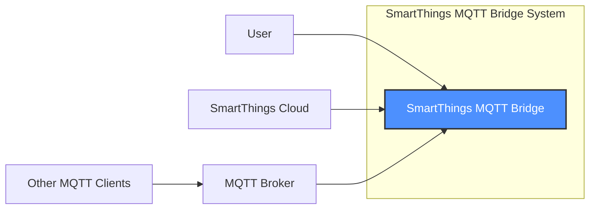
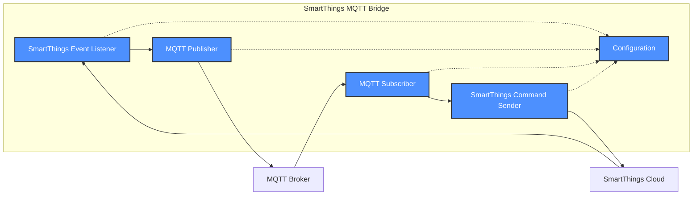
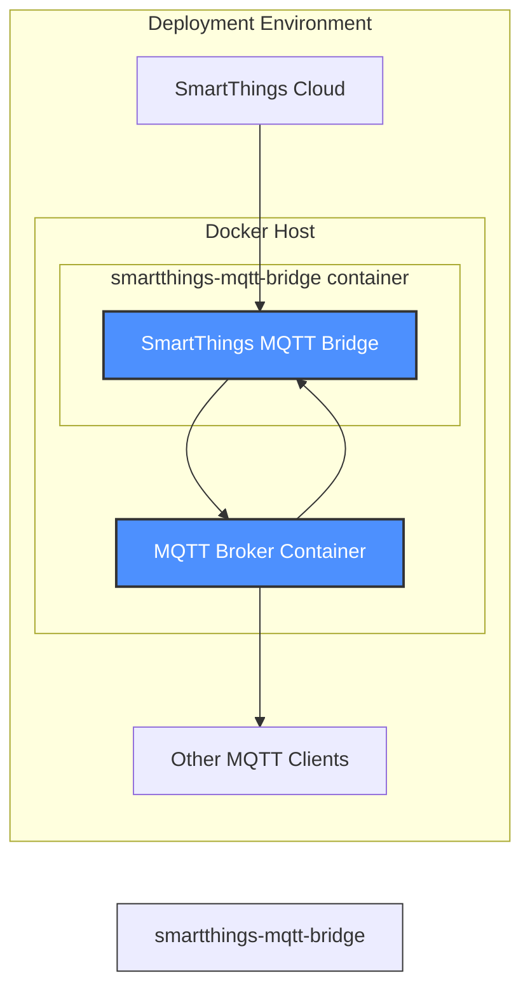

# BUSINESS POSTURE

Business Priorities and Goals:

*   Provide a bridge between SmartThings and MQTT, enabling users to integrate their SmartThings devices with a wider range of home automation systems and devices that support MQTT.
*   Offer a self-hosted solution, giving users control over their data and privacy.
*   Maintain a relatively simple and easy-to-install/configure system, targeting users who may have some technical skills but are not necessarily developers or system administrators.
*   Support a variety of SmartThings device types and capabilities.
*   Provide a stable and reliable connection between SmartThings and MQTT.

Most Important Business Risks:

*   Data breaches or unauthorized access to SmartThings devices due to vulnerabilities in the bridge.
*   Loss of user trust due to privacy concerns related to data handling by the bridge.
*   System instability or unreliability leading to user frustration and abandonment.
*   Difficulty in maintaining the project due to its complexity or lack of clear documentation.
*   Incompatibility with future SmartThings updates or changes in the MQTT protocol.
*   Lack of adoption due to the complexity of installation or configuration.

# SECURITY POSTURE

Existing Security Controls:

*   security control: The project utilizes the MQTT protocol, which can be configured to use TLS/SSL for encrypted communication. (README.md, config.yml)
*   security control: The project's configuration file (config.yml) allows users to specify MQTT credentials (username and password). (config.yml)
*   security control: The project's documentation recommends using a strong, unique password for the MQTT broker. (README.md)
*   security control: The project is open-source, allowing for community review and identification of potential security vulnerabilities. (GitHub repository)

Accepted Risks:

*   accepted risk: The project relies on the user to properly configure and secure their MQTT broker, including setting up TLS/SSL and strong authentication.
*   accepted risk: The project does not implement any specific authorization mechanisms beyond the authentication provided by MQTT. All subscribed clients have access to all messages.
*   accepted risk: The project is written in Node.js, which has a large dependency tree, increasing the potential attack surface.
*   accepted risk: The project's documentation does not explicitly address all potential security threats or provide detailed security hardening guidelines.
*   accepted risk: The project does not implement input validation on MQTT messages.

Recommended Security Controls:

*   security control: Implement input validation to ensure that data received from both SmartThings and MQTT conforms to expected formats and types. This will help prevent injection attacks and other vulnerabilities.
*   security control: Add more granular authorization controls. Consider using MQTT topic-level permissions to restrict access to specific devices or data based on user roles or client identities.
*   security control: Regularly update dependencies to address known vulnerabilities. Implement automated dependency checking and updates.
*   security control: Provide detailed security documentation, including best practices for securing the MQTT broker, configuring TLS/SSL, and managing user credentials.
*   security control: Consider adding support for OAuth 2.0 or other modern authentication/authorization protocols for SmartThings integration.
*   security control: Implement logging and monitoring to detect and respond to suspicious activity.

Security Requirements:

*   Authentication:
    *   The bridge must authenticate with the MQTT broker using secure credentials (username/password or client certificates).
    *   The bridge should support TLS/SSL encryption for communication with the MQTT broker.
    *   Consider supporting more robust authentication mechanisms like OAuth 2.0 for SmartThings.

*   Authorization:
    *   The bridge should implement access controls to limit which MQTT clients can access specific SmartThings devices or data.
    *   Consider using MQTT topic-level permissions for granular authorization.

*   Input Validation:
    *   The bridge must validate all data received from SmartThings and MQTT to prevent injection attacks and other vulnerabilities.
    *   Data should be checked against expected types, formats, and ranges.

*   Cryptography:
    *   All communication with the MQTT broker should be encrypted using TLS/SSL.
    *   Sensitive data, such as passwords, should be stored securely (e.g., hashed or encrypted).

# DESIGN

## C4 CONTEXT

Element Descriptions:

*   Element:
    *   Name: User
    *   Type: Person
    *   Description: A person who interacts with SmartThings devices and other home automation systems via MQTT.
    *   Responsibilities: Configures and uses the SmartThings MQTT Bridge, interacts with SmartThings devices, and uses other MQTT clients.
    *   Security controls: N/A

*   Element:
    *   Name: SmartThings MQTT Bridge
    *   Type: Software System
    *   Description: The software system that bridges communication between SmartThings and MQTT.
    *   Responsibilities: Receives events from SmartThings, publishes messages to MQTT, subscribes to MQTT topics, and sends commands to SmartThings.
    *   Security controls: MQTT authentication, TLS/SSL encryption (configurable), input validation (recommended), authorization (recommended).

*   Element:
    *   Name: SmartThings Cloud
    *   Type: External System
    *   Description: The cloud platform provided by SmartThings for managing and controlling devices.
    *   Responsibilities: Manages SmartThings devices, provides an API for interacting with devices, and sends events to subscribed clients.
    *   Security controls: SmartThings platform security controls (authentication, authorization, encryption).

*   Element:
    *   Name: MQTT Broker
    *   Type: External System
    *   Description: A message broker that implements the MQTT protocol.
    *   Responsibilities: Receives messages from publishers, delivers messages to subscribers, and manages client connections.
    *   Security controls: MQTT broker security controls (authentication, authorization, TLS/SSL encryption).

*   Element:
    *   Name: Other MQTT Clients
    *   Type: External System
    *   Description: Other applications or devices that communicate via MQTT.
    *   Responsibilities: Publish and subscribe to MQTT topics.
    *   Security controls: MQTT client security controls (authentication, TLS/SSL encryption).

## C4 CONTAINER

Element Descriptions:

*   Element:
    *   Name: SmartThings Event Listener
    *   Type: Container
    *   Description: Listens for events from the SmartThings cloud.
    *   Responsibilities: Receives events from SmartThings, parses event data, and forwards data to the MQTT Publisher.
    *   Security controls: Input validation (recommended).

*   Element:
    *   Name: MQTT Publisher
    *   Type: Container
    *   Description: Publishes messages to the MQTT broker.
    *   Responsibilities: Receives data from the SmartThings Event Listener, formats data as MQTT messages, and publishes messages to the MQTT broker.
    *   Security controls: MQTT authentication, TLS/SSL encryption (configurable).

*   Element:
    *   Name: MQTT Subscriber
    *   Type: Container
    *   Description: Subscribes to topics on the MQTT broker.
    *   Responsibilities: Subscribes to MQTT topics, receives messages from the MQTT broker, parses message data, and forwards data to the SmartThings Command Sender.
    *   Security controls: MQTT authentication, TLS/SSL encryption (configurable), input validation (recommended).

*   Element:
    *   Name: SmartThings Command Sender
    *   Type: Container
    *   Description: Sends commands to SmartThings devices.
    *   Responsibilities: Receives data from the MQTT Subscriber, formats data as SmartThings commands, and sends commands to the SmartThings cloud.
    *   Security controls: Input validation (recommended).

*   Element:
    *   Name: Configuration
    *   Type: Container
    *   Description: Stores configuration settings.
    *   Responsibilities: Provides configuration settings to other components.
    *   Security controls: Secure storage of sensitive data (e.g., passwords).

## DEPLOYMENT

Possible Deployment Solutions:

1.  Docker Container: Package the application and its dependencies into a Docker container for easy deployment on various platforms.
2.  Bare Metal/VM: Install Node.js and the application directly on a server (physical or virtual).
3.  Cloud Platform (e.g., AWS, GCP, Azure): Deploy the application using platform-specific services (e.g., AWS Elastic Beanstalk, Google App Engine, Azure App Service).

Chosen Solution (Docker Container):

Element Descriptions:

*   Element:
    *   Name: Docker Host
    *   Type: Infrastructure Node
    *   Description: A server (physical or virtual) that runs the Docker engine.
    *   Responsibilities: Hosts and runs Docker containers.
    *   Security controls: Operating system security controls, Docker security best practices.

*   Element:
    *   Name: smartthings-mqtt-bridge container
    *   Type: Container Instance
    *   Description: A Docker container running the SmartThings MQTT Bridge application.
    *   Responsibilities: Runs the SmartThings MQTT Bridge application.
    *   Security controls: Container security best practices (e.g., minimal base image, non-root user).

*   Element:
    *   Name: MQTT Broker Container
    *   Type: Container Instance
    *   Description: Docker container with MQTT broker.
    *   Responsibilities: Runs the MQTT Broker application.
    *   Security controls: Container security best practices (e.g., minimal base image, non-root user), MQTT broker security controls (authentication, authorization, TLS/SSL encryption).

*   Element:
    *   Name: SmartThings Cloud
    *   Type: External System
    *   Description: The cloud platform provided by SmartThings.
    *   Responsibilities: Manages SmartThings devices and provides an API.
    *   Security controls: SmartThings platform security controls.

*   Element:
    *   Name: Other MQTT Clients
    *   Type: External System
    *   Description: Other applications or devices that communicate via MQTT.
    *   Responsibilities: Publish and subscribe to MQTT topics.
    *   Security controls: MQTT client security controls.

## BUILD

The build process for the SmartThings MQTT Bridge is relatively simple, as it is a Node.js application. However, security considerations should be incorporated into the process.

Build Process Steps:

1.  Developer commits code to the Git repository (GitHub).
2.  A build server (e.g., GitHub Actions) is triggered by the commit.
3.  The build server checks out the code from the repository.
4.  Dependency Check: The build server runs a dependency check (e.g., npm audit) to identify any known vulnerabilities in the project's dependencies.
5.  Linter: The build server runs a linter (e.g., ESLint) to check for code style and potential errors.
6.  Unit Tests: The build server runs unit tests to verify the functionality of the code.
7.  Docker Build: If all checks and tests pass, the build server builds a Docker image for the application.
8.  Docker Registry: The Docker image is pushed to a Docker registry (e.g., Docker Hub).

Security Controls:

*   security control: Dependency checking (npm audit) to identify and mitigate known vulnerabilities in dependencies.
*   security control: Linting (ESLint) to enforce code style and identify potential errors.
*   security control: Unit tests to verify code functionality and prevent regressions.
*   security control: Building a Docker image to ensure a consistent and isolated runtime environment.
*   security control: Using a secure Docker registry to store and distribute the application image.
*   security control: Using minimal base image for Docker build.
*   security control: Running container with non-root user.

# RISK ASSESSMENT

Critical Business Processes:

*   Providing reliable and secure communication between SmartThings devices and MQTT clients.
*   Maintaining user trust and privacy.
*   Ensuring the stability and availability of the bridge.

Data to Protect:

*   SmartThings device data (state, commands, metadata): Sensitivity - Medium to High (depending on the specific device and data).
*   MQTT credentials (username, password): Sensitivity - High.
*   Configuration data (e.g., MQTT broker address): Sensitivity - Medium.
*   User's home automation setup and device inventory: Sensitivity - Medium to High.

# QUESTIONS & ASSUMPTIONS

Questions:

*   What is the expected user base and their technical expertise? This will influence the design and security recommendations.
*   What specific SmartThings devices and capabilities need to be supported?
*   Are there any specific performance requirements or limitations?
*   What is the long-term maintenance plan for the project?
*   What MQTT brokers are commonly used by the target audience?
*   Are there any existing security audits or penetration tests performed on the SmartThings platform or MQTT brokers that should be considered?

Assumptions:

*   BUSINESS POSTURE: The primary goal is to provide a functional and reliable bridge, with security being a high priority but potentially balanced against ease of use.
*   SECURITY POSTURE: Users are responsible for securing their own MQTT broker and network. The bridge itself will provide basic security features, but advanced security configurations may be left to the user.
*   DESIGN: The design will prioritize simplicity and ease of deployment, using a Docker container as the primary deployment method. The bridge will be designed to be as stateless as possible, relying on the MQTT broker for message persistence.