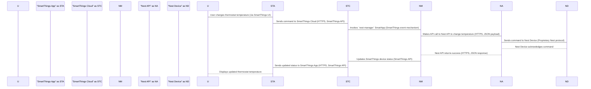
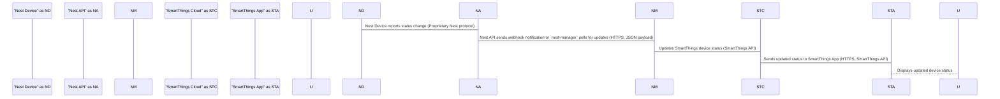
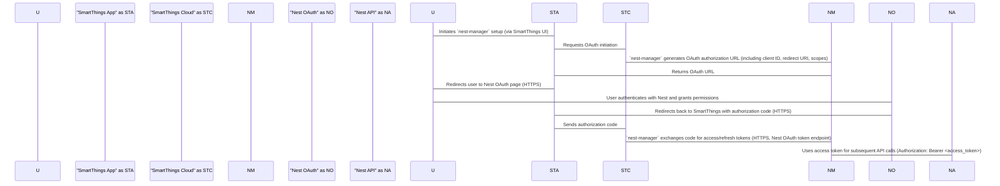

# Project Design Document: nest-manager

**Version:** 1.1
**Date:** October 26, 2023
**Author:** AI Software Architect

## 1. Introduction

This document provides a detailed architectural design for the `nest-manager` project, an open-source SmartThings integration for Nest devices. This document aims to clearly outline the system's components, their interactions, and the data flow, serving as a foundation for subsequent threat modeling activities. This revision includes more specific details regarding technologies and potential security considerations.

## 2. Goals and Objectives

*   Provide a comprehensive and detailed overview of the `nest-manager` architecture.
*   Identify key components and their specific functionalities and technologies.
*   Describe the data flow within the system, including data formats and protocols.
*   Highlight potential security considerations and vulnerabilities associated with each component and interaction.
*   Serve as a robust basis for future threat modeling exercises.

## 3. High-Level Architecture

The `nest-manager` project acts as a bridge between the SmartThings ecosystem and the Nest ecosystem, allowing users to control and monitor their Nest devices through the SmartThings platform. The core components involved are:

*   **SmartThings Hub:** The central hub for local automation and communication within a SmartThings environment, potentially running Zigbee, Z-Wave, and IP-based protocols.
*   **SmartThings Cloud:** Samsung's cloud platform that hosts SmartApps (written in Groovy) and manages device integrations via REST APIs and event streams.
*   **`nest-manager` SmartApp:** The Groovy-based application running within the SmartThings Cloud, leveraging the SmartThings API for device management and OAuth for Nest authentication.
*   **Nest API:** Google's cloud-based API for interacting with Nest devices and services, primarily using RESTful interfaces and JSON data.
*   **Nest Devices:** Physical Nest devices such as thermostats, cameras, and protects, communicating with the Nest cloud via Wi-Fi.
*   **User:** The individual interacting with the system through the SmartThings mobile app, authenticated via Samsung accounts.

```mermaid
graph LR
    subgraph "SmartThings Ecosystem"
        A("User")
        B("SmartThings Mobile App")
        C("SmartThings Hub")
        D("SmartThings Cloud")
        E("`nest-manager` SmartApp")
    end
    subgraph "Nest Ecosystem"
        F("Nest API")
        G("Nest Devices")
    end

    A -- "Interact with" --> B
    B -- "Sends commands to/Receives updates from" --> D
    C -- "Local device communication (e.g., Zigbee, Z-Wave)" --> G
    D -- "Manages and executes (Groovy)" --> E
    E -- "Communicates with (HTTPS, OAuth 2.0)" --> F
    F -- "Controls and retrieves data from (HTTPS, JSON)" --> G
    D -- "Communicates with (REST API)" --> C
```

## 4. Component Details

This section details the individual components of the `nest-manager` system and their functionalities, including specific technologies and security considerations.

### 4.1. User

*   **Description:** The end-user who interacts with the system through the SmartThings mobile application, authenticated via their Samsung account.
*   **Functionality:** Initiates commands to control Nest devices (e.g., setting thermostat temperature), views device status (e.g., current temperature, camera feed), and configures the `nest-manager` integration (e.g., linking Nest account).
*   **Security Considerations:** User authentication relies on the security of the Samsung account. Compromised user accounts could lead to unauthorized access and control of Nest devices.

### 4.2. SmartThings Mobile App

*   **Description:** The mobile application provided by Samsung for interacting with the SmartThings ecosystem, available on iOS and Android.
*   **Functionality:** Provides a user interface for controlling devices through the SmartThings API, displaying device status, and managing SmartApps. Communicates with the SmartThings Cloud via secure HTTPS connections.
*   **Security Considerations:** Relies on SmartThings platform security for user authentication and secure communication. Vulnerabilities in the mobile app itself could be exploited. Data transmitted between the app and the cloud should be encrypted.

### 4.3. SmartThings Hub

*   **Description:** A physical device that acts as a local gateway for the SmartThings ecosystem, running a local execution environment and supporting various communication protocols.
*   **Functionality:** Communicates with local devices (including potentially some Nest devices if directly integrated via protocols like Thread, though `nest-manager` primarily uses the cloud API), executes local automations (SmartThings Rules), and communicates with the SmartThings Cloud via a persistent connection.
*   **Security Considerations:** Physical security of the hub is important. Secure communication protocols for local devices (e.g., secure pairing for Zigbee/Z-Wave). Vulnerabilities in the hub's firmware could be exploited.

### 4.4. SmartThings Cloud

*   **Description:** Samsung's cloud infrastructure that hosts SmartApps, manages device integrations, and handles user authentication and authorization.
*   **Functionality:** Provides the runtime environment for the `nest-manager` SmartApp (executing Groovy code), manages OAuth authentication with the Nest API, facilitates communication between the mobile app and the integration via REST APIs and event streams, and stores device and user data.
*   **Security Considerations:** Relies on Samsung's security measures for data protection, access control, and secure execution of SmartApps. Vulnerabilities in the SmartThings platform or its APIs could be exploited. Secure storage of sensitive data like OAuth tokens is critical.

### 4.5. `nest-manager` SmartApp

*   **Description:** The core component of the integration, a Groovy application running within the SmartThings Cloud, utilizing the SmartThings API for device interaction and the Nest API for Nest device control.
*   **Functionality:**
    *   Handles user authentication and authorization with the Nest API using the OAuth 2.0 Authorization Code Grant flow. Securely stores and manages OAuth access tokens and refresh tokens, likely using SmartThings' secure storage mechanisms.
    *   Translates SmartThings commands (received via the SmartThings API) into corresponding Nest API calls (using HTTPS and JSON).
    *   Receives updates from the Nest API (e.g., device status changes) potentially through polling or, less likely, through a push mechanism if offered by the Nest API.
    *   Updates the status of virtual Nest devices within SmartThings using the SmartThings API, making Nest device information available to SmartThings automations and the mobile app.
    *   Provides configuration options for the integration through the SmartThings UI (e.g., selecting which Nest devices to integrate).
    *   Manages the lifecycle of the integration, including handling user disconnections and re-authorizations.
*   **Security Considerations:**
    *   **Secure Storage of Credentials:**  The secure storage and handling of OAuth access tokens and refresh tokens are paramount. Improper storage could lead to unauthorized access to Nest devices.
    *   **Input Validation:**  Thorough validation of input data received from the SmartThings platform to prevent injection attacks (e.g., command injection).
    *   **Secure Communication:**  Ensuring all communication with the Nest API is over HTTPS to protect data in transit.
    *   **Authorization Checks:** Implementing authorization checks to ensure only authorized SmartThings users can control linked Nest devices.
    *   **Vulnerabilities in Groovy Code:** Potential vulnerabilities in the `nest-manager`'s Groovy code (e.g., insecure API calls, logic flaws) could be exploited. Regular code reviews and security testing are recommended.
    *   **Rate Limiting:** Implementing appropriate rate limiting when interacting with the Nest API to avoid being blocked due to excessive requests.

### 4.6. Nest API

*   **Description:** Google's cloud-based API that allows third-party applications to interact with Nest devices and services, using RESTful principles and JSON data format over HTTPS.
*   **Functionality:** Provides endpoints for controlling Nest devices (e.g., setting thermostat temperature, arming/disarming security systems), retrieving device status (e.g., current temperature, camera events), and managing user accounts and permissions. Utilizes OAuth 2.0 for authentication and authorization.
*   **Security Considerations:** Relies on Google's security measures, including robust OAuth 2.0 implementation for authentication and authorization, and mandatory HTTPS for secure communication. Third-party integrations are subject to Google's API usage policies and rate limits.

### 4.7. Nest Devices

*   **Description:** Physical Nest devices such as thermostats, cameras, doorbells, and smoke detectors, connected to the user's Wi-Fi network and communicating with the Nest cloud.
*   **Functionality:** Perform their intended functions (e.g., controlling temperature, recording video) and report their status to the Nest API. Receive commands from the Nest API to perform actions.
*   **Security Considerations:** Device security is crucial, including secure boot processes, firmware updates to patch vulnerabilities, and secure communication with the Nest cloud. Compromised devices could provide unauthorized access to the network or user data.

## 5. Data Flow

The following outlines the typical data flow within the `nest-manager` system for common operations, including details about data formats and protocols.

### 5.1. User Initiates a Command (e.g., Change Thermostat Temperature)



### 5.2. Nest Device Status Update



### 5.3. Initial Setup and Authentication



## 6. Security Considerations

Based on the architecture and data flow, the following security considerations are important, categorized for clarity:

*   **Authentication and Authorization:**
    *   **OAuth 2.0 Implementation:** The security of the integration heavily relies on the correct and secure implementation of the OAuth 2.0 flow for authenticating with the Nest API.
    *   **Token Management:** Secure storage and handling of OAuth access and refresh tokens within the `nest-manager` SmartApp is critical. Consider using SmartThings' built-in secure storage mechanisms.
    *   **SmartThings User Authentication:** The integration inherits the security of the SmartThings user authentication mechanism.
*   **Communication Security:**
    *   **HTTPS Everywhere:** Ensure all communication between components (SmartThings App to Cloud, SmartThings Cloud to Nest API) utilizes HTTPS to encrypt data in transit.
*   **Data Security:**
    *   **Data Privacy:** The integration handles personal data related to Nest devices and user activity. Ensure compliance with privacy regulations and protect user data.
    *   **Secure Storage:**  Any persistent data stored by the `nest-manager` (beyond OAuth tokens, which should use secure storage) should be encrypted at rest.
*   **Application Security:**
    *   **Input Validation:** The `nest-manager` SmartApp must rigorously validate all input data received from the SmartThings platform to prevent injection attacks (e.g., command injection).
    *   **Authorization Checks:** Implement proper authorization mechanisms within the `nest-manager` to ensure that only authorized SmartThings users can control their linked Nest devices.
    *   **Code Security:** The Groovy code of the `nest-manager` SmartApp should be regularly reviewed for potential vulnerabilities (e.g., insecure API calls, logic flaws, information disclosure). Static and dynamic code analysis tools can be helpful.
    *   **Dependency Management:** Ensure that any external libraries or dependencies used by the SmartApp are up-to-date and free from known vulnerabilities. Regularly scan dependencies for security issues.
    *   **Error Handling and Logging:** Implement secure error handling to avoid leaking sensitive information in error messages. Implement comprehensive logging for auditing and security monitoring, ensuring logs themselves are securely stored.
*   **API Security:**
    *   **API Key Management (If Applicable):** While OAuth is the primary mechanism, if any API keys are used, their secure storage and management are critical. Avoid hardcoding API keys.
    *   **Rate Limiting:** Implement appropriate rate limiting when interacting with the Nest API to prevent abuse and avoid being blocked.
*   **Platform Security:**
    *   **SmartThings Platform Security:** The `nest-manager` SmartApp runs within the SmartThings Cloud, inheriting its security posture. Be aware of potential vulnerabilities in the SmartThings platform itself.
    *   **Nest API Security:** Rely on Google's security measures for the Nest API. Stay informed about any security advisories or updates from Google.
*   **Device Security:**
    *   **Nest Device Security:** The security of the integration is also dependent on the security of the Nest devices themselves. Encourage users to keep their device firmware updated.

## 7. Assumptions and Constraints

*   The `nest-manager` SmartApp is developed and deployed within the standard SmartThings Groovy environment and its limitations.
*   The integration relies on the availability, functionality, and stability of both the SmartThings API and the Nest API.
*   Users have valid Nest accounts and have successfully authorized the `nest-manager` SmartApp to access their Nest data through the OAuth 2.0 flow.
*   The SmartThings platform provides a reasonably secure environment for running SmartApps, including secure storage for sensitive information.
*   Network connectivity is assumed between all components for communication.

## 8. Future Considerations

*   **Enhanced Local Control:** Explore options for more direct local control of Nest devices through the SmartThings Hub, potentially leveraging local APIs or protocols if available, to reduce reliance on cloud services and improve latency.
*   **Support for More Nest Device Types and Features:** Expand the integration to support a wider range of Nest devices and their specific features, as the Nest API evolves.
*   **Improved Error Handling and Resilience:** Implement more robust error handling and retry mechanisms to improve the resilience of the integration in case of temporary API outages or network issues.
*   **Advanced Automation Capabilities:** Explore opportunities to leverage more advanced SmartThings automation features in conjunction with Nest devices.
*   **Security Audits and Penetration Testing:** Conduct regular security audits and penetration testing of the `nest-manager` code and architecture to proactively identify and address potential vulnerabilities.
*   **Integration with other Smart Home Platforms:** Consider the feasibility of extending the integration to other popular smart home platforms.
*   **User Interface Enhancements:** Explore ways to improve the user experience for configuring and managing the integration within the SmartThings mobile app.

This document provides a comprehensive and detailed design overview of the `nest-manager` project, intended to be a valuable resource for understanding the system's architecture and serving as a robust foundation for conducting thorough threat modeling to identify and mitigate potential security risks. This improved version offers more specific details and considerations for a more in-depth analysis.