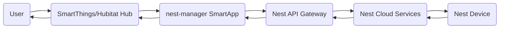
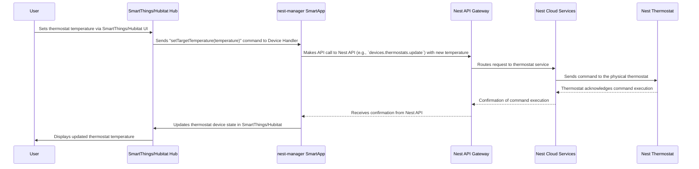
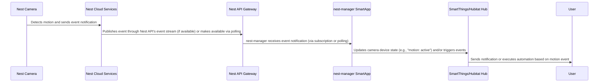

# Project Design Document: nest-manager Integration for SmartThings/Hubitat

**Version:** 1.1
**Date:** October 26, 2023
**Author:** AI Software Architect

## 1. Introduction

This document provides an enhanced design overview of the `nest-manager` project, an open-source solution facilitating the integration of Nest devices with SmartThings and Hubitat smart home platforms. This detailed description of the system's architecture, components, and data flow is intended to be a robust foundation for conducting a thorough threat modeling exercise.

The `nest-manager` project empowers users to control and monitor their Nest ecosystem devices (thermostats, cameras, protects, etc.) directly through their existing SmartThings or Hubitat hubs. It functions as an intermediary, bridging the communication gap between the Nest cloud services and the user's chosen smart home platform.

## 2. Goals and Objectives

The core objectives of the `nest-manager` project are:

- To enable a robust and reliable integration between Nest devices and SmartThings/Hubitat platforms.
- To allow users to seamlessly control Nest devices through their smart home hub's native interfaces and automation capabilities.
- To deliver a feature-rich integration solution encompassing the primary functionalities of Nest devices.
- To maintain ongoing compatibility with evolving Nest APIs and SmartThings/Hubitat platform updates, ensuring long-term usability.

## 3. System Architecture

The `nest-manager` project's architecture involves several interacting components. The high-level interaction can be visualized as follows:

### 3.1. Components

- **User:** The individual interacting with the smart home system, initiating control commands or observing device status updates through the SmartThings/Hubitat interface.
- **SmartThings/Hubitat Hub:** The central processing unit of the smart home system, responsible for executing user-defined automations, managing connected devices, and providing a user interface.
- **nest-manager SmartApp:** The central software component of the integration, residing and executing within the SmartThings or Hubitat environment. It orchestrates communication with the Nest API and translates commands and data between the Nest ecosystem and the smart home platform.
- **Nest API Gateway:**  The entry point to Google's Nest ecosystem, responsible for authentication, authorization, and routing requests to the appropriate backend services.
- **Nest Cloud Services:** Google's cloud infrastructure hosting the core logic and data for managing Nest devices and user accounts.
- **Nest Device:** The physical Nest hardware device (e.g., thermostat, camera, smoke detector) that the user aims to control or monitor.

### 3.2. Detailed Component Description

- **nest-manager SmartApp:**
    - **OAuth 2.0 Client & Token Manager:** Implements the OAuth 2.0 authorization code grant flow to obtain user consent and secure access tokens for the Nest API. Manages the storage, refresh, and revocation of these tokens.
    - **Device Discovery Service:** Periodically queries the Nest API for a list of devices associated with the authenticated user's account, registering new devices and updating existing device information within the SmartThings/Hubitat platform.
    - **Command Handling Logic:** Receives commands from the SmartThings/Hubitat hub (e.g., setting a thermostat temperature), translates these commands into the appropriate Nest API calls, and sends them to the Nest API Gateway.
    - **State Synchronization Engine:**  Implements mechanisms to keep the device states within SmartThings/Hubitat synchronized with the actual states reported by the Nest devices. This might involve polling the Nest API or utilizing any available real-time subscription mechanisms.
    - **Device Handlers Interface:** Provides an abstraction layer for interacting with platform-specific Device Handlers, ensuring compatibility across SmartThings and Hubitat.

- **Device Handlers (SmartThings/Hubitat):**
    - **Platform Abstraction Layer:** Provides a standardized interface for the SmartApp to interact with different device types within the SmartThings and Hubitat ecosystems.
    - **Capability Mapping:** Maps the capabilities of Nest devices (e.g., `Thermostat`, `Camera`, `Sensor`) to the corresponding capabilities defined within the SmartThings/Hubitat platform.
    - **Command Execution:**  Receives abstract commands from the SmartApp and translates them into platform-specific actions to update device states or trigger device functions.
    - **State Reporting:**  Updates the device state within the SmartThings/Hubitat platform based on information received from the SmartApp, reflecting the current status of the Nest device.

## 4. Data Flow

The following diagrams illustrate the typical data flow for common interaction scenarios.

### 4.1. Controlling a Nest Thermostat Temperature

### 4.2. Receiving a Nest Camera Motion Event

## 5. Security Considerations (Detailed)

This section expands on the initial security considerations, providing more specific examples relevant to the `nest-manager` architecture.

- **Authentication and Authorization:**
    - **OAuth 2.0 Vulnerabilities:** Improper implementation of the OAuth 2.0 flow could lead to authorization code interception or token theft. Securely storing the client secret and validating redirect URIs are crucial.
    - **Token Storage Security:** Access and refresh tokens should be stored securely within the SmartThings/Hubitat environment, utilizing platform-provided secure storage mechanisms. Weak storage could lead to unauthorized access to the Nest account.
    - **Scope Creep:**  The integration should only request the minimum necessary OAuth scopes required for its functionality. Requesting excessive permissions increases the potential impact of a security breach.
- **API Security:**
    - **Man-in-the-Middle Attacks:** All communication with the Nest API must occur over HTTPS to prevent eavesdropping and tampering. Proper certificate validation is essential.
    - **API Key Management:** If any API keys are used (beyond OAuth), their secure storage and management are critical. Hardcoding keys is a significant vulnerability.
    - **Rate Limiting and Abuse Prevention:** The integration should implement appropriate retry logic and respect Nest API rate limits to avoid service disruption and potential account lockout.
- **Data Privacy:**
    - **Data Minimization:** The integration should only access and store the minimum amount of Nest device data necessary for its functionality.
    - **Data Storage and Handling:**  Understand where and how Nest device data is stored within the SmartThings/Hubitat environment. Ensure compliance with relevant privacy regulations regarding data retention and deletion.
    - **Data Transmission Security:** Any transmission of Nest device data within the SmartThings/Hubitat environment should be secured.
- **SmartThings/Hubitat Security:**
    - **SmartApp Vulnerabilities:**  The `nest-manager` SmartApp itself could be vulnerable to code injection, cross-site scripting (if it has a web interface), or other common web application vulnerabilities.
    - **Device Handler Security:**  Vulnerabilities in the Device Handlers could allow malicious actors to control Nest devices or gain unauthorized access to the smart home hub.
    - **Platform Security Model:** The security of the integration is inherently tied to the security of the underlying SmartThings/Hubitat platform. Understanding the platform's security model and limitations is important.
- **Code Security:**
    - **Dependency Vulnerabilities:** Regularly scan and update third-party libraries used by the project to address known vulnerabilities.
    - **Secure Coding Practices:** Adherence to secure coding practices is essential to prevent common software vulnerabilities. Regular code reviews and static analysis can help identify potential issues.
- **User Impersonation:** Ensure that actions performed through the integration are correctly attributed to the authorized user and cannot be easily spoofed.

## 6. Deployment Considerations

- The `nest-manager` SmartApp is deployed as a custom SmartApp within the user's SmartThings Groovy IDE or the Hubitat web interface.
- Device Handlers are installed separately on the SmartThings or Hubitat platform to represent the individual Nest devices.
- Users must complete an OAuth 2.0 authentication flow, typically involving redirecting to a Nest login page and granting permissions to the `nest-manager` application.
- The deployment process often involves copying code snippets or using package managers provided by the respective platforms.

## 7. Future Enhancements (Out of Scope for Initial Threat Model)

- Expansion of supported Nest device types and functionalities.
- Implementation of more sophisticated error handling, logging, and debugging tools.
- Development of a more user-friendly interface for configuration and management.
- Integration with other smart home ecosystems beyond SmartThings and Hubitat.

## 8. Open Questions and Areas for Further Investigation

- **API Key Management Details:** How are the OAuth client ID and secret managed and secured within the `nest-manager` codebase and during deployment?
- **Specific Data Accessed and Stored:**  A precise inventory of the Nest API endpoints used and the data fields accessed and potentially stored by the SmartApp is needed.
- **Error Handling and Resilience:**  Detailed examination of the error handling mechanisms for various API communication failures and edge cases is required.
- **Token Storage Implementation:**  Clarification on how user credentials and access/refresh tokens are specifically stored and protected within the SmartThings/Hubitat environment. Are platform-provided secure storage APIs used?
- **Implemented Security Best Practices:** A review of the codebase to identify specific security measures implemented (e.g., input validation, output encoding, protection against common web vulnerabilities) is necessary.
- **Event Handling Mechanism:**  Detailed understanding of how real-time events from Nest devices are handled (e.g., using Google Cloud Pub/Sub or long polling).

This enhanced design document provides a more detailed and nuanced understanding of the `nest-manager` project's architecture and potential security considerations. This information will be invaluable for conducting a comprehensive and effective threat modeling exercise.
