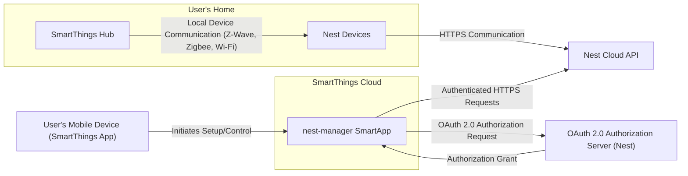
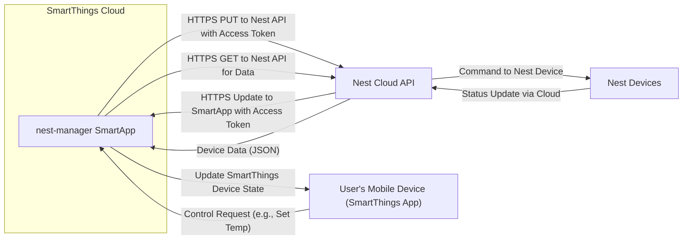

# Project Design Document: nest-manager SmartThings Integration

**Version:** 1.1
**Date:** October 26, 2023
**Author:** Gemini (AI Language Model)
**Project:** nest-manager SmartThings Integration
**Project Repository:** https://github.com/tonesto7/nest-manager

## 1. Introduction

This document provides an enhanced and more detailed design overview of the `nest-manager` project, a SmartThings integration for Nest devices. This document is intended to serve as a robust foundation for subsequent threat modeling activities. It elaborates on the system's architecture, components, data flow, and key security considerations, providing a deeper understanding of potential attack surfaces.

## 2. Goals

* Provide a comprehensive and detailed architectural overview of the `nest-manager` project, suitable for threat modeling.
* Clearly identify key components and their specific interactions, including communication protocols and data formats.
* Describe the data flow within the system with specific examples of data exchanged.
* Highlight potential security considerations with more concrete examples of threats and vulnerabilities for threat modeling.

## 3. Scope

This document covers the design of the `nest-manager` SmartThings integration as represented in the provided GitHub repository. It focuses on the logical architecture, data flow, and security aspects involved in connecting SmartThings with Nest devices. While it doesn't delve into the specific lines of Groovy code or the intricacies of the Nest API documentation, it provides sufficient detail for security analysis.

## 4. Target Audience

This document is intended for:

* Security engineers and architects performing detailed threat modeling and security assessments.
* Developers working on or maintaining the `nest-manager` integration, requiring a deeper understanding of its architecture and security implications.
* Anyone needing a thorough understanding of the system's architecture for security analysis and risk assessment.

## 5. System Overview

The `nest-manager` project bridges the gap between the SmartThings and Nest ecosystems, enabling users to manage and automate their Nest devices through the SmartThings platform. This integration allows for unified control and automation scenarios involving devices from both ecosystems. The core of the integration involves secure communication between the SmartThings Cloud and the Nest Cloud API, facilitated by the `nest-manager` SmartApp.

## 6. Architectural Design

The `nest-manager` integration comprises the following key components, with a more detailed description of their roles and interactions:

* **SmartThings Hub:** The local gateway device in the user's home that executes local automations and communicates with connected devices. It plays a less direct role in the cloud-to-cloud integration but is the central point for the user's SmartThings ecosystem.
* **SmartThings Cloud:** The cloud infrastructure hosting SmartThings services, including the execution environment for SmartApps, device management, and user account management.
* **`nest-manager` SmartApp:** A custom application developed using the SmartThings Groovy SDK. It resides and executes within the SmartThings Cloud. Its primary functions include:
    * Handling the OAuth 2.0 authentication flow with Nest.
    * Translating SmartThings commands into Nest API calls.
    * Processing data received from the Nest API and updating SmartThings device states.
    * Potentially handling event subscriptions for real-time updates from Nest.
* **Nest Cloud API:** The set of RESTful APIs provided by Nest for interacting with Nest devices and data. The `nest-manager` SmartApp uses these APIs to:
    * Retrieve device information (status, temperature, etc.).
    * Send commands to control devices (set temperature, arm/disarm security, etc.).
    * Potentially subscribe to event streams for real-time updates.
* **Nest Devices:** The physical Nest devices (thermostats, cameras, doorbells, smoke detectors, etc.) connected to the user's Wi-Fi network and communicating with the Nest Cloud.
* **User's Mobile Device (SmartThings App):** The mobile application used by the user to interact with the SmartThings platform. This is where users configure the `nest-manager` integration and control their Nest devices through SmartThings.
* **OAuth 2.0 Authorization Server (Nest):** The component within the Nest infrastructure responsible for authenticating users, obtaining consent for data access, and issuing access tokens to authorized applications like `nest-manager`.

## 7. Data Flow

The data flow within the `nest-manager` integration involves several key scenarios, with specific examples of data exchanged:

* **Initial Setup and Authorization (OAuth 2.0 Flow):**
    * User initiates the `nest-manager` setup via the SmartThings mobile app.
    * SmartThings app redirects the user's browser to the Nest OAuth 2.0 authorization endpoint (`https://home.nest.com/login/oauth2/authorize`).
    * User authenticates with their Nest credentials on the Nest platform.
    * User grants (or denies) permissions requested by the `nest-manager` SmartApp (e.g., read thermostat data, control devices).
    * Nest authorization server redirects the user back to a designated callback URL within the SmartThings Cloud with an authorization code.
    * `nest-manager` SmartApp exchanges the authorization code for an access token and a refresh token by making a POST request to the Nest token endpoint (`https://www.googleapis.com/oauth2/v4/token`) with the code, client ID, and client secret.
    * Access and refresh tokens are securely stored within the SmartThings platform's secure storage mechanisms associated with the SmartApp.

* **Retrieving Nest Device Data (Example: Thermostat Temperature):**
    * `nest-manager` SmartApp periodically (or on demand) makes an authenticated HTTPS GET request to the Nest API endpoint for thermostat data (e.g., `https://developer-api.nest.com/devices/thermostats/<device_id>?auth=<access_token>`).
    * The Nest Cloud API responds with a JSON payload containing thermostat properties, including current temperature, target temperature, humidity, etc.
    * `nest-manager` parses the JSON response and updates the corresponding virtual thermostat device in SmartThings with the received data.

* **Controlling Nest Devices (Example: Setting Thermostat Temperature):**
    * User adjusts the setpoint of the virtual Nest thermostat in the SmartThings app.
    * SmartThings platform sends a command to the `nest-manager` SmartApp with the desired temperature.
    * `nest-manager` SmartApp constructs an HTTPS PUT request to the Nest API endpoint for the specific thermostat (e.g., `https://developer-api.nest.com/devices/thermostats/<device_id>?auth=<access_token>`), with a JSON payload containing the new target temperature.
    * The Nest Cloud API processes the request and sends the command to the Nest thermostat.
    * The Nest thermostat adjusts its settings.
    * The Nest Cloud API may send a subsequent update to the `nest-manager` SmartApp reflecting the change.

* **Event Handling (Potential using Nest's deprecated Streaming API or newer alternatives if available):**
    * If implemented, `nest-manager` might establish a persistent connection (e.g., using Server-Sent Events or WebSockets if Nest provides such an API) to receive real-time updates from Nest devices.
    * When a Nest device's state changes (e.g., motion detected by a camera), the Nest Cloud API pushes an event notification to the `nest-manager` SmartApp.
    * `nest-manager` processes the event and updates the corresponding SmartThings device status immediately.

## 8. Security Considerations

This section outlines key security considerations for the `nest-manager` integration, providing specific examples of potential threats:

* **OAuth 2.0 Implementation Vulnerabilities:**
    * **Authorization Code Interception/Theft:** A malicious app or attacker intercepting the authorization code during the redirect flow could impersonate the `nest-manager` and gain unauthorized access. Ensuring proper HTTPS usage and secure redirect URI configuration is crucial.
    * **Cross-Site Request Forgery (CSRF) during Authorization:** An attacker could trick a logged-in user into granting access to their Nest account to the attacker's SmartThings instance. Implementing state parameters in the OAuth flow can mitigate this.
    * **Access Token Leakage/Storage Vulnerabilities:** If access or refresh tokens are not stored securely within the SmartThings platform (e.g., in plain text logs or insecure storage), they could be compromised, allowing unauthorized access to the user's Nest account.
    * **Insufficient Scope of Permissions:** Requesting overly broad permissions during the OAuth flow increases the potential impact of a compromise. The principle of least privilege should be applied.

* **API Security Vulnerabilities:**
    * **Man-in-the-Middle (MITM) Attacks:** If communication between the `nest-manager` SmartApp and the Nest Cloud API is not strictly over HTTPS, attackers could intercept and modify data or steal access tokens.
    * **API Key Exposure (If Applicable):** While OAuth is the primary mechanism, if any API keys are used, their hardcoding or insecure storage within the SmartApp code could lead to compromise.
    * **Rate Limiting Exploitation:** An attacker could intentionally exceed the Nest API's rate limits, causing denial of service for legitimate users of the integration.
    * **Injection Attacks (e.g., Command Injection):** While less likely in this cloud-to-cloud scenario, improper handling of data received from the Nest API could potentially lead to vulnerabilities if that data is used in further processing or commands.
    * **Insecure Deserialization:** If the `nest-manager` deserializes data from the Nest API without proper validation, it could be vulnerable to attacks exploiting deserialization flaws.

* **SmartThings Platform Security Dependencies:**
    * **SmartThings Cloud Compromise:** A security breach in the SmartThings Cloud infrastructure could potentially expose access tokens and other sensitive data used by the `nest-manager` integration.
    * **SmartApp Vulnerabilities:** Bugs or vulnerabilities within the `nest-manager` SmartApp code itself could be exploited to gain unauthorized access or control.
    * **Insecure Device Handlers (If Custom Ones Are Used):** If the integration relies on custom device handlers, vulnerabilities in those handlers could be exploited.

* **User Privacy Risks:**
    * **Excessive Data Collection:** The integration might collect and store more Nest device data than necessary, raising privacy concerns.
    * **Data Retention Policies:** Lack of clear data retention policies could lead to the indefinite storage of sensitive user data.
    * **Data Sharing with Third Parties (Unintended):** Vulnerabilities could potentially lead to the unintended sharing of Nest device data with unauthorized third parties.

## 9. Assumptions and Constraints

* The `nest-manager` SmartApp operates within the security sandbox and limitations imposed by the SmartThings platform.
* The security of the integration heavily relies on the proper implementation and security of the Nest Cloud API and its OAuth 2.0 implementation.
* Users are assumed to have a reasonable level of security awareness regarding their Nest and SmartThings accounts.
* The document assumes that all communication between the `nest-manager` SmartApp and the Nest Cloud API is intended to be over HTTPS.

## 10. Future Considerations

* **Migration to Newer Nest APIs:**  As Google has deprecated older Nest APIs, future development should focus on migrating to the newer Google Smart Home platform APIs for enhanced security and features.
* **Local Control Options:** Exploring secure methods for direct local communication with Nest devices, if feasible, could reduce reliance on cloud services and improve privacy.
* **Enhanced Error Handling and Security Logging:** Implementing more robust error handling and security logging within the `nest-manager` SmartApp can aid in identifying and responding to potential security incidents.
* **Regular Security Audits and Code Reviews:** Periodic security audits and code reviews are essential to identify and address potential vulnerabilities.

This enhanced design document provides a more detailed and security-focused overview of the `nest-manager` project. It serves as a more robust foundation for conducting thorough threat modeling and identifying potential security risks associated with the integration.