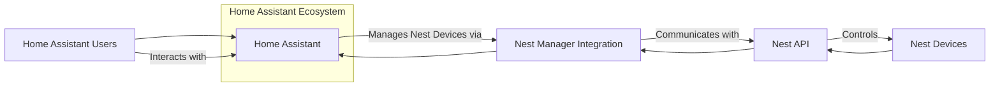
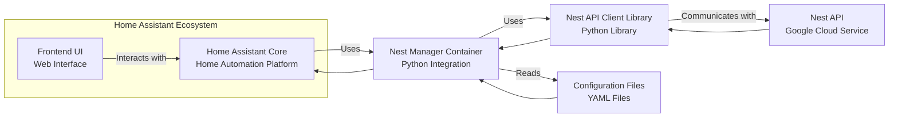
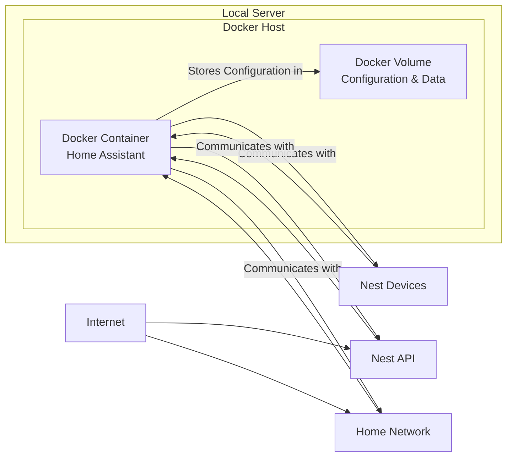

# BUSINESS POSTURE

This project, nest-manager, aims to provide enhanced integration between Nest devices and Home Assistant. By bridging these two ecosystems, users gain centralized control and automation capabilities for their smart home environment.

- Business Priorities and Goals:
  - Enhance user experience for Home Assistant users with Nest devices.
  - Provide a seamless integration for managing Nest thermostats, cameras, doorbells, and protect devices within Home Assistant.
  - Enable advanced automation scenarios leveraging both Nest and Home Assistant functionalities.
  - Increase the utility and value of Home Assistant for users invested in the Nest ecosystem.

- Business Risks:
  - Data privacy and security risks associated with accessing and managing Nest devices and data.
  - Potential service disruption if the integration fails or Nest API changes.
  - Compatibility issues with future Nest or Home Assistant updates.
  - Risk of unauthorized access to Nest devices through vulnerabilities in the integration.

# SECURITY POSTURE

- Security Controls:
  - security control: Authentication to Nest API is handled through Nest's OAuth 2.0 mechanism. (Implemented in: nest-manager code, likely leveraging a library for OAuth flow)
  - security control: Home Assistant's authentication and authorization mechanisms are used to control access to the integration within Home Assistant. (Implemented in: Home Assistant core, nest-manager integration utilizes Home Assistant's framework)
  - security control: Communication with Nest APIs is likely over HTTPS, ensuring data in transit encryption. (Implemented in: Libraries used for Nest API communication)
  - security control: Code is publicly available on GitHub, allowing for community review and identification of potential vulnerabilities. (Implemented in: GitHub repository)

- Accepted Risks:
  - accepted risk: Reliance on third-party Nest API and its security posture.
  - accepted risk: Security of user's Nest account credentials managed by Nest.
  - accepted risk: Potential vulnerabilities in third-party libraries used for Nest API interaction and OAuth.
  - accepted risk: Security of the Home Assistant instance where nest-manager is installed, which is outside the scope of this project.

- Recommended Security Controls:
  - security control: Implement input validation and sanitization for all data received from Nest API and Home Assistant to prevent injection attacks.
  - security control: Regularly update dependencies to patch known vulnerabilities in libraries used for Nest API interaction and Home Assistant integration.
  - security control: Implement logging and monitoring of security-relevant events, such as authentication failures and API access errors.
  - security control: Consider using a secrets management solution to securely store and manage API keys and OAuth credentials instead of plain text configuration files.
  - security control: Perform static application security testing (SAST) and dynamic application security testing (DAST) on the code to identify potential vulnerabilities.

- Security Requirements:
  - Authentication:
    - Requirement: Securely authenticate with the Nest API using OAuth 2.0.
    - Requirement: Integrate with Home Assistant's authentication system to control user access to the integration.
  - Authorization:
    - Requirement: Implement authorization checks to ensure users can only access and control Nest devices they are authorized to manage within Home Assistant.
    - Requirement: Follow the principle of least privilege when accessing Nest API resources.
  - Input Validation:
    - Requirement: Validate and sanitize all input received from Nest API and Home Assistant to prevent injection vulnerabilities.
    - Requirement: Handle API responses and data from Home Assistant securely, preventing unexpected data from causing issues.
  - Cryptography:
    - Requirement: Ensure all communication with Nest API is encrypted using HTTPS.
    - Requirement: Securely store any sensitive data, such as API keys or tokens, using appropriate encryption or secrets management techniques.

# DESIGN

## C4 CONTEXT



- Context Diagram Elements:
  - - Name: Home Assistant Users
    - Type: Person
    - Description: Users who utilize Home Assistant to manage their smart home, including Nest devices.
    - Responsibilities: Manage and monitor Nest devices through the Home Assistant interface.
    - Security controls: Authentication and authorization provided by Home Assistant.
  - - Name: Home Assistant
    - Type: Software System
    - Description: Open-source home automation platform that nest-manager integrates with.
    - Responsibilities: Provides a platform for home automation, user interface, and integration management. Hosts the nest-manager integration.
    - Security controls: User authentication, authorization, access control lists, secure configuration.
  - - Name: Nest Manager Integration
    - Type: Software System
    - Description: Home Assistant integration that bridges Nest devices and the Home Assistant platform.
    - Responsibilities: Authenticates with Nest API, translates Home Assistant commands to Nest API calls, and presents Nest device data within Home Assistant.
    - Security controls: Secure API key management, input validation, secure communication with Nest API.
  - - Name: Nest API
    - Type: Software System
    - Description: Google's API for accessing and controlling Nest devices.
    - Responsibilities: Provides access to Nest device data and control functionalities. Manages Nest user accounts and authentication.
    - Security controls: OAuth 2.0 authentication, API access controls, data encryption in transit and at rest.
  - - Name: Nest Devices
    - Type: Software System
    - Description: Physical Nest devices such as thermostats, cameras, doorbells, and protect devices.
    - Responsibilities: Perform their intended functions (e.g., thermostat regulates temperature, camera records video), communicate with Nest API.
    - Security controls: Device security, firmware updates, secure communication protocols.

## C4 CONTAINER



- Container Diagram Elements:
  - - Name: Home Assistant Core
    - Type: Container
    - Description: The core application of Home Assistant, responsible for automation logic, device management, and integration framework.
    - Responsibilities: Provides the runtime environment for the nest-manager integration, manages device states, and executes automations.
    - Security controls: Home Assistant's core security features, including access control, authentication, and secure configuration.
  - - Name: Frontend UI
    - Type: Container
    - Description: Home Assistant's web-based user interface, used by users to interact with and manage their smart home, including Nest devices through the integration.
    - Responsibilities: Presents Nest device information and controls to users, allows users to configure and manage the integration.
    - Security controls: Home Assistant's frontend security features, session management, input sanitization.
  - - Name: Nest Manager Container
    - Type: Container
    - Description: The Python code implementing the nest-manager integration within Home Assistant.
    - Responsibilities: Handles communication with Nest API, translates data between Nest and Home Assistant, manages API credentials and configuration.
    - Security controls: Secure credential management, input validation, secure logging, dependency management.
  - - Name: Nest API Client Library
    - Type: Container
    - Description: Python library used by nest-manager to interact with the Nest API.
    - Responsibilities: Provides an abstraction layer for interacting with Nest API endpoints, handles API requests and responses.
    - Security controls: Library's inherent security features, regular updates to address vulnerabilities.
  - - Name: Configuration Files
    - Type: Container
    - Description: YAML files used to configure the nest-manager integration, including API keys and user settings.
    - Responsibilities: Stores configuration data for the integration.
    - Security controls: Secure file permissions, potentially secrets management for sensitive data within configuration.
  - - Name: Nest API
    - Type: Container
    - Description: Google's cloud-based Nest API service.
    - Responsibilities: Provides access to Nest device data and control functionalities, handles authentication and authorization.
    - Security controls: Nest API's security controls, OAuth 2.0, rate limiting, data encryption.

## DEPLOYMENT

Deployment is within a typical Home Assistant installation environment. Home Assistant can be deployed in various ways, including:

- Docker container
- Virtual machine
- Raspberry Pi or dedicated hardware
- Cloud-based Home Assistant services

We will describe a common deployment scenario using Docker on a local server.



- Deployment Diagram Elements:
  - - Name: Docker Container
    - Type: Container
    - Description: Docker container running the Home Assistant application, including the nest-manager integration.
    - Responsibilities: Executes Home Assistant and nest-manager code, manages integrations, and communicates with Nest devices and API.
    - Security controls: Docker container security, base image security, resource limits, network policies.
  - - Name: Docker Volume
    - Type: Storage
    - Description: Docker volume used to persist Home Assistant configuration and data, including nest-manager configuration.
    - Responsibilities: Stores persistent data for Home Assistant and nest-manager.
    - Security controls: File system permissions, volume encryption (if applicable), backups.
  - - Name: Local Server
    - Type: Infrastructure
    - Description: Physical or virtual server hosting the Docker environment.
    - Responsibilities: Provides the hardware and operating system for running Docker and Home Assistant.
    - Security controls: Server hardening, operating system security, physical security of the server.
  - - Name: Home Network
    - Type: Network
    - Description: Local network where the Home Assistant server and potentially some Nest devices are located.
    - Responsibilities: Provides network connectivity for Home Assistant to access local devices and the internet.
    - Security controls: Firewall, network segmentation, Wi-Fi security (if applicable).
  - - Name: Internet
    - Type: Network
    - Description: Public internet network.
    - Responsibilities: Provides connectivity to Nest API and external services.
    - Security controls: Firewall, intrusion detection/prevention systems at the network perimeter.
  - - Name: Nest Devices
    - Type: Device
    - Description: Physical Nest devices in the user's home.
    - Responsibilities: Interact with the Home Assistant integration via the local network or Nest cloud.
    - Security controls: Device security features, firmware updates, secure communication protocols.
  - - Name: Nest API
    - Type: Cloud Service
    - Description: Google's cloud-based Nest API service accessed over the internet.
    - Responsibilities: Provides API access to Nest devices.
    - Security controls: Nest API security controls, cloud provider security.

## BUILD

```mermaid
flowchart LR
    A["Developer"] --> B("Code Changes");
    B --> C["GitHub Repository"];
    C --> D["GitHub Actions"
    "Build & Test"];
    D --> E["Docker Image Registry"
    "ghcr.io / Docker Hub"];
    E --> F["Deployment Environment"];
    style D fill:#ccf,stroke:#99f,stroke-width:2px
```

- Build Process Elements:
  - - Name: Developer
    - Type: Person
    - Description: Software developer contributing to the nest-manager project.
    - Responsibilities: Writes code, fixes bugs, and implements new features.
    - Security controls: Secure development practices, code review, access control to the repository.
  - - Name: Code Changes
    - Type: Code
    - Description: Modifications to the source code of the nest-manager project.
    - Responsibilities: Implement new functionalities, fix issues, and improve the codebase.
    - Security controls: Version control (Git), code review, static analysis.
  - - Name: GitHub Repository
    - Type: Code Repository
    - Description: GitHub repository hosting the source code of nest-manager.
    - Responsibilities: Version control, code storage, collaboration platform.
    - Security controls: Access control, branch protection, audit logs, vulnerability scanning by GitHub.
  - - Name: GitHub Actions
    - Type: CI/CD System
    - Description: GitHub's built-in CI/CD service used for automated build, test, and potentially deployment processes.
    - Responsibilities: Automates build process, runs tests, performs security checks (linters, SAST), and potentially publishes artifacts.
    - Security controls: Secure workflow definitions, secrets management, isolated build environments, audit logs.
  - - Name: Docker Image Registry
    - Type: Artifact Repository
    - Description: Registry for storing and distributing Docker images, such as GitHub Container Registry (ghcr.io) or Docker Hub.
    - Responsibilities: Stores and serves Docker images of nest-manager or related components.
    - Security controls: Access control, image signing, vulnerability scanning of images, secure storage.
  - - Name: Deployment Environment
    - Type: Infrastructure
    - Description: Target environment where nest-manager is deployed (e.g., user's Home Assistant instance).
    - Responsibilities: Runs the deployed application.
    - Security controls: Environment security controls as described in the Deployment section.

# RISK ASSESSMENT

- Critical Business Processes:
  - Home Automation Control: Maintaining the ability for users to control and monitor their Nest devices through Home Assistant. Disruption could lead to inconvenience and loss of smart home functionality.
  - Data Privacy: Protecting user's Nest device data and credentials from unauthorized access or disclosure. Breach could lead to privacy violations and reputational damage.

- Data Sensitivity:
  - Nest Device Data: Includes sensor readings (temperature, humidity), camera feeds, doorbell events, device status, user preferences. Sensitivity: Moderate to High, depending on the type of data and user's privacy expectations. Camera and microphone data are highly sensitive.
  - Nest API Credentials (OAuth Tokens): Highly sensitive. Unauthorized access can lead to full control of user's Nest devices and data.
  - Home Assistant Configuration Data: May contain sensitive information depending on user setup. Sensitivity: Low to Moderate.

# QUESTIONS & ASSUMPTIONS

- Questions:
  - What is the intended scope of threat modeling? Is it focused on the integration itself, or the entire Home Assistant ecosystem including nest-manager?
  - What are the specific concerns regarding data privacy and security for this project from the business perspective?
  - Are there any specific compliance requirements that need to be considered (e.g., GDPR, CCPA)?
  - What is the risk appetite of the organization or users deploying this integration?

- Assumptions:
  - Assumption: The primary goal is to provide a functional and user-friendly integration while maintaining a reasonable level of security.
  - Assumption: Users are expected to have a basic understanding of Home Assistant and Docker if deploying in a Docker environment.
  - Assumption: Security best practices for Home Assistant and Docker deployments are assumed to be followed by the users.
  - Assumption: The threat model will primarily focus on risks related to the nest-manager integration and its interaction with Nest API and Home Assistant.