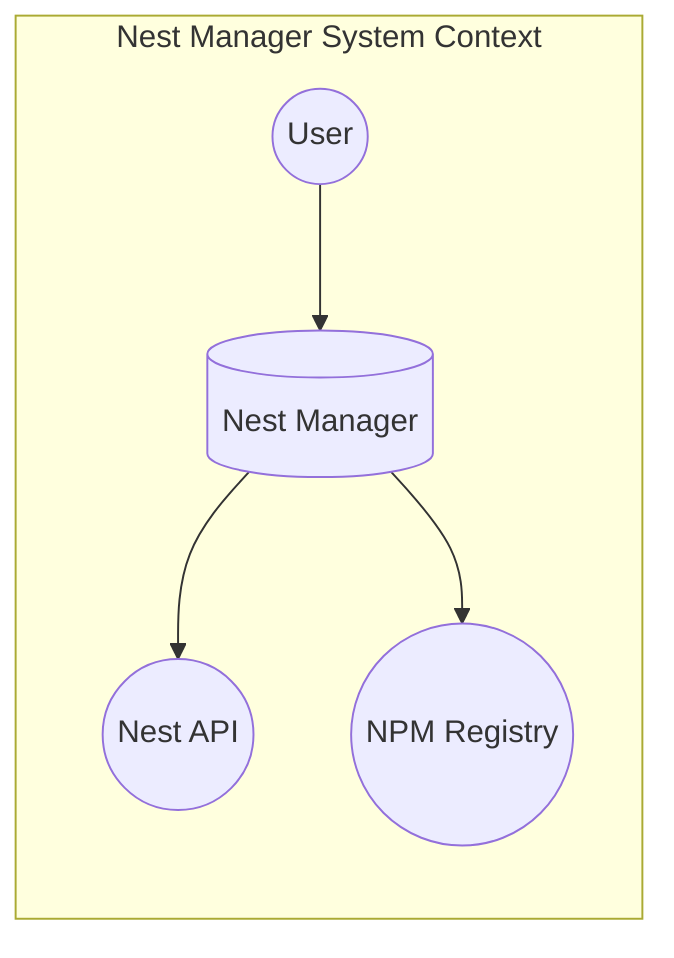
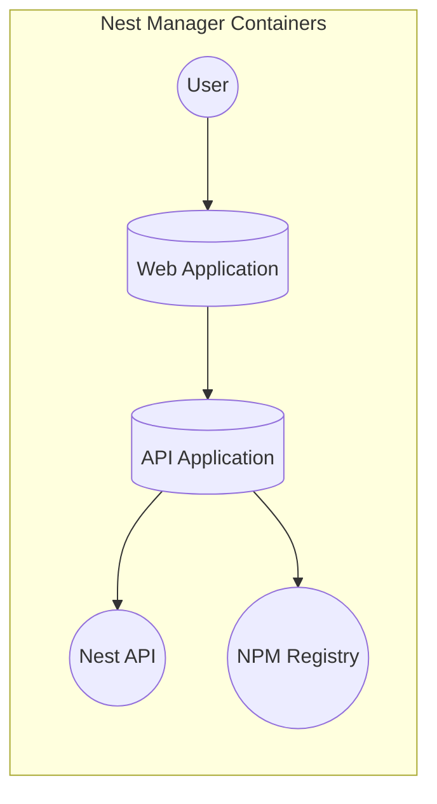
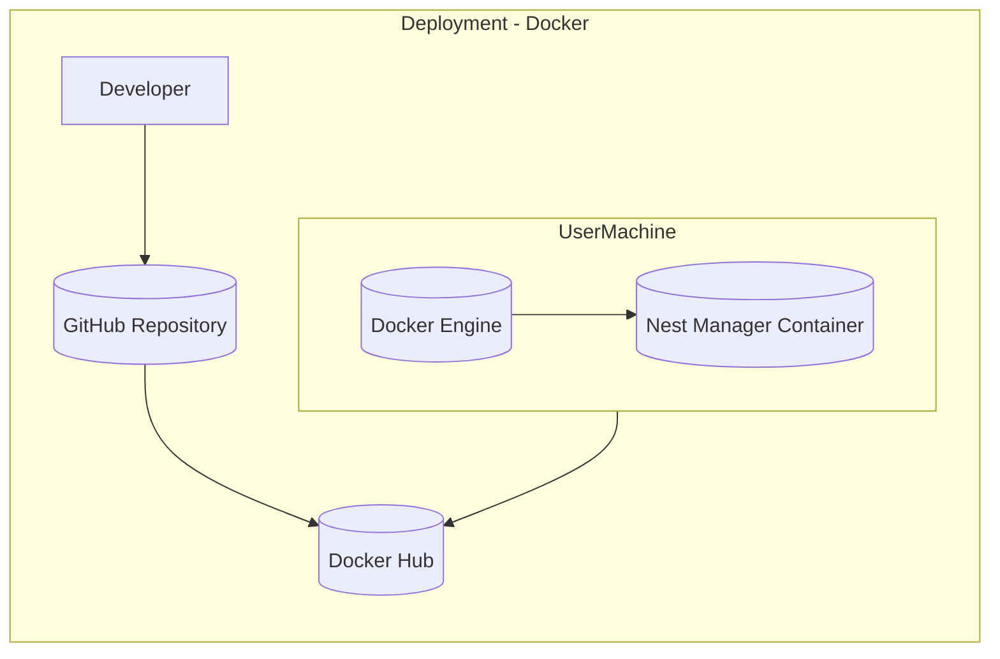
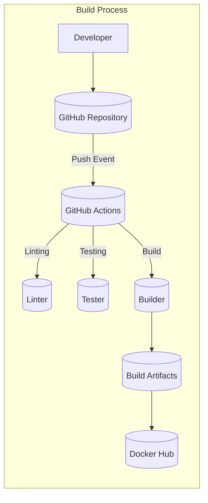

Okay, let's create a design document for the `nest-manager` project.

# BUSINESS POSTURE

Business Priorities and Goals:

*   Provide a simplified and enhanced user experience for managing Nest devices, potentially beyond what the official Nest application offers.
*   Enable home automation enthusiasts and developers to integrate Nest devices into custom smart home setups and workflows.
*   Offer a community-driven solution for Nest device management, potentially filling gaps in official support or features.
*   Reduce complexity for users who want to interact with Nest devices programmatically.

Most Important Business Risks:

*   Dependency on Nest API: Changes or limitations to the Nest API (now Google Nest API) could break functionality or limit the project's capabilities. This is a critical risk.
*   User Account Security: The application handles sensitive user credentials and access tokens for Nest accounts. A security breach could expose user data and control of their Nest devices.
*   Data Privacy: User data related to Nest device usage is collected and potentially stored. Compliance with privacy regulations (GDPR, CCPA, etc.) is crucial.
*   Maintaining User Trust: Negative publicity due to security vulnerabilities, data breaches, or unreliable functionality could severely damage the project's reputation and adoption.
*   Support and Maintenance: As an open-source project, ensuring ongoing maintenance, updates, and community support is essential for long-term viability.

# SECURITY POSTURE

Existing Security Controls:

*   security control: OAuth 2.0 for Nest API Authentication: The project uses OAuth 2.0, as indicated by the authorization flow in the README, to obtain user consent and access tokens for interacting with the Nest API. Implemented in authorization flow.
*   security control: Data Validation: Some level of data validation is likely present to handle API responses and user inputs, although the specifics need to be confirmed by examining the codebase. Implemented in code.
*   security control: Dependency Management: The project uses `npm` (Node Package Manager) to manage dependencies, allowing for updates and security patches to be applied. Implemented in `package.json`.
*   security control: Community Code Review: Being an open-source project on GitHub, the codebase is subject to community scrutiny and contributions, which can help identify and address security vulnerabilities. Implemented in GitHub repository.

Accepted Risks:

*   accepted risk: Reverse Engineering: The project relies on understanding and interacting with the Nest API, which may involve some degree of reverse engineering if the API is not fully documented.
*   accepted risk: API Changes: The project is vulnerable to breaking changes in the Nest API, which are outside the project's control.
*   accepted risk: Limited Control over Nest Infrastructure: The project interacts with Nest's cloud infrastructure, which is a third-party system with its own security controls and potential vulnerabilities.

Recommended Security Controls:

*   security control: Implement robust input validation and sanitization for all user inputs and API responses to prevent injection attacks (XSS, command injection, etc.).
*   security control: Enforce secure coding practices, including regular code reviews, static analysis, and dynamic testing, to identify and address vulnerabilities.
*   security control: Implement secure storage of sensitive data, such as API keys and access tokens, using encryption and appropriate access controls.
*   security control: Provide clear and concise documentation on security best practices for users, including how to securely manage their Nest credentials.
*   security control: Establish a vulnerability disclosure program to encourage responsible reporting of security issues.
*   security control: Regularly audit dependencies for known vulnerabilities and apply updates promptly.
*   security control: Implement logging and monitoring to detect and respond to suspicious activity.
*   security control: Consider implementing multi-factor authentication (MFA) if supported by the Nest API.

Security Requirements:

*   Authentication:
    *   The application MUST use OAuth 2.0 to authenticate users with the Nest API.
    *   The application MUST NOT store Nest user passwords directly.
    *   The application SHOULD support multi-factor authentication if available through the Nest API.
*   Authorization:
    *   The application MUST only request the minimum necessary permissions from the Nest API.
    *   The application MUST enforce access controls to ensure users can only access and modify their own Nest devices.
*   Input Validation:
    *   The application MUST validate all user inputs and API responses to prevent injection attacks.
    *   The application MUST sanitize data before displaying it to prevent cross-site scripting (XSS) attacks.
*   Cryptography:
    *   The application MUST use HTTPS for all communication with the Nest API.
    *   The application MUST securely store any sensitive data, such as API keys and access tokens, using encryption.

# DESIGN

## C4 CONTEXT

Element Descriptions:

*   Element:
    *   Name: User
    *   Type: Person
    *   Description: A person who interacts with Nest Manager to control their Nest devices.
    *   Responsibilities:
        *   Provides Nest account credentials.
        *   Interacts with the Nest Manager UI.
        *   Views Nest device data.
        *   Controls Nest devices.
    *   Security controls:
        *   Uses strong passwords.
        *   Enables multi-factor authentication (if available).

*   Element:
    *   Name: Nest Manager
    *   Type: Software System
    *   Description: The application that provides a simplified interface for managing Nest devices.
    *   Responsibilities:
        *   Authenticates users with the Nest API.
        *   Retrieves data from the Nest API.
        *   Displays data to the user.
        *   Sends commands to the Nest API.
        *   Manages user sessions.
    *   Security controls:
        *   OAuth 2.0 for Nest API authentication.
        *   Input validation and sanitization.
        *   Secure storage of sensitive data.
        *   Regular security audits and updates.

*   Element:
    *   Name: Nest API
    *   Type: External System
    *   Description: The official API provided by Google Nest for interacting with Nest devices.
    *   Responsibilities:
        *   Provides access to Nest device data.
        *   Allows control of Nest devices.
        *   Manages user accounts and permissions.
    *   Security controls:
        *   OAuth 2.0 for authentication.
        *   HTTPS for secure communication.
        *   Rate limiting and access controls.

*   Element:
    *   Name: NPM Registry
    *   Type: External System
    *   Description: The public registry for Node.js packages.
    *   Responsibilities:
        *   Provides access to third-party libraries and dependencies.
    *   Security controls:
        *   Package signing (optional).
        *   Vulnerability scanning (optional).

## C4 CONTAINER

Element Descriptions:

*   Element:
    *   Name: Web Application
    *   Type: Web Application
    *   Description: The user interface for interacting with Nest Manager, likely a web-based application.
    *   Responsibilities:
        *   Displays Nest device data to the user.
        *   Provides controls for interacting with Nest devices.
        *   Handles user input and validation.
        *   Communicates with the API Application.
    *   Security controls:
        *   Input validation and sanitization.
        *   Cross-site scripting (XSS) prevention.
        *   Secure communication with the API Application (HTTPS).

*   Element:
    *   Name: API Application
    *   Type: API Application
    *   Description: The backend component that handles communication with the Nest API and manages user sessions.
    *   Responsibilities:
        *   Authenticates users with the Nest API.
        *   Retrieves data from the Nest API.
        *   Processes data and sends it to the Web Application.
        *   Sends commands from the Web Application to the Nest API.
        *   Manages user sessions and access tokens.
    *   Security controls:
        *   OAuth 2.0 for Nest API authentication.
        *   Secure storage of API keys and access tokens.
        *   Input validation and sanitization.
        *   Rate limiting and access controls.

*   Element:
    *   Name: Nest API
    *   Type: External System
    *   Description: The official API provided by Google Nest.
    *   Responsibilities: Same as in C4 Context.
    *   Security controls: Same as in C4 Context.

*   Element:
    *   Name: NPM Registry
    *   Type: External System
    *   Description: The public registry for Node.js packages.
    *   Responsibilities: Same as in C4 Context.
    *   Security controls: Same as in C4 Context.

## DEPLOYMENT

Possible Deployment Solutions:

1.  **Local Installation:** Users can clone the repository and run the application locally on their own machines.
2.  **Docker Containerization:** The application could be packaged as a Docker container, making it easier to deploy and run on various platforms.
3.  **Cloud Deployment (e.g., Heroku, AWS, Google Cloud):** The application could be deployed to a cloud platform, providing scalability and availability.

Chosen Deployment Solution (Example: Docker Containerization):

Element Descriptions:

*   Element:
    *   Name: Developer
    *   Type: Person
    *   Description: A developer who contributes to the Nest Manager project.
    *   Responsibilities:
        *   Writes code.
        *   Tests code.
        *   Commits code to the GitHub repository.
    *   Security controls:
        *   Uses strong passwords.
        *   Enables multi-factor authentication for GitHub.

*   Element:
    *   Name: GitHub Repository
    *   Type: Code Repository
    *   Description: The source code repository for the Nest Manager project.
    *   Responsibilities:
        *   Stores the project's source code.
        *   Tracks changes to the code.
        *   Facilitates collaboration among developers.
    *   Security controls:
        *   Access controls.
        *   Branch protection rules.
        *   Code review requirements.

*   Element:
    *   Name: Docker Hub
    *   Type: Container Registry
    *   Description: A public registry for Docker images.
    *   Responsibilities:
        *   Stores and distributes Docker images.
    *   Security controls:
        *   Image signing (optional).
        *   Vulnerability scanning (optional).

*   Element:
    *   Name: User Machine
    *   Type: Physical/Virtual Machine
    *   Description: The machine where the user runs the Nest Manager application.
    *   Responsibilities:
        *   Runs the Docker Engine.
        *   Pulls the Nest Manager Docker image from Docker Hub.
        *   Runs the Nest Manager container.
    *   Security controls:
        *   Operating system security updates.
        *   Firewall.
        *   Antivirus software.

*   Element:
    *   Name: Docker Engine
    *   Type: Container Runtime
    *   Description: The software that runs Docker containers.
    *   Responsibilities:
        *   Manages Docker containers.
        *   Provides isolation between containers and the host operating system.
    *   Security controls:
        *   Regular security updates.
        *   Secure configuration.

*   Element:
    *   Name: Nest Manager Container
    *   Type: Docker Container
    *   Description: The running instance of the Nest Manager application.
    *   Responsibilities:
        *   Runs the Nest Manager application.
        *   Communicates with the Nest API.
    *   Security controls:
        *   All security controls listed for the Nest Manager application in previous sections.

## BUILD

Build Process Description:

1.  **Developer Commits Code:** A developer commits code changes to the GitHub repository.
2.  **GitHub Actions Triggered:** A push event to the repository triggers a GitHub Actions workflow.
3.  **Linting:** The workflow runs a linter (e.g., ESLint) to check for code style and potential errors.
    *   security control: Static code analysis for style and potential errors.
4.  **Testing:** The workflow runs unit tests and integration tests to ensure the code functions correctly.
    *   security control: Automated testing to catch bugs and regressions.
5.  **Build:** The workflow builds the application, creating a Docker image.
    *   security control: Automated build process to ensure consistency and reproducibility.
6.  **Publish Artifacts:** The Docker image is pushed to Docker Hub.
    *   security control: Secure storage and distribution of build artifacts.
7. **Dependency Scanning:** Dependencies are scanned for known vulnerabilities.
    * security control: Supply chain security.

# RISK ASSESSMENT

Critical Business Processes to Protect:

*   User authentication and authorization with the Nest API.
*   Retrieval and display of Nest device data.
*   Control of Nest devices through the application.
*   Management of user sessions and access tokens.

Data to Protect and Sensitivity:

*   Nest Account Credentials (Indirectly): The application handles OAuth tokens, which grant access to the user's Nest account. Sensitivity: High.
*   Nest Device Data: Information about the user's Nest devices, including their status, settings, and usage history. Sensitivity: Medium to High (depending on the specific data).
*   User Preferences and Settings: Any custom settings or preferences configured within the Nest Manager application. Sensitivity: Medium.
*   API Keys and Access Tokens: Sensitive credentials used to communicate with the Nest API. Sensitivity: High.

# QUESTIONS & ASSUMPTIONS

Questions:

*   What specific data validation and sanitization techniques are currently implemented?
*   How are API keys and access tokens currently stored and managed?
*   Are there any existing logging or monitoring mechanisms in place?
*   What is the intended deployment model for the application?
*   Are there any specific compliance requirements (e.g., GDPR, CCPA) that need to be considered?
*   What level of unit and integration testing is currently in place?
*   Is there a documented process for handling security vulnerabilities?
*   What version of Node.js and npm are used, and are they regularly updated?
*   What specific Nest API endpoints are used, and what permissions are requested?
*   Is there any error handling and reporting implemented?

Assumptions:

*   BUSINESS POSTURE: The project aims to provide a free and open-source solution for managing Nest devices.
*   BUSINESS POSTURE: The project is primarily targeted at home automation enthusiasts and developers.
*   SECURITY POSTURE: The project relies on the security of the Nest API and the underlying Node.js ecosystem.
*   SECURITY POSTURE: Users are responsible for securing their own Nest accounts and devices.
*   DESIGN: The application is a Node.js application.
*   DESIGN: The application uses a web-based user interface.
*   DESIGN: The application communicates with the Nest API using HTTPS.
*   DESIGN: The project uses npm for dependency management.
*   DESIGN: The project is hosted on GitHub.
*   DESIGN: The build process can be automated using GitHub Actions.