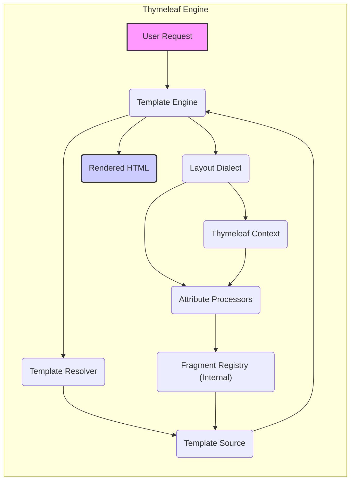
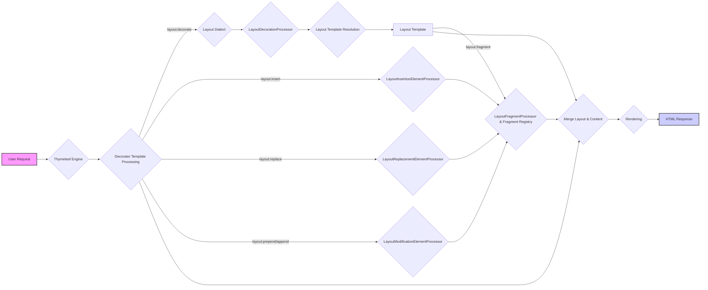

# Project Design Document: Thymeleaf Layout Dialect

**Version:** 1.1
**Date:** October 26, 2023
**Author:** AI Software Architect

## 1. Introduction

This document provides an enhanced design overview of the Thymeleaf Layout Dialect project. It elaborates on the architecture, key components, data flow, and security considerations of the dialect. This document serves as a robust foundation for subsequent threat modeling activities.

### 1.1. Purpose

The primary purpose of this document is to offer a more in-depth understanding of the Thymeleaf Layout Dialect's design and functionality. This enhanced understanding is critical for accurately identifying potential security vulnerabilities and developing comprehensive mitigation strategies during the threat modeling process.

### 1.2. Scope

This document encompasses the core architectural components and functionalities of the Thymeleaf Layout Dialect as described in the project repository: [https://github.com/ultraq/thymeleaf-layout-dialect](https://github.com/ultraq/thymeleaf-layout-dialect). It maintains a focus on the logical and conceptual design while providing more context and detail where appropriate.

### 1.3. Goals

*   Provide a more detailed definition of the key components and their interactions within the dialect.
*   Offer a more granular illustration of the data flow during template processing, including specific attribute processor actions.
*   Identify potential areas of security concern with more specific examples and context based on the design.
*   Furnish a stronger and more detailed basis for conducting thorough threat modeling.

## 2. Overview

The Thymeleaf Layout Dialect is a powerful extension for the Thymeleaf template engine, empowering developers to construct reusable and maintainable web page structures. It achieves this by enabling the creation of layout templates with designated content insertion points, and content templates that specify which layout to use and the content to be placed within those points.

The fundamental concepts of the dialect are:

*   **Layout Templates:** These templates define the overarching structure of a web page, containing named placeholders (fragments) where dynamic content will be inserted.
*   **Decorator Templates:** These templates specify the layout template to be applied and provide the specific content that will populate the placeholders within the layout.
*   **Fragments:** Reusable blocks of markup defined within templates. They serve as the units of content that are inserted into layout placeholders or other templates.

## 3. Architecture

The Thymeleaf Layout Dialect seamlessly integrates with the Thymeleaf template engine by leveraging Thymeleaf's established extension mechanisms. The core architectural components, with more detail, are:

*   **Layout Dialect Class (`nz.net.ultraq.thymeleaf.layout.LayoutDialect`):** This class serves as the central registration point for the dialect within the Thymeleaf engine. It registers the custom attribute processors, ensuring they are recognized and invoked during template processing.
*   **Attribute Processors (implementing `org.thymeleaf.processor.element.IElementProcessor`):** These are the workhorses of the dialect, responsible for handling the custom attributes introduced. Key attribute processors include:
    *   `layout:decorate` (`nz.net.ultraq.thymeleaf.layout.LayoutDecorationProcessor`): This processor, when encountered in a decorator template, identifies the specified layout template to be used. It triggers the loading and processing of the layout.
    *   `layout:fragment` (`nz.net.ultraq.thymeleaf.layout.LayoutFragmentProcessor`): Found within layout templates, this processor marks specific elements as named regions (fragments) where content can be inserted. It associates a name with the enclosed markup.
    *   `layout:insert` (`nz.net.ultraq.thymeleaf.layout.LayoutInsertionElementProcessor`): Used in decorator templates, this processor targets a named fragment in the layout template and inserts the content of the element it's attached to into that fragment.
    *   `layout:replace` (`nz.net.ultraq.thymeleaf.layout.LayoutReplacementElementProcessor`): Similar to `layout:insert`, but instead of inserting content, it replaces the entire content of the targeted fragment in the layout with the content of the current element.
    *   `layout:prepend` (`nz.net.ultraq.thymeleaf.layout.LayoutModificationElementProcessor` with a specific mode): This processor adds the content of the current element to the beginning of the targeted fragment in the layout.
    *   `layout:append` (`nz.net.ultraq.thymeleaf.layout.LayoutModificationElementProcessor` with a specific mode): This processor adds the content of the current element to the end of the targeted fragment in the layout.
*   **Fragment Registry (Internal):** While not explicitly a separate class, the dialect internally manages a mechanism (likely within the processing context) to store and retrieve fragments defined within templates. This is essential for the `layout:insert`, `layout:replace`, `layout:prepend`, and `layout:append` processors to locate the correct content.
*   **Template Resolution (Delegated to Thymeleaf):** The dialect relies entirely on Thymeleaf's robust template resolution mechanism to locate and load both layout and fragment templates. This involves configured template resolvers that search for templates based on provided names and locations.
*   **Context Integration (Thymeleaf Context):** The Layout Dialect operates within the standard Thymeleaf context. This provides access to variables, objects, and the overall processing state, allowing the dialect to interact with other parts of the application and template processing pipeline.



## 4. Data Flow

The data flow during the processing of a template utilizing the Layout Dialect can be broken down into more specific steps:

1. **User Request:** A user initiates a request for a web page, which triggers the Thymeleaf template engine to begin processing the associated template.
2. **Template Engine Initialization:** Thymeleaf starts processing the initially requested template (typically a decorator template).
3. **Layout Decoration Detection:** The Thymeleaf engine encounters the `layout:decorate` attribute within the decorator template.
4. **Layout Dialect Invocation:** The `layout:decorate` attribute triggers the `LayoutDecorationProcessor`.
5. **Layout Template Resolution:** The `LayoutDecorationProcessor` uses Thymeleaf's template resolver to locate and load the layout template specified in the `layout:decorate` attribute's value.
6. **Layout Template Processing:** Thymeleaf begins processing the layout template.
7. **Fragment Identification in Layout:** During layout template processing, the `LayoutFragmentProcessor` identifies elements with the `layout:fragment` attribute and registers the enclosed markup as named fragments within the internal fragment registry.
8. **Content Insertion/Replacement/Modification in Decorator:** Back in the decorator template processing, when attributes like `layout:insert`, `layout:replace`, `layout:prepend`, or `layout:append` are encountered:
    *   The corresponding attribute processor (`LayoutInsertionElementProcessor` or `LayoutModificationElementProcessor`) is invoked.
    *   The processor identifies the target fragment name specified in the attribute's value.
    *   It retrieves the content associated with the current element in the decorator template.
    *   It interacts with the internal fragment registry to locate the named fragment in the layout template.
    *   The content from the decorator is then inserted into, replaces, prepends to, or appends to the identified fragment in the layout template's structure.
9. **Final Rendering:** After all layout decorations and fragment manipulations are complete, Thymeleaf continues processing the merged template (the layout template with the inserted/modified content) to generate the final HTML output.
10. **HTML Response:** The fully rendered HTML is then sent back to the user's browser as the response to their request.



## 5. Security Considerations

Considering the design and data flow, the following security considerations are important for threat modeling:

*   **Template Injection Vulnerabilities:** If the values supplied to `layout:decorate`, `layout:insert`, or related attributes are derived from unsanitized user input, attackers could potentially inject malicious template code. For example, a crafted URL parameter could alter the layout being included, leading to the execution of arbitrary code or the display of unintended content.
*   **Information Disclosure through Error Handling:** Verbose error messages or stack traces generated during template processing, particularly during template resolution failures or fragment handling issues, could expose sensitive information about the application's file structure, internal logic, or dependencies.
*   **Denial of Service (DoS) Attacks:**  Maliciously crafted templates with excessively complex layout hierarchies or deeply nested fragment inclusions could consume significant server resources (CPU, memory), potentially leading to performance degradation or a complete denial of service.
*   **Dependency Vulnerabilities:** The Layout Dialect's functionality relies on the underlying Thymeleaf library. Any known vulnerabilities within the specific version of Thymeleaf being used could indirectly impact the security of applications utilizing the Layout Dialect. Regular updates to dependencies are crucial.
*   **Cross-Site Scripting (XSS) through Unsafe Fragment Content:** While the Layout Dialect focuses on template structure, if user-provided data is incorporated into fragments without proper output escaping within the templates themselves (using Thymeleaf's standard mechanisms like `th:text` with escaping), it can create XSS vulnerabilities. Attackers could inject malicious scripts that execute in users' browsers.
*   **Potential for Logic Flaws in Custom Fragment Handling:** If applications implement custom logic around how fragments are defined, accessed, or processed (beyond the core dialect functionality), vulnerabilities in this custom logic could be introduced. For instance, if fragment names are dynamically generated based on user input without proper validation.
*   **Server-Side Request Forgery (SSRF) (Less Likely but Possible):** In highly unusual scenarios where the layout dialect is used in conjunction with features that allow fetching external resources based on user input (though this is not a primary function of the dialect itself), there might be a theoretical risk of SSRF if those inputs are not properly validated.

## 6. Dependencies

The primary and essential dependency for the Thymeleaf Layout Dialect is:

*   **Thymeleaf (`org.thymeleaf`):** This is the core template engine that the Layout Dialect extends. The specific version compatibility between the Layout Dialect and Thymeleaf is critical. Refer to the Layout Dialect's documentation for supported Thymeleaf versions to ensure proper functionality and avoid potential conflicts or vulnerabilities.

## 7. Deployment

Deploying the Thymeleaf Layout Dialect within a Java web application that utilizes Thymeleaf involves the following standard steps:

*   **Dependency Management:** Add the Thymeleaf Layout Dialect as a dependency to your project's build configuration file.
    *   **Maven `pom.xml`:**
        ```xml
        <dependency>
            <groupId>nz.net.ultraq.thymeleaf</groupId>
            <artifactId>thymeleaf-layout-dialect</artifactId>
            <version>YOUR_VERSION</version> <!- Replace with the desired version ->
        </dependency>
        ```
    *   **Gradle `build.gradle`:**
        ```gradle
        dependencies {
            implementation("nz.net.ultraq.thymeleaf:thymeleaf-layout-dialect:YOUR_VERSION") // Replace with the desired version
        }
        ```
*   **Thymeleaf Configuration:** Register the `LayoutDialect` with your Thymeleaf template engine configuration. This is typically done within your Spring configuration or a similar setup for other Java web frameworks.
    *   **Spring Boot Example:** Spring Boot often auto-configures Thymeleaf. You might need to explicitly add the dialect if auto-configuration doesn't pick it up, or if you have custom Thymeleaf configuration.
        ```java
        @Configuration
        public class ThymeleafConfig {

            @Bean
            public LayoutDialect layoutDialect() {
                return new LayoutDialect();
            }
        }
        ```
    *   Alternatively, you can register the dialect directly with the `TemplateEngine` instance if you are manually configuring Thymeleaf.

## 8. Future Considerations

While not immediately relevant for the initial threat modeling process, awareness of potential future developments can inform long-term security planning and considerations:

*   **Enhanced Fragment Selection and Manipulation:** Potential features for more advanced ways to target, modify, and dynamically select fragments based on various criteria.
*   **Dynamic Layout Resolution Strategies:** Mechanisms to dynamically determine which layout template to apply based on request attributes, user roles, or other contextual information.
*   **Improved Integration with Asynchronous Template Processing:** Ensuring seamless and secure operation within asynchronous template rendering scenarios.
*   **Consideration for Security-Focused Features:**  Exploring potential features that could enhance the security of template composition, such as more granular control over fragment access or built-in sanitization options (though output escaping is generally handled by Thymeleaf itself).

This enhanced document provides a more detailed and comprehensive understanding of the Thymeleaf Layout Dialect's design and operation. This deeper understanding will be invaluable for conducting a more thorough and effective threat modeling exercise to identify and mitigate potential security risks associated with its utilization.
