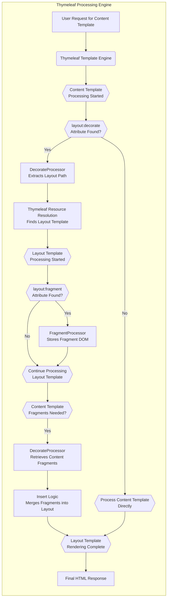

# Project Design Document: Thymeleaf Layout Dialect

**Version:** 1.1
**Date:** October 26, 2023
**Author:** Gemini (AI Language Model)

## 1. Introduction

This document provides an enhanced and detailed design overview of the Thymeleaf Layout Dialect project. This document is intended to serve as a robust foundation for understanding the system's architecture, components, and data flow, specifically tailored for the purpose of conducting thorough threat modeling. It meticulously outlines the key functionalities and interactions within the dialect, empowering security professionals to identify potential vulnerabilities and design precise and effective mitigations.

## 2. Goals and Scope

The primary goal of the Thymeleaf Layout Dialect is to empower developers to construct reusable layouts and implement template inheritance seamlessly within the Thymeleaf templating engine. This enables the definition of consistent, common page structures, into which specific, dynamic content can be injected into designated sections, known as fragments, within those layouts.

The scope of this document encompasses the core, intricate functionalities of the dialect, including:

*   Layout decoration facilitated by the `layout:decorate` attribute.
*   Precise fragment definition utilizing the `layout:fragment` attribute.
*   Mechanism for fragment insertion or replacement within layout templates.
*   Capability to pass parameters to fragments for dynamic content rendering.
*   Seamless integration with the established Thymeleaf processing pipeline.

This document explicitly does not cover:

*   The internal, low-level workings of the core Thymeleaf templating engine itself.
*   Specific, varied use cases or fine-grained implementation details within individual user applications.
*   The build process, testing procedures, or deployment strategies for the dialect library.

## 3. System Overview

The Thymeleaf Layout Dialect functions as a specialized extension meticulously integrated into the Thymeleaf templating engine. As Thymeleaf processes a template, the layout dialect's specifically designed processors intercept designated attributes, notably those prefixed with `layout:*`, and dynamically modify the standard template processing flow. The fundamental principle is to identify a "content template" whose rendered output is intended to be incorporated within a "layout template". The dialect orchestrates the merging of these two distinct templates by strategically inserting or replacing specific sections of the layout template with the relevant content extracted from the content template.

## 4. Core Components

This section provides a detailed breakdown of the key components that constitute the Thymeleaf Layout Dialect:

*   **`LayoutDialect`:** This class serves as the central registration point for the dialect and its associated attribute processors within the Thymeleaf engine. It acts as the primary entry point, initializing and enabling the dialect's core functionalities.
*   **`LayoutAttributeProcessor`:** This abstract class provides a foundational structure and common utilities for all specific layout attribute processors. It encapsulates shared logic and simplifies the development of individual processors.
*   **`DecorateProcessor`:** This processor is responsible for handling the `layout:decorate` attribute encountered within content templates. Its core responsibilities include:
    *   **Layout Template Identification:**  Extracting the path or name of the layout template to be utilized, typically from the attribute's value. This often involves resolving the template using Thymeleaf's resource resolution mechanisms.
    *   **Layout Template Processing Initiation:** Triggering the Thymeleaf engine to begin processing the identified layout template. This effectively pauses the processing of the content template.
    *   **Content Template DOM Storage:**  Persisting the Document Object Model (DOM) tree of the content template. This stored DOM will be used later to extract fragments for insertion into the layout.
*   **`FragmentProcessor`:** This processor manages the `layout:fragment` attribute, which can be present in both layout and content templates. Its key responsibilities are:
    *   **Named Fragment Identification:** Locating and identifying named fragments within a template based on the value of the `layout:fragment` attribute.
    *   **Fragment DOM Storage:** Storing the DOM subtree associated with each identified fragment, making it available for later use during the merging process.
    *   **Fragment Lookup:**  Providing a mechanism for other processors (primarily `DecorateProcessor`) to retrieve stored fragment DOMs based on their names.
*   **`InsertProcessor` (Logical):** While not a formally named class, the core logic responsible for the insertion of content template fragments into the layout template is a critical aspect. This logic is primarily orchestrated by the `DecorateProcessor` in conjunction with the information gathered by the `FragmentProcessor`. It involves:
    *   **Fragment Matching:** Identifying corresponding fragments in the layout template based on names.
    *   **Content Insertion/Replacement:**  Inserting the DOM of the content template's fragment into the designated location within the layout template, potentially replacing existing content.
*   **`LayoutContext` (Internal):** This internal data structure likely exists within the dialect's processing logic to maintain crucial state information throughout the layout decoration process. This context might store:
    *   The DOM of the content template.
    *   A map of identified fragments and their corresponding DOMs.
    *   Potentially, parameters passed to fragments.

## 5. Data Flow

The following flowchart provides a more granular illustration of the typical data flow during the processing of a template utilizing the Thymeleaf Layout Dialect:

**Detailed Steps:**

1. **User Request for Content Template:** A user initiates a request for a web page, triggering the processing of a designated Thymeleaf content template.
2. **Thymeleaf Template Engine:** The core Thymeleaf engine commences the processing of the requested template.
3. **Content Template Processing Started:**  Thymeleaf begins parsing and processing the elements within the content template.
4. **`layout:decorate` Attribute Found?:** The engine encounters the `layout:decorate` attribute within the content template's markup.
5. **`DecorateProcessor` Extracts Layout Path:** The `DecorateProcessor` intercepts the `layout:decorate` attribute and extracts the specified path or name of the intended layout template.
6. **Thymeleaf Resource Resolution Finds Layout Template:** Thymeleaf's resource resolution mechanism is employed to locate and load the specified layout template.
7. **Layout Template Processing Started:** The Thymeleaf engine now initiates the processing of the identified layout template.
8. **`layout:fragment` Attribute Found?:** During the processing of the layout template, the engine encounters `layout:fragment` attributes.
9. **`FragmentProcessor` Stores Fragment DOM:** The `FragmentProcessor` identifies and stores the Document Object Model (DOM) subtree associated with each named fragment defined by the `layout:fragment` attribute.
10. **Continue Processing Layout Template:** Thymeleaf continues its standard processing of the layout template.
11. **Content Template Fragments Needed?:**  As the processing of the layout template progresses, the point is reached where content from the original content template needs to be inserted.
12. **`DecorateProcessor` Retrieves Content Fragments:** The `DecorateProcessor` accesses the stored DOM of the content template and retrieves the DOMs of the relevant fragments (those whose names match placeholders in the layout).
13. **Insert Logic Merges Fragments into Layout:** The core insertion logic, primarily managed by the `DecorateProcessor`, takes the retrieved content fragments and merges them into the corresponding locations within the layout template's DOM. This might involve replacing existing elements or simply inserting new ones.
14. **Layout Template Rendering Complete:** The fully merged template (the layout template with the inserted content from the content template) is rendered into the final HTML output.
15. **Process Content Template Directly:** If the initial content template does not contain the `layout:decorate` attribute, the Thymeleaf engine proceeds with its standard processing of the content template without invoking the layout dialect.
16. **Final HTML Response:** The generated HTML is then sent back to the user's browser as the response to their initial request.

## 6. Security Considerations (Detailed)

This section expands upon the initial security considerations, providing more detailed explanations and potential attack scenarios that should be rigorously examined during a dedicated threat modeling exercise.

*   **Server-Side Template Injection (SSTI) via `layout:decorate`:**
    *   **Threat:** If the layout template path specified in the `layout:decorate` attribute is sourced from user input or an otherwise untrusted source (e.g., database content not properly sanitized), an attacker could inject malicious template code.
    *   **Scenario:** An attacker could manipulate a URL parameter or form field that influences the `layout:decorate` value to point to a malicious template containing code that executes arbitrary commands on the server.
    *   **Mitigation:**  Strictly avoid using user-provided input directly in the `layout:decorate` attribute. Implement robust input validation and sanitization. Consider using a whitelist of allowed layout templates.
*   **Fragment Injection/Manipulation:**
    *   **Threat:** While less probable in typical server-side rendering scenarios, if fragment names or parameters passed to fragments could be influenced by malicious user input, it could lead to unintended content inclusion or manipulation, potentially causing cross-site scripting (XSS) vulnerabilities if user-controlled content is rendered without proper escaping.
    *   **Scenario:** An attacker might try to craft specific fragment names or parameter values in a request that, when processed, injects malicious scripts into the final HTML.
    *   **Mitigation:**  Carefully control how fragment names and parameters are determined. Sanitize any user-provided data used in fragment parameter values before rendering. Utilize Thymeleaf's built-in escaping mechanisms.
*   **Denial of Service (DoS) through Complex Layouts:**
    *   **Threat:**  Malicious actors could craft excessively complex layout structures with deep nesting or a large number of fragments, leading to significant consumption of server resources (CPU, memory) during template processing, potentially causing a denial of service.
    *   **Scenario:** An attacker repeatedly requests pages that trigger the processing of these overly complex layouts, overwhelming the server's capacity.
    *   **Mitigation:**  Implement safeguards against excessively complex templates. This could involve setting limits on the depth of nesting or the number of fragments. Monitor server resource usage and implement rate limiting.
*   **Information Disclosure through Error Handling:**
    *   **Threat:**  If error handling during layout processing is not implemented securely, detailed error messages might inadvertently reveal sensitive information about the application's internal structure, file paths, or dependencies to unauthorized users.
    *   **Scenario:**  An attacker might intentionally trigger errors in the layout processing to glean information from the error messages.
    *   **Mitigation:**  Implement generic error pages that do not expose sensitive details. Log detailed error information securely for debugging purposes.
*   **Dependency Vulnerabilities:**
    *   **Threat:** The Thymeleaf Layout Dialect depends on the core Thymeleaf library. Vulnerabilities present in the underlying Thymeleaf library could be exploited through the layout dialect if not properly addressed.
    *   **Scenario:** A known vulnerability in a specific version of Thymeleaf could be exploited by an attacker if the application is using a vulnerable version of the layout dialect that depends on that Thymeleaf version.
    *   **Mitigation:**  Keep the Thymeleaf library and the layout dialect updated to the latest versions to patch known vulnerabilities. Regularly review security advisories for both libraries. Utilize dependency scanning tools to identify potential vulnerabilities.
*   **Cross-Site Scripting (XSS) via Unsafe Fragment Rendering:**
    *   **Threat:** If content from content templates, particularly within fragments, is rendered without proper output escaping, it could lead to XSS vulnerabilities if that content originates from user input or an untrusted source.
    *   **Scenario:** An attacker could inject malicious JavaScript code into a fragment within a content template, and if this content is rendered directly into the layout without escaping, the script will execute in the victim's browser.
    *   **Mitigation:**  Always use Thymeleaf's standard mechanisms for output escaping (e.g., `th:text` for text content, `th:utext` for unescaped text when absolutely necessary and with extreme caution). Treat all user-provided data as potentially malicious.

## 7. Dependencies

The Thymeleaf Layout Dialect has a crucial dependency on the following:

*   **Thymeleaf:** This is the foundational templating engine upon which the layout dialect is built. The specific version of Thymeleaf that the layout dialect is compatible with is a critical factor for both functionality and security. Threat modeling should consider the security vulnerabilities associated with the specific Thymeleaf version in use.

## 8. Deployment

The Thymeleaf Layout Dialect is typically deployed as a standard Java library (packaged as a JAR file) within a web application that utilizes Thymeleaf for its presentation layer. To enable the dialect, it must be explicitly registered within the Thymeleaf template engine configuration, usually within the Spring configuration or a similar setup.

## 9. Future Considerations

While not directly impacting the security of the current version, awareness of potential future enhancements can aid in anticipating future security challenges:

*   **Advanced Layout Composition Techniques:**  Future iterations might introduce more complex mechanisms for composing layouts, such as dynamic layout selection based on runtime conditions or more sophisticated fragment manipulation. These enhancements could potentially introduce new attack surfaces if not carefully designed.
*   **Integration with Client-Side Frameworks:** If the dialect were to integrate more deeply with client-side JavaScript frameworks, new security considerations related to the interaction between server-side rendering and client-side logic would need to be addressed.
*   **Customizable Processing Pipelines:** Allowing developers to customize the layout processing pipeline could offer flexibility but also introduce risks if not properly secured, potentially allowing for the injection of malicious processing steps.

This enhanced document provides a more comprehensive and detailed design overview of the Thymeleaf Layout Dialect, with a strong emphasis on aspects crucial for thorough threat modeling. By understanding the intricacies of the components, the detailed data flow, and the expanded security considerations, security professionals can conduct a more effective analysis of the project's potential vulnerabilities and devise robust security strategies.
