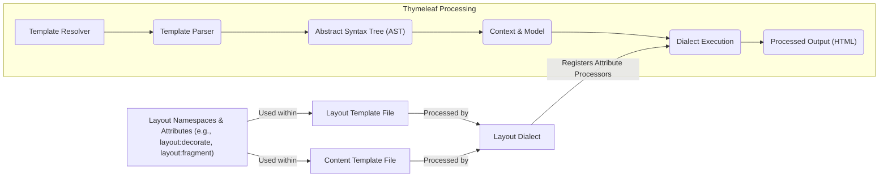
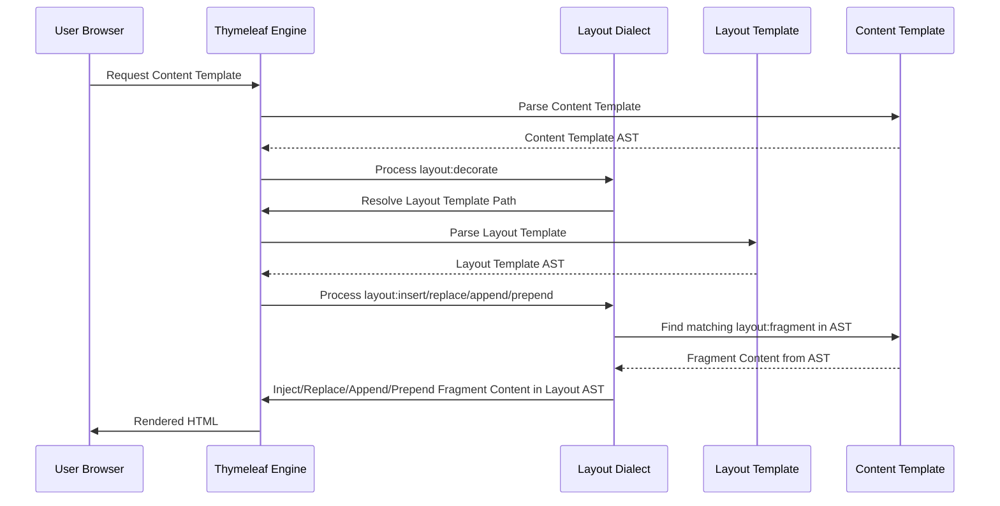

# Project Design Document: Thymeleaf Layout Dialect

**Version:** 1.1
**Date:** October 26, 2023
**Author:** AI Software Architect

## 1. Introduction

This document provides a detailed design overview of the Thymeleaf Layout Dialect project, as found on GitHub at [https://github.com/ultraq/thymeleaf-layout-dialect](https://github.com/ultraq/thymeleaf-layout-dialect). This document aims to clearly articulate the architecture, components, and data flow of the dialect. It will serve as a foundation for subsequent threat modeling activities.

### 1.1. Purpose

The primary purpose of this document is to provide a comprehensive technical description of the Thymeleaf Layout Dialect. This description will be used to identify potential security vulnerabilities and attack vectors during the threat modeling process.

### 1.2. Scope

This document covers the core functionality and architecture of the Thymeleaf Layout Dialect. It focuses on how the dialect integrates with the Thymeleaf templating engine and how it enables layout inheritance and fragment inclusion. It specifically details the custom attributes and their processing logic. It does not delve into the specifics of the Thymeleaf engine itself, beyond its interaction with the dialect.

### 1.3. Target Audience

This document is intended for:

*   Security engineers and architects involved in threat modeling and security assessments.
*   Software developers who need a deep understanding of the dialect's architecture for maintenance, debugging, or extension.
*   Technical project managers and stakeholders requiring a technical overview of the component.

## 2. Overview

The Thymeleaf Layout Dialect is a powerful extension for the Thymeleaf templating engine, designed to facilitate the creation of reusable and maintainable web page layouts. It introduces a set of custom XML attributes that allow developers to define base templates (layouts) and then create specific page templates that inherit from these layouts, overriding or inserting content into designated sections (fragments). This promotes a DRY (Don't Repeat Yourself) approach to web template development.

## 3. Architectural Design

The Thymeleaf Layout Dialect functions as a standard Thymeleaf dialect, registering custom processors that are invoked during the template processing lifecycle. These processors manipulate the template's Document Object Model (DOM) to achieve the desired layout inheritance and fragment inclusion.



### 3.1. Key Components

*   **LayoutDialect Class:** The central class of the dialect, responsible for implementing the `IDialect` interface from Thymeleaf. It registers the custom attribute processors with the Thymeleaf engine during initialization.
*   **Attribute Processors:** These are the core logic units of the dialect. Each processor is associated with a specific layout namespace attribute and defines how that attribute modifies the template DOM. Key attribute processors include:
    *   **`LayoutDecorationProcessor` (`layout:decorate`):** Applied to the root element of a content template. It triggers the loading and processing of the specified layout template. The processor essentially merges the content template into the layout template.
    *   **`LayoutFragmentProcessor` (`layout:fragment`):** Used within a layout template to define named regions or placeholders where content from content templates can be inserted.
    *   **`LayoutInsertionProcessor` (`layout:insert`, `layout:replace`, `layout:append`, `layout:prepend`):**  These processors are used within the layout template. They identify named fragments in the content template and insert, replace, append, or prepend the content of those fragments into the layout template's DOM at the location of the attribute.
*   **Template Resolution:** The dialect leverages Thymeleaf's existing `ITemplateResolver` implementations to locate and load both layout and content templates based on their names or paths.

### 3.2. Data Flow

The rendering process using the Layout Dialect follows these steps:

1. **Request for a Content Template:** The Thymeleaf engine receives a request to process a specific content template (e.g., a user navigates to a URL associated with this template).
2. **Content Template Parsing:** The Thymeleaf engine parses the content template, creating an Abstract Syntax Tree (AST).
3. **`layout:decorate` Processing:** If the root element of the content template contains the `layout:decorate` attribute, the `LayoutDecorationProcessor` is invoked.
    *   The processor extracts the path or name of the layout template from the attribute's value.
    *   Thymeleaf's template resolvers are used to locate and load the specified layout template.
4. **Layout Template Parsing:** The layout template is parsed into its own AST.
5. **Layout Template Processing with Fragment Inclusion:** The Thymeleaf engine begins processing the layout template's AST.
    *   When `layout:insert`, `layout:replace`, `layout:append`, or `layout:prepend` attributes are encountered, their respective processors are invoked.
    *   These processors examine the attribute's value to identify the target fragment name.
    *   The processors then search the *already parsed* AST of the content template for elements with a matching `layout:fragment` attribute.
    *   The content within the identified fragment in the content template is extracted.
    *   Based on the specific insertion attribute (`insert`, `replace`, `append`, `prepend`), the content from the content template's fragment is manipulated and inserted into the layout template's AST at the location of the attribute.
6. **Final Output Generation:** Once the layout template processing is complete, with all fragments included, the Thymeleaf engine serializes the resulting AST into the final HTML output, which is then sent to the client.



## 4. Security Considerations

This section outlines potential security considerations related to the design and functionality of the Thymeleaf Layout Dialect. These points will be further explored during a dedicated threat modeling exercise.

*   **Server-Side Template Injection (SSTI):** If the values provided to layout attributes, particularly `layout:decorate`, are derived from unsanitized user input, attackers could potentially inject malicious template code. This could allow them to execute arbitrary code on the server. For example, a manipulated `layout:decorate` value could point to a crafted template containing harmful scripts.
*   **Path Traversal Vulnerabilities:** If the paths used to resolve layout templates (specified in `layout:decorate`) are not properly validated, an attacker might be able to access arbitrary files on the server's filesystem. This could lead to information disclosure or other security breaches.
*   **Denial of Service (DoS):**  Maliciously crafted templates with excessively complex layout structures or deeply nested fragment inclusions could consume significant server resources (CPU, memory), potentially leading to a denial of service. This could involve creating templates that cause infinite loops or extremely long processing times.
*   **Information Disclosure through Error Messages:** Verbose error messages during template processing, especially those revealing file paths or internal application details, could provide valuable information to attackers. Proper error handling and logging are crucial.
*   **Cross-Site Scripting (XSS) via Template Content:** While the Layout Dialect itself doesn't directly introduce XSS, if the content inserted into fragments from the content template is not properly sanitized before being rendered, it could lead to XSS vulnerabilities. This is a general Thymeleaf concern but relevant in the context of how content is managed within layouts.
*   **Dependency Vulnerabilities:** The Layout Dialect depends on the Thymeleaf library. Any known vulnerabilities in the specific version of Thymeleaf used by the application could indirectly impact the security of the application using the Layout Dialect. Regularly updating dependencies is essential.

## 5. Dependencies

*   **Thymeleaf:** The Thymeleaf Layout Dialect has a mandatory runtime dependency on the Thymeleaf templating engine. The dialect is designed to work with specific versions of Thymeleaf. Dependency management is typically handled through build tools like Maven or Gradle. For example, in Maven, the dependency would be declared in the `pom.xml` file with appropriate group ID, artifact ID, and version.

    ```xml
    <dependency>
        <groupId>org.thymeleaf</groupId>
        <artifactId>thymeleaf</artifactId>
        <version>${thymeleaf.version}</version> <!- Replace with actual version ->
    </dependency>
    ```

## 6. Deployment

The Thymeleaf Layout Dialect is deployed as a standard Java library (JAR file). To integrate it into a web application:

*   **Dependency Management:** Add the dialect as a dependency to the project's build configuration file (e.g., `pom.xml` for Maven, `build.gradle` for Gradle).
    ```xml
    <dependency>
        <groupId>nz.net.ultraq.thymeleaf</groupId>
        <artifactId>thymeleaf-layout-dialect</artifactId>
        <version>${layout-dialect.version}</version> <!- Replace with actual version ->
    </dependency>
    ```
*   **Automatic Registration:** When the Thymeleaf engine initializes within the web application, it automatically discovers and registers the Layout Dialect, making its custom attributes available for use in templates. No explicit registration code is typically required.

## 7. Future Considerations (Beyond Initial Scope)

*   **Advanced Layout Composition:** Exploring more sophisticated mechanisms for combining and nesting layouts.
*   **Dynamic Fragment Selection:**  Investigating ways to dynamically choose which fragment to include based on runtime conditions.
*   **Improved Error Handling and Debugging:** Enhancing error messages and providing better tools for debugging layout-related issues.

This improved design document provides a more detailed and comprehensive overview of the Thymeleaf Layout Dialect, suitable for informing a thorough threat modeling process.