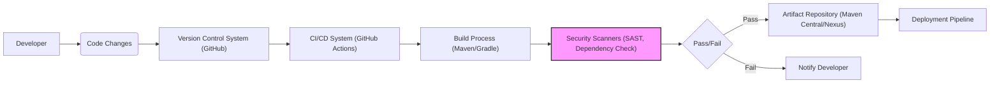

# BUSINESS POSTURE

- Business Priorities and Goals:
  - The primary goal of the Thymeleaf Layout Dialect project is to simplify and enhance web page layout management for developers using the Thymeleaf templating engine in Java web applications.
  - It aims to improve code reusability, reduce development time, and increase the maintainability of web application front-ends by providing a flexible and intuitive layout mechanism.
  - By offering a well-structured approach to template inheritance and composition, the project seeks to empower developers to create more organized and efficient Thymeleaf templates.

- Business Risks:
  - Dependency Vulnerabilities: As a third-party library, there is a risk of vulnerabilities within the Thymeleaf Layout Dialect itself or its dependencies. Exploits in these areas could compromise applications that rely on the library.
  - Integration Issues: Incorrect or insecure integration of the library into web applications could introduce vulnerabilities. Misconfiguration or misuse of the dialect by developers could lead to unintended security consequences.
  - Template Injection: If the library does not properly handle template inputs or user-provided data within templates, it could be susceptible to template injection attacks, potentially leading to cross-site scripting (XSS) or server-side code execution in applications using it.
  - Availability and Maintainability: Reliance on an open-source project carries a risk of project abandonment or lack of timely security updates if vulnerabilities are discovered. This could impact the long-term security and stability of applications using the library.
  - Reputation Damage: If vulnerabilities are found and exploited in applications due to flaws in the Thymeleaf Layout Dialect, it could negatively impact the reputation of both the library and the organizations using it.

# SECURITY POSTURE

- Existing Security Controls:
  - security control: Reliance on Thymeleaf's built-in security features. Thymeleaf itself is designed with security in mind, including protection against XSS and other template-related vulnerabilities. (Documented in Thymeleaf documentation).
  - security control: Standard Java web application security practices are expected to be in place in applications using this library. This includes measures like input validation, output encoding, authentication, and authorization implemented at the application level. (Application specific).
  - security control: Dependency management practices in place for applications using the library, such as using dependency management tools (Maven, Gradle) and potentially dependency vulnerability scanning. (Application specific, build process).

- Accepted Risks:
  - accepted risk: Risks associated with using third-party open-source libraries. This includes the potential for undiscovered vulnerabilities and reliance on the community for maintenance and security updates.
  - accepted risk: Risk of developer error in integrating and using the library securely within applications. Developers need to be trained and aware of secure coding practices when using templating engines and libraries.

- Recommended Security Controls:
  - recommended security control: Implement automated dependency scanning for the Thymeleaf Layout Dialect library and its dependencies in applications that use it. This will help identify and address known vulnerabilities promptly. (Build process, application deployment).
  - recommended security control: Conduct regular security code reviews of the Thymeleaf Layout Dialect project itself, focusing on template processing logic and input handling to identify potential vulnerabilities. (Project development lifecycle).
  - recommended security control: Provide clear and comprehensive security guidelines and best practices for developers using the Thymeleaf Layout Dialect, emphasizing secure template development and integration. (Project documentation).
  - recommended security control: Establish a process for reporting and responding to security vulnerabilities in the Thymeleaf Layout Dialect project. This includes having a security contact, a vulnerability disclosure policy, and a plan for releasing security patches. (Project maintenance).

- Security Requirements:
  - Authentication:
    - Not directly applicable to the Thymeleaf Layout Dialect library itself. Authentication is handled at the application level in web applications that use this library.
  - Authorization:
    - Not directly applicable to the Thymeleaf Layout Dialect library itself. Authorization is handled at the application level in web applications that use this library to control access to application features and data rendered in templates.
  - Input Validation:
    - security requirement: The Thymeleaf Layout Dialect should handle template inputs and directives in a way that prevents template injection vulnerabilities. It should not introduce new pathways for injecting malicious code through its features.
    - security requirement: When processing template fragments and layouts, the library should avoid insecurely evaluating or interpreting user-provided data that could be embedded within templates.
  - Cryptography:
    - Not directly applicable to the core functionality of the Thymeleaf Layout Dialect library. Cryptographic operations are typically handled at the application level for securing data and communication. However, if the library were to introduce features that involve handling sensitive data or communication, appropriate cryptographic measures would need to be considered.

# DESIGN

## C4 CONTEXT

```mermaid
flowchart LR
    subgraph "Web Application Environment"
        A["Java Web Application"]
    end
    B["Thymeleaf Layout Dialect"]
    C["Thymeleaf Templating Engine"]
    D["Java Web Developers"]
    E["Maven/Gradle"]

    D --> B
    B --> C
    B --> A
    A --> C
    E --> B: "Dependency Management"
    style B fill:#f9f,stroke:#333,stroke-width:2px
```

- Context Diagram Elements:
  - - Name: Java Web Application
    - Type: Software System
    - Description: The target environment where the Thymeleaf Layout Dialect is used. This represents the web application built by developers that utilizes Thymeleaf for templating and the Layout Dialect for enhanced layout capabilities.
    - Responsibilities: Runs the web application logic, handles user requests, renders web pages using Thymeleaf and the Layout Dialect, implements application-level security controls (authentication, authorization, input validation, etc.).
    - Security controls: Application-level security controls, including authentication, authorization, session management, input validation, output encoding, and protection against common web application vulnerabilities (OWASP Top 10).

  - - Name: Thymeleaf Layout Dialect
    - Type: Software System (Library)
    - Description: The Thymeleaf Layout Dialect library itself. It extends Thymeleaf's functionality to provide layout templating features. It is developed and distributed as an open-source project.
    - Responsibilities: Provides custom Thymeleaf dialects and processors for defining and applying layouts to Thymeleaf templates. Parses and processes template attributes and elements related to layout definitions. Integrates with the Thymeleaf engine.
    - Security controls: Secure coding practices during development, input validation within the dialect's code to prevent template injection, dependency vulnerability scanning for its own dependencies, and adherence to secure software development lifecycle principles.

  - - Name: Thymeleaf Templating Engine
    - Type: Software System (Library)
    - Description: The core Thymeleaf templating engine that the Layout Dialect extends. It is responsible for parsing and processing Thymeleaf templates.
    - Responsibilities: Parses Thymeleaf templates, processes Thymeleaf Standard Dialect attributes, provides core templating functionality, and interacts with the Layout Dialect to handle layout-specific directives.
    - Security controls: Thymeleaf's built-in security features, including protection against XSS and template injection vulnerabilities. Regular security updates and patches provided by the Thymeleaf project.

  - - Name: Java Web Developers
    - Type: Person
    - Description: Developers who use the Thymeleaf Layout Dialect to build Java web applications. They are responsible for writing Thymeleaf templates, integrating the library into their projects, and ensuring secure usage.
    - Responsibilities: Develop web applications using Java and Thymeleaf, design and implement web page layouts using the Layout Dialect, configure and integrate the library, and follow secure coding practices when using templating and the Layout Dialect.
    - Security controls: Secure development training, code reviews, static and dynamic code analysis, and adherence to organizational security policies and guidelines.

  - - Name: Maven/Gradle
    - Type: Software System (Build Tool)
    - Description: Dependency management and build tools commonly used in Java projects. Maven or Gradle are used to manage the Thymeleaf Layout Dialect library as a dependency in Java web applications.
    - Responsibilities: Manage project dependencies, including downloading and including the Thymeleaf Layout Dialect library and its transitive dependencies. Build and package the Java web application.
    - Security controls: Dependency vulnerability scanning plugins for Maven/Gradle, secure repository management practices, and build process security controls to ensure the integrity of dependencies.

## C4 CONTAINER

```mermaid
flowchart LR
    subgraph "Java Web Application"
        A["Web Application Code"]
        B["Thymeleaf Layout Dialect Library (JAR)"]
        C["Thymeleaf Library (JAR)"]
        D["Java Virtual Machine (JVM)"]
    end

    A --> B: "Uses"
    A --> C: "Uses"
    B --> C: "Extends"
    D --> A: "Runs"
    style B fill:#f9f,stroke:#333,stroke-width:2px
```

- Container Diagram Elements:
  - - Name: Web Application Code
    - Type: Software Container (Code)
    - Description: The custom code of the Java web application being developed. This includes controllers, services, models, and Thymeleaf templates that utilize the Layout Dialect.
    - Responsibilities: Implements the application's business logic, handles user requests, orchestrates data flow, and renders web pages using Thymeleaf templates and the Layout Dialect.
    - Security controls: Application-level security controls implemented within the code, including input validation, output encoding, authorization checks, secure session management, and protection against application-specific vulnerabilities. Code reviews, static and dynamic analysis, and security testing of the application code.

  - - Name: Thymeleaf Layout Dialect Library (JAR)
    - Type: Software Container (Library)
    - Description: The packaged Thymeleaf Layout Dialect library, distributed as a JAR file. This container provides the layout templating functionality to web applications.
    - Responsibilities: Provides Thymeleaf dialects and processors for layout management. Handles parsing and processing of layout-related template directives. Integrates with the Thymeleaf engine.
    - Security controls: Secure coding practices during library development, input validation within the library's code, dependency vulnerability scanning for library dependencies, and secure build and release processes for the JAR artifact.

  - - Name: Thymeleaf Library (JAR)
    - Type: Software Container (Library)
    - Description: The core Thymeleaf templating engine library, distributed as a JAR file. This is a dependency of the Layout Dialect and provides the base templating functionality.
    - Responsibilities: Provides core Thymeleaf templating engine functionality, parses and processes Thymeleaf templates, and handles standard Thymeleaf dialects.
    - Security controls: Thymeleaf's built-in security features, regular security updates and patches provided by the Thymeleaf project, and secure build and release processes for the JAR artifact.

  - - Name: Java Virtual Machine (JVM)
    - Type: Infrastructure Container (Runtime Environment)
    - Description: The Java Virtual Machine that provides the runtime environment for the Java web application and the Thymeleaf libraries.
    - Responsibilities: Executes the Java bytecode of the web application and libraries. Provides memory management, garbage collection, and other runtime services.
    - Security controls: JVM security features, including bytecode verification, security managers (if enabled), and regular security updates and patches for the JVM itself. Operating system-level security controls on the server hosting the JVM.

## DEPLOYMENT

- Deployment Options:
  - Option 1: Traditional Server Deployment: Deploying the Java web application (including the Thymeleaf Layout Dialect library) to a traditional application server (e.g., Tomcat, Jetty, WildFly) running on-premises or in the cloud (IaaS).
  - Option 2: Containerized Deployment: Packaging the Java web application and application server into a Docker container and deploying it to a container orchestration platform (e.g., Kubernetes, Docker Swarm) in the cloud (PaaS/CaaS) or on-premises.
  - Option 3: Serverless Deployment: Deploying the Java web application as a serverless function (e.g., AWS Lambda, Azure Functions, Google Cloud Functions). This might be less common for traditional web applications using Thymeleaf, but could be applicable for specific use cases.

- Detailed Deployment (Option 2: Containerized Deployment with Kubernetes):

```mermaid
flowchart LR
    subgraph "Kubernetes Cluster"
        subgraph "Nodes"
            subgraph "Node 1"
                A["Pod: Web Application Pod"]
                B["Container: Web Application Container"]
                C["Container: Thymeleaf Layout Dialect (JAR)"]
                D["Container: Thymeleaf (JAR)"]
                E["Container: Application Server (e.g., Tomcat)"]
            end
        end
        F["Kubernetes Service"]
        G["Ingress Controller"]
    end
    H["Internet"]
    H --> G: "HTTPS Requests"
    G --> F: "Routes Requests"
    F --> A: "Load Balances Requests"
    A --> B
    B --> C: "Uses"
    B --> D: "Uses"
    B --> E: "Runs In"
    style C fill:#f9f,stroke:#333,stroke-width:2px
    style D fill:#fff,stroke:#333,stroke-width:1px
    style E fill:#fff,stroke:#333,stroke-width:1px
```

- Deployment Diagram Elements:
  - - Name: Kubernetes Cluster
    - Type: Infrastructure Environment
    - Description: A Kubernetes cluster providing a container orchestration platform for deploying and managing the web application.
    - Responsibilities: Orchestrates container deployment, scaling, and management. Provides networking, load balancing, and service discovery within the cluster. Ensures high availability and fault tolerance.
    - Security controls: Kubernetes security features, including RBAC (Role-Based Access Control), network policies, pod security policies/admission controllers, secrets management, and regular security updates for the Kubernetes platform. Infrastructure security controls for the underlying nodes and network.

  - - Name: Nodes (Node 1)
    - Type: Infrastructure Component (Compute Instance)
    - Description: Worker nodes in the Kubernetes cluster. These are virtual or physical machines that run the application containers.
    - Responsibilities: Provide compute resources for running containers. Host pods and execute containerized applications.
    - Security controls: Operating system-level security hardening, regular patching, intrusion detection systems (IDS), host-based firewalls, and access control to the nodes themselves.

  - - Name: Pod: Web Application Pod
    - Type: Software Component (Kubernetes Pod)
    - Description: A Kubernetes pod is the smallest deployable unit, encapsulating one or more containers. In this case, it hosts the Web Application Container along with the Thymeleaf and Layout Dialect libraries (packaged within the application container).
    - Responsibilities: Provides a shared network namespace and storage volumes for the containers within it. Ensures co-location and shared lifecycle of the containers.
    - Security controls: Pod security policies/admission controllers to enforce security constraints on pods, resource limits and quotas, and network policies to control network traffic to and from pods.

  - - Name: Container: Web Application Container
    - Type: Software Container (Docker Container)
    - Description: A Docker container packaging the Java web application code, the Thymeleaf Layout Dialect and Thymeleaf libraries (JARs), and an application server (e.g., Tomcat).
    - Responsibilities: Runs the web application code within the containerized environment. Serves web pages, processes requests, and utilizes the Thymeleaf and Layout Dialect libraries for templating.
    - Security controls: Container image security scanning to identify vulnerabilities in base images and application dependencies. Principle of least privilege for container processes. Secure container configuration. Regular patching of container images.

  - - Name: Container: Thymeleaf Layout Dialect (JAR)
    - Type: Software Container (Library JAR within Container)
    - Description: The Thymeleaf Layout Dialect library JAR file, included within the Web Application Container.
    - Responsibilities: Provides layout templating functionality to the web application running in the container.
    - Security controls: Inherits security controls from the Web Application Container and the underlying infrastructure. Secure build process for the JAR artifact.

  - - Name: Container: Thymeleaf (JAR)
    - Type: Software Container (Library JAR within Container)
    - Description: The Thymeleaf library JAR file, included within the Web Application Container.
    - Responsibilities: Provides core Thymeleaf templating functionality to the web application.
    - Security controls: Inherits security controls from the Web Application Container and the underlying infrastructure. Secure build process for the JAR artifact.

  - - Name: Container: Application Server (e.g., Tomcat)
    - Type: Software Container (Application Server within Container)
    - Description: An application server (e.g., Tomcat) running within the Web Application Container to host the Java web application.
    - Responsibilities: Provides a runtime environment for the Java web application. Handles request processing, web serving, and application lifecycle management.
    - Security controls: Application server security configuration, security updates and patches for the application server, and adherence to application server security best practices.

  - - Name: Kubernetes Service
    - Type: Infrastructure Component (Kubernetes Service)
    - Description: A Kubernetes service that provides a stable IP address and DNS name to access the Web Application Pods.
    - Responsibilities: Load balances traffic across multiple Web Application Pods. Provides service discovery within the Kubernetes cluster.
    - Security controls: Network policies to control access to the service, service account security, and monitoring of service traffic.

  - - Name: Ingress Controller
    - Type: Infrastructure Component (Kubernetes Ingress)
    - Description: A Kubernetes Ingress controller that manages external access to the services within the cluster, typically handling HTTP/HTTPS routing.
    - Responsibilities: Routes external requests to the appropriate Kubernetes services based on configured rules. Provides TLS termination and other ingress-related functionalities.
    - Security controls: Ingress controller security configuration, TLS/SSL certificate management, protection against common web attacks (e.g., DDoS, OWASP Top 10) at the ingress level, and access control to ingress resources.

  - - Name: Internet
    - Type: External System
    - Description: The public internet from which users access the web application.
    - Responsibilities: Provides network connectivity for users to access the application.
    - Security controls: External firewalls, DDoS protection, and network security controls at the perimeter of the infrastructure. User-side security controls (e.g., browser security, antivirus).

## BUILD



- Build Process Description:
  - Developer makes code changes and commits them to a Version Control System (GitHub).
  - A CI/CD system (e.g., GitHub Actions) is triggered upon code changes (e.g., push, pull request).
  - The CI/CD system initiates the Build Process using build tools like Maven or Gradle.
  - During the build process, Security Scanners are integrated:
    - Static Application Security Testing (SAST) scanners analyze the source code for potential vulnerabilities.
    - Dependency Check tools scan project dependencies for known vulnerabilities.
  - The build process and security scans result in a Pass or Fail status.
  - If the build and security checks Pass:
    - Build artifacts (JAR file of the Thymeleaf Layout Dialect library) are published to an Artifact Repository (e.g., Maven Central for public release, or a private repository like Nexus for internal use).
    - The artifact is then available for use in Deployment Pipelines.
  - If the build or security checks Fail:
    - The CI/CD system notifies the developer about the failure.
    - The developer needs to address the issues (e.g., fix code vulnerabilities, resolve dependency issues) and commit new changes to trigger the build process again.

- Build Diagram Elements:
  - - Name: Developer
    - Type: Person
    - Description: A software developer who writes and modifies the code for the Thymeleaf Layout Dialect project.
    - Responsibilities: Writes code, fixes bugs, implements new features, and ensures code quality and security.
    - Security controls: Secure coding practices, code reviews, and developer workstations security.

  - - Name: Version Control System (GitHub)
    - Type: Software System (Code Repository)
    - Description: GitHub is used as the version control system to store and manage the source code of the Thymeleaf Layout Dialect project.
    - Responsibilities: Stores source code, tracks changes, manages branches and versions, and facilitates collaboration among developers.
    - Security controls: Access control to the repository, branch protection rules, audit logging, and security features provided by GitHub (e.g., dependency vulnerability scanning, secret scanning).

  - - Name: CI/CD System (GitHub Actions)
    - Type: Software System (Automation Platform)
    - Description: GitHub Actions is used as the CI/CD system to automate the build, test, and deployment processes for the project.
    - Responsibilities: Automates build workflows, runs tests, performs security scans, and manages artifact publishing.
    - Security controls: Secure CI/CD pipeline configuration, access control to CI/CD workflows and secrets, audit logging, and secure integration with other systems.

  - - Name: Build Process (Maven/Gradle)
    - Type: Software System (Build Tool)
    - Description: Maven or Gradle is used as the build tool to compile the Java code, manage dependencies, and package the Thymeleaf Layout Dialect library into a JAR file.
    - Responsibilities: Compiles code, manages dependencies, runs unit tests, packages the library, and executes build scripts.
    - Security controls: Secure build tool configuration, dependency management security (e.g., using dependency management tools to resolve dependencies securely), and build environment security.

  - - Name: Security Scanners (SAST, Dependency Check)
    - Type: Software System (Security Tooling)
    - Description: Security scanning tools integrated into the build process to automatically detect potential vulnerabilities. Includes SAST scanners for static code analysis and dependency check tools for vulnerability scanning of dependencies.
    - Responsibilities: Analyze source code for vulnerabilities (SAST), scan dependencies for known vulnerabilities (Dependency Check), and report findings.
    - Security controls: Regularly updated vulnerability databases for scanners, secure configuration of scanners, and integration with the CI/CD system for automated scanning.

  - - Name: Artifact Repository (Maven Central/Nexus)
    - Type: Software System (Artifact Storage)
    - Description: Maven Central (for public release) or a private repository like Nexus (for internal use) is used to store and distribute the built JAR artifact of the Thymeleaf Layout Dialect library.
    - Responsibilities: Stores and manages build artifacts, provides access to artifacts for developers and deployment pipelines, and ensures artifact integrity.
    - Security controls: Access control to the artifact repository, secure artifact storage, audit logging, and artifact signing to ensure integrity and authenticity.

  - - Name: Deployment Pipeline
    - Type: Software System (Automation Pipeline)
    - Description: An automated deployment pipeline that takes the built artifact from the artifact repository and deploys it to target environments (e.g., test, staging, production).
    - Responsibilities: Automates the deployment process, ensures consistent and repeatable deployments, and manages environment configurations.
    - Security controls: Secure deployment pipeline configuration, access control to deployment environments and credentials, audit logging, and secure deployment practices (e.g., immutable infrastructure, infrastructure-as-code).

# RISK ASSESSMENT

- Critical Business Processes:
  - For the Thymeleaf Layout Dialect library itself, the critical business process is the development, maintenance, and distribution of a secure and reliable library that developers can confidently use in their web applications.
  - For organizations using the library, the critical business processes are the development and operation of their web applications, which may rely on the layout functionality provided by this library to deliver their services and functionalities to end-users.

- Data to Protect and Sensitivity:
  - For the Thymeleaf Layout Dialect library project, the primary data to protect is the source code of the library itself. This code is publicly available on GitHub, but maintaining its integrity and preventing unauthorized modifications is important.
  - For applications using the library, the data being processed and rendered within Thymeleaf templates is the data to protect. The sensitivity of this data depends on the specific application. It can range from publicly accessible content to highly sensitive personal or financial information. The library itself does not directly handle sensitive data, but vulnerabilities in the library could potentially expose data processed by applications using it.

# QUESTIONS & ASSUMPTIONS

- Questions:
  - What is the intended deployment environment for applications using this library? (e.g., cloud, on-premises, containerized, serverless). This will help refine the deployment diagram and security considerations.
  - What are the specific security requirements and compliance standards that applications using this library need to adhere to? (e.g., PCI DSS, HIPAA, GDPR). This will help identify additional security controls and requirements.
  - Is there a dedicated security team or person responsible for the Thymeleaf Layout Dialect project? If so, what are their roles and responsibilities regarding security?
  - What is the process for reporting and handling security vulnerabilities in the Thymeleaf Layout Dialect project? Is there a security contact and a vulnerability disclosure policy?
  - Are there any specific security features or functionalities planned for future releases of the Thymeleaf Layout Dialect library?

- Assumptions:
  - BUSINESS POSTURE:
    - The primary business goal is to provide a useful and developer-friendly library that enhances Thymeleaf templating.
    - Security is a secondary but important consideration to ensure the library does not introduce vulnerabilities into applications using it.
    - The project is intended for general use by Java web developers and organizations of varying sizes and risk appetites.
  - SECURITY POSTURE:
    - Applications using the library are expected to implement their own application-level security controls.
    - The library itself should be developed with secure coding practices and should not introduce new vulnerabilities.
    - Dependency management and vulnerability scanning are expected to be part of the development and deployment processes for applications using the library.
  - DESIGN:
    - The library is distributed as a JAR file and is intended to be used as a dependency in Java web applications.
    - The build process involves standard Java build tools (Maven/Gradle) and CI/CD practices.
    - Deployment environments can vary, but containerized deployments are a common scenario.