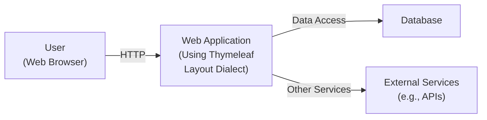
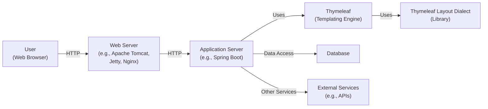
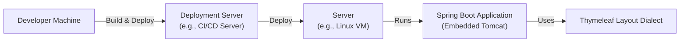
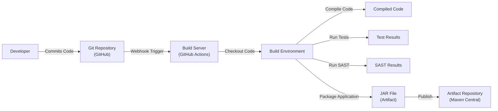

Okay, let's create a design document for the Thymeleaf Layout Dialect project.

# BUSINESS POSTURE

Business Priorities and Goals:

*   Enable developers to create reusable page layouts/templates in Thymeleaf, reducing code duplication and improving maintainability.
*   Provide a simple, intuitive, and flexible mechanism for defining and applying layouts.
*   Maintain high performance and minimal overhead.
*   Ensure compatibility with various Thymeleaf versions and Spring Framework integrations.
*   Provide good documentation and examples to facilitate adoption.

Business Risks:

*   Inconsistent layout rendering across different browsers or Thymeleaf configurations, leading to a broken user interface.
*   Performance bottlenecks introduced by the layout dialect, slowing down page rendering.
*   Security vulnerabilities introduced by improper handling of user-supplied data within layouts or fragments.
*   Lack of adoption due to complexity or poor documentation.
*   Compatibility issues with future Thymeleaf or Spring versions, requiring significant rework.
*   Inability to meet specific layout requirements of complex applications.

# SECURITY POSTURE

Existing Security Controls:

*   security control: The project itself is a templating engine extension, and thus relies heavily on the underlying security of Thymeleaf and the application using it.  Thymeleaf itself has built-in mechanisms to prevent Cross-Site Scripting (XSS) by escaping output by default. (Reference: Thymeleaf documentation, and application's configuration of Thymeleaf).
*   security control: The library does not directly handle user authentication or authorization. This is the responsibility of the application using the library. (Reference: Application's security configuration).
*   security control: Input validation is primarily the responsibility of the application using the library. The library itself does not perform specific input validation. (Reference: Application's input validation logic).
*   security control: The library does not directly handle cryptographic operations. (Reference: N/A, not applicable to the library's core function).
*   security control: Relies on the secure development practices of the maintainers, including code reviews and addressing reported vulnerabilities. (Reference: GitHub repository, issue tracker).
*   security control: Build process uses Gradle Wrapper, ensuring consistent builds. (Reference: `gradlew` files in the repository).

Accepted Risks:

*   accepted risk: The library, if misconfigured or used improperly within an application, could potentially contribute to XSS vulnerabilities. This is mitigated by Thymeleaf's default escaping behavior, but developers must be aware of this.
*   accepted risk: The library's functionality could be abused to create overly complex or deeply nested layouts, potentially leading to performance issues or stack overflow errors. This is mitigated by encouraging developers to follow best practices for layout design.

Recommended Security Controls:

*   security control: Integrate automated security scanning tools (e.g., SAST, SCA) into the build process to identify potential vulnerabilities in the library's code and dependencies.
*   security control: Provide clear documentation and examples on how to use the library securely, emphasizing the importance of input validation and output encoding in the application layer.
*   security control: Establish a security vulnerability disclosure policy and process for handling reported issues.

Security Requirements:

*   Authentication: Not directly applicable to the library. Authentication is handled by the application using the library.
*   Authorization: Not directly applicable to the library. Authorization is handled by the application using the library.
*   Input Validation: The application using the library *must* perform thorough input validation to prevent injection attacks. The library should not introduce any new input validation requirements beyond what Thymeleaf already provides.
*   Cryptography: Not directly applicable to the library. Cryptographic operations are handled by the application using the library.
*   Output Encoding: Thymeleaf's built-in output encoding (escaping) should be sufficient to prevent XSS vulnerabilities, provided it is used correctly in the application. The library should not disable or circumvent Thymeleaf's output encoding.

# DESIGN

## C4 CONTEXT

Element Descriptions:

*   Element:
    *   Name: User
    *   Type: Person
    *   Description: A person interacting with the web application through a web browser.
    *   Responsibilities: Initiates requests, views rendered pages.
    *   Security controls: Browser-based security controls (e.g., same-origin policy, cookie security).

*   Element:
    *   Name: Web Application
    *   Type: Software System
    *   Description: The application that utilizes the Thymeleaf Layout Dialect for its templating.
    *   Responsibilities: Handles user requests, processes data, renders web pages using Thymeleaf and the Layout Dialect.
    *   Security controls: Input validation, output encoding (Thymeleaf), authentication, authorization, session management, protection against common web vulnerabilities (e.g., CSRF, SQL injection).

*   Element:
    *   Name: Database
    *   Type: Software System
    *   Description: The database used by the web application to store data.
    *   Responsibilities: Stores and retrieves data.
    *   Security controls: Access control, encryption at rest and in transit, auditing, database firewall.

*   Element:
    *   Name: External Services
    *   Type: Software System
    *   Description: Any external services or APIs that the web application interacts with.
    *   Responsibilities: Provides specific services to the web application.
    *   Security controls: Authentication, authorization, secure communication (e.g., HTTPS), input validation.

## C4 CONTAINER

Element Descriptions:

*   Element:
    *   Name: User
    *   Type: Person
    *   Description: A person interacting with the web application.
    *   Responsibilities: Initiates requests, views rendered pages.
    *   Security controls: Browser-based security controls.

*   Element:
    *   Name: Web Server
    *   Type: Container
    *   Description: The web server that receives requests from the user.
    *   Responsibilities: Handles HTTP requests, serves static content, forwards requests to the application server.
    *   Security controls: TLS/SSL configuration, access control, request filtering.

*   Element:
    *   Name: Application Server
    *   Type: Container
    *   Description: The application server that runs the web application code.
    *   Responsibilities: Executes application logic, interacts with Thymeleaf, accesses the database and external services.
    *   Security controls: Authentication, authorization, session management, input validation, output encoding.

*   Element:
    *   Name: Thymeleaf
    *   Type: Container (Library)
    *   Description: The Thymeleaf templating engine.
    *   Responsibilities: Processes templates, renders HTML.
    *   Security controls: Output encoding (escaping) to prevent XSS.

*   Element:
    *   Name: Layout Dialect
    *   Type: Container (Library)
    *   Description: The Thymeleaf Layout Dialect library.
    *   Responsibilities: Provides layout functionality to Thymeleaf.
    *   Security controls: Relies on Thymeleaf's security features.

*   Element:
    *   Name: Database
    *   Type: Container
    *   Description: The database used by the web application.
    *   Responsibilities: Stores and retrieves data.
    *   Security controls: Access control, encryption.

*   Element:
    *   Name: External Services
    *   Type: Container
    *   Description: External services or APIs.
    *   Responsibilities: Provides specific services.
    *   Security controls: Authentication, authorization, secure communication.

## DEPLOYMENT

Possible Deployment Solutions:

1.  **Embedded Server (e.g., Spring Boot):** The application is packaged as a self-contained executable JAR with an embedded server (e.g., Tomcat, Jetty). This is a common approach for Spring Boot applications.
2.  **Traditional WAR Deployment:** The application is packaged as a WAR file and deployed to a standalone application server (e.g., Tomcat, JBoss).
3.  **Cloud Platform (e.g., AWS, Azure, GCP):** The application can be deployed to a cloud platform using various services (e.g., AWS Elastic Beanstalk, Azure App Service, Google App Engine). This often involves containerization (e.g., Docker).

Chosen Solution (for detailed description): Embedded Server (Spring Boot)

Element Descriptions:

*   Element:
    *   Name: Developer Machine
    *   Type: Infrastructure Node
    *   Description: The developer's workstation.
    *   Responsibilities: Code development, testing, building.
    *   Security controls: Local security measures (e.g., firewall, antivirus).

*   Element:
    *   Name: Deployment Server
    *   Type: Infrastructure Node
    *   Description: A server that handles the deployment process (e.g., Jenkins, GitLab CI).
    *   Responsibilities: Builds the application, runs tests, deploys the artifact.
    *   Security controls: Access control, secure build environment.

*   Element:
    *   Name: Server
    *   Type: Infrastructure Node
    *   Description: The server where the application is deployed.
    *   Responsibilities: Hosts the application.
    *   Security controls: Operating system security, firewall, intrusion detection.

*   Element:
    *   Name: Spring Boot Application
    *   Type: Software System Instance
    *   Description: The running instance of the Spring Boot application.
    *   Responsibilities: Handles user requests, processes data, renders pages.
    *   Security controls: Application-level security controls.

*   Element:
     *  Name: Thymeleaf Layout Dialect
     *  Type: Library
     *  Description: Library that is used by Spring Boot Application.
     *  Responsibilities: Provides layout functionality to Thymeleaf.
     *  Security controls: Relies on Thymeleaf's security features.

## BUILD

The Thymeleaf Layout Dialect project uses Gradle as its build tool. The build process is automated and includes several steps to ensure code quality and security.

Build Process Steps and Security Controls:

1.  **Code Commit:** Developers commit code to the GitHub repository.
    *   security control: Code reviews are performed before merging changes.

2.  **Webhook Trigger:** A webhook triggers the build process on the build server (GitHub Actions).

3.  **Checkout Code:** The build server checks out the code from the repository.

4.  **Compile Code:** The Gradle build script compiles the code.
    *   security control:  Gradle Wrapper ensures consistent build environment.

5.  **Run Tests:** Unit and integration tests are executed.
    *   security control: Tests verify the functionality and help prevent regressions.

6.  **Run SAST:** (Recommended) A Static Application Security Testing (SAST) tool should be integrated into the build process to scan the code for potential vulnerabilities.
    *   security control: SAST tools identify potential security flaws in the code.

7.  **Package Application:** The compiled code and dependencies are packaged into a JAR file.

8.  **Publish Artifact:** The JAR file is published to an artifact repository (Maven Central).
    *   security control:  Artifact signing can be used to ensure the integrity of the published artifact.

# RISK ASSESSMENT

Critical Business Processes:

*   Rendering web pages with consistent and correct layouts.
*   Providing a reliable and maintainable templating solution for web applications.

Data to Protect:

*   The library itself does not handle sensitive data directly. However, it is used to render web pages, which may display sensitive data managed by the *application* using the library. Therefore, the primary concern is to prevent vulnerabilities that could lead to the *exposure* or *manipulation* of that application-level data.
*   Data Sensitivity: The sensitivity of the data depends entirely on the application using the Thymeleaf Layout Dialect. The library itself does not define the sensitivity.

# QUESTIONS & ASSUMPTIONS

Questions:

*   Are there any specific compliance requirements (e.g., PCI DSS, HIPAA) that the applications using this library typically need to meet? This would influence the recommendations for application-level security.
*   What is the expected level of traffic and load for applications using this library? This would help assess performance risks.
*   What are the typical deployment environments for applications using this library (e.g., cloud providers, on-premise)?
*   Are there any specific security concerns or past incidents related to Thymeleaf or similar templating engines in the organization's history?

Assumptions:

*   BUSINESS POSTURE: The primary goal is to provide a robust and maintainable layout solution for Thymeleaf users. The organization has a moderate risk appetite, prioritizing stability and security but also recognizing the need for developer productivity.
*   SECURITY POSTURE: The organization has a basic understanding of web application security principles and follows secure coding practices. Thymeleaf's default escaping is understood and utilized.
*   DESIGN: The typical use case involves Spring Boot applications deployed to a cloud environment or on-premise servers. The applications using the library will handle their own authentication, authorization, and input validation. The library is used in a standard way, following the documentation and examples.