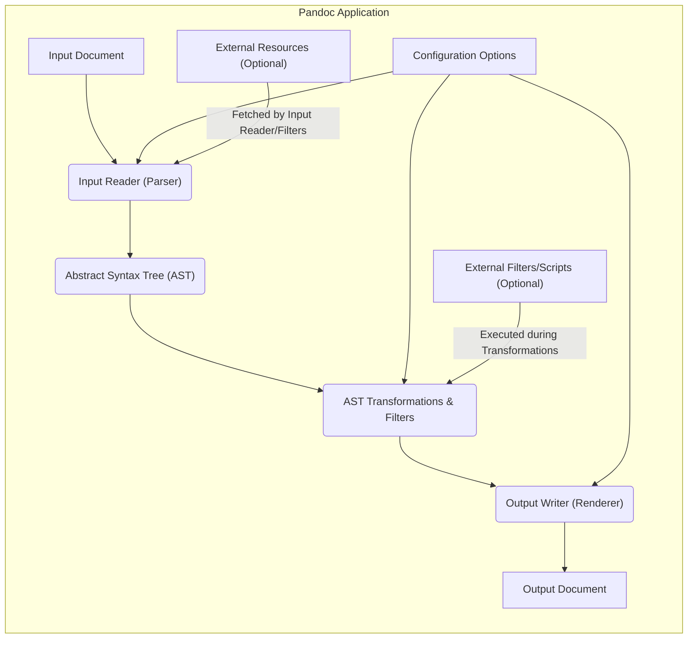

## Project Design Document: Pandoc (Improved)

**1. Introduction**

This document provides an enhanced and more detailed design overview of Pandoc, the universal document converter. This document is specifically crafted to serve as a robust foundation for subsequent threat modeling activities. It meticulously outlines the key components, data flow, interactions, and potential security considerations within the Pandoc application.

**2. Project Overview**

Pandoc is a versatile command-line tool designed for converting files between a vast array of markup formats. Its strength lies in its ability to seamlessly transform documents from formats like Markdown, reStructuredText, and HTML into formats such as LaTeX, Docx, PDF, EPUB, and many others. At its core, Pandoc operates by parsing the input document into a standardized internal Abstract Syntax Tree (AST), which then serves as an intermediary representation for rendering the output in the desired format. This decoupled architecture allows for flexible and accurate format conversions.

**3. System Architecture**

The following diagram illustrates the refined high-level architecture of Pandoc, emphasizing the flow of data and control:

**4. Key Components (Detailed)**

*   **Input Reader (Parser):**
    *   **Responsibility:**  This component is responsible for reading the raw input document and interpreting its structure according to the specified input format. It utilizes format-specific parsing libraries or modules (e.g., commonmark-hs for Markdown, libxml2 for HTML).
    *   **Functionality:**
        *   Identifies the input format based on user specification or file extension.
        *   Handles character encoding detection and conversion.
        *   Parses the document content into a structured representation.
        *   Reports syntax errors or inconsistencies in the input.
        *   May fetch external resources (images, includes) based on directives within the input document.
    *   **Security Relevance:** Vulnerabilities in the parsing libraries or the input reader logic can lead to:
        *   Denial of Service (DoS) through malformed input causing excessive resource consumption.
        *   Code Execution if vulnerabilities in the parser allow for control flow manipulation.
        *   Information Disclosure by improperly handling or exposing parts of the input.
        *   Server-Side Request Forgery (SSRF) if fetching external resources is not properly controlled.
*   **Abstract Syntax Tree (AST):**
    *   **Responsibility:**  The AST serves as the central, format-agnostic representation of the document's content and structure. It captures the semantic meaning of the input, independent of the original markup syntax.
    *   **Functionality:**
        *   Represents the document as a tree-like structure of nodes.
        *   Stores content, metadata, and structural information.
        *   Provides a consistent interface for transformations and rendering.
    *   **Security Relevance:** While the AST itself is an internal data structure, its design and how it's manipulated are crucial. Issues here could indirectly lead to vulnerabilities if transformations or rendering make incorrect assumptions about its state.
*   **AST Transformations & Filters:**
    *   **Responsibility:** This stage involves modifying the AST to achieve various effects, such as applying formatting rules, inserting content, or performing semantic transformations. Filters provide a powerful mechanism for extending Pandoc's functionality.
    *   **Functionality:**
        *   Applies built-in transformations (e.g., smart quotes, table of contents generation).
        *   Executes user-defined filters, which can be external scripts or Lua code.
        *   Filters can modify node attributes, add or remove nodes, and restructure the tree.
    *   **Security Relevance:** This is a critical area for security:
        *   **External Filter Execution:** Executing arbitrary external commands poses a significant risk of command injection and arbitrary code execution.
        *   **Lua Filter Security:**  Lua filters have access to Pandoc's internal data structures and functions. Vulnerabilities in the Lua environment or poorly written filters can lead to security breaches.
        *   **Filter Logic Errors:**  Bugs in built-in or user-defined filters could lead to unexpected modifications of the AST, potentially resulting in incorrect or insecure output.
*   **Output Writer (Renderer):**
    *   **Responsibility:** The Output Writer takes the transformed AST and generates the final output document in the specified format. It handles the specific syntax and formatting rules of the target format.
    *   **Functionality:**
        *   Traverses the AST and generates the corresponding markup or binary representation.
        *   Applies formatting, styling, and layout rules.
        *   Handles character encoding for the output.
        *   May utilize templates or stylesheets to customize the output.
    *   **Security Relevance:**
        *   **Output Injection:**  If the renderer doesn't properly sanitize content from the AST, it could lead to injection vulnerabilities in the output format (e.g., Cross-Site Scripting (XSS) in HTML, LaTeX injection).
        *   **Template Vulnerabilities:** If user-provided or untrusted templates are used, they could contain malicious code or lead to information disclosure.
        *   **Format-Specific Vulnerabilities:**  Certain output formats have inherent security risks if not handled carefully (e.g., PDF vulnerabilities).
*   **Configuration Options:**
    *   **Responsibility:**  Configuration options allow users to customize Pandoc's behavior, influencing parsing, transformations, and rendering.
    *   **Functionality:**
        *   Specified through command-line arguments, configuration files, or environment variables.
        *   Control input and output formats, enable extensions, specify filters, set metadata, and more.
    *   **Security Relevance:**
        *   **Insecure Defaults:**  Default configurations might not be the most secure.
        *   **Overly Permissive Options:**  Options that allow for the execution of external code or fetching remote resources can increase the attack surface.
        *   **Configuration Injection:** In scenarios where configuration is derived from user input, there's a risk of injecting malicious configurations.

**5. Data Flow (Detailed)**

1. **Input Acquisition:** Pandoc receives the input document, either from a specified file path or standard input. Configuration options related to the input format and encoding are also processed.
2. **Parsing and AST Creation:** The Input Reader, guided by the input format and configuration, parses the document. External resources referenced in the document might be fetched at this stage. The result is a structured AST representing the document's content.
3. **AST Transformation:** The AST is then passed through the transformation pipeline. Built-in transformations are applied. If user-defined filters are specified, Pandoc will:
    *   For external scripts: Execute the script as a separate process, passing the AST (or a serialized representation) as input and receiving the modified AST as output.
    *   For Lua filters: Load and execute the Lua script within Pandoc's Lua environment, allowing the script to directly manipulate the AST.
4. **Rendering and Output Generation:** The transformed AST is then processed by the Output Writer, which generates the final output document according to the specified output format and configuration. This involves translating the AST nodes into the target format's syntax and applying formatting rules.
5. **Output Delivery:** The generated output document is written to the specified file path or standard output.

**6. Interactions with External Systems (Detailed)**

*   **File System:**
    *   **Read Operations:** Reading input files, configuration files, templates, and potentially resources referenced in input documents.
    *   **Write Operations:** Writing output files, temporary files (if used), and potentially log files.
    *   **Security Relevance:**  Path traversal vulnerabilities could allow access to unauthorized files. Improper handling of file permissions could lead to information disclosure or modification.
*   **Standard Input/Output:**
    *   **Input:** Receiving document content or commands via standard input.
    *   **Output:** Sending the converted document or error messages via standard output/error.
    *   **Security Relevance:**  If Pandoc is used in a pipeline, vulnerabilities could be chained with other tools.
*   **External Filters/Scripts:**
    *   **Execution:** Spawning external processes to execute filter scripts.
    *   **Data Exchange:** Passing the AST (or a serialized form) to the filter and receiving the modified AST back.
    *   **Security Relevance:**  Major risk of command injection if filter paths or arguments are not properly sanitized. The security of the executed scripts is entirely dependent on the user.
*   **Lua Interpreter:**
    *   **Execution:** Running Lua code within Pandoc's process.
    *   **API Access:** Lua filters have access to a Pandoc-specific API for manipulating the AST and accessing other functionalities.
    *   **Security Relevance:**  Vulnerabilities in the Lua interpreter itself or in the Pandoc API exposed to Lua could be exploited. Malicious Lua code can perform arbitrary actions within Pandoc's context.
*   **Network (Potentially):**
    *   **Resource Fetching:** Downloading remote resources (images, stylesheets, includes) specified in input documents.
    *   **Template Retrieval:**  Potentially fetching remote templates.
    *   **Security Relevance:**  Risk of SSRF, man-in-the-middle attacks, and downloading malicious content. Lack of proper validation of fetched content could lead to further vulnerabilities.

**7. Deployment Considerations**

Pandoc is typically deployed as a standalone, statically linked executable, simplifying deployment across various platforms. Common deployment scenarios include:

*   **Local Command-Line Tool:**  Users install Pandoc directly on their machines for personal use.
*   **Server-Side Processing:** Integrated into web applications or document processing pipelines on servers.
*   **Containerized Environments:** Deployed within Docker or other container technologies.
*   **Build Systems:** Used as part of automated build processes for generating documentation.

The deployment context significantly impacts the threat landscape. Server-side deployments require stricter security measures than local usage.

**8. Security Considerations (Expanded)**

This section provides a more detailed breakdown of potential security concerns:

*   **Input Validation Vulnerabilities:**
    *   **Parser Exploits:**  Crafted input can trigger bugs in parsers leading to crashes, memory corruption, or code execution.
    *   **Encoding Issues:**  Improper handling of character encodings can lead to unexpected behavior or vulnerabilities.
    *   **Recursive Bomb Attacks:**  Deeply nested or self-referential input structures can cause excessive resource consumption.
*   **Filter Security Risks:**
    *   **Command Injection:**  Unsanitized filter arguments can allow attackers to execute arbitrary commands.
    *   **Lua Sandbox Escapes:**  Vulnerabilities in the Lua environment could allow filters to break out of the intended sandbox.
    *   **Malicious Filters:**  Users might unknowingly use malicious filters that compromise the system.
*   **Output Injection Vulnerabilities:**
    *   **Cross-Site Scripting (XSS):**  In HTML output, unsanitized content from the AST can lead to XSS vulnerabilities.
    *   **LaTeX Injection:**  Similar injection risks exist for LaTeX output.
    *   **Format-Specific Exploits:**  Other output formats might have their own injection vulnerabilities.
*   **Dependency Vulnerabilities:**
    *   Pandoc relies on external libraries. Vulnerabilities in these libraries can directly impact Pandoc's security.
    *   Regularly updating dependencies is crucial.
*   **Resource Exhaustion Attacks:**
    *   Processing extremely large files or documents with complex structures can lead to excessive memory or CPU usage, causing denial of service.
*   **Configuration Security:**
    *   Using insecure or default configurations can increase the attack surface.
    *   Storing sensitive configuration information insecurely.
*   **Network Security Risks:**
    *   **SSRF:**  Fetching remote resources without proper validation can allow attackers to access internal network resources.
    *   **Man-in-the-Middle Attacks:**  Fetching resources over insecure connections can expose data to interception.
    *   **Malware Download:**  Downloading and processing malicious content from remote sources.
*   **Temporary File Security:**
    *   Insecure creation or handling of temporary files can lead to information leakage or other vulnerabilities.

**9. Assumptions and Constraints**

*   Users are expected to exercise caution when using external filters and understand the associated risks.
*   The security of the underlying operating system and file system is a prerequisite.
*   This design document focuses on the core Pandoc application and does not cover specific integrations or deployment scenarios in exhaustive detail.

**10. Security Controls (High-Level)**

While a full security architecture is beyond the scope of this design document, here are some high-level security controls relevant to Pandoc:

*   **Input Sanitization:**  Rigorous validation and sanitization of input data to prevent parser exploits and other input-related vulnerabilities.
*   **Sandboxing/Isolation:**  Consider sandboxing or isolating the execution of external filters to limit their potential impact.
*   **Output Encoding and Escaping:**  Properly encoding and escaping output content to prevent injection vulnerabilities.
*   **Dependency Management:**  Regularly updating dependencies and using vulnerability scanning tools.
*   **Resource Limits:**  Implementing limits on resource consumption to prevent denial-of-service attacks.
*   **Secure Configuration Practices:**  Providing secure default configurations and educating users on secure configuration options.
*   **Network Security Measures:**  Validating URLs and using secure protocols (HTTPS) when fetching remote resources.
*   **Principle of Least Privilege:**  Running Pandoc with the minimum necessary privileges.

**11. Future Considerations**

*   Detailed security analysis of individual parsers and renderers.
*   In-depth review of the Lua filtering mechanism and potential security enhancements.
*   Development of secure coding guidelines for Pandoc contributors.
*   Regular security audits and penetration testing.

This improved design document provides a more comprehensive and detailed understanding of Pandoc's architecture and potential security considerations, making it a more effective foundation for threat modeling activities.