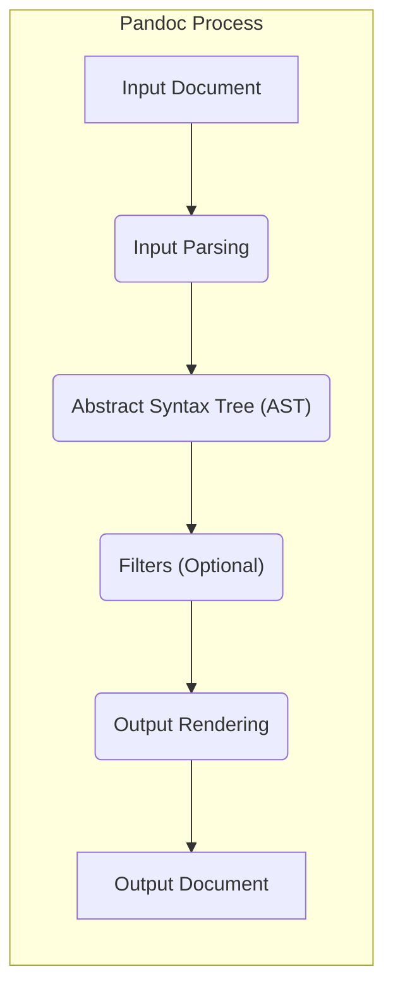

# Project Design Document: Pandoc (Improved)

**Version:** 2.0
**Date:** October 26, 2023
**Author:** Gemini (AI Language Model)

## 1. Introduction

This document provides an enhanced design overview of Pandoc, the versatile "Swiss-Army knife" for document conversion. This detailed design serves as the foundation for comprehensive threat modeling. Pandoc is a command-line utility enabling the conversion of documents between a vast array of markup formats. Its flexibility makes it a cornerstone in numerous document processing and publishing workflows.

## 2. Goals

*   Provide a more granular description of Pandoc's architecture and its internal components.
*   Elaborate on the data transformation and manipulation processes within Pandoc.
*   Highlight critical areas and functionalities with potential security implications in greater detail.
*   Furnish a robust and comprehensive understanding of the system specifically tailored for effective threat modeling.

## 3. Scope

This design document encompasses the core functionalities of the Pandoc command-line application, focusing on:

*   The mechanisms for parsing diverse input document formats.
*   The structure and manipulation of the internal Abstract Syntax Tree (AST).
*   The application and execution of transformation processes and filters.
*   The rendering process for generating output documents in various formats.
*   The handling of command-line arguments, options, and configurations.
*   The integration and execution of Lua filters for extending Pandoc's capabilities.
*   Error handling and reporting within the conversion process.

This document explicitly excludes:

*   The intricate implementation details of individual input and output format handlers.
*   The internal workings of specific Haskell libraries utilized by Pandoc's core.
*   Graphical User Interfaces (GUIs) or external wrappers built around the Pandoc executable.
*   Detailed platform-specific deployment and installation procedures.

## 4. High-Level Architecture

Pandoc operates through a sequential pipeline, processing input documents through distinct stages to achieve the desired output format.

**Components:**

*   **"Input Document"**: The source document intended for conversion.
*   **"Input Parsing"**: The module responsible for reading, interpreting, and validating the input document according to its format specification. This includes error detection and reporting.
*   **"Abstract Syntax Tree (AST)"**: The central, format-agnostic representation of the document's structure and content. It serves as an intermediary for transformations.
*   **"Filters (Optional)"**: User-defined scripts or programs that can inspect, modify, and transform the AST. These offer extensibility and customization.
*   **"Output Rendering"**: The module responsible for generating the final output document in the specified target format based on the processed AST.
*   **"Output Document"**: The converted document in the desired output format.

## 5. Detailed Design

### 5.1. Input Parsing (Detailed)

*   This stage involves reading the raw input stream and converting it into Pandoc's internal AST representation.
*   Pandoc employs a modular design, utilizing specific parsers tailored to each supported input format (e.g., CommonMark, HTML, LaTeX, reStructuredText).
*   Each parser performs lexical analysis, syntax analysis, and semantic interpretation to build the hierarchical structure of the document in the AST.
*   Crucially, this stage includes error handling mechanisms to manage malformed, invalid, or potentially malicious input. Parsers should implement robust validation to prevent exploits.
*   Configuration options related to input format (e.g., extensions for Markdown) are applied during this phase.

### 5.2. Abstract Syntax Tree (AST) (Detailed)

*   The AST is a tree-like data structure representing the document's logical structure, independent of any specific markup language.
*   It consists of nodes representing semantic elements like paragraphs, headings, lists, code blocks, images, citations, and metadata.
*   Each node can have attributes and child nodes, forming a hierarchical representation.
*   The AST facilitates seamless conversion between different formats by providing a common intermediary representation.
*   Manipulation of the AST is the core function of filters.

### 5.3. Filters (Detailed)

*   Filters are external programs or scripts that can programmatically inspect and modify the AST. This provides a powerful extension mechanism for Pandoc.
*   Pandoc supports various types of filters:
    *   **"Lua filters"**: Scripts written in the Lua programming language that directly interact with and manipulate the AST through a provided API. They operate within Pandoc's process.
    *   **"Executable filters"**: External programs that receive the AST as input (typically in JSON format) via standard input and return a modified AST via standard output. These run as separate processes.
*   Filters are applied sequentially in the order specified by the user.
*   Filter execution introduces security considerations, especially with executable filters, as they can potentially execute arbitrary code.

### 5.4. Output Rendering (Detailed)

*   This stage takes the processed AST and generates the output document in the desired format.
*   Pandoc utilizes specific writers for each supported output format (e.g., HTML, PDF via LaTeX, DOCX, EPUB).
*   Each writer traverses the AST and generates the corresponding markup or binary representation, handling formatting, styling, and output-specific details.
*   Output rendering may involve escaping special characters or sanitizing content to prevent vulnerabilities in the target format (e.g., preventing XSS in HTML output).
*   Configuration options related to the output format (e.g., template files, CSS for HTML) are applied during this phase.

### 5.5. Command-Line Interface (CLI) (Detailed)

*   Pandoc's primary interface is the command-line.
*   The CLI parses arguments provided by the user to determine:
    *   Input and output file paths.
    *   Input and output formats.
    *   Applied filters and their order.
    *   Various conversion options and settings.
*   Robust argument parsing is crucial to prevent unexpected behavior or security vulnerabilities arising from maliciously crafted command-line arguments.
*   Error handling for invalid or missing arguments is also important.

### 5.6. Lua Engine (Detailed)

*   Pandoc embeds a Lua interpreter to execute Lua filters directly within its process.
*   The Lua engine provides an API for accessing and manipulating the AST, allowing for powerful and flexible transformations.
*   Security considerations for Lua filters include preventing access to sensitive system resources or unintended side effects.

## 6. Data Flow Diagram

This diagram illustrates the detailed flow of data through the Pandoc application's core processing stages.

```mermaid
graph LR
    A["User Input (Command Line)"] --> B("CLI Argument Parsing & Validation");
    B --> C{Input File Specified?};
    C -- Yes --> D("Read Input File");
    C -- No --> E("Read from Standard Input");
    D --> F("Select Input Parser (based on format)");
    E --> F;
    F --> G("Input Parsing & Validation");
    G -- "Errors" --> H("Error Reporting & Exit");
    G -- "Valid AST" --> I("Abstract Syntax Tree (AST)");
    I --> J{Filters Specified?};
    J -- Yes --> K("Apply Filters (Lua/Executable)");
    K --> L("Modified Abstract Syntax Tree");
    L --> M("Select Output Renderer (based on format)");
    J -- No --> M;
    M --> N("Output Rendering & Sanitization");
    N -- "Errors" --> H;
    N --> O{Output File Specified?};
    O -- Yes --> P("Write to Output File");
    O -- No --> Q("Write to Standard Output");
```

**Data Flow Description:**

1. The user provides input via the command line, including file paths, formats, and filter specifications.
2. The CLI argument parsing component validates and interprets the user's input.
3. Pandoc checks if an input file is specified.
4. If an input file is provided, its contents are read. Otherwise, input is read from standard input.
5. The appropriate input parser is selected based on the specified input format.
6. The input parser processes the input, performing validation and generating the initial AST.
7. Error handling during parsing may lead to error reporting and program termination.
8. If parsing is successful, the resulting AST is generated.
9. Pandoc checks if any filters are specified by the user.
10. If filters are specified, they are applied sequentially. This may involve executing Lua scripts within the process or external executable filters.
11. Filters modify the AST, resulting in a transformed AST.
12. If no filters are specified, the AST proceeds directly to the output rendering stage.
13. The appropriate output renderer is selected based on the desired output format.
14. The output renderer processes the AST, generating the output document and performing necessary sanitization.
15. Error handling during rendering may lead to error reporting and program termination.
16. Pandoc checks if an output file is specified.
17. If an output file is specified, the rendered output is written to it.
18. Otherwise, the output is written to standard output.

## 7. Security Considerations (Detailed)

This section expands on potential security considerations, providing more specific examples and potential threats.

*   **Input Validation Vulnerabilities:**
    *   **Threat:** Maliciously crafted input files could exploit vulnerabilities in the parsers, leading to buffer overflows, denial of service, or even arbitrary code execution. For example, a specially crafted Markdown file could exploit a weakness in the CommonMark parser.
    *   **Mitigation:** Implement strict validation rules for all input formats, including checking for unexpected characters, exceeding length limits, and malformed syntax. Fuzzing the parsers with a wide range of inputs is crucial.
*   **Filter Execution Risks:**
    *   **Threat (Executable Filters):** Executing external filters introduces the risk of arbitrary code execution if a malicious filter is used. A compromised filter could perform actions like deleting files or installing malware.
    *   **Threat (Lua Filters):** While running within Pandoc's process, poorly written or malicious Lua filters could potentially access sensitive data or cause unintended side effects.
    *   **Mitigation:** Implement mechanisms to restrict the capabilities of external filters (e.g., using sandboxing or process isolation). Provide clear warnings to users about the risks of using untrusted filters. Implement security reviews for commonly used filters.
*   **Resource Exhaustion Attacks:**
    *   **Threat:** Processing extremely large or deeply nested input documents could consume excessive memory or CPU resources, leading to denial of service.
    *   **Mitigation:** Implement limits on resource usage, such as maximum input file size, maximum recursion depth for parsing, and timeouts for processing.
*   **Output Vulnerabilities (e.g., Cross-Site Scripting - XSS):**
    *   **Threat:** When generating output in formats like HTML, improper encoding or sanitization of content from the input document could introduce XSS vulnerabilities. Malicious scripts could be injected into the output.
    *   **Mitigation:** Implement robust output encoding and sanitization techniques specific to each output format. Use established libraries for escaping HTML entities and preventing script injection.
*   **Dependency Vulnerabilities:**
    *   **Threat:** Pandoc relies on various third-party libraries for parsing and rendering. Vulnerabilities in these dependencies could be exploited.
    *   **Mitigation:** Regularly update dependencies and monitor security advisories for known vulnerabilities. Employ dependency scanning tools to identify potential risks.
*   **Command-Line Injection:**
    *   **Threat:** If user-provided data (e.g., filter paths or options) is not properly sanitized when constructing commands to execute external filters, it could lead to command-line injection vulnerabilities. Attackers could inject arbitrary commands.
    *   **Mitigation:** Avoid constructing shell commands directly from user input. Use secure methods for invoking external processes, such as passing arguments as separate parameters rather than embedding them in a shell string.
*   **Information Disclosure:**
    *   **Threat:** Error messages or verbose output could potentially reveal sensitive information about the system or the input document's structure.
    *   **Mitigation:** Carefully review error handling and logging mechanisms to avoid disclosing sensitive information. Provide generic error messages to users while logging detailed information securely for debugging.

## 8. Technologies Used

*   **Core Programming Language:** Haskell
*   **Input Parsing Libraries:**  A diverse set of libraries specific to each supported input format (e.g., `commonmark-hs` for CommonMark, `hxt` for XML/HTML).
*   **Output Rendering Libraries:** Libraries tailored for generating various output formats (e.g., libraries for LaTeX generation, HTML construction, DOCX creation).
*   **Scripting Language:** Lua (embedded for filter functionality)
*   **Command-Line Argument Parsing Library:**  Likely a Haskell library such as `optparse-applicative`.
*   **Build System:** Cabal or Stack (for managing dependencies and building the project).

## 9. Deployment Considerations

*   Pandoc is typically deployed as a standalone, statically linked executable, simplifying distribution.
*   It can be integrated into various environments and workflows, including:
    *   Local command-line usage on personal computers.
    *   Automated document processing pipelines and scripts.
    *   Integration into web applications (though direct execution might require careful security considerations).
    *   Usage within CI/CD pipelines for generating documentation.
    *   Potentially as part of serverless functions or containerized applications.
*   Security considerations during deployment include:
    *   Ensuring the integrity of the Pandoc executable.
    *   Managing permissions and access control for input and output files.
    *   Carefully considering the security implications when executing Pandoc in environments with untrusted input or when using external filters.

This improved design document provides a more in-depth understanding of Pandoc's architecture and data flow, crucial for a more thorough and effective threat modeling process. The enhanced details on components, data flow, and security considerations aim to facilitate the identification and mitigation of potential vulnerabilities.