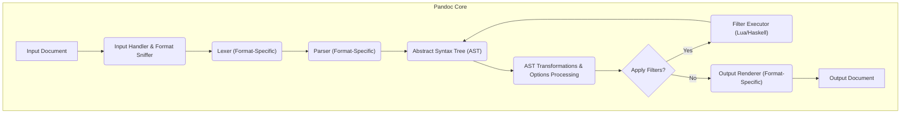
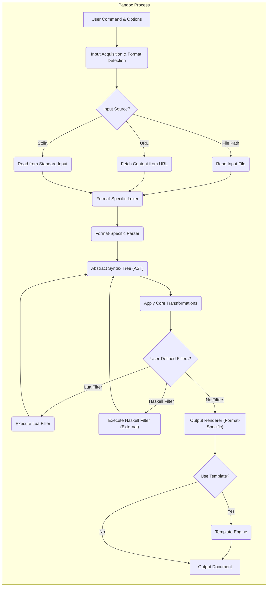

# Project Design Document: Pandoc

**Version:** 1.1
**Date:** October 26, 2023
**Author:** AI Software Architect

## 1. Introduction

This document provides an enhanced design overview of Pandoc, the universal document converter. It details the key architectural components, data flow, and interactions within the system, with a focus on aspects relevant to security and threat modeling.

Pandoc is a versatile command-line tool enabling the conversion of files between a vast array of markup formats. Its flexibility and extensibility make it a cornerstone for many document processing and publishing workflows.

## 2. Goals and Objectives

* **Core Functionality:** Robust and accurate conversion of documents between numerous markup formats (e.g., Markdown, HTML, LaTeX, DOCX, EPUB, reStructuredText, etc.).
* **Extensibility:** Empower users to extend Pandoc's capabilities through user-defined filters (primarily Lua and Haskell).
* **Customization:** Offer a rich set of command-line options to fine-tune the conversion process and tailor the output format to specific needs.
* **Platform Independence:** Ensure seamless operation across major operating systems (Linux, macOS, Windows) and architectures.
* **Maintainability:** Uphold a well-modularized and documented codebase to facilitate updates, bug fixes, and community contributions.
* **Security:** Minimize potential security vulnerabilities arising from input processing, filter execution, and interaction with external resources.

## 3. System Architecture

Pandoc's architecture follows a pipeline model, processing documents through distinct stages:

* **Input Acquisition:**  Receiving the source document and determining its format.
* **Parsing and Lexing:**  Breaking down the input into meaningful tokens and constructing an internal representation.
* **Abstract Syntax Tree (AST) Construction:** Building a structured representation of the document's content and semantics.
* **Transformation and Filtering:** Modifying the AST based on user options and external filters.
* **Output Generation and Rendering:** Converting the AST into the target document format.

### 3.1. Input Acquisition

* **Input Sources:** Pandoc supports diverse input sources:
    * **File Paths:** Direct specification of local file paths.
    * **Standard Input (stdin):** Receiving document content piped from other processes.
    * **URLs:** Fetching content from remote URLs (primarily for formats like HTML).
* **Format Detection (Sniffing):** Pandoc employs heuristics (e.g., file extensions, magic numbers) and potentially user-specified options to identify the input format.
* **Character Encoding Handling:**  Manages various character encodings, with UTF-8 as the preferred and default encoding.

### 3.2. Parsing and Lexing

* **Format-Specific Lexers:**  Each supported input format has a corresponding lexer responsible for breaking the input stream into tokens.
* **Format-Specific Parsers:**  Parsers consume the tokens generated by the lexer and build the initial Abstract Syntax Tree (AST) representation of the document. Different parsers handle the specific grammar and syntax of each input format.
* **Error Handling:** Parsers incorporate error detection and recovery mechanisms to handle malformed or invalid input, although the robustness of error handling can vary between parsers.

### 3.3. Abstract Syntax Tree (AST) Construction

* **Unified Internal Representation:** The AST serves as a canonical, format-agnostic representation of the document's structure and content. This abstraction is crucial for enabling conversions between disparate formats.
* **Node Types:** The AST consists of various node types representing elements like paragraphs, headings, lists, code blocks, images, and metadata.
* **Metadata Handling:**  Information about the document (e.g., title, author, date) is also represented within the AST.

### 3.4. Transformation and Filtering

* **Core Transformations:** Pandoc applies built-in transformations to the AST based on user-specified options (e.g., table of contents generation, citation processing, numbering).
* **Filter Execution:**
    * **Lua Filters:** Users can write Lua scripts that operate on the AST, allowing for arbitrary modifications and extensions. Lua filters are executed within an embedded Lua interpreter.
    * **Haskell Filters:**  Haskell programs can be written to interact with the AST, providing more advanced filtering capabilities. These typically involve compiling a separate executable that Pandoc invokes.
* **Options Processing:** Command-line options significantly influence the transformation stage, dictating how the AST is manipulated before output generation.

### 3.5. Output Generation and Rendering

* **Format-Specific Renderers (Writers):**  Dedicated renderers exist for each supported output format. These components traverse the AST and generate the corresponding markup or binary data.
* **Template Processing:** For templated output formats (e.g., HTML, LaTeX, ODT), Pandoc utilizes template engines to inject the document content from the AST into predefined templates, allowing for customization of the output structure and styling.
* **Resource Handling:** Output generation may involve managing external resources like images, stylesheets, and fonts, potentially requiring file system access or network requests.

## 4. Data Flow

The following diagram illustrates the detailed data flow within Pandoc:

**Detailed Data Flow Steps:**

1. **User Command & Options:** The user provides a command to the Pandoc executable, including input and output specifications, and various options.
2. **Input Acquisition & Format Detection:** Pandoc parses the command-line arguments, identifies the input source, and attempts to determine the input format.
3. **Input Source?:**  A decision point based on the identified input source.
4. **Read Input File:** If the input is a file path, the file is read from the file system.
5. **Fetch Content from URL:** If the input is a URL, Pandoc attempts to retrieve the content over the network.
6. **Read from Standard Input:** If no file or URL is specified, Pandoc reads from the standard input stream.
7. **Format-Specific Lexer:** The appropriate lexer for the input format tokenizes the input stream.
8. **Format-Specific Parser:** The parser consumes the tokens and constructs the initial AST.
9. **Abstract Syntax Tree (AST):** The document is now represented in a structured, format-independent way.
10. **Apply Core Transformations:** Built-in transformations based on user options are applied to the AST.
11. **User-Defined Filters?:** Pandoc checks if any user-defined filters are specified.
12. **Execute Lua Filter:** If Lua filters are specified, the embedded Lua interpreter executes the filter scripts, modifying the AST.
13. **Execute Haskell Filter (External):** If Haskell filters are specified, Pandoc invokes the external Haskell executable, which processes and potentially modifies the AST.
14. **Output Renderer (Format-Specific):** The appropriate renderer for the desired output format is selected.
15. **Use Template?:** Pandoc checks if a template is to be used for the output format.
16. **Template Engine:** If a template is used, the template engine combines the AST with the template to generate the output.
17. **Output Document:** The final document in the specified output format is generated and written to the specified output file or standard output.

## 5. Security Considerations

This section details potential security considerations relevant to Pandoc.

* **Input Validation Vulnerabilities:**
    * **Parser Exploits:** Maliciously crafted input files could exploit vulnerabilities in format-specific parsers, leading to arbitrary code execution, crashes, or denial of service. Examples include buffer overflows or injection vulnerabilities within the parsing logic.
    * **External Entity Expansion (XXE):** When processing formats like XML or HTML, improper handling of external entities could allow attackers to access local files or internal network resources.
    * **Path Traversal:** If processing includes handling file paths from input (e.g., for including images), insufficient sanitization could allow attackers to access arbitrary files on the system.
* **Filter Execution Risks:**
    * **Arbitrary Code Execution:** Lua and Haskell filters execute arbitrary code, posing a significant risk if untrusted filters are used. This could allow attackers to gain full control of the system running Pandoc.
    * **Resource Exhaustion:** Malicious filters could be designed to consume excessive CPU, memory, or disk space, leading to denial of service.
    * **Information Disclosure:** Filters could be used to access and exfiltrate sensitive information from the system.
* **Command Injection Vulnerabilities:**
    * **Insecure Option Handling:** Certain Pandoc options that involve executing external commands (e.g., for graph generation) could be exploited if user-provided input is not properly sanitized before being passed to the shell.
* **Denial of Service (DoS) Attacks:**
    * **Resource Exhaustion through Input:** Processing extremely large or deeply nested input documents could exhaust system resources (CPU, memory), leading to DoS.
    * **Recursive Processing:**  Carefully crafted input could trigger infinite loops or excessive recursion within the parsing or transformation stages.
* **Supply Chain Security Risks:**
    * **Dependency Vulnerabilities:** Pandoc relies on various libraries for parsing and output generation. Vulnerabilities in these dependencies could be exploited.
    * **Compromised Build Process:**  If the Pandoc build process is compromised, malicious code could be injected into the distributed binaries.
* **Information Disclosure:**
    * **Verbose Error Messages:**  Detailed error messages could reveal sensitive information about the system's configuration or file paths.
    * **Temporary Files:**  Improper handling of temporary files created during processing could lead to information leakage.
* **Network Security:**
    * **Server-Side Request Forgery (SSRF):** If Pandoc is used to fetch content from URLs based on user input, attackers could potentially use it to probe internal network services.

## 6. Deployment Considerations and Security Implications

The deployment environment significantly impacts the security posture of Pandoc.

* **Local Command-Line Usage:**  Risks are primarily limited to the user's machine and depend on the trustworthiness of the input files and any used filters.
* **Scripting and Automation:**  If Pandoc is used in automated scripts, ensure that the scripts and any input data are from trusted sources. Consider the permissions under which the scripts are executed.
* **Server-Side Processing (Web Applications):** This scenario introduces significant risks:
    * **Untrusted Input:** Web applications often process user-provided input, which could be malicious. Input sanitization and validation are crucial.
    * **Filter Execution in a Shared Environment:** Executing user-provided filters on a server poses a high risk of arbitrary code execution. Sandboxing or containerization is highly recommended.
    * **Resource Limits:** Implement resource limits to prevent DoS attacks.
    * **Principle of Least Privilege:** Run Pandoc processes with the minimum necessary privileges.
* **Containerization (e.g., Docker):**  Containers provide isolation, which can mitigate some risks, especially for server-side deployments. However, container images should be built securely and kept up-to-date.
* **CI/CD Pipelines:**  Ensure that the CI/CD environment is secure and that input data and scripts are trusted.

## 7. Technologies Used

* **Core Programming Language:** Haskell
* **Parsing Libraries:**  Parsec, Attoparsec, and format-specific parsing libraries.
* **Template Engines:** `template-haskell`, `shakespeare`.
* **Scripting Language for Filters:** Lua (embedded), Haskell (external execution).
* **Build System:** Cabal, Stack.
* **Operating System Support:** Cross-platform (Linux, macOS, Windows).

## 8. Future Security Enhancements

* **Sandboxing for Filters:** Implement robust sandboxing mechanisms for Lua and potentially Haskell filters to limit their access to system resources and prevent arbitrary code execution.
* **Improved Input Sanitization and Validation:** Enhance input validation across all supported formats to prevent parser exploits and other input-related vulnerabilities.
* **Address XXE Vulnerabilities:** Ensure proper handling of external entities in XML and HTML parsing to prevent information disclosure.
* **Strengthen Command Injection Prevention:**  Thoroughly sanitize user input before passing it to any external commands. Consider alternative approaches that avoid shell execution.
* **Resource Limits and Throttling:** Implement mechanisms to limit resource consumption during processing to mitigate DoS attacks.
* **Regular Security Audits and Penetration Testing:** Conduct periodic security assessments to identify and address potential vulnerabilities.
* **Software Bill of Materials (SBOM):** Generate and maintain an SBOM to track dependencies and facilitate vulnerability management.
* **Secure Defaults:**  Configure Pandoc with secure default settings.
* **User Education and Best Practices:** Provide clear documentation and guidance on secure usage of Pandoc, especially regarding filters.

This enhanced design document provides a more detailed and security-focused overview of the Pandoc project, serving as a solid foundation for comprehensive threat modeling activities.