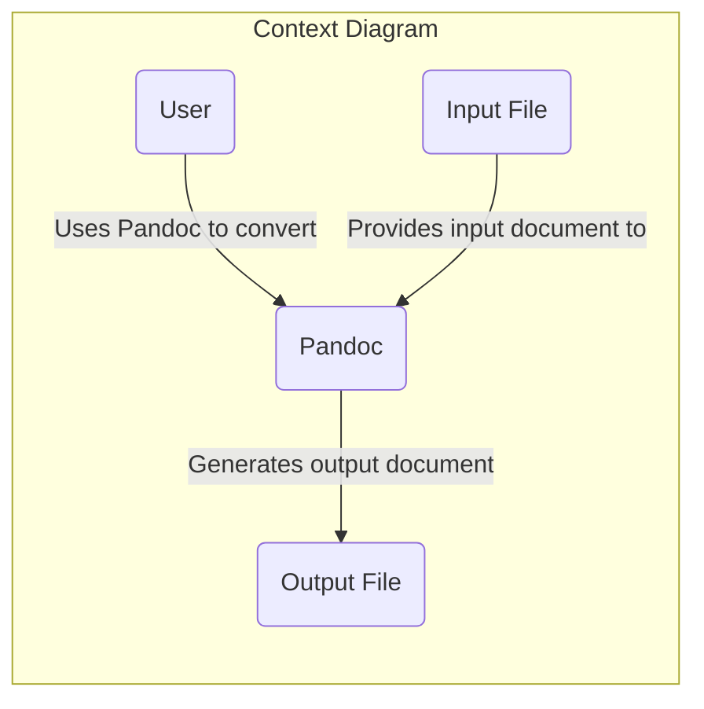
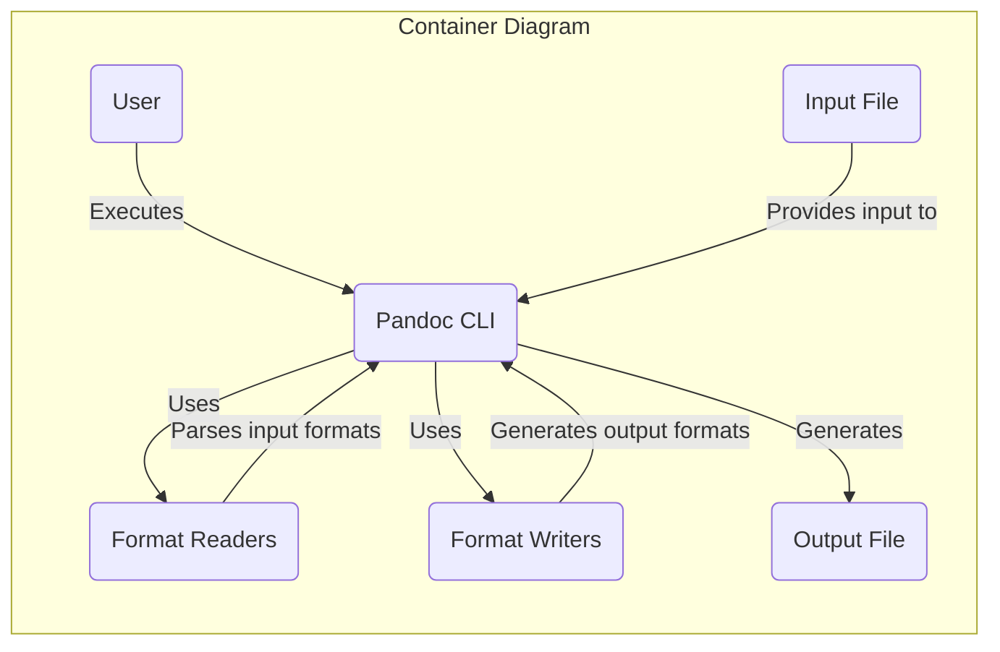
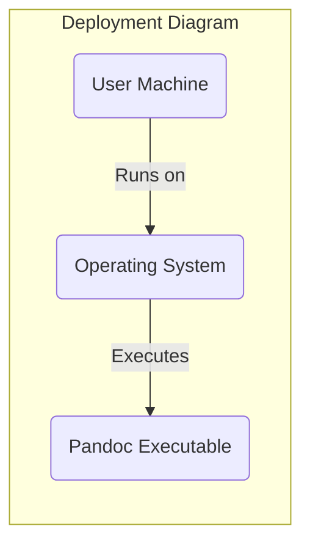
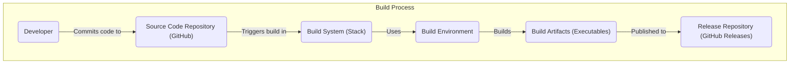

# BUSINESS POSTURE

This project, Pandoc, is a universal document converter. Its primary business priority is to provide a robust and versatile tool for converting documents between various markup and document formats. The main business goal is to enable users to easily transform documents from one format to another, facilitating interoperability and workflow efficiency across different platforms and applications.

Key business risks associated with Pandoc include:
- Data loss or corruption during the conversion process, potentially leading to inaccurate or incomplete documents.
- Incorrect or unexpected document formatting after conversion, which could impact readability and usability.
- Performance bottlenecks, especially when handling large or complex documents, affecting user productivity.
- Lack of support for emerging or less common document formats, limiting the tool's applicability.
- Security vulnerabilities in the conversion process that could be exploited to compromise user systems or data.

# SECURITY POSTURE

Existing security controls for Pandoc:
- security control: Memory safety provided by Haskell, the programming language Pandoc is written in, mitigates certain classes of vulnerabilities like buffer overflows. Implemented in: Pandoc codebase.
- security control: Input parsing and validation are performed to handle various document formats. Implemented in: Pandoc source code, format-specific readers.
- security control: Regular updates and bug fixes are released by the maintainers, addressing reported issues including security vulnerabilities. Described in: Pandoc release notes and commit history.

Accepted risks for Pandoc:
- accepted risk: Users are responsible for the security of the environment where Pandoc is executed, including the security of input and output files.
- accepted risk: Complex document formats may have inherent parsing ambiguities or vulnerabilities that are difficult to fully mitigate.

Recommended security controls to implement:
- recommended security control: Implement automated fuzzing to proactively identify potential parsing vulnerabilities across different document formats.
- recommended security control: Integrate Static Application Security Testing (SAST) tools into the build process to automatically detect code-level security flaws.
- recommended security control: Implement dependency scanning to identify and manage vulnerabilities in third-party libraries used by Pandoc.
- recommended security control: Establish a clear vulnerability disclosure and response process to handle reported security issues effectively.

Security requirements for Pandoc:
- Authentication: Not applicable. Pandoc is a command-line tool and does not require user authentication.
- Authorization: Not applicable. Pandoc operates on files provided by the user and does not require authorization mechanisms.
- Input validation: Robust input validation is crucial to prevent vulnerabilities arising from maliciously crafted documents. Pandoc must validate input data against expected formats and structures for all supported document types.
- Cryptography: Cryptography is not a core requirement for Pandoc's primary function of document conversion. However, if Pandoc is extended to handle encrypted documents or secure communication in the future, appropriate cryptographic measures will be necessary.

# DESIGN

## C4 CONTEXT

Context Diagram Elements:

- Name: User
  - Type: Person
  - Description: Individuals who use Pandoc to convert documents between different formats.
  - Responsibilities: Provides input documents and specifies desired output format. Reviews and uses the converted output documents.
  - Security controls: User environment security, responsible for securing input and output files.

- Name: Pandoc
  - Type: Software System
  - Description: Universal document converter that transforms documents between various markup and document formats.
  - Responsibilities: Reads input documents, parses and converts document formats, generates output documents in the specified format.
  - Security controls: Input validation, memory safety, secure parsing and conversion logic.

- Name: Input File
  - Type: External System (Data Store)
  - Description: Document file in a supported format provided as input to Pandoc for conversion.
  - Responsibilities: Contains the source document content to be converted.
  - Security controls: File system permissions, user access controls, potentially encryption at rest depending on user environment.

- Name: Output File
  - Type: External System (Data Store)
  - Description: Document file in the desired output format generated by Pandoc after conversion.
  - Responsibilities: Stores the converted document content.
  - Security controls: File system permissions, user access controls, potentially encryption at rest depending on user environment.

## C4 CONTAINER

Container Diagram Elements:

- Name: Pandoc CLI
  - Type: Application
  - Description: Command-line interface application that orchestrates the document conversion process. It's the main executable users interact with.
  - Responsibilities: Accepts user commands and input files, loads appropriate format readers and writers, manages the conversion pipeline, and outputs the converted document.
  - Security controls: Command-line argument parsing, process isolation, calls format readers and writers securely.

- Name: Format Readers
  - Type: Library
  - Description: Collection of libraries responsible for parsing various input document formats (e.g., Markdown, HTML, LaTeX).
  - Responsibilities: Reads and parses input files, validates input format, extracts document content into an internal representation.
  - Security controls: Input validation, secure parsing logic, memory safety, protection against format-specific vulnerabilities.

- Name: Format Writers
  - Type: Library
  - Description: Collection of libraries responsible for generating output documents in various formats (e.g., HTML, PDF, DOCX).
  - Responsibilities: Takes the internal document representation and generates output files in the specified format, ensures correct formatting and structure.
  - Security controls: Output encoding and sanitization, prevention of injection vulnerabilities in output formats, secure generation of output files.

- Name: User
  - Type: Person
  - Description: Individuals who execute the Pandoc CLI application.
  - Responsibilities: Executes Pandoc with appropriate commands and input files.
  - Security controls: User environment security, responsible for secure usage of the CLI and handling of input/output files.

- Name: Input File
  - Type: Data Store
  - Description: Document file provided as input to Pandoc CLI.
  - Responsibilities: Contains the source document content.
  - Security controls: File system permissions, user access controls.

- Name: Output File
  - Type: Data Store
  - Description: Document file generated by Pandoc CLI.
  - Responsibilities: Stores the converted document content.
  - Security controls: File system permissions, user access controls.

## DEPLOYMENT

Deployment Architecture: Standalone Executable Distribution

Pandoc is primarily distributed as standalone executables for various operating systems (Windows, macOS, Linux). Users download and install the executable on their local machines or servers.

Deployment Diagram Elements:

- Name: User Machine
  - Type: Infrastructure
  - Description: User's personal computer, laptop, or server where Pandoc is installed and executed.
  - Responsibilities: Provides the environment for running Pandoc, including operating system and file system.
  - Security controls: Operating system security controls, user account management, endpoint security software (antivirus, firewall).

- Name: Operating System
  - Type: Software
  - Description: Operating system (e.g., Windows, macOS, Linux) installed on the user machine.
  - Responsibilities: Provides system resources and APIs for Pandoc to run, manages file system access and process execution.
  - Security controls: OS security updates, kernel-level security features, access control mechanisms.

- Name: Pandoc Executable
  - Type: Software
  - Description: Standalone executable file containing the Pandoc application and its dependencies.
  - Responsibilities: Performs document conversion when executed by the user.
  - Security controls: Executable integrity (code signing), application-level security controls implemented within Pandoc.

## BUILD

Build Process: Stack-based Haskell Build

Pandoc uses the Stack build tool for Haskell projects. The build process typically involves:

Build Process Elements:

- Name: Developer
  - Type: Person
  - Description: Software developers who contribute code to the Pandoc project.
  - Responsibilities: Writes code, fixes bugs, implements new features, commits code to the source code repository.
  - Security controls: Secure coding practices, code review, access control to the source code repository.

- Name: Source Code Repository (GitHub)
  - Type: System
  - Description: GitHub repository hosting the Pandoc source code.
  - Responsibilities: Stores and manages the source code, tracks changes, facilitates collaboration among developers.
  - Security controls: Access control (authentication and authorization), branch protection, audit logging, vulnerability scanning of dependencies.

- Name: Build System (Stack)
  - Type: Tool
  - Description: Haskell Stack build tool used to compile and build Pandoc.
  - Responsibilities: Manages dependencies, compiles Haskell code, runs tests, creates executable artifacts.
  - Security controls: Dependency management (verifying package integrity), build process isolation, secure configuration of build environment.

- Name: Build Environment
  - Type: Infrastructure
  - Description: Environment where the build process is executed, could be developer's local machine or a CI/CD server.
  - Responsibilities: Provides necessary tools and libraries for building Pandoc, executes build commands.
  - Security controls: Secure configuration of build environment, access control, software supply chain security for build tools and dependencies.

- Name: Build Artifacts (Executables)
  - Type: Data
  - Description: Compiled executables for different platforms, ready for distribution.
  - Responsibilities: Represents the final output of the build process, ready to be released to users.
  - Security controls: Code signing to ensure integrity and authenticity, secure storage and transfer of build artifacts.

- Name: Release Repository (GitHub Releases)
  - Type: System
  - Description: GitHub Releases page used to distribute pre-built Pandoc executables to users.
  - Responsibilities: Hosts and distributes Pandoc releases, provides download links for users.
  - Security controls: Access control, integrity checks (checksums) for release artifacts, HTTPS for secure download.

# RISK ASSESSMENT

Critical business process to protect: Document conversion functionality. Ensuring accurate, reliable, and secure document conversion is paramount to Pandoc's value proposition.

Data to protect: User documents being converted. Sensitivity of data varies depending on the user and the content of the documents. Documents can range from publicly available information to highly confidential business or personal data. The sensitivity level is user-dependent and Pandoc as a tool must be designed to handle potentially sensitive data securely, even though it does not store or manage this data persistently.

# QUESTIONS & ASSUMPTIONS

Questions:
- What are the most common use cases for Pandoc in enterprise environments? (e.g., document archival, content migration, report generation).
- Are there any plans to offer Pandoc as a cloud service or integrate it with web applications in the future?
- What is the current process for handling security vulnerability reports and releasing security patches?
- Are there any specific document formats that are considered higher risk from a security perspective?

Assumptions:
- Pandoc is primarily used as a command-line tool executed by users on their local machines or servers.
- Users are responsible for the security of their own environments, including input and output files.
- Pandoc's development prioritizes security and aims to mitigate potential vulnerabilities in document parsing and conversion.
- The Haskell programming language provides a degree of inherent memory safety, reducing the risk of certain types of vulnerabilities.
- The open-source nature of Pandoc allows for community scrutiny and contributions to security improvements.